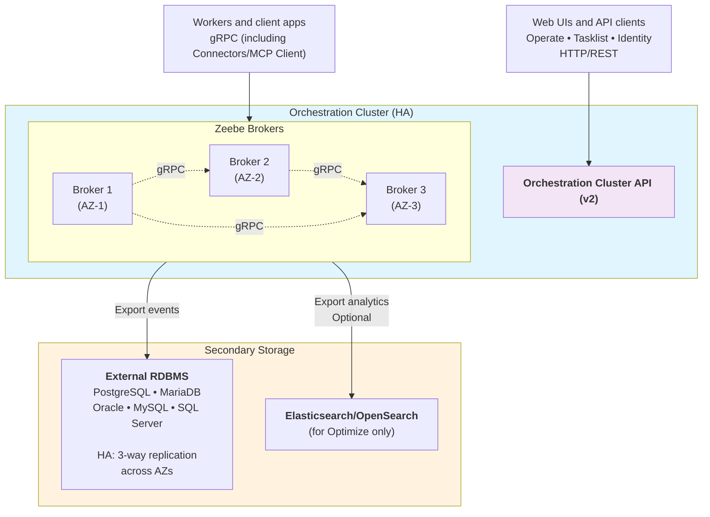

Understand reference architectures for running Camunda 8 Self-Managed in production with a relational database (RDBMS) as secondary storage, including supported topologies, Orchestration Cluster interactions, and critical constraints.

## Recommended topology

For production deployments with RDBMS, Camunda recommends a **HA Zeebe cluster backed by an external managed RDBMS**:

### Key characteristics

**Clustering**

- Minimum three brokers for production HA
- Each broker in separate availability zone
- Default replication factor 3 (spans AZs)

**Secondary storage**

- Single external managed RDBMS instance
- Database handles replication and failover
- Camunda does not manage database HA

**Data flow**

- Processes are executed
- State is flushed to RDBMS
- Operate and Tasklist access the Orchestration Cluster v2 API and do not directly access the database

## When Elasticsearch/OpenSearch is required

Elasticsearch or OpenSearch is required **only for Optimize**. When Optimize is enabled:

- Deploy Elasticsearch/OpenSearch alongside your RDBMS
- Enable the Elasticsearch or OpenSearch exporter to store analytics data
- The Orchestration Cluster uses RDBMS as secondary storage

Without Optimize: RDBMS-only stack is fully supported.

## Production constraints

❌ **ES/OS ↔ RDBMS migration not supported**: Choose your secondary storage backend before production. No automated migration tools available.

❌ **Uniform broker configuration required**: All brokers in a Zeebe cluster must export to the same secondary storage backend. You may run Elasticsearch/OpenSearch only to support Optimize, but the cluster still uses a single backend for its own secondary storage.

❌ **v1 API not supported**: Only the v2 Orchestration Cluster REST API works with RDBMS. See [migrate to the Orchestration Cluster API](/apis-tools/migration-manuals/migrate-to-camunda-api.md).

❌ **No automatic fallback**: If the secondary storage becomes unavailable, Zeebe can continue processing but cannot export. Pending operations queue until storage recovers (applies to any secondary storage backend).

## Network and security

- **Orchestration Cluster ↔ RDBMS**: Private network connectivity with TLS in production
- **Network isolation**: Restrict RDBMS access to Orchestration Cluster pods only (use NetworkPolicies)

## Supported scenarios

✅ **Single-node orchestration + external RDBMS** (non-HA, acceptable for non-critical workloads)

✅ **HA Zeebe cluster + external managed RDBMS** (recommended for production)

✅ **Managed database services** (AWS Aurora, Azure Database, GCP Cloud SQL)

## Next steps

- [RDBMS configuration](/self-managed/deployment/manual/rdbms/configuration.md)
- [RDBMS support policy](/self-managed/concepts/databases/relational-db/rdbms-support-policy.md)
- [RDBMS Helm configuration](/self-managed/deployment/helm/configure/database/rdbms.md)
