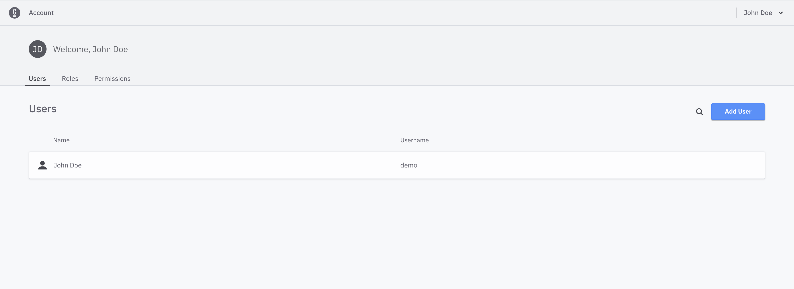

:::caution
IAM has been replaced with Identity for version 1.4+. Please refer to the
[Identity documentation](../../../identity/what-is-identity.md) for ongoing support.
:::

In this part of the tutorial, we'll show you how to access the login page and log in to the IAM component.

### Accessing the UI

Navigate to `localhost:8080` to see the UI exposed by the IAM component.


### Default user

IAM creates a default user during installation; use this account to log in.

```text
Username: demo
Password: demo
```

### Home screen

You are directed to the home page once logged in successfully.


