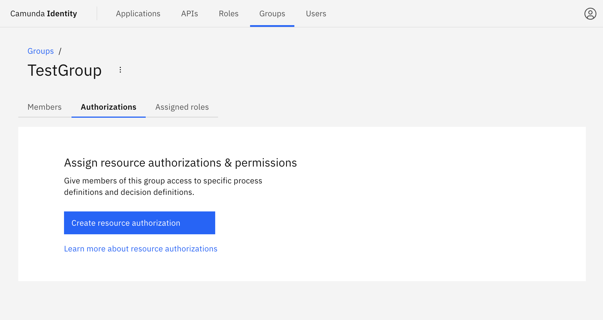
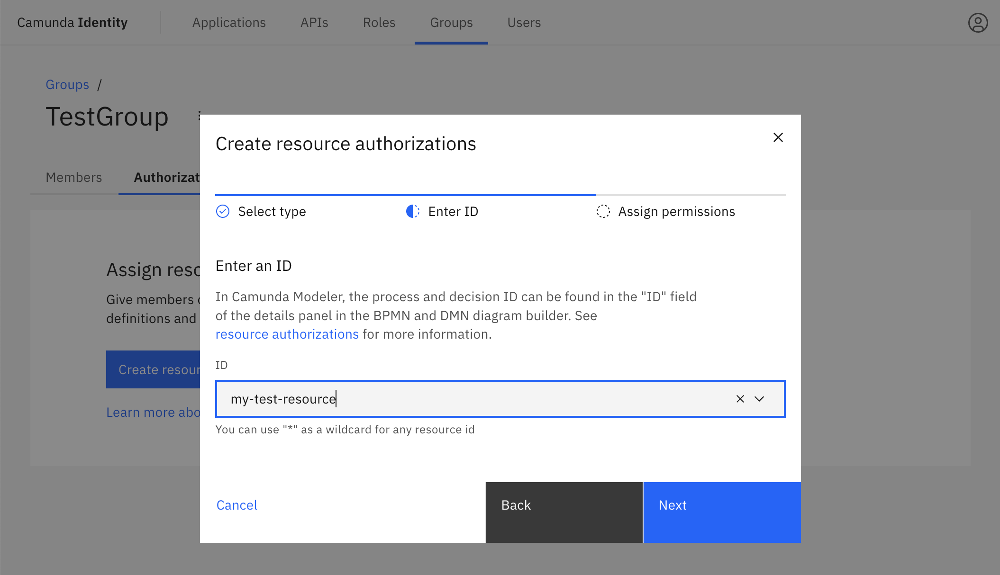
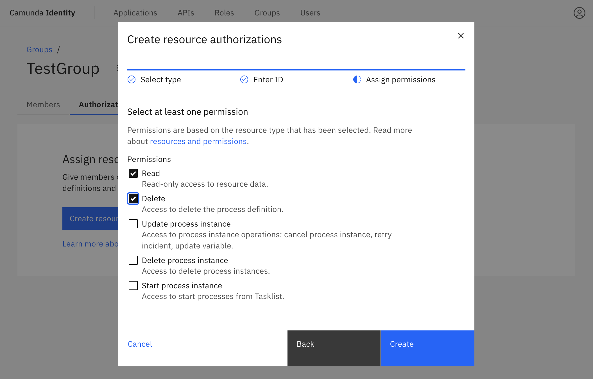
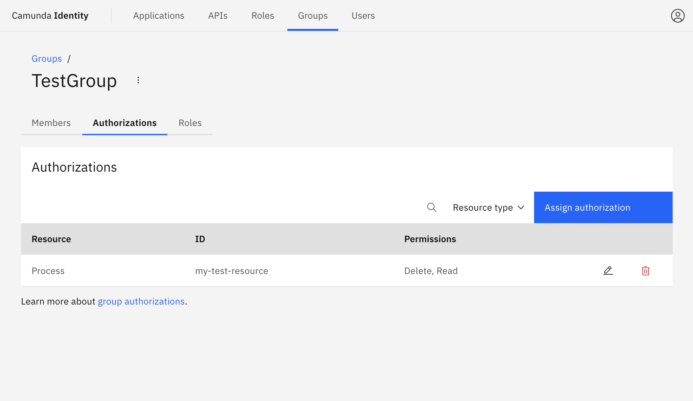
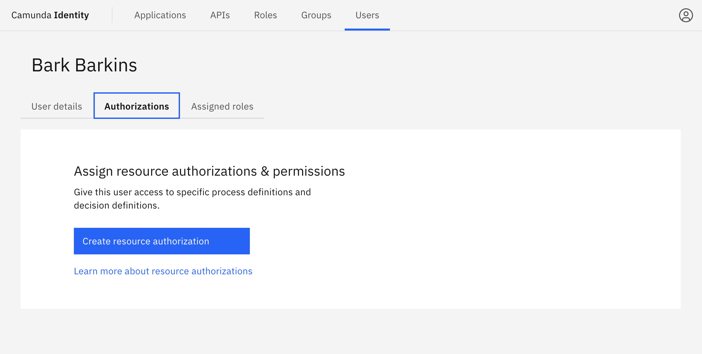
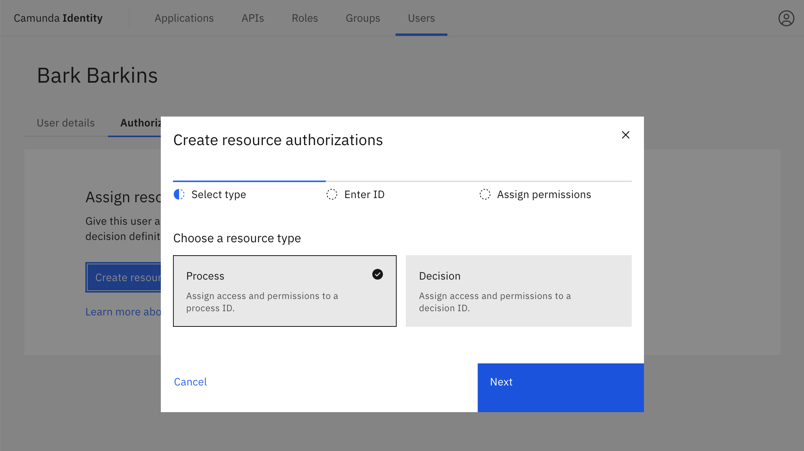
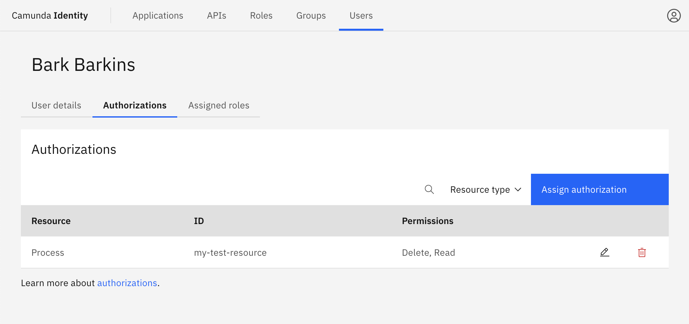

import Tabs from "@theme/Tabs";
import TabItem from "@theme/TabItem";

Use resource authorizations to configure resource-level access to Camunda 8 entities.

## Supported resource authorizations

The following resource authorizations are currently supported:

| Resource type   | Permissions                       | Resource ID                   | Description                                                           |
| :-------------- | :-------------------------------- | :---------------------------- | :-------------------------------------------------------------------- |
| Process         | `Read`                            | Process ID or `*` (wildcard)  | Show process definition and process instance data in the Operate UI   |
| Process         | `Delete`                          | Process ID or `*` (wildcard)  | Delete process definitions via the Operate UI                         |
| Process         | `Update process instance`         | Process ID or `*` (wildcard)  | Update process instance data via the Operate UI                       |
| Process         | `Delete process instance`         | Process ID or `*` (wildcard)  | Delete process instance via the Operate UI                            |
| Process         | `Start process instance`          | Process ID or `*` (wildcard)  | Start process instance via the Tasklist UI                            |
| Decision        | `Read`                            | Decision ID or `*` (wildcard) | Show decision definition and decision instance data in the Operate UI |
| Decision        | `Delete`                          | Decision ID or `*` (wildcard) | Delete decision definitions via the Operate UI                        |
| Batch-Operation | `Create`                          | `*` (wildcard)                | Create any batch operations via the Operate UI                        |
| Batch-Operation | `Create cancel process instance`  | `*` (wildcard)                | Create _cancel process instance_ batch operations via the Operate UI  |
| Batch-Operation | `Create migrate process instance` | `*` (wildcard)                | Create _migrate process instance_ batch operations via the Operate UI |
| Batch-Operation | `Create modify process instance`  | `*` (wildcard)                | Create _modify process instance_ batch operations via the Operate UI  |
| Batch-Operation | `Create resolve incident`         | `*` (wildcard)                | Create _resolve incident_ batch operations via the Operate UI         |
| Batch-Operation | `Read`                            | `*` (wildcard)                | Read batch operation data via the Operate UI                          |
| Batch-Operation | `Update`                          | `*` (wildcard)                | Manage batch operations via the Operate UI                            |

Resource authorizations are only supported when running Identity with Keycloak as an IdP.

:::note
Resource authorizations are disabled by default. You can enable them using environment variables. This feature must be enabled in all required components, see:

- [Identity feature flags](/self-managed/identity/miscellaneous/configuration-variables.md#feature-flags)
- [Operate resource based permissions](/self-managed/operate-deployment/operate-authentication.md#resource-based-permissions)
- [Tasklist resource based permissions](/self-managed/tasklist-deployment/tasklist-authentication.md#resource-based-permissions)

You must also [configure a database](/self-managed/identity/miscellaneous/configuration-variables.md#database-configuration) for Identity to use resource authorizations.

:::

## Manage resource authorizations

Resource authorizations can be configured for an individual user or a group. Below we show you how to create authorizations
for both:

<Tabs groupId="entityType" defaultValue="groups" queryString values={[{label: 'Groups', value: 'groups', }, {label: 'Users', value: 'users', },]} >
<TabItem value="groups">

1. Log in to the Identity UI and navigate to the **Groups** tab. Select the group you would like to create an authorization for from the table, and click on the **Authorizations** tab:

2. Click **Create resource authorization** and a modal will open. Select the type of resource you are creating an authorization for, and click **Next**:

3. Input the ID of the resource you would like to create an authorization for, select the resource from the list, and click **Next**:

:::tip
Want to apply an authorization to a wide range of resources? We support a wildcard character `*` to match any resource.

Partial matching, for example `my-resource*`, is not supported.
:::

4. Select the permissions you would like to assign, and click **Create**:

On confirmation, the modal closes, the table updates, and your authorization is shown:

</TabItem>
<TabItem value="users">

1. Log in to the Identity UI and navigate to the **Users** tab. Select the user you would like to create an authorization for from the table, and click on the **Authorizations** tab:

2. Click **Create resource authorization** and a modal will open. Select the type of resource you are creating an authorization for, and click **Next**:

3. Input the ID of the resource you would like to create an authorization for, select the resource from the list, and click **Next**:

:::tip
Want to apply an authorization to a wide range of resources? We support a wildcard character `*` to match any resource.

Partial matching, for example `my-resource*`, is not supported.
:::

4. Select the permissions you would like to assign, and click **Create**:

On confirmation, the modal closes, the table updates, and your authorization is shown:

</TabItem>
</Tabs>
