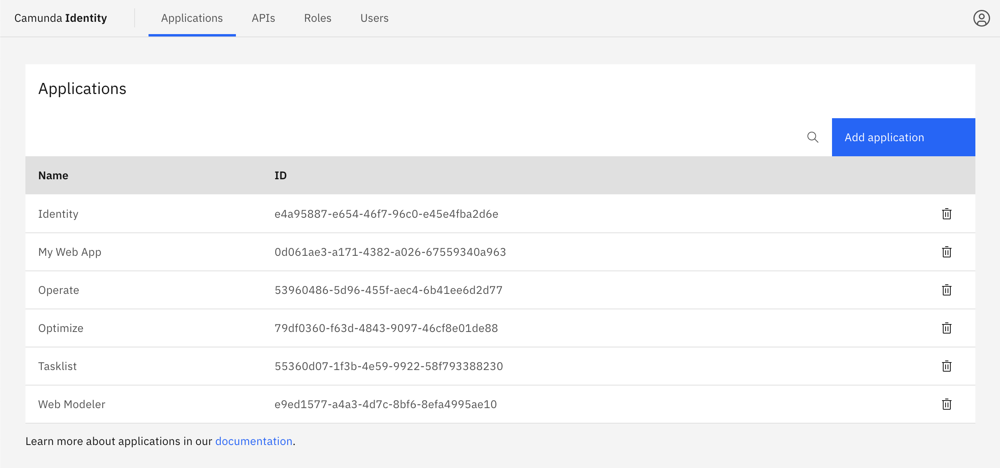

import ApplicationImg from '../img/add-application-modal-2.png';

In Identity, an application represents an entity that can request Identity to authenticate a user or a service.

## About applications

Camunda 8 provides a set of preconfigured applications:

- Connectors
- Identity
- Operate
- Optimize
- Tasklist
- Web Modeler
- Zeebe

As an Identity user you can also add your own custom applications. For example, you can provide a service with M2M access to a Camunda 8 API, such as a custom job worker.

## Application types

To align with the [OAuth 2.0 standard](https://oauth.net/2/client-types/), Camunda distinguishes between _confidental_ and _public_ clients. Applications are also categorized by usage pattern, using the _M2M_ application type in Identity, for systems to communicate using _confidental_ clients without direct user interaction.

- Confidential
- Machine-to-machine (M2M)
- Public

The application type is selected when you [create an application](#add-an-application), based on its ability to securely store and use secrets, as well as the mode of authentication it uses.

| Application type | Secret | User login flow | M2M authentication |
| :--------------- | :----- | :-------------- | :----------------- |
| Confidential     | Yes    | Yes             | Yes                |
| M2M              | Yes    | No              | Yes                |
| Public           | No     | Yes             | No                 |

:::info

- To learn more about OAuth client types, refer to [OAuth 2.0 Client Types](https://oauth.net/2/client-types/),
- To learn more about confidential and public applications, refer to [confidential and public applications](https://auth0.com/docs/get-started/applications/confidential-and-public-applications).

:::

## Manage applications

### Add an application

1. Log in to the Identity interface and navigate to the **Applications** tab:

   

2. Click the **Add application** button located on the top right of the table and a modal will open.

3. Enter a name for your application. In this guide we will use a set of example values. Select the type of your application based on our [guide](/self-managed/identity/application-user-group-role-management/applications.md#types-of-applications). Depending on the selected type, you might need to enter at least one redirect URI. Once you have entered the required details, click **Add**:

   

4. On confirmation, the modal will close, and the list updates to show your new application. Click on your new application to view the details. This includes your generated client ID and client secret depending on the selected [application type](/self-managed/identity/application-user-group-role-management/applications.md#application-types).

   

## Application permissions

You can control the access an application has in Camunda 8 by [assigning permissions](/self-managed/identity/access-management/manage-permissions.md#assign-a-permission-to-an-application) to the application.

:::info
For an overview of permissions available, see [available permissions](/self-managed/identity/access-management/access-management-overview.md#permissions).
:::
