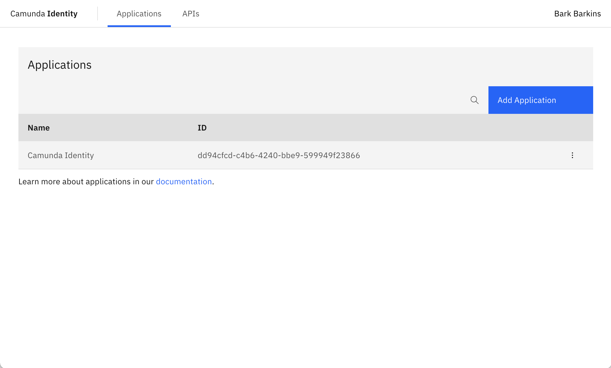

Before you can work with Identity, you need to install it along with other Camunda 8 components.

Follow the [installation guide](/self-managed/platform-deployment/overview.md) for more details on this process.

## Accessing the UI

As soon as Identity is started, you can access the login page and log in to the Identity application.

<!-- Let's move away from recommending localhost first. What port or URL would they find Identity if they used Helm Kubernetes? -->

Navigate to [localhost:8080](http://localhost:8080) to see the UI exposed by Identity.


## Default user

The configuration in this guide creates an example user during installation; use this account to log in:

<!-- Is this true for any setup? -->
<!-- For setting up production systems, we should nudge users to remove this configuration prior to launching. -->

```text
Username: demo
Password: demo
```

:::note Want to create more users?
Creating a user in Identity is not currently supported. To create a user, see
[Keycloak's documentation on creating a user](https://www.keycloak.org/docs/22.0.1/server_admin/#proc-creating-user_server_administration_guide).
:::

## Home screen

You are directed to the home page once logged in successfully.

<!-- What should they expect to see on this page? A list of all their applications, including the Identity application? -->

<!-- This should be the name associated with demo demo or aligned with other screenshot users. -->


