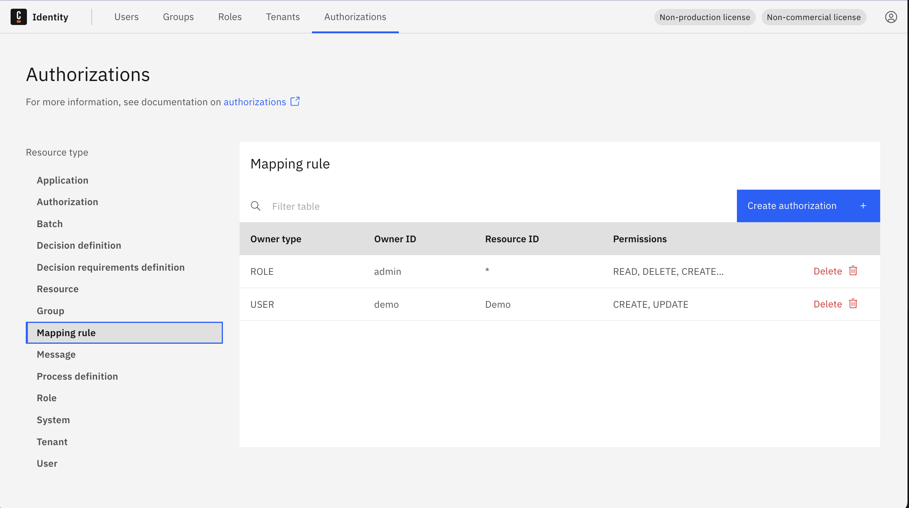
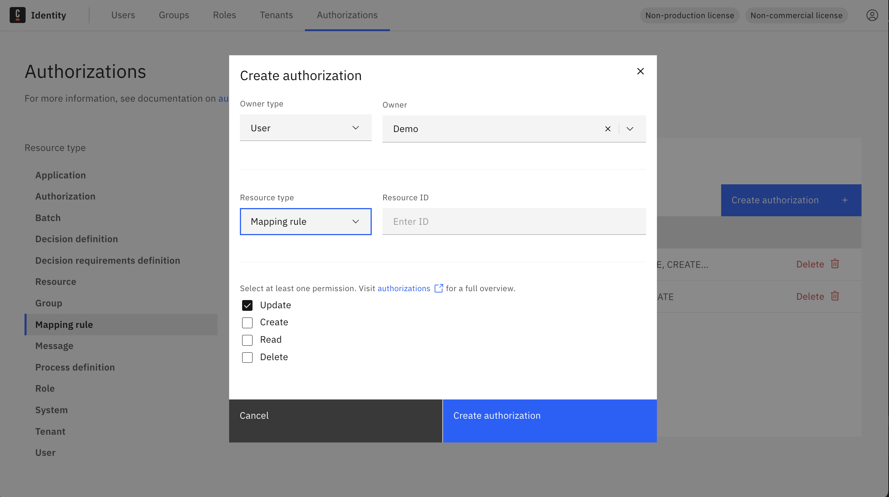
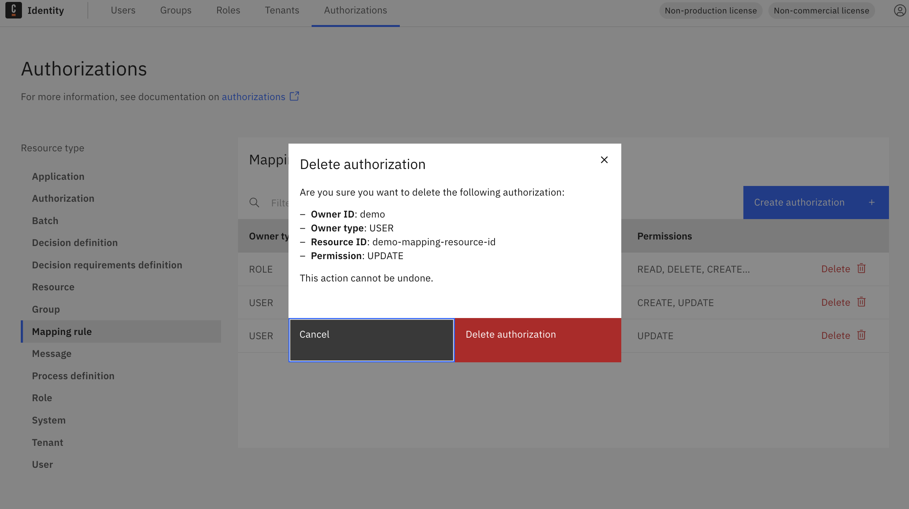

import Tabs from "@theme/Tabs";
import TabItem from "@theme/TabItem";

This guide explains how to assign users, groups, or roles permission to manage specific mapping rules. To learn how to create mapping rules themselves, see Managing Mapping Rules.

:::tip
To learn more about the concept of mapping rules, see the [mapping rules documentation](../../../concepts/mapping-rules.md).
:::

1. Log in to the Identity UI and navigate to the **Authorizations** tab.
2. In the left sidebar, select **Mapping rule** as the resource type.

:::info
The `Default` mapping rule is created during startup using the [IDENTITY_INITIAL_CLAIM_NAME and IDENTITY_INITIAL_CLAIM_VALUE environment variables](../../deployment/configuration-variables.md#oidc-configuration).  
This allows the first user to access the Identity UI. Afterward, you can configure additional rules for user access to Camunda components.
:::

<Tabs groupId="mappingRuleAction" defaultValue="add" queryString
values={[{label: 'Add', value: 'add', },{label: 'Update', value: 'update', },{label: 'Delete', value: 'delete', },]}>

<TabItem value="add">

### Add a mapping rule

1. Click **Create authorization**.

2. In the modal, set the following:
   - **Owner type**: User / Group / Role
   - **Owner**: Select the specific owner
   - **Resource type**: `Mapping rule`
   - **Resource ID**: Enter a unique resource ID
   - **Permissions**: Select one or more (Create, Read, Update, Delete)

3. Click **Create authorization** to save the mapping rule.

</TabItem>

<TabItem value="update">

### Update a mapping rule

1. In the **Authorizations** table with **Mapping rule** selected, click **Delete** next to an existing rule (update is done by removing and re-adding with changes).

2. Recreate the rule with updated values using the **Add** tab steps above.

:::note
Currently, rule updates are handled by deleting and re-creating the authorization with modified values.
:::

</TabItem>

<TabItem value="delete">

### Delete a mapping rule

1. Navigate to the **Authorizations** tab with **Mapping rule** selected as the resource type.

2. Click the **Delete** button on the rule you want to remove.

</TabItem>

</Tabs>
