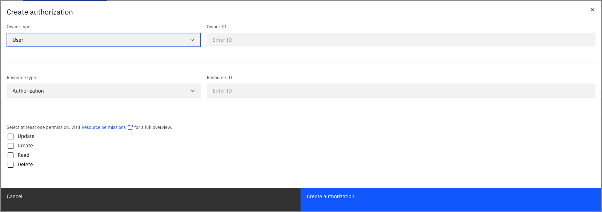

Identity provides unified, cluster-level identity management and authorizations. Authorizations are managed through permissions that can be assigned to [users](user.md), group, role and mapping.

## Authorization overview

Authorization is a mechanism that controls access to resources and actions based on permissions assigned to an entity.

Camunda 8 cluster uses resource-based authorization control, which means that permissions are granted to entities (like users) to perform specific actions on specified resources. For example, permissions can be set for actions such as reading, updating, creating, or deleting resources like process instances.

Authorizations can be enabled or disabled for each Camunda 8 cluster via [configuration settings](../installation.md#enable-api-authentication-and-authorizations). By default, authorizations are disabled. When they are enabled, a user is not granted access to anything by default and must be explicitly granted permission to access applications or perform actions on resources.

## Authorization concepts

### Permissions

Permissions are the building blocks of authorizations. They define the actions that can be performed on resources. Permissions are granted to entities (like users) to perform specific actions on specified resources.

Permissions are defined by a combination of a resource type, resource ID, and action. For example, a permission might grant a user the ability to read a specific process instance.

### Resources

Resources are the objects on which actions can be performed. Resources can be entities like process instances, tasks, or users. Resources are identified by a resource ID and type.

## Create an authorization

1. Log in to the Camunda 8 web application.
2. Click on the `Authorizations` tab.
3. Select the resource type on the left side of the screen.
4. Click on the `Create authorization` button, this will create an authorization for the previously selected resource type.
5. Select the owner type (user, group, role, or mapping) to which you want to assign permissions.
6. Add the owner ID to which you want to assign permissions.
7. Add the resource ID.
8. Select the permissions you want to permit.
9. Click on the `Create authorization` button.
10. The authorization is created and the user, group, role, or mapping is granted the permission to perform the action on the specified resource.

## Delete an authorization

1. Log in to the Camunda 8 web application.
2. Click on the `Authorizations` tab.
3. Select the resource type of the authorization you want to delete.
4. Click on the `Delete` button next to the authorization you want to delete.
5. Confirm the deletion by clicking on the `Delete` button in the confirmation dialog.
6. The authorization is deleted and the user, group, role, or mapping no longer has permission to perform the action on the specified resource.
