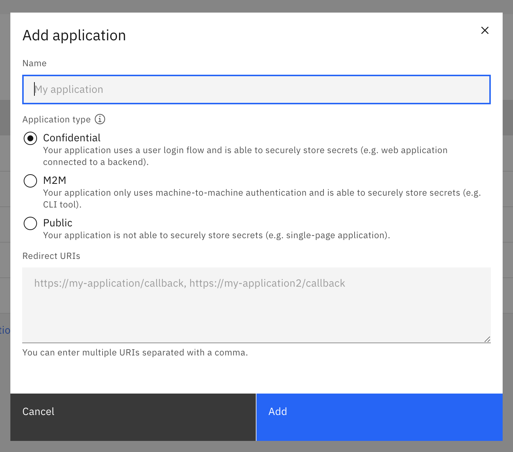
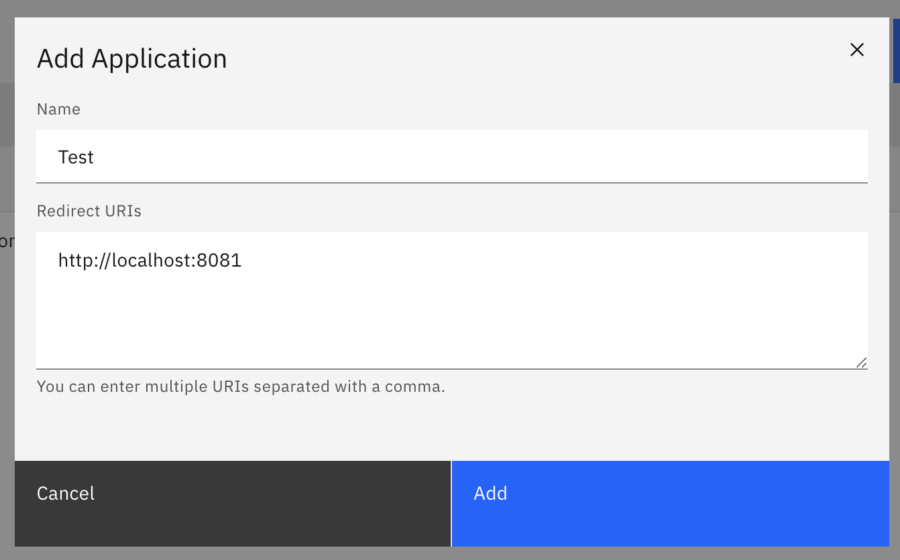
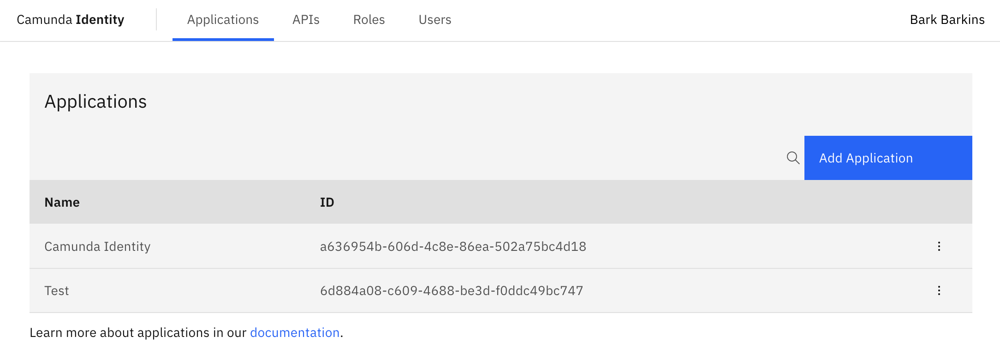
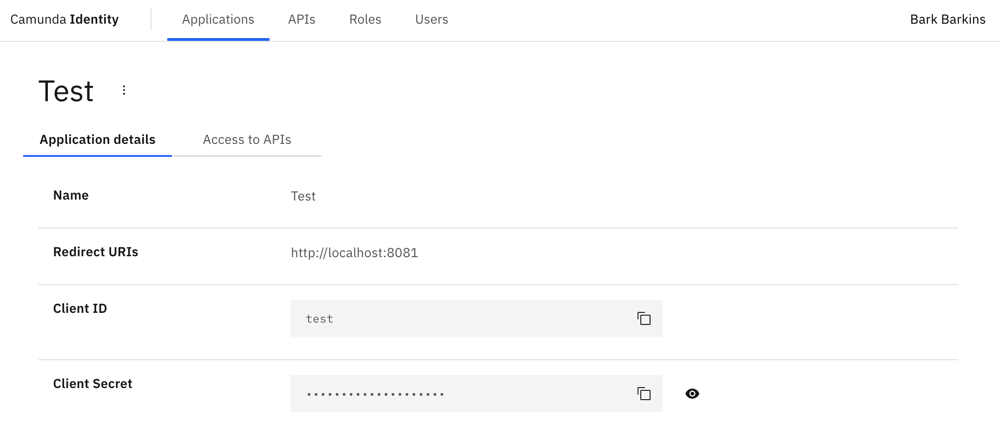

In this guide we will show you how to use Identity to create an application.

:::tip Want to learn more about applications?
Head over to our documentation on [applications](/self-managed/concepts/access-control/applications.md) to find out more.
:::

:::caution Write access needed
To add an application, you need to have write access to Identity.
Read our [guide on managing user access](managing-user-access.md) to learn more.
:::

1. Log in to the Identity UI and navigate to the **Applications** tab:

2. Click the **Add application** button located on the top right of the table and a modal will open:

3. Fill in a name for your application. For this guide we will use a set of example values.
   Select the type of your application based on our [guide](/self-managed/concepts/access-control/applications.md#types-of-applications).
   Depending on the selected type, you might need to enter at least one redirect URI. When you have inserted the required
   details, click **Add**:

On confirmation, the modal will close, the list will update, and your new application will be shown:

You are now able to click on your new application to view the details. This includes your generated client ID
and client secret depending on the selected [type](/self-managed/concepts/access-control/applications.md#types-of-applications):

