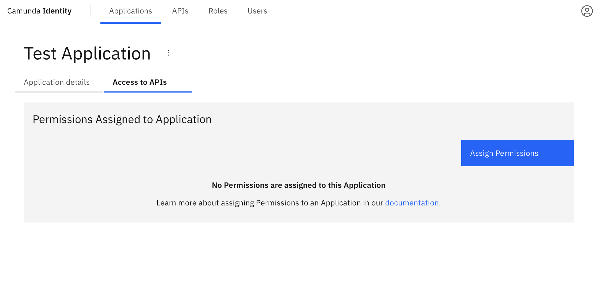
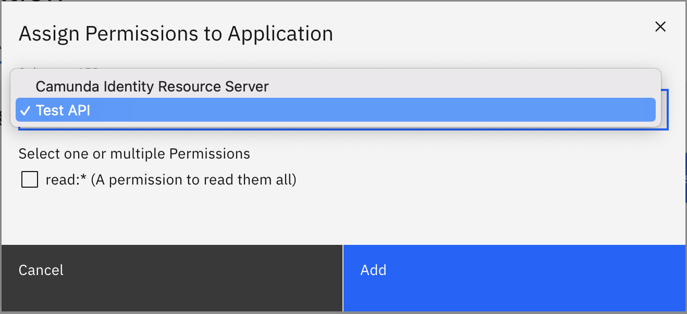
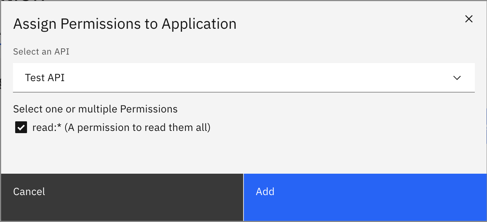
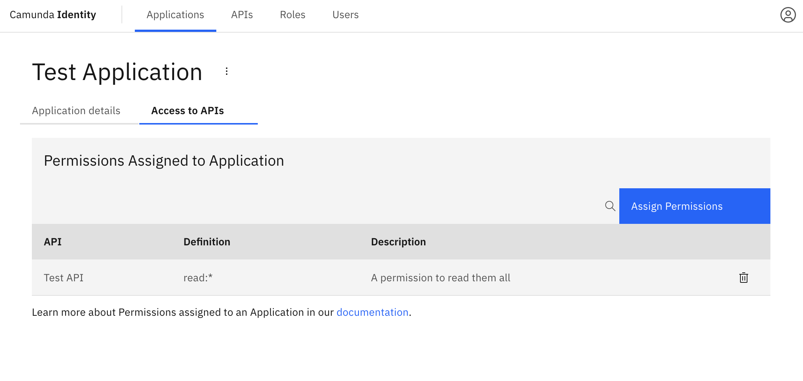

In this guide we will show you how to use Identity to assign a permission to an application.

To assign a permission to an application using Identity, take the following steps:

1. Log in to the Identity UI and navigate to the **Applications** tab, select an application, and click on **Access to APIs**:

2. Select the API which contains the permission you want to assign:

3. Select the permission you would like to assign and click **Add**

On confirmation, the modal will close, the table will update, and your assigned permission will be shown:

