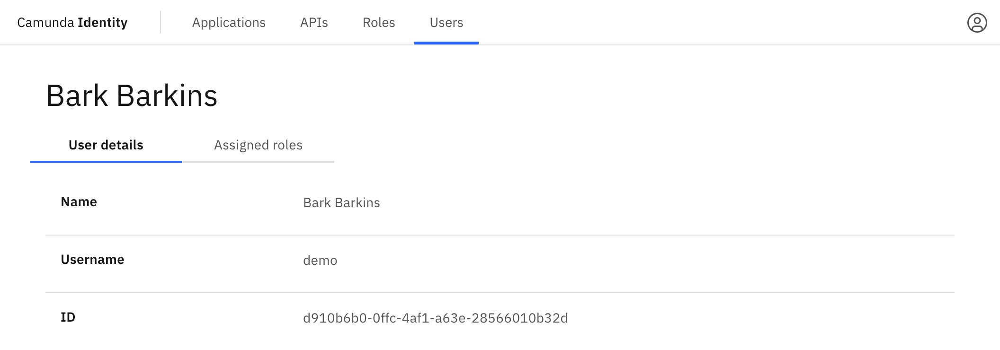

In this guide we will show you how to use Identity to assign a role to a user.

:::caution Write access needed
To assign a role to a user, you need to have write access to Identity.
Read our [guide on managing user access](managing-user-access.md) to learn more.
:::

To assign a role to a user using Identity, take the following steps:

1. Log in to the Identity UI and navigate to the **Users** tab:

2. Click on the user you want to assign a role to to view their details:

3. Click on **Assigned Roles** to view the roles currently assigned to the user:

4. Click the **Assign Role** button located on the top right of the table and a modal will open:

5. Select the role you want to assign to the user and click **Add**.

On confirmation, the modal will close, the table will update, and the newly assigned role will be shown:

