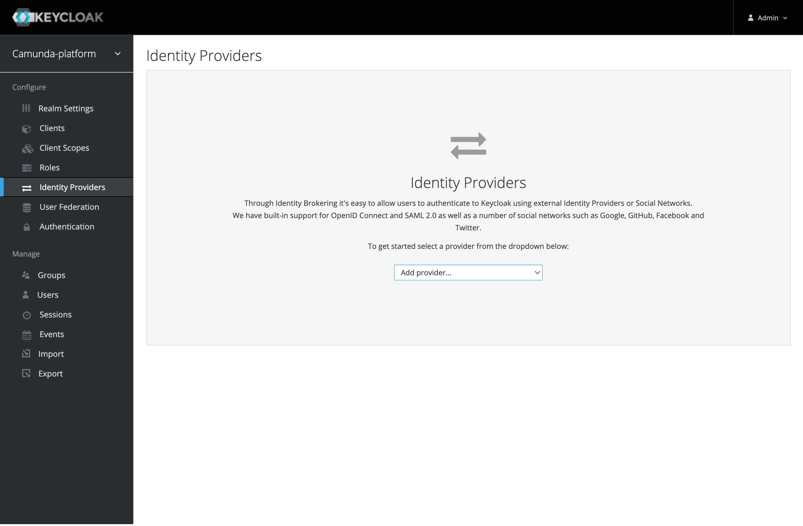
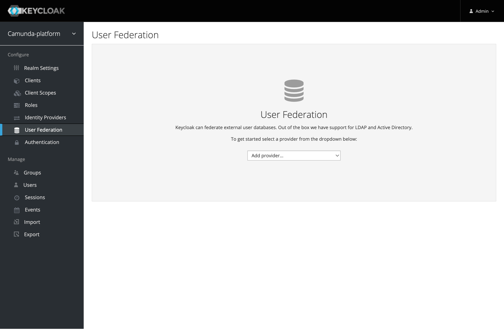

:::info
The Identity UI does not offer support for configuring external identity providers. You can configure an external
identity provider directly in Keycloak Administrator Console.
:::

To configure an external identity provider like OpenID Connect, SAML, LDAP, or Active Directory, take the following steps:

1. Log in to the Keycloak Administrator Console. Open the URL you have configured for Keycloak in your browser.
   :::tip
   When using the example
   [Docker Compose](/self-managed/setup/deploy/local/docker-compose.md) setup, Keycloak
   is available at [http://localhost:18080/](http://localhost:18080/).
   :::
2. Click **Administrator Console** and log in using the Keycloak administrator credentials. The default administrator username is `admin`. When deploying Camunda 8 with [Helm charts](/self-managed/setup/overview.md),
   you can extract the password as described in
   [secrets extraction](/self-managed/setup/upgrade.md#secrets-extraction).
   Using the example [Docker Compose](/self-managed/setup/deploy/local/docker-compose.md)
   setup, the password is set via `KEYCLOAK_ADMIN_PASSWORD` environment variable and is `admin` per default.
3. Select the realm you are using with Camunda 8. By default, this is **Camunda-platform**.
   
4. Add an identity provider using one of the following methods:
   1. To add an OpenID Connect or SAML provider, select **Identity Providers** in the main menu, click **Add provider...**, and fill in all required configuration settings.
      
   2. To connect to your LDAP, Active Directory, or Kerberos server, select **User Federation** in the main menu, click **Add provider...**, and fill in all required configuration settings.
      

:::tip
Keycloak supports a wide variety of authentication options, such as mapping external user groups, roles, or scopes to internal roles, and configuring the login screen and flow when multiple providers are added.

Visit the Keycloak documentation for your version of Keycloak for details on [adding a provider](https://www.keycloak.org/docs/latest/server_admin/#adding-a-provider),
[configuring authentication](https://www.keycloak.org/docs/latest/server_admin/index.html#configuring-authentication_server_administration_guide), and
[integrating identity providers](https://www.keycloak.org/docs/latest/server_admin/index.html#_identity_broker).
:::
