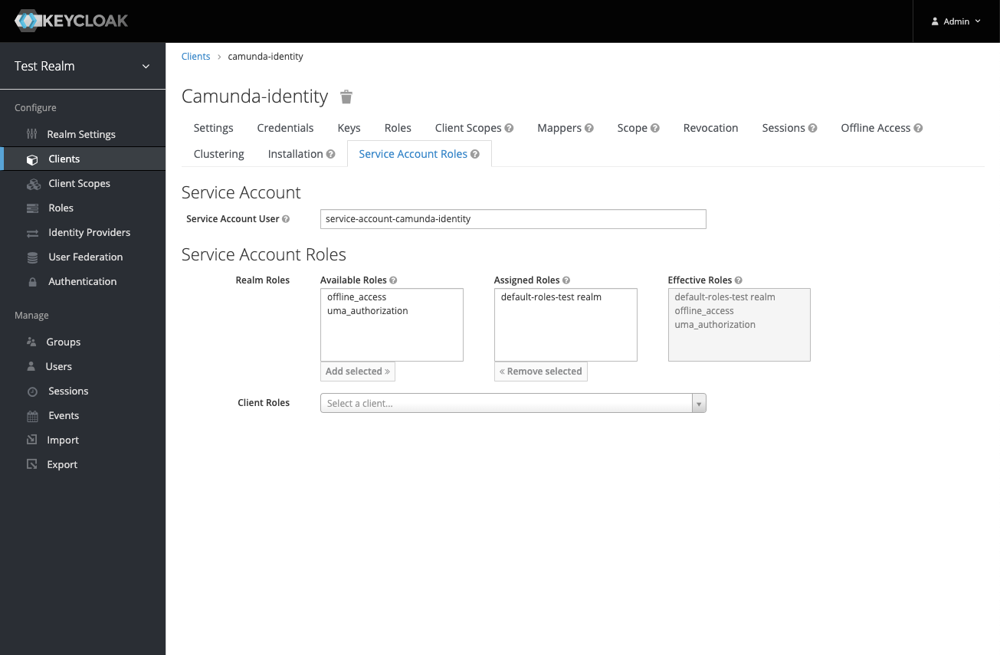
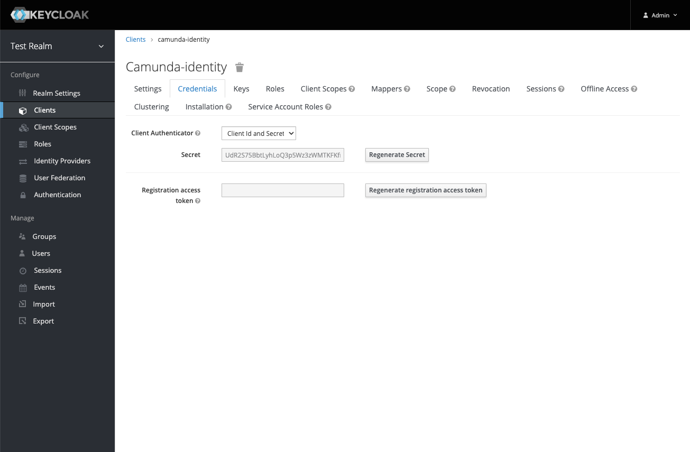

In this guide, we will show you how you can connect the Identity component to your existing Keycloak instance.

### Prerequisites

- Access to your Keycloak Admin Console
- A basic understanding of administering realms and clients in Keycloak

To connect Identity to an existing Keycloak instance, take the following steps:

1. Login to your Keycloak Admin Console

2. Hover over the current selected realm name, in our example **Master**, and select the realm you would like to connect Identity to, in our example it is **Test Realm**

3. Click on **Clients** in the left navigation bar and then click **Create**

4. Enter the client ID and the URL of where your Identity instance will be hosted then click **Save**
   :::note What client ID should I use?
   By default, Identity uses the Client ID `camunda-identity` so we would recommend using this too. If you choose a different client ID this will need to be set in the Identity application [environment variables](/docs/self-managed/identity/deployment/configuration-variables.md).
   :::

5. On the page for the client created, set the **Access Type** to `confidential` and **Service Accounts Enabled** to `ON`

6. Scroll to the bottom of the page, click **Save** and return to the top of the page

7. Click on the **Service Account Roles** tab in the top navigation

8. Select the `realm-management` client from the **Client Roles** dropdown

9. Assign the `manage-clients`, `manage-realm`, and `manage-users` role from the **Available Roles** list

:::note Why does Identity need these roles?
Identity is designed to allow users to manage the various entities related to the Camunda platform. To achieve this it requires specific access to the realm.
:::

10. Click on the **Credentials** tab and copy the client secret

11. Set the `IDENTITY_CLIENT_SECRET` [environment variable](/docs/self-managed/identity/deployment/configuration-variables.md) with the value from step 9.

12. Start the Identity application

:::note What does Identity create when starting?
The Identity application creates a base set of configuration required to function successfully, to understand more about what is created and why please see [the starting configuration](/docs/self-managed/identity/deployment/starting-configuration.md).
:::
