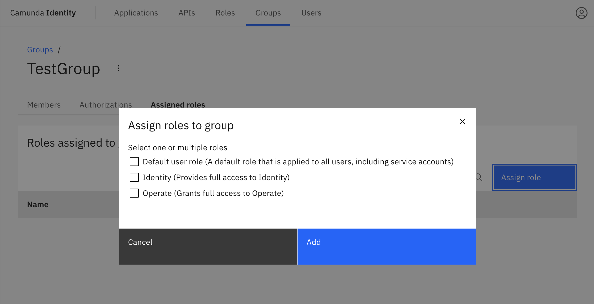
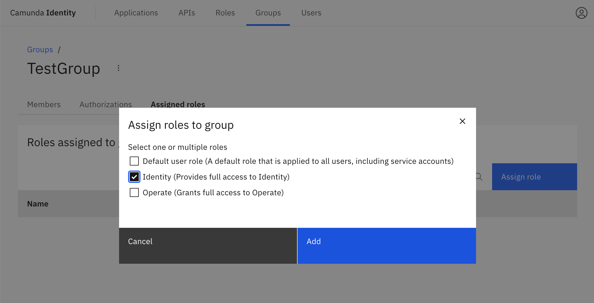

In this guide we will show you how to use Identity to assign roles to a group.

:::caution Write access needed
To assign a role to a group, you need to have write access to Identity.
Read our [guide on managing user access](../managing-user-access.md) to learn more.
:::

1. Log in to the Identity UI and navigate to the **Groups** tab, select the group you would like to assign a role to from the table, and click on the **Roles** tab:

2. Click on **Assign Role**

3. We are now able to select the roles to assign to our group. When you have selected the roles, click **Add**:

On confirmation, the modal will close, the table will update, and your assigned roles will be shown:

