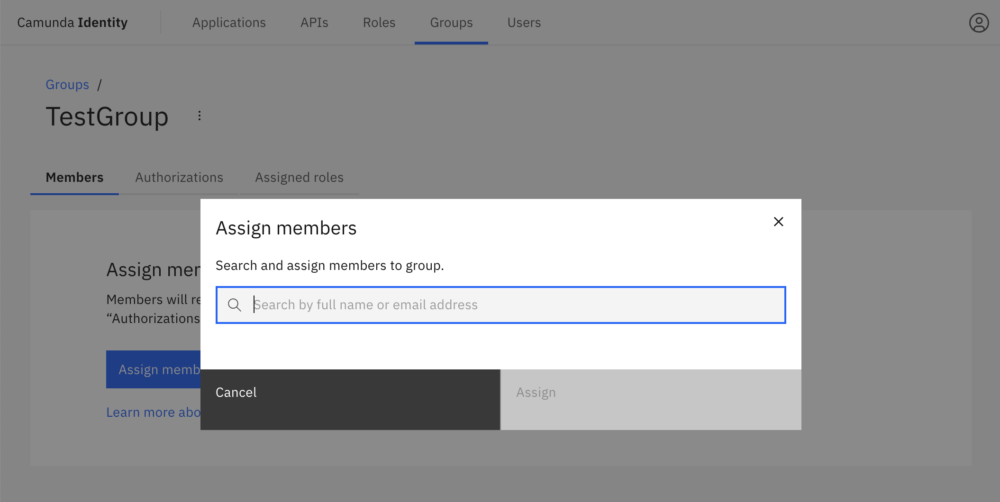
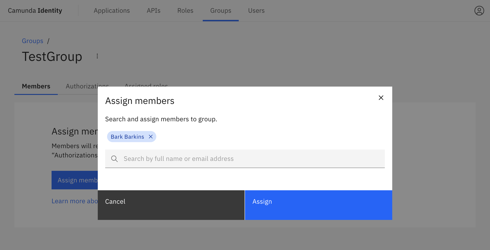

In this guide we will show you how to use Identity to assign users to a group.

:::caution Write access needed
To assign a user to a group, you need to have write access to Identity.
Read our [guide on managing user access](../managing-user-access.md) to learn more.
:::

1. Log in to the Identity UI and navigate to the **Groups** tab and select the group you would like to assign a user to from the table:

2. Click on **Assign Members**

3. We are now able to search and select the users to assign to our group. When you have selected the users, click **Assign**:

On confirmation, the modal will close, the table will update, and your assigned members will be shown:

