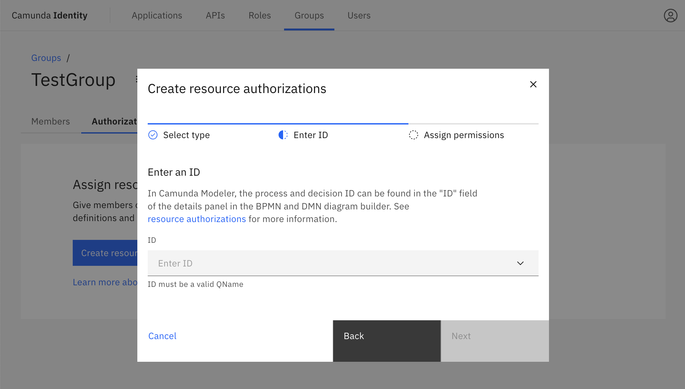
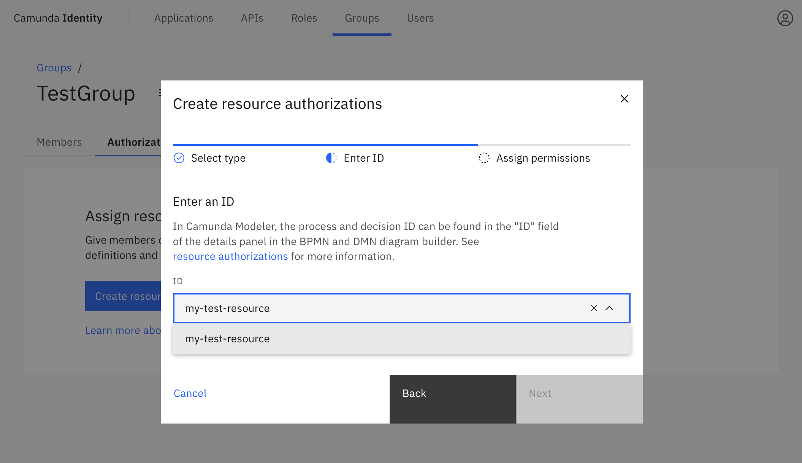
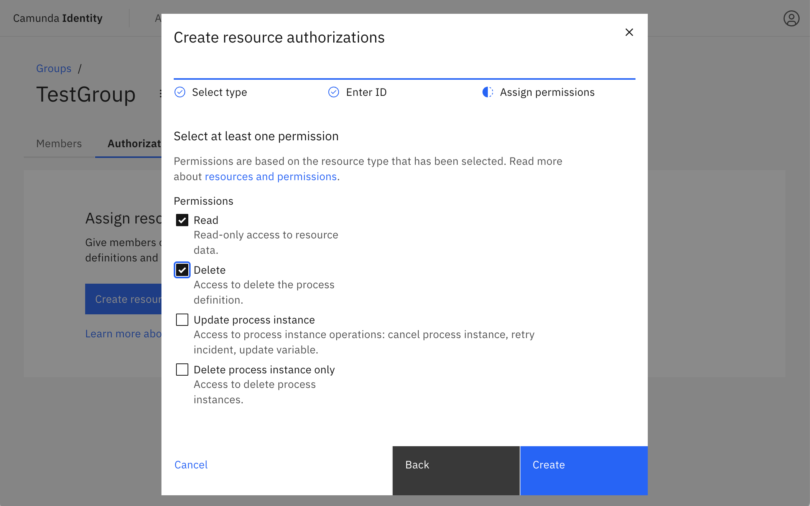
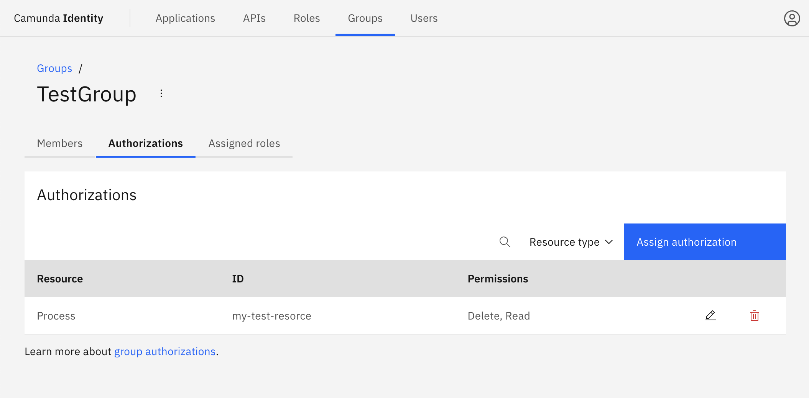

In this guide we will show you how to use Identity to create authorizations for a group.

:::caution Write access needed
To create an authorization for a group, you need to have write access to Identity.
Read our [guide on managing user access](../managing-user-access.md) to learn more.
:::

1. Log in to the Identity UI and navigate to the **Groups** tab, select the group you would like to create an authorization for from the table, and click on the **Authorizations** tab:

2. Click on **Create resource authorization** and a modal will open:

3. Select the type of resource you are creating an authorization for, then click **Next**:

4. Input the ID of the resource you would like to create an authorization for, select the resource from the list, and click **Next**:

5. Select the permissions you would like to assign and click **Create**

On confirmation, the modal will close, the table will update, and your authorization will be shown:

