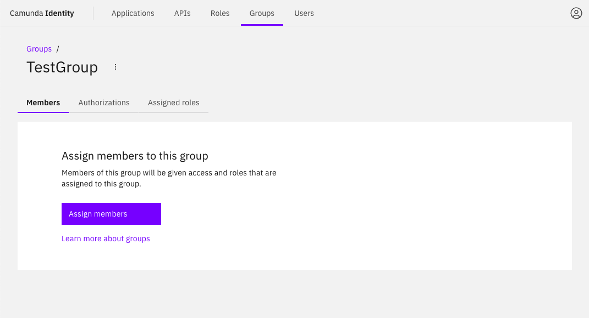

In this guide we will show you how to use Identity to create a group, and assign users and roles to a group.

:::tip Want to learn more about groups?
Head over to our documentation on [groups](/self-managed/concepts/access-control/groups.md) to learn more.
:::

## Create a group

To create a group using Identity, take the following steps:

1. Log in to the Identity UI and navigate to the **Groups** tab:

2. Click the **Add Group** button located on the top right of the table and a modal will open.

3. Fill in the name of the group. For this guide, we use an example value. After inserting the name, click **Add**:

On confirmation, the modal closes, the table updates, and your new group is shown:

## Assign users to a group

In this guide we will show you how to use Identity to assign users to a group.

:::caution Write access needed
To assign a user to a group, you must have write access to Identity.
Read our [guide on managing user access](../managing-user-access.md) to learn more.
:::

1. Log in to the Identity UI and navigate to the **Groups** tab. Select the group you would like to assign a user to from the table:

2. Click **Assign Members** and a modal will open.

3. Search and select the users to assign to the group. After selecting the users, click **Assign**.

On confirmation, the modal closes, the table updates, and your assigned members are shown:

## Assign roles to a group

:::caution Write access needed
To assign a role to a group, you must have write access to Identity.
Read our [guide on managing user access](../managing-user-access.md) to learn more.
:::

1. Log in to the Identity UI and navigate to the **Groups** tab. Select the group you would like to assign a role to from the table, and click on the **Roles** tab:

2. Click **Assign Role** and a modal will open.

3. Select the roles to assign to the group. When you have selected the roles, click **Add**.

On confirmation, the modal closes, the table updates, and your assigned roles are shown:

