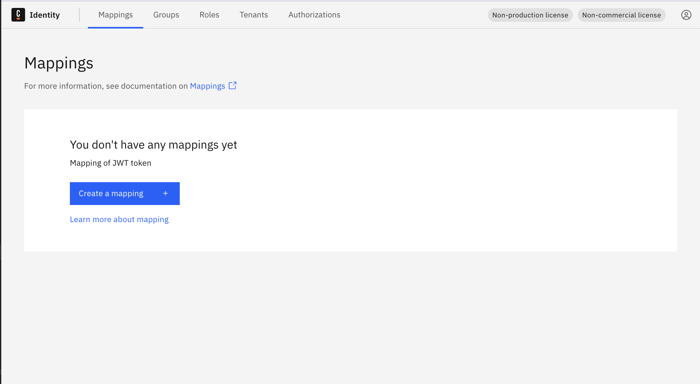
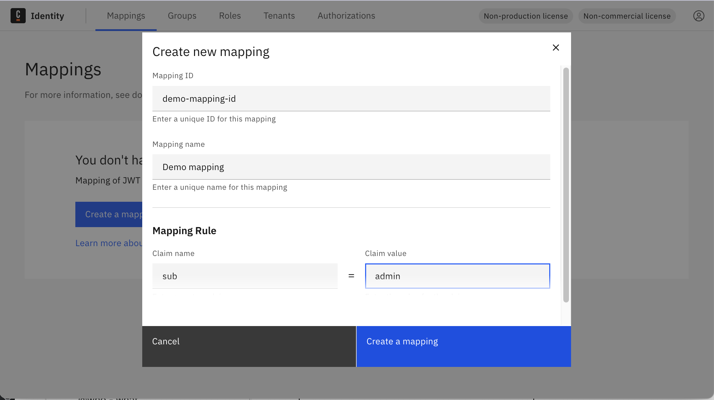
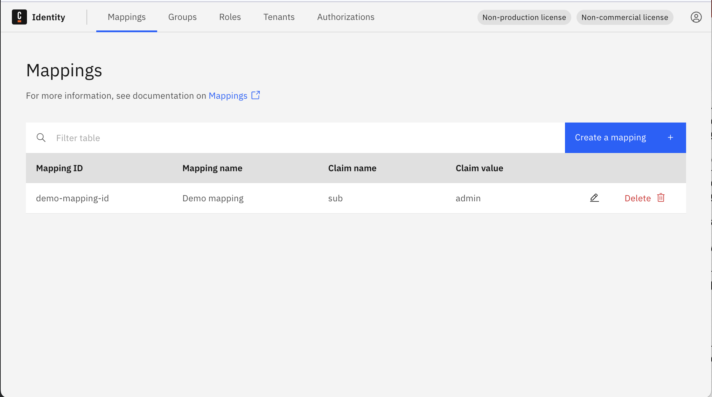
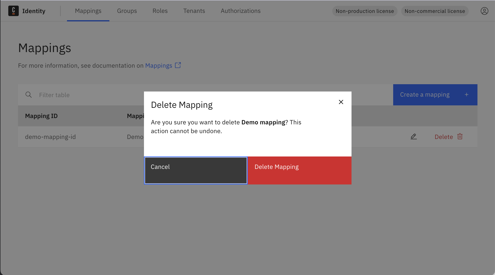

import Tabs from "@theme/Tabs";
import TabItem from "@theme/TabItem";

In this guide, you will learn how to manage mapping rules in Identity and how to control the Camunda entities related to
them.

:::tip
To learn more about the concept of mapping rules, see
the [mapping rules documentation](../../../concepts/mapping-rules.md).
:::

1. Log in to the Identity UI and navigate to the **Mappings** tab.

:::info
The `Default` mapping rule is created during startup using the [IDENTITY_INITIAL_CLAIM_NAME and
IDENTITY_INITIAL_CLAIM_VALUE environment variables](../../deployment/configuration-variables.md#oidc-configuration) to
allow an initial user access to the Identity UI. Once you have
access to the Identity UI, configure the additional mapping rules to ensure your users have
the correct access to the Camunda components.
:::

<Tabs groupId="mappingRuleAction" defaultValue="add" queryString
values={[{label: 'Add', value: 'add', },{label: 'Update', value: 'update', },{label: 'Delete', value: 'delete', },]} >

<TabItem value="add">

1. Click the **Add mapping** button and select the type of mapping to create. You can create a mapping for a role or
   tenant.

2. Fill in the fields for the mapping rule and click **Create**.

:::note

The operator option is used to define how we evaluate the rules against your tokens. The options are:

- **Contains**: Used for array-based claims, such as a list of roles.
- **Equals**: Used for string-based claims, such as a string ID.

:::

The created mapping rule can be seen in the table.

</TabItem>
<TabItem value="update">

1. Click the pencil icon on the row of the mapping rule you want to update.

2. Update the fields for the mapping rule and click **Update**.

:::note
You can only update the entities applied by the mapping rule along with the claims used to map the entities. You cannot
update the type of mapping rule.
:::

</TabItem>
<TabItem value="delete">

Click on the **trash can** icon on the row of the mapping rule you want to delete and confirm.

After confirming, the mapping rule is deleted and no longer appears in the table.

</TabItem>

</Tabs>
