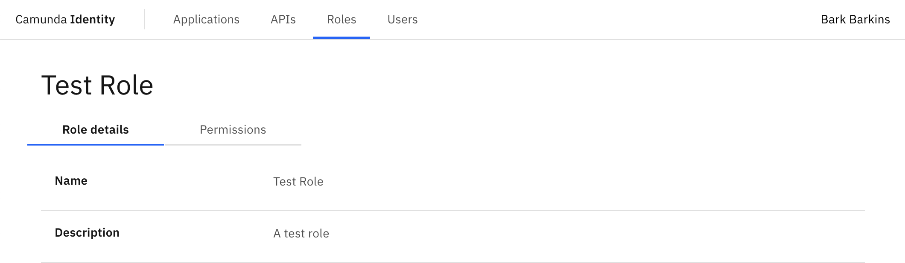

To use [Identity](/self-managed/identity/what-is-identity.md), an account is required. We refer to this account as a user. Access to the components within Camunda 8 can be controlled by the roles assigned to a user.

In this guide we will show you how to use Identity to create a role and assign a role to a user.

Roles are a way to group sets of [permissions](/self-managed/identity/user-guide/roles/add-assign-permission.md) which can be
assigned to users using the [Identity](/self-managed/identity/what-is-identity.md) UI.

:::caution Write access needed
To add and assign a role to a user, you need to have write access to Identity.
Read our [guide on managing user access](/self-managed/identity/user-guide/authorizations/managing-user-access.md) to learn more.
:::

## Add a role

1. Log in to the Identity UI and navigate to the **Roles** tab:

2. Click the **Add Role** button located on the top right of the table and a modal will open.

3. We are now able to fill out the details of the role. For this guide, we will use a set of example values. When you have inserted the details, click **Add**:

On confirmation, the modal will close, the table will update, and your new role will be shown. Click on your new role to view the details:

## Assign a role to a user

To assign a role to a user using Identity, take the following steps:

1. Log in to the Identity UI and navigate to the **Users** tab:

2. Click on the user you want to assign a role to to view their details.

3. Click on **Assigned Roles** to view the roles currently assigned to the user.

4. Click the **Assign Role** button located on the top right of the table and a modal will open.

5. Select the role you want to assign to the user and click **Add**.

On confirmation, the modal will close, the table will update, and the newly assigned role will be shown:

