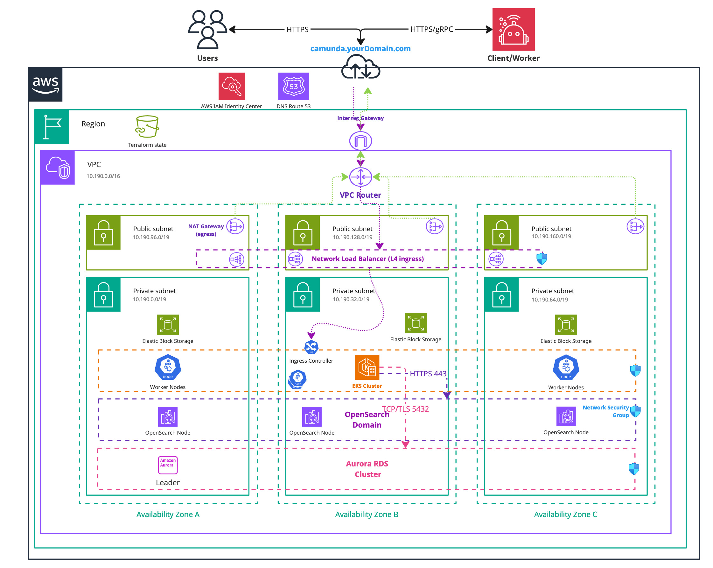
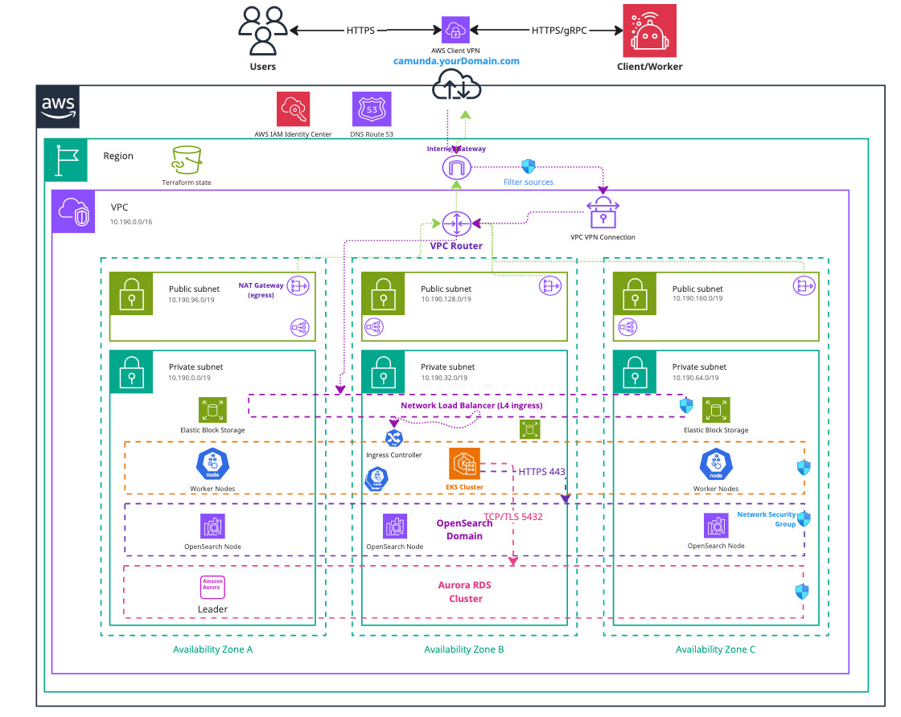

<!-- (!) Note: Please ensure that this guide maintains a consistent structure and presentation style throughout, similar to the ROSA HCP Terraform setup. The user should have a similar experience when reading both guides. -->

import Tabs from "@theme/Tabs";
import TabItem from "@theme/TabItem";

This guide explains how to provision an [Amazon Web Services (AWS) Elastic Kubernetes Service (EKS) cluster](https://docs.aws.amazon.com/eks/latest/userguide/what-is-eks.html) using Terraform, a widely used Infrastructure as Code (IaC) tool.  
The EKS cluster serves as the infrastructure foundation for running Camunda 8.

Camunda recommends this approach for a robust, sustainable setup. For a quicker trial or proof of concept, or if the Terraform module doesn’t meet your needs, see [Deploy an EKS cluster with eksctl](./eksctl.md).

For advanced EKS scenarios, see the [Amazon EKS documentation](https://docs.aws.amazon.com/eks/latest/userguide/).

:::tip

New to Terraform or Infrastructure as Code? Start with the [Terraform IaC documentation](https://developer.hashicorp.com/terraform/tutorials/aws-get-started/infrastructure-as-code) and try the [interactive quick start](https://developer.hashicorp.com/terraform/tutorials/aws-get-started/infrastructure-as-code#quick-start).

:::

## Requirements

- **AWS account** – Required to create AWS resources. See [What is an AWS account?](https://docs.aws.amazon.com/accounts/latest/reference/accounts-welcome.html).
- **AWS CLI** – Command-line tool to manage AWS resources. [Install AWS CLI](https://docs.aws.amazon.com/cli/latest/userguide/getting-started-install.html).
- **Terraform** – IaC tool used to provision resources. [Install Terraform](https://developer.hashicorp.com/terraform/downloads).
- **kubectl** – CLI for interacting with Kubernetes clusters. [Install kubectl](https://kubernetes.io/docs/tasks/tools/#kubectl).
- **jq** – Lightweight JSON processor. [Download jq](https://jqlang.github.io/jq/download/).
- **IAM Roles for Service Accounts (IRSA)** – Configure IRSA to map IAM roles to Kubernetes service accounts. This removes the need for long-lived credentials and lets Kubernetes services assume IAM roles to interact with AWS services (for example, S3, RDS, Route 53).
  - See the AWS [IRSA deep dive](https://aws.amazon.com/blogs/containers/diving-into-iam-roles-for-service-accounts/).
  - IRSA is recommended as an [EKS best practice](https://aws.github.io/aws-eks-best-practices/security/docs/iam/).
- **AWS service quotas** – Verify your quotas before deployment:
  - At least 3 Elastic IPs (one per availability zone).
  - Adequate quotas for **VPCs, EC2 instances, and storage**.
  - Request increases if needed via the AWS console. You pay only for used resources. See [AWS service quotas](https://docs.aws.amazon.com/general/latest/gr/aws_service_limits.html) and [Amazon EC2 service quotas](https://docs.aws.amazon.com/AWSEC2/latest/UserGuide/ec2-resource-limits.html)
- **Shell** – Examples use GNU Bash.

For the tool versions used in testing, see the repository’s [.tool-versions](https://github.com/camunda/camunda-deployment-references/blob/main/.tool-versions) file. It contains an up-to-date list of versions used for testing.

### Considerations

#### General considerations

This setup provides a solid starting point for running Camunda 8 on AWS. It is not optimized for peak performance. Use it as a foundation you can extend and adapt for production with [Infrastructure as Code (IaC) tools](https://developer.hashicorp.com/terraform/tutorials/aws-get-started/infrastructure-as-code).

If Terraform feels complex at first, try the [eksctl guide](./eksctl.md) for a simpler entry point, which shows the resources created and how they interact with each other.

- To test or develop against Camunda 8, consider signing up for our [SaaS offering](https://camunda.com/platform/).
- If you already have an Amazon EKS cluster, skip ahead to the [Helm setup guide](./eks-helm.md) to deploy Camunda 8.

#### Security considerations

The following security considerations were flagged by [Trivy](https://trivy.dev/) to simplify adoption and development. Review and address these before production.  
You can look up each ID in the [Aqua vulnerability database](https://avd.aquasec.com/).

```
AVD-AWS-0040 #(CRITICAL): Public cluster access is enabled.
AVD-AWS-0041 #(CRITICAL): Cluster allows access from a public CIDR: 0.0.0.0/0
AVD-AWS-0104 #(CRITICAL): Security group rule allows egress to multiple public internet addresses.

AVD-AWS-0343 #(MEDIUM): Cluster does not have Deletion Protection enabled
AVD-AWS-0178 #(MEDIUM): VPC does not have VPC Flow Logs enabled.
AVD-AWS-0038 #(MEDIUM): Control plane scheduler logging is not enabled.
AVD-AWS-0077 #(MEDIUM): Cluster instance has very low backup retention period.

AVD-AWS-0133 #(LOW): Instance does not have performance insights enabled.
```

:::warning

Reference architectures and examples provided in this guide are not turnkey modules. Camunda recommends cloning the repository and modifying it locally.

You are responsible for operating and maintaining the infrastructure. Camunda updates the reference architecture over time and changes may not be backward compatible. You can use these updates to upgrade your customized codebase as needed.

:::

:::danger Cost management

This guide will incur costs on your cloud provider account, specifically for the managed Kubernetes service, running Kubernetes nodes in EC2, Elastic Block Storage (EBS), and Route 53. For more details, see [AWS EKS pricing](https://aws.amazon.com/eks/pricing/) and the [AWS Pricing Calculator](https://calculator.aws/#/). Costs vary by region.

:::

### Variants

We support two variants of this architecture:

- **Standard installation** - Uses username and password connection for the Camunda components (or relies on network isolation for specific components). This option is straightforward and easier to implement, making it ideal for environments where simplicity and rapid deployment are priorities, or where network isolation provides sufficient security.

- **IRSA** (IAM Roles for Service Accounts) - Uses service accounts to perform authentication with IAM policies. This approach offers stronger security and better integration with AWS services, as it eliminates the need to manage credentials manually. It is especially beneficial in environments with strict security requirements, where fine-grained access control and dynamic role-based access are essential.

#### How to choose

- If you prefer a simpler setup with basic authentication or network isolation, and your security needs are moderate, the **standard installation** is a suitable choice.
- If you require enhanced security, dynamic role-based access management, and want to leverage AWS’s identity services for fine-grained control, the **IRSA** variant is the better option.

Both can be set up with or without a **Domain** ([Ingress](https://kubernetes.io/docs/concepts/services-networking/ingress/)).

### Outcome

<!-- The following diagram should be exported as an image and as a PDF from the sources https://miro.com/app/board/uXjVL-6SrPc=/ --->
<!-- To export: click on the frame > "Export Image" > as PDF and as JPG (low res), then save it in the ./assets/ folder --->

_Infrastructure diagram for a single region EKS setup (click on the image to open the PDF version)_
[](./assets/eks-single-region.pdf)

After completing this guide, you will have:

- An Amazon EKS Kubernetes cluster running with four nodes ready for Camunda 8 installation.
- The [EBS CSI driver](https://docs.aws.amazon.com/eks/latest/userguide/ebs-csi.html), installed and configured. This is used by the Camunda 8 Helm chart to create [persistent volumes](https://kubernetes.io/docs/concepts/storage/persistent-volumes/).
- (Optional) A managed [Aurora PostgreSQL 15.x](https://aws.amazon.com/rds/postgresql/) instance for Camunda.
- (Optional) A managed [Amazon OpenSearch Service](https://aws.amazon.com/opensearch-service/) domain created and configured for use with the Camunda platform.
- (Optional) [IRSA](https://docs.aws.amazon.com/eks/latest/userguide/iam-roles-for-service-accounts.html) configured so Kubernetes workloads can assume IAM roles without stored credentials.

## 1. Configure AWS and initialize Terraform

### Obtain a copy of the reference architecture

The first step is to download a copy of the reference architecture from the [GitHub repository](https://github.com/camunda/camunda-deployment-references/blob/main/aws/kubernetes/eks-single-region/). This material will be used throughout the rest of this documentation. The reference architectures are versioned using the same Camunda versions (`stable/8.x`).

The provided reference architecture repository allows you to directly reuse and extend the existing Terraform example base. This sample implementation is flexible to extend to your own needs without the potential limitations of a Terraform module maintained by a third party.

   <Tabs groupId="env">
   <TabItem value="standard" label="Standard" default>

```bash reference
https://github.com/camunda/camunda-deployment-references/blob/main/aws/kubernetes/eks-single-region/procedure/get-your-copy.sh
```

   </TabItem>
   <TabItem value="irsa" label="IRSA">

```bash reference
https://github.com/camunda/camunda-deployment-references/blob/main/aws/kubernetes/eks-single-region-irsa/procedure/get-your-copy.sh
```

   </TabItem>
   </Tabs>

With the reference architecture copied, you can proceed with the remaining steps outlined in this documentation. Ensure that you are in the correct directory before continuing with further instructions.

### Terraform prerequisites

To manage the infrastructure for Camunda 8 on AWS using Terraform, we need to set up Terraform's backend to store the state file remotely in an S3 bucket. This ensures secure and persistent storage of the state file.

:::note
Advanced users may want to handle this part differently and use a different backend. The backend setup provided is an example for new users.
:::

#### Set up AWS authentication

The [AWS Terraform provider](https://registry.terraform.io/providers/hashicorp/aws/latest/docs) is required to create resources in AWS. Before you can use the provider, you must authenticate it using your AWS credentials.

:::caution Ownership of the created resources

A user who creates resources in AWS will always retain administrative access to those resources, including any Kubernetes clusters created. It is recommended to create a dedicated [AWS IAM user](https://docs.aws.amazon.com/IAM/latest/UserGuide/id_users.html) for Terraform purposes, ensuring that the resources are managed and owned by that user.

:::

You can further change the region and other preferences and explore different [authentication](https://registry.terraform.io/providers/hashicorp/aws/latest/docs#authentication-and-configuration) methods:

- For development or testing purposes you can use the [AWS CLI](https://docs.aws.amazon.com/cli/latest/userguide/cli-chap-getting-started.html). If you have configured your AWS CLI, Terraform will automatically detect and use those credentials.
  To configure the AWS CLI:

  ```bash
  aws configure
  ```

  Enter your `AWS_ACCESS_KEY_ID`, `AWS_SECRET_ACCESS_KEY`, region, and output format. These can be retrieved from the [AWS Console](https://docs.aws.amazon.com/IAM/latest/UserGuide/id_credentials_access-keys.html).

- For production environments, we recommend the use of a dedicated IAM user. Create [access keys](https://docs.aws.amazon.com/IAM/latest/UserGuide/id_credentials_access-keys.html) for the new IAM user via the console, and export them as `AWS_ACCESS_KEY_ID` and `AWS_SECRET_ACCESS_KEY`.

#### Create an S3 bucket for Terraform state management

Before setting up Terraform, you need to create an S3 bucket that will store the state file. This is important for collaboration and to prevent issues like state file corruption.

To start, set the region as an environment variable upfront to avoid repeating it in each command:

```bash
export AWS_REGION=<your-region>
```

Replace `<your-region>` with your chosen AWS region (for example, `eu-central-1`).

Now, follow these steps to create the S3 bucket with versioning enabled:

1. Open your terminal and ensure the AWS CLI is installed and configured.

2. Run the following command to create an S3 bucket for storing your Terraform state. Make sure to use a unique bucket name and set the `AWS_REGION` environment variable beforehand:

   ```bash reference
   https://github.com/camunda/camunda-deployment-references/blob/main/aws/common/procedure/s3-bucket/s3-bucket-creation.sh
   ```

3. Enable versioning on the S3 bucket to track changes and protect the state file from accidental deletions or overwrites:

   ```bash reference
   https://github.com/camunda/camunda-deployment-references/blob/main/aws/common/procedure/s3-bucket/s3-bucket-versioning.sh
   ```

4. Secure the bucket by blocking public access:

   ```bash reference
   https://github.com/camunda/camunda-deployment-references/blob/main/aws/common/procedure/s3-bucket/s3-bucket-private.sh
   ```

5. Verify versioning is enabled on the bucket:

   ```bash reference
   https://github.com/camunda/camunda-deployment-references/blob/main/aws/common/procedure/s3-bucket/s3-bucket-verify.sh
   ```

This S3 bucket will now securely store your Terraform state files with versioning enabled.

#### Initialize Terraform

Once your authentication is set up, you can initialize your Terraform project. The previous steps configured a dedicated S3 Bucket (`S3_TF_BUCKET_NAME`) to store your state, and the following creates a bucket key that will be used by your configuration.

Configure the backend and download the necessary provider plugins:

```bash reference
https://github.com/camunda/camunda-deployment-references/blob/main/aws/common/procedure/s3-bucket/s3-bucket-tf-init.sh
```

Terraform will connect to the S3 bucket to manage the state file, ensuring remote and persistent storage.

### EKS cluster module setup

This module provides the foundational configuration for AWS access and Terraform usage.

We use [Terraform modules](https://developer.hashicorp.com/terraform/language/modules) to abstract resources into reusable components and simplify infrastructure management.

The [Camunda AWS EKS cluster module](https://github.com/camunda/camunda-deployment-references/tree/main/aws/modules/eks-cluster/) is publicly available and serves as a robust starting point for deploying an Amazon EKS cluster. Review the module before implementation to understand its structure and capabilities.

The module is locally sourced in your clone. Any changes you make to the module in your repository take effect immediately in your setup.

#### Set up the EKS cluster module

1. Go to the [reference architecture directory of the cloned repository](#obtain-a-copy-of-the-reference-architecture).

   Verify the layout, and switch into the cluster module:

   ```bash
      cd ./aws/kubernetes/eks-single-region(-irsa)/terraform/

      ls
      # Example output:
      # cluster  vpn

      cd cluster
   ```

1. Review `cluster.tf`. It references the local Terraform module and contains a basic cluster setup that you can adjust to your needs. The file is available here:

   <Tabs groupId="env">
   <TabItem value="standard" label="Standard" default>

   ```hcl reference
   https://github.com/camunda/camunda-deployment-references/blob/main/aws/kubernetes/eks-single-region/terraform/cluster/cluster.tf
   ```

   </TabItem>
   <TabItem value="irsa" label="IRSA">

   ```hcl reference
   https://github.com/camunda/camunda-deployment-references/blob/main/aws/kubernetes/eks-single-region-irsa/terraform/cluster/cluster.tf
   ```

   </TabItem>
   </Tabs>

1. Configure user access to the cluster. By default, the user who creates the Amazon EKS cluster has administrative access.

   <details>
     <summary>Grant cluster access to other users</summary>
     <p>

   If you want to grant access to other users, you can configure this by using the `access_entries` input.

   Amazon EKS access management is divided into two distinct layers:

   - The **first layer** involves **AWS IAM permissions**, which allow basic Amazon EKS functionalities such as interacting with the Amazon EKS UI and generating EKS access through the AWS CLI. The module handles this part for you by creating the necessary IAM roles and policies.

   - The **second layer** controls **cluster access** within Kubernetes, defining the user's permissions inside the cluster (for example, policy association). This can be configured directly through the module's `access_entries` input.

   To manage user access, use the `access_entries` configuration:

   ```hcl
   access_entries = {
     example = {
       kubernetes_groups = []
       principal_arn     = "<arn>"

       policy_associations = {
         example = {
           policy_arn   = "arn:aws:eks::aws:cluster-access-policy/AmazonEKSViewPolicy"
           access_scope = {
             namespaces = ["default"]
             type       = "namespace"
           }
         }
       }
     }
   }
   ```

   In this configuration:

   - Replace `principal_arn` with the ARN of the IAM user or role.
   - Use `policy_associations` to define policies for fine-grained access control.

   For a full list of available policies, refer to the [AWS EKS Access Policies documentation](https://docs.aws.amazon.com/eks/latest/userguide/access-policies.html).

   </p>
   </details>

1. Customize the cluster setup. The module offers various input options that allow you to further customize the cluster configuration. For a comprehensive list of available options and detailed usage instructions, refer to the [EKS module documentation](https://github.com/camunda/camunda-deployment-references/blob/main/aws/modules/eks-cluster/README.md).

   :::note Private cluster

   By default, this cluster is accessible from the internet.
   To restrict access, set `private_vpc = true`. This creates a private cluster that is only accessible through the [private subnets](https://docs.aws.amazon.com/vpc/latest/userguide/configure-subnets.html) of your VPC. Optionally, you can expose a public Ingress by setting the `expose_public_elb` variable in the EKS module.

   ⚠️ Because private subnets are not reachable from the internet, you must connect your network to the cluster using either a [bastion host](https://docs.aws.amazon.com/mwaa/latest/userguide/tutorials-private-network-bastion.html) or a Client VPN.

   See the [VPN module setup](#vpn-module-setup) to configure an [AWS Client VPN endpoint](https://docs.aws.amazon.com/vpn/latest/clientvpn-admin/cvpn-getting-started.html) for secure access to the private cluster.

   :::

### PostgreSQL module setup

:::info Optional module

If you don't want to use this module, you can skip this section. However, you may need to adjust the remaining instructions to remove references to this module.

If you choose not to use this module, you must either provide a managed PostgreSQL service or use the internal deployment by the Camunda Helm chart in Kubernetes.

Additionally, you must delete the `db.tf` file in the `terraform/cluster` directory of your chosen reference. Otherwise, it will create the resources.
:::

We separated the cluster and PostgreSQL modules to offer you more customization options.

#### Set up the Aurora PostgreSQL module

1. Go to the [reference architecture directory of the cloned repository](#obtain-a-copy-of-the-reference-architecture).

   Verify the layout and switch into the cluster module. For simplicity, the PostgreSQL file is located in the cluster module:

   ```bash
      cd ./aws/kubernetes/eks-single-region(-irsa)/terraform/

      ls
      # Example output:
      # cluster  vpn

      cd cluster
   ```

1. The `db.tf` file references the local Terraform module and contains a basic Aurora PostgreSQL setup that you can adjust to your needs. The file is available here:

   <Tabs groupId="env">
     <TabItem value="standard" label="Standard" default>

   ```hcl reference
   https://github.com/camunda/camunda-deployment-references/blob/main/aws/kubernetes/eks-single-region/terraform/cluster/db.tf
   ```

     </TabItem>
     <TabItem value="irsa" label="IRSA">

   In addition to using standard username and password authentication, you can opt to use [**IRSA (IAM Roles for Service Accounts)**](https://aws.amazon.com/blogs/opensource/introducing-fine-grained-iam-roles-service-accounts/) for secure, role-based access to your Aurora database. This method allows your EKS workloads to assume IAM roles without needing to manage AWS credentials directly.

   :::note
   Using IRSA is optional. If preferred, you can continue using traditional password-based authentication for database access.
   :::

   If you choose to use IRSA, you'll need to take note of the **IAM role** created for Aurora and the **AWS Account ID**, as these will be used later to annotate the Kubernetes service account.

   ##### Aurora IRSA role and policy

   The Aurora module uses outputs from the EKS cluster module to configure the IRSA role and policy. Below are the required parameters:

   Here's how to define the IAM role trust policy and access policy for Aurora:

   ```hcl reference
   https://github.com/camunda/camunda-deployment-references/blob/main/aws/kubernetes/eks-single-region-irsa/terraform/cluster/db.tf
   ```

   Once the IRSA configuration is complete, ensure you **record the IAM role name** (from the `iam_aurora_role_name` configuration), it is required to annotate the Kubernetes service account in the next step.

   </TabItem>
   </Tabs>

1. Customize the Aurora cluster setup through various input options. Refer to the [Aurora module documentation](https://github.com/camunda/camunda-deployment-references/blob/main/aws/modules/aurora/README.md) for more details on other customization options.

### OpenSearch module setup

:::info Optional module

If you don't want to use this module, you can skip this section. However, you may need to adjust the remaining instructions to remove references to this module.

If you choose not to use this module, you'll need to either provide a managed Elasticsearch or OpenSearch service or use the internal deployment by the Camunda Helm chart in Kubernetes.

Additionally, you must delete the `opensearch.tf` file within the `terraform/cluster` directory of your chosen reference as it will otherwise create the resources.
:::

The OpenSearch module creates an OpenSearch domain intended for Camunda platform. OpenSearch is a powerful alternative to Elasticsearch. For more information on using OpenSearch with Camunda, refer to the [Camunda documentation](/self-managed/installation-methods/helm/configure/database/using-existing-opensearch.md).

:::note Migration to OpenSearch is not supported

Using Amazon OpenSearch Service requires [setting up a new Camunda installation](/self-managed/setup/overview.md). Migration from previous Camunda versions using Elasticsearch environments is currently not supported. Switching between Elasticsearch and OpenSearch, in either direction, is also not supported.

:::

#### Set up the OpenSearch domain module

1. Go to the [reference architecture directory of the cloned repository](#obtain-a-copy-of-the-reference-architecture).

   Verify the layout and switch into the cluster module. For simplicity, the OpenSearch file is located in the cluster module:

   ```bash
      cd ./aws/kubernetes/eks-single-region(-irsa)/terraform/

      ls
      # Example output:
      # cluster  vpn

      cd cluster
   ```

1. The `opensearch.tf` references the local Terraform module and contains a basic AWS OpenSearch setup that you can adjust to your needs. The file is available here:

   <Tabs groupId="env">
     <TabItem value="standard" label="Standard" default>

   :::caution Network based security
   The standard deployment for OpenSearch relies on the first layer of security, which is the Network.
   While this setup allows easy access, it may expose sensitive data. To enhance security, consider implementing IAM Roles for Service Accounts (IRSA) to restrict access to the OpenSearch cluster, providing a more secure environment.
   For more information, see the [Amazon OpenSearch Service Fine-Grained Access Control documentation](https://docs.aws.amazon.com/opensearch-service/latest/developerguide/fgac.html#fgac-access-policies).
   :::

   ```hcl reference
   https://github.com/camunda/camunda-deployment-references/blob/main/aws/kubernetes/eks-single-region/terraform/cluster/opensearch.tf
   ```

     </TabItem>
     
     <TabItem value="irsa" label="IRSA">

   In addition to standard authentication, which uses anonymous users and relies on the network for access control, you can also use [**IRSA (IAM Roles for Service Accounts)**](https://aws.amazon.com/blogs/opensource/introducing-fine-grained-iam-roles-service-accounts/) to securely connect to OpenSearch. IRSA enables your Kubernetes workloads to assume IAM roles without managing AWS credentials directly.

   :::note
   Using IRSA is optional. If you prefer, you can continue using password-based access to your OpenSearch domain.
   :::

   If you choose to use IRSA, you'll need to take note of the **IAM role name** created for OpenSearch and the **AWS Account ID**, as these will be required later to annotate the Kubernetes service account.

   ##### OpenSearch IRSA role and policy

   To configure IRSA for OpenSearch, the OpenSearch module uses outputs from the EKS cluster module to define the necessary IAM role and policies.

   Here's an example of how to define the IAM role trust policy and access policy for OpenSearch, this configuration will deploy an OpenSearch domain with advanced security enabled:

   ```hcl reference
   https://github.com/camunda/camunda-deployment-references/blob/main/aws/kubernetes/eks-single-region-irsa/terraform/cluster/opensearch.tf
   ```

   Once the IRSA configuration is complete, ensure you **record the IAM role name** (from the `iam_opensearch_role_name` configuration), it is required to annotate the Kubernetes service account in the next step.

   As the OpenSearch domain has advanced security enabled and [fine-grained access control](https://docs.aws.amazon.com/opensearch-service/latest/developerguide/fgac.html), we will later use your provided master username (`advanced_security_master_user_name`) and password (`advanced_security_master_user_password`) to perform the initial setup of the security component, allowing the created IRSA role to access the domain.

   </TabItem>
   </Tabs>

1. Customize the cluster setup using various input options. For a full list of available parameters, see the [OpenSearch module documentation](https://github.com/camunda/camunda-deployment-references/blob/main/aws/modules/opensearch/README.md).

:::tip

The instance type `m7i.large.search` in the above example is a suggestion, and can be changed depending on your needs.

:::

### Create the EKS cluster, PostgreSQL, and OpenSearch domain

After configuring the `cluster` module (which includes EKS, PostgreSQL, and OpenSearch), use Terraform to plan and create the resources.

:::note Secret management

We strongly recommend managing sensitive information such as the OpenSearch, Aurora username and password using a secure secrets management solution like HashiCorp Vault. For details on how to inject secrets directly into Terraform via Vault, see the [Terraform Vault Secrets Injection Guide](https://developer.hashicorp.com/terraform/tutorials/secrets/secrets-vault).

:::

1. Open a terminal in the chosen reference folder where `config.tf` and other `.tf` files are.

   ```bash
      cd ./aws/kubernetes/eks-single-region(-irsa)/terraform/

      ls
      # Example output:
      # cluster  vpn

      cd cluster
   ```

2. Perform a final initialization for anything changed throughout the guide:

   ```bash reference
   https://github.com/camunda/camunda-deployment-references/blob/main/aws/common/procedure/s3-bucket/s3-bucket-tf-init.sh#L7
   ```

3. Plan the configuration files:

   ```bash
   terraform plan -out cluster.plan # describe what will be created
   ```

4. After reviewing the plan, you can confirm and apply the changes.

   ```bash
   terraform apply cluster.plan     # apply the creation
   ```

Terraform will now create the Amazon EKS cluster with all the necessary configurations. The completion of this process may require approximately 20-30 minutes for each component.

#### Define outputs

Terraform lets you define outputs, which make it easier to retrieve important values generated during execution, such as database endpoints and other configuration details needed for the Helm setup.

Each module definition set up in the reference contains an output definition at the end of the file. You can adjust them as needed.

Outputs let you easily referenc values such as the **cert-manager** ARN, **external-dns** ARN, and the endpoints for **PostgreSQL** and **OpenSearch** in subsequent steps or scripts, streamlining your deployment process.

### VPN module setup

You can optionally set up an AWS VPN endpoint to access a private cluster.  
This step is only required if you configured a private cluster.

Using a VPN offers a flexible and secure way to connect to the private subnets within your VPC. It can be used either by a user to access cluster resources or to enable cross-site communications via [PrivateLink](https://docs.aws.amazon.com/vpc/latest/privatelink/what-is-privatelink.html). This module focuses on user access.

<!-- The following diagram should be exported as an image and as a PDF from the sources https://miro.com/app/board/uXjVL-6SrPc=/ --->
<!-- To export: click on the frame > "Export Image" > as PDF and as JPG (low res), then save it in the ./assets/ folder --->

_Infrastructure diagram for a single region EKS setup with VPN (click on the image to open the PDF version)_
[](./assets/eks-single-region-vpn.pdf)

AWS VPN technology is compatible with OpenVPN clients. It uses [x509 certificates](https://docs.aws.amazon.com/vpn/latest/clientvpn-admin/mutual.html) for mutual authentication and source verification.
The encryption provided by these certificates ensures that traffic can securely transit over the internet to the AWS VPN endpoint, which performs NAT and routes the traffic directly into the private subnets. This VPN endpoint then becomes the sole access point to the private cluster.

#### Retrieve the VPC cluster ID

To create the VPN Endpoint in your cluster's VPC, you need to retrieve the VPC ID using [Terraform outputs](https://developer.hashicorp.com/terraform/language/values/outputs) from the [EKS cluster module](#eks-cluster-module-setup). Follow these steps:

1. Go to the [reference architecture directory of the cloned repository](#obtain-a-copy-of-the-reference-architecture) amd switch into the `cluster` module directory:

   ```bash
   cd ./aws/kubernetes/eks-single-region/terraform/

   ls
   # Example output:
   # cluster vpn

   cd cluster
   ```

2. Export the [VPC ID](https://registry.terraform.io/providers/hashicorp/aws/latest/docs/data-sources/vpc) to an environment variable:

   ```bash
   export CLUSTER_VPC_ID="$(terraform output -raw vpc_id)"
   echo "CLUSTER_VPC_ID=$CLUSTER_VPC_ID"
   ```

#### Set up the VPN module

From the parent directory of your cluster module, go to the `vpn` directory which holds the VPN endpoint configuration.

This setup creates a Certificate Authority (CA) for AWS VPN to perform encryption and mutual client authentication. For simplicity, the CA and generated certificates are stored in the project’s Terraform state (`tfstate`). You may customize this as needed.

1. Review `config.tf`, which configures the S3 backend for Terraform state management:

   ```hcl reference
   https://github.com/camunda/camunda-deployment-references/blob/main/aws/kubernetes/eks-single-region/terraform/vpn/config.tf
   ```

2. Review `vpn.tf`, which defines the VPC Client endpoint configuration:

   ```hcl reference
   https://github.com/camunda/camunda-deployment-references/blob/main/aws/kubernetes/eks-single-region/terraform/vpn/vpn.tf
   ```

This VPN Client Endpoint follows [AWS best practices and constraints](https://docs.aws.amazon.com/vpn/latest/clientvpn-admin/what-is-best-practices.html):

- Uses a client CIDR range that does not overlap with the VPC CIDR or any manually added VPN route table routes.
- Implements [split-tunnel routing](https://docs.aws.amazon.com/vpn/latest/clientvpn-admin/split-tunnel-vpn.html), so only traffic for the VPC goes through the VPN, minimizing bandwidth use.
- Supports IPv4 only and is bound to the VPC’s private subnets.

**Initialize and configure Terraform**:

1. Set your Terraform state key, initialize Terraform with the S3 [backend](#create-an-s3-bucket-for-terraform-state-management), and download necessary provider plugins:

   ```bash
   export S3_TF_BUCKET_KEY_VPN="camunda-terraform/vpn.tfstate"

   echo "Storing cluster terraform state in s3://$S3_TF_BUCKET_NAME/$S3_TF_BUCKET_KEY_VPN"

   terraform init -backend-config="bucket=$S3_TF_BUCKET_NAME" -backend-config="key=$S3_TF_BUCKET_KEY_VPN" -backend-config="region=$S3_TF_BUCKET_REGION"
   ```

   Terraform will connect to the S3 bucket to manage the state file, ensuring remote and persistent storage.

2. For each client connecting to the cluster, assign a unique name in `client_key_names` to simplify certificate revocation.

3. By default, VPN access is allowed from any IP address. Restrict access by adjusting the `vpn_allowed_cidr_blocks` variable.

4. Review and adjust the configuration for your network design.

5. For customization options, see the [VPN module documentation](https://github.com/camunda/camunda-deployment-references/blob/main/aws/modules/vpn/README.md).

#### Outputs

The module stores certificates and VPN client configurations in the Terraform state. The next section explains how to retrieve and use client configurations.

#### Execution

1. Generate a Terraform plan for the VPN Client endpoint configuration.
   This will use the private subnets of the designated VPC:

   ```bash
   # describe what will be created
   terraform plan -out vpn.plan \
    -var vpc_id="$CLUSTER_VPC_ID"
   ```

2. Review and apply the plan to create the resources:

   ```bash
   terraform apply vpn.plan     # creates the resources
   ```

Creating the VPN Client endpoint typically takes about 10 minutes. After completion, the Terraform output `vpn_client_configs` provides the client configuration files.

## 2. Preparation for Camunda 8 installation

### Access to the private network using the VPN

This section applies if you have previously created a private cluster and want to access it using the [VPN module configured earlier](#vpn-module-setup).

1. Navigate to the VPN module directory (`vpn`):

   ```bash
   pwd

   # Example output:
   # ./camunda-deployment-references/aws/kubernetes/eks-single-region(-irsa)/terraform/vpn/
   ```

2. Generate your client’s VPN configuration file. This file is compatible with [OpenVPN (ovpn)](https://openvpn.net/) format:

   ```bash reference
   https://github.com/camunda/camunda-deployment-references/blob/main/aws/common/procedure/vpn/gather-vpn-config.sh
   ```

3. Import the generated configuration file (`my-client.ovpn`) into an OpenVPN client:

   - _(preferred)_ [Official AWS VPN Client](https://docs.aws.amazon.com/vpn/latest/clientvpn-user/connect-aws-client-vpn-connect.html)
   - [Other OpenVPN Clients](https://docs.aws.amazon.com/vpn/latest/clientvpn-user/connect.html)

4. Once the VPN client is connected, you will have secure access to the VPC’s private network.

### Access the created EKS cluster

You can gain access to the Amazon EKS cluster via the `AWS CLI` using the following command:

```bash
export CLUSTER_NAME="$(terraform console <<<local.eks_cluster_name | jq -r)"

aws eks --region "$AWS_REGION" update-kubeconfig --name "$CLUSTER_NAME" --alias "$CLUSTER_NAME"
```

After updating the kubeconfig, you can verify your connection to the cluster with `kubectl`:

```bash
kubectl get nodes
```

Create a namespace for Camunda:

```shell
export CAMUNDA_NAMESPACE="camunda"
kubectl create namespace "$CAMUNDA_NAMESPACE"
```

In the remainder of the guide, we reference the `CAMUNDA_NAMESPACE` variable as the namespace to create some required resources in the Kubernetes cluster, such as secrets or one-time setup jobs.

### Configure a high-performance StorageClass

Camunda 8 requires high IOPS for performance-critical components like **Zeebe**, so it is important to use AWS **gp3** volumes rather than the default `gp2`.

This step defines a custom `StorageClass` that:

- Uses **gp3** EBS volumes with optimized IOPS and throughput
- Sets a **`Retain`** reclaim policy
- Uses `WaitForFirstConsumer` volume binding
- Becomes the default StorageClass for the cluster

#### Apply the StorageClass

Run the following script to apply the new storage class and set it as default:

```bash reference
https://github.com/camunda/camunda-deployment-references/blob/main/aws/kubernetes/eks-single-region/procedure/storageclass-configure.sh
```

To verify completion of the operation, run:

```bash reference
https://github.com/camunda/camunda-deployment-references/blob/main/aws/kubernetes/eks-single-region/procedure/storageclass-verify.sh
```

This must be applied **before installing the Camunda Helm chart** so that PersistentVolumeClaims (PVCs) are provisioned with the correct performance characteristics.

### Export values for the Helm chart

After configuring and deploying your infrastructure with Terraform, follow these instructions to export key values for use in Helm charts to deploy [Camunda 8 on Kubernetes](./eks-helm.md).

The following commands will export the required outputs as environment variables. You may need to omit some if you have chosen not to use certain modules. These values will be necessary for deploying Camunda 8 with Helm charts:

<Tabs groupId="env">
  <TabItem value="standard" label="Standard" default>

```bash reference
https://github.com/camunda/camunda-deployment-references/blob/main/aws/kubernetes/eks-single-region/procedure/export-helm-values.sh
```

  </TabItem>
  
  <TabItem value="irsa" label="IRSA">

```bash reference
https://github.com/camunda/camunda-deployment-references/blob/main/aws/kubernetes/eks-single-region-irsa/procedure/export-helm-values.sh
```

:::note IRSA users

To authenticate and authorize access to PostgreSQL and OpenSearch, **you do not need to export the PostgreSQL or OpenSearch passwords**, IRSA will handle the authentication.

**However**, you will still need to export the relevant usernames and other settings to Helm.

:::

  </TabItem>
</Tabs>

Ensure that you use the actual values you passed to the Terraform module during the setup of PostgreSQL and OpenSearch.

### Configure the database and associated access

As you now have a database, you need to create dedicated databases for each Camunda component and an associated user that have a configured access. Follow these steps to create the database users and configure access.

You can access the created database in the following ways:

1. **Bastion host:** Set up a bastion host within the same network to securely access the database.
2. **Pod within the EKS cluster:** Deploy a pod in your EKS cluster equipped with the necessary tools to connect to the database. See [Access internal infrastructure](#access-internal-infrastructure).
3. **VPN:** Establish a VPN connection to the VPC where the Aurora Cluster resides, allowing secure access from your local machine or another network.

The choice depends on your infrastructure setup and security preferences. In this guide, we'll use a pod within the EKS cluster to configure the database.

1. In your terminal, set the necessary environment variables that will be substituted in the setup manifest:

   ```bash reference
   https://github.com/camunda/camunda-deployment-references/blob/main/aws/kubernetes/eks-single-region/procedure/vars-create-db.sh
   ```

   A **Kubernetes job** will connect to the database and create the necessary users with the required privileges. The script installs the necessary dependencies and runs SQL commands to create the IRSA user and assign it the correct roles and privileges.

2. Create a secret that references the environment variables:

   <Tabs groupId="env">
     <TabItem value="standard" label="Standard" default>

   ```bash reference
   https://github.com/camunda/camunda-deployment-references/blob/main/aws/kubernetes/eks-single-region/procedure/create-setup-db-secret.sh
   ```

   This command creates a secret named `setup-db-secret` and dynamically populates it with the values from your environment variables.

   After running the above command, you can verify that the secret was created successfully by using:

   ```bash
   kubectl get secret setup-db-secret -o yaml --namespace "$CAMUNDA_NAMESPACE"
   ```

   This should display the secret with the base64 encoded values.

   </TabItem>

   <TabItem value="irsa" label="IRSA">

   ```bash reference
   https://github.com/camunda/camunda-deployment-references/blob/main/aws/kubernetes/eks-single-region-irsa/procedure/create-setup-db-secret.sh
   ```

   This command creates a secret named `setup-db-secret` and dynamically populates it with the values from your environment variables.

   After running the above command, you can verify that the secret was created successfully by using:

   ```bash
   kubectl get secret setup-db-secret -o yaml --namespace "$CAMUNDA_NAMESPACE"
   ```

   This should display the secret with the base64 encoded values.

   </TabItem>
   </Tabs>

3. Save the following manifest to a file, for example, `setup-postgres-create-db.yml`.

   <Tabs groupId="env" queryString values={
   [
   {label: 'Standard', value: 'standard' },
   {label: 'IRSA', value: 'irsa' },
   ]}>
   <TabItem value="standard">

   ```yaml reference
   https://github.com/camunda/camunda-deployment-references/blob/main/aws/kubernetes/eks-single-region/setup-postgres-create-db.yml
   ```

   </TabItem>
   <TabItem value="irsa">

   ```yaml reference
   https://github.com/camunda/camunda-deployment-references/blob/main/aws/kubernetes/eks-single-region-irsa/setup-postgres-create-db.yml
   ```

   </TabItem>
   </Tabs>

4. Apply the manifest:

   ```bash
   kubectl apply -f setup-postgres-create-db.yml --namespace "$CAMUNDA_NAMESPACE"
   ```

   Once the secret is created, the **Job** manifest from the previous step can consume this secret to securely access the database credentials.

5. Once the job is created, monitor its progress using:

   ```bash
   kubectl get job/create-setup-user-db --namespace "$CAMUNDA_NAMESPACE" --watch
   ```

   Once the job shows as `Completed`, the users and databases will have been successfully created.

6. View the logs of the job to confirm that the users were created and privileges were granted successfully:

   ```bash
   kubectl logs job/create-setup-user-db --namespace "$CAMUNDA_NAMESPACE"
   ```

7. Clean up the resources:

   ```bash
   kubectl delete job create-setup-user-db --namespace "$CAMUNDA_NAMESPACE"
   kubectl delete secret setup-db-secret --namespace "$CAMUNDA_NAMESPACE"
   ```

Running these commands cleans up both the job and the secret, ensuring that no unnecessary resources remain in the cluster.

### Configure OpenSearch fine grained access control

As you now have an OpenSearch domain, you need to configure the related access for each Camunda component.

You can access the created OpenSearch domain in the following ways:

1. **Bastion host:** Set up a bastion host within the same network to securely access the OpenSearch domain.
2. **Pod within the EKS cluster:** Deploy a pod in your EKS cluster equipped with the necessary tools to connect to the OpenSearch domain. See [Access internal infrastructure](#access-internal-infrastructure).
3. **VPN:** Establish a VPN connection to the VPC where the OpenSearch domain resides, allowing secure access from your local machine or another network.

The choice depends on your infrastructure setup and security preferences. In this tutorial, we'll use a pod within the EKS cluster to configure the domain.

<Tabs groupId="env">
  <TabItem value="standard" label="Standard" default>

The standard installation comes already pre-configured, and no additional steps are required.

  </TabItem>
  <TabItem value="irsa" label="IRSA">

1. In your terminal, set the necessary environment variables that will be substituted in the setup manifest:

   ```bash reference
   https://github.com/camunda/camunda-deployment-references/blob/main/aws/kubernetes/eks-single-region-irsa/procedure/vars-create-os.sh
   ```

   A **Kubernetes job** will connect to the OpenSearch dommain and configure it.

1. Create a secret that references the environment variables:

   ```bash reference
   https://github.com/camunda/camunda-deployment-references/blob/main/aws/kubernetes/eks-single-region-irsa/procedure/create-setup-os-secret.sh
   ```

   This command creates a secret named `setup-os-secret` and dynamically populates it with the values from your environment variables.

   After running the above command, you can verify that the secret was created successfully by using:

   ```bash
   kubectl get secret setup-os-secret -o yaml --namespace "$CAMUNDA_NAMESPACE"
   ```

   This should display the secret with the base64 encoded values.

1. Save the following manifest to a file, for example, `setup-opensearch-fgac.yml`.

   ```yaml reference
   https://github.com/camunda/camunda-deployment-references/blob/main/aws/kubernetes/eks-single-region-irsa/setup-opensearch-fgac.yml
   ```

1. Apply the manifest:

   ```bash
   kubectl apply -f setup-opensearch-fgac.yml --namespace "$CAMUNDA_NAMESPACE"
   ```

   Once the secret is created, the **Job** manifest from the previous step can consume this secret to securely access the OpenSearch domain credentials.

1. Once the job is created, monitor its progress using:

   ```bash
   kubectl get job/setup-opensearch-fgac --namespace "$CAMUNDA_NAMESPACE" --watch
   ```

   Once the job shows as `Completed`, the OpenSearch domain is configured correctly for fine grained access control.

1. View the logs of the job to confirm that the privileges were granted successfully:

   ```bash
   kubectl logs job/setup-opensearch-fgac --namespace "$CAMUNDA_NAMESPACE"
   ```

1. Clean up the resources:

   ```bash
   kubectl delete job setup-opensearch-fgac --namespace "$CAMUNDA_NAMESPACE"
   kubectl delete secret setup-os-secret --namespace "$CAMUNDA_NAMESPACE"
   ```

Running these commands will clean up both the job and the secret, ensuring that no unnecessary resources remain in the cluster.

</TabItem>
</Tabs>

### Access internal infrastructure

:::warning Not recommended in production

These approaches are intended for **development and troubleshooting purposes only**.
For a production cluster, use a proper VPN or other secure access methods.

:::

Some infrastructure components, such as OpenSearch dashboards or Aurora PostgreSQL databases, are accessible only from inside the Virtual Private Cloud (VPC).
You can use a temporary pod as a _jump host_ to tunnel traffic to these components.

---

<details>
<summary>Generic approach using a jump host</summary>

**Component connection details**

Export `REMOTE_HOST`, `REMOTE_PORT`, and `LOCAL_PORT` with the component-specific values:

| Component            | `REMOTE_HOST`      | `REMOTE_PORT`  | `LOCAL_PORT` |
| -------------------- | ------------------ | -------------- | ------------ |
| OpenSearch dashboard | `$OPENSEARCH_HOST` | `443`          | `9200`       |
| Aurora PostgreSQL    | `$AURORA_ENDPOINT` | `$AURORA_PORT` | `5432`       |

1. Run a socat pod to create a TCP tunnel:

   ```bash
   kubectl --namespace $CAMUNDA_NAMESPACE run my-jump-pod -it \
   --image=alpine/socat \
   --tty --rm \
   --restart=Never \
   --expose=true --port=$REMOTE_PORT -- \
   tcp-listen:$REMOTE_PORT,fork,reuseaddr \
   tcp-connect:$REMOTE_HOST:$REMOTE_PORT
   ```

   :::tip How it works
   [socat](http://www.dest-unreach.org/socat/) (_SOcket CAT_) is a command-line tool that relays data between two network endpoints.

   In this command:

   - `tcp-listen:$REMOTE_PORT,fork,reuseaddr` listens on the specified port in the pod and can handle multiple connections.
   - `tcp-connect:$REMOTE_HOST:$REMOTE_PORT` forwards all incoming traffic to the internal component endpoint.

   Combined with `kubectl port-forward` (step 2), the flow is:

   ```
   Local Client → localhost:$LOCAL_PORT → port-forward → my-jump-pod:$REMOTE_PORT → socat → Remote Component
   ```

   This setup lets you securely reach internal components without exposing them publicly.
   :::

2. Port-forward the pod to your local machine:

   ```bash
   kubectl port-forward --namespace $CAMUNDA_NAMESPACE pod/my-jump-pod $LOCAL_PORT:$REMOTE_PORT
   ```

3. Connect to the component:

   _OpenSearch example:_

   ```bash
   https://localhost:$LOCAL_PORT/_dashboards
   ```

   Accept the insecure connection if prompted.

   _Aurora PostgreSQL example:_

   ```bash
   PGPASSWORD=$AURORA_PASSWORD psql -h localhost -p $LOCAL_PORT -U $AURORA_USERNAME -d <DATABASE>
   ```

</details>

## 3. Install Camunda 8 using the Helm chart

Now that you've exported the necessary values, you can proceed with installing Camunda 8 using Helm charts. Follow the guide [Camunda 8 on Kubernetes](./eks-helm.md) for detailed instructions on deploying the platform to your Kubernetes cluster.
