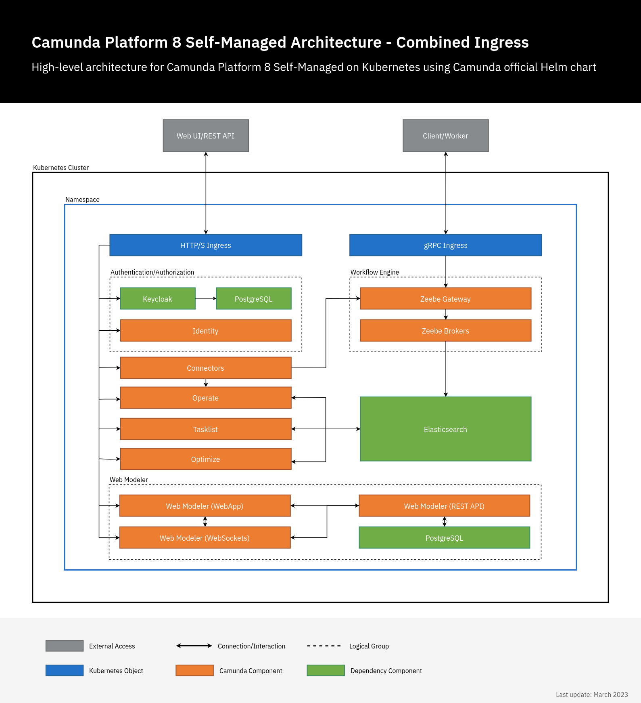

import { HelmChartInstall } from "@site/src/components/CamundaDistributions";

:::note
The `13.0.0-alpha4.1` Helm chart released with Camunda 8.8.0-alpha4 introduces a new default setup to support the 8.8 [Identity management updates](/reference/announcements-release-notes/880/880-release-notes.md#identity-management-updates-saasself-managed). Currently, this setup is limited to the following components:

- The Orchestration core (Zeebe, Operate, Tasklist, and Orchestration cluster Identity)
- Connectors

This temporary limitation will be resolved in subsequent alpha releases.
:::

We recommend using Kubernetes and Helm to deploy and run Camunda 8 Self-Managed in production environments.

There are many ways to provision and configure a Kubernetes cluster, and several architectural decisions to consider. For example: Will your workers run inside the Kubernetes cluster or externally? You'll need to configure the cluster accordingly and tailor the setup to your architecture.

Camunda provides continuously improved Helm charts that are not tied to any specific cloud provider, allowing you to choose your preferred Kubernetes platform. These charts are available in the [Camunda Helm repository](https://artifacthub.io/packages/helm/camunda/camunda-platform), and we encourage you to [report issues](https://github.com/camunda/camunda-platform-helm/issues).

## What is Helm?

[Helm](https://helm.sh/) is a package manager for Kubernetes resources. It allows you to install a set of components by referencing a chart name and overriding configurations to suit various deployment scenarios.

Helm also manages dependencies between charts, so that multiple components can be installed and configured with a single command.

For more details, refer to the full list of [Helm values](https://artifacthub.io/packages/helm/camunda/camunda-platform#parameters).

## Components

The following charts are installed as part of the Camunda 8 Self-Managed platform:

- **Zeebe**: Deploys a Zeebe cluster with three brokers using the `camunda/zeebe` Docker image.
- **Zeebe Gateway**: Deploys a standalone Zeebe Gateway with two replicas.
- **Operate**: Deploys Operate, which connects to an existing Elasticsearch cluster.
- **Tasklist**: Deploys Tasklist to support user task management.
- **Optimize**: Deploys Optimize for analyzing historic process execution data.
- **Identity**: Deploys the Identity component for authentication and authorization.
- **Connectors**: Deploys the connectors component for integration with external systems.
- **Elasticsearch**: Deploys an Elasticsearch cluster with two nodes.
- **Web Modeler**: Deploys Web Modeler for collaborative BPMN modeling.
  - _Note_: This chart is disabled by default and must be [enabled explicitly](#install-web-modeler).
- **Console**: Deploys Camunda Console Self-Managed.
  - _Note_: This chart is also disabled by default and must be [enabled explicitly](#install-console).

:::note Amazon OpenSearch Helm support
The existing Helm charts are configured to use Elasticsearch by default, but they can also be configured to connect to Amazon OpenSearch Service. Refer to the guide on [using Amazon OpenSearch Service](/self-managed/installation-methods/helm/configure/database/using-existing-opensearch.md).

**Zeebe**: Configure the [OpenSearch exporter](/self-managed/components/orchestration-cluster/zeebe/exporters/opensearch-exporter.md).

**Operate**, **Tasklist**, and **Optimize**: These components use the same configuration keys for both Elasticsearch and OpenSearch. To switch, replace the `elasticsearch` prefix with `opensearch` and provide the corresponding values.

For example, `CAMUNDA_OPERATE_ELASTICSEARCH_URL` becomes `CAMUNDA_OPERATE_OPENSEARCH_URL`. For Optimize, ensure variables use the proper prefix, such as `OPTIMIZE_ELASTICSEARCH_HTTP_PORT` becoming `CAMUNDA_OPTIMIZE_OPENSEARCH_HTTP_PORT`.

Refer to the configuration documentation for each component for additional parameters:

- [Operate](/self-managed/components/orchestration-cluster/operate/operate-configuration.md#settings-for-opensearch)
- [Tasklist](/self-managed/components/orchestration-cluster/tasklist/tasklist-configuration.md#elasticsearch-or-opensearch)
- [Optimize](/self-managed/components/optimize/configuration/system-configuration.md#opensearch)
  :::



When you install the [camunda-platform](https://artifacthub.io/packages/helm/camunda/camunda-platform) Helm chart, all components shown in the architecture diagram above are installed.

:::note
Helm also supports document storage and management with [document handling](/self-managed/concepts/document-handling/overview.md).
:::

## Versioning

Starting with Camunda 8.4 (January 2024), the Helm chart version is decoupled from the application version. For example, the chart version may be `9.0.0` while the application version is `8.4.x`.

To see which application versions are included in a specific Helm chart, refer to the [full version matrix](https://helm.camunda.io/camunda-platform/version-matrix/).

## Installation

At [helm.camunda.io](https://helm.camunda.io/), you’ll find a Helm chart that configures a 3-broker cluster with:

- Two Elasticsearch instances
- Operate
- Two Zeebe Gateways
- Tasklist

This configuration is comparable to the Production-S cluster plan in [Camunda 8 SaaS](https://camunda.com/get-started/) and should be sufficient for approximately 80% of use cases.

### Prerequisites

Before deploying Camunda using Helm, ensure you have the following:

- A Kubernetes cluster (local, on a cloud platform, or on-premises)
- [Helm](https://helm.sh/docs/intro/install/)
- [kubectl](https://kubernetes.io/docs/tasks/tools/#kubectl) CLI

### Helm repository

To use the Camunda charts, first add the Camunda Helm chart repository. Once added, Helm can fetch and install charts from [https://helm.camunda.io](https://helm.camunda.io).

```shell
helm repo add camunda https://helm.camunda.io
helm repo update
```

### Create Identity secrets

In the default configuration, Helm charts automatically generate all required Camunda Identity secrets for communication between Camunda 8 components and Identity.

However, due to an issue with a [Bitnami library](https://docs.bitnami.com/general/how-to/troubleshoot-helm-chart-issues/#credential-errors-while-upgrading-chart-releases), running future `helm upgrade` commands may unintentionally regenerate these secrets.

While upgrades are still possible by following our [upgrade guide](/self-managed/installation-methods/helm/upgrade/upgrade.md#upgrading-where-identity-enabled), we recommend **pre-creating these secrets** to ensure a smoother upgrade process. This is especially helpful when using CI/CD tools such as ArgoCD, FluxCD, or Jenkins.

Below is an example of a pre-created secret:

```yaml
apiVersion: v1
kind: Secret
metadata:
  name: identity-secret-for-components
type: Opaque
data:
  operate-secret: VmVyeUxvbmdTdHJpbmc=
  tasklist-secret: VmVyeUxvbmdTdHJpbmc=
  optimize-secret: VmVyeUxvbmdTdHJpbmc=
  connectors-secret: VmVyeUxvbmdTdHJpbmc=
  console-secret: VmVyeUxvbmdTdHJpbmc=
  keycloak-secret: VmVyeUxvbmdTdHJpbmc=
  zeebe-secret: VmVyeUxvbmdTdHJpbmc=
```

Add the following configuration parameters to your `values.yaml` file

```yaml
global:
  identity:
    auth:
      operate:
        existingSecret:
          name: identity-secret-for-components
      tasklist:
        existingSecret:
          name: identity-secret-for-components
      optimize:
        existingSecret:
          name: identity-secret-for-components
      webModeler:
        existingSecret:
          name: identity-secret-for-components
      connectors:
        existingSecret:
          name: identity-secret-for-components
      console:
        existingSecret:
          name: identity-secret-for-components
      zeebe:
        existingSecret:
          name: identity-secret-for-components
```

Once this is completed, you are ready to install the Helm chart hosted in the official Camunda Helm chart repo.

### Install Camunda Helm chart

To install the available Camunda 8 components inside a Kubernetes cluster, you can simply run:

<HelmChartInstall />

You can use the `-n` flag to specify the Kubernetes namespace where the components should be installed.

By default, the command does **not** install Web Modeler or Console. To enable them, follow the respective installation instructions:

- [Enable Web Modeler](#install-web-modeler)
- [Enable Console](#install-console)

Installing all components in a cluster requires downloading all related Docker images to the Kubernetes nodes. The time this takes will vary depending on your cloud provider and network speed.

For air-gapped environments, refer to the guide on [installing in an air-gapped environment](/self-managed/installation-methods/helm/configure/air-gapped-installation.md).

By default, the Helm chart uses [open-source images from Bitnami](https://github.com/bitnami/containers). For enterprise installations, Camunda recommends using enterprise images. See [Install with vendor enterprise images](#install-with-vendor-enterprise-images) for more information.

To check the progress of your deployment, confirm that the Kubernetes pods are up and running by using the following command:

```shell
kubectl get pods
```

This will return something similar to the following:

```
NAME                                           READY   STATUS              RESTARTS   AGE
camunda-keycloak-0                       0/1     Pending             0          4s
camunda-identity-6bb5d864cc-kk6dv        0/1     ContainerCreating   0          4s
camunda-operate-cb597fd76-6vr2x          0/1     ContainerCreating   0          4s
camunda-optimize-676955b547-vxts7        0/1     ContainerCreating   0          4s
camunda-connectors-1bba590ff-a63dc       0/1     ContainerCreating   0          4s
camunda-postgresql-0                     0/1     Pending             0          4s
camunda-tasklist-5bf5c56f7b-sdwg7        0/1     ContainerCreating   0          4s
camunda-zeebe-0                          0/1     Pending             0          4s
camunda-zeebe-1                          0/1     ContainerCreating   0          4s
camunda-zeebe-2                          0/1     Pending             0          4s
camunda-zeebe-gateway-657b774f95-bbcx5   0/1     ContainerCreating   0          4s
camunda-zeebe-gateway-657b774f95-gmlbm   0/1     Running             0          4s
elasticsearch-master-0                   0/1     Pending             0          4s
elasticsearch-master-1                   0/1     Init:0/1            0          4s
```

Wait for all Kubernetes pods to reach the `Ready` state. For example:

```
NAME                                           READY    STATUS    RESTARTS   AGE
elasticsearch-master-0                          1/1     Running   0          4m6s
camunda-operate-XXX                             1/1     Running   0          4m6s
camunda-connectors-XXX                          1/1     Running   0          4m6s
camunda-zeebe-0                                 1/1     Running   0          4m6s
camunda-tasklist-XXX                            1/1     Running   0          4m6s
camunda-zeebe-gateway                           1/1     Running   0          4m6s
```

### Install the latest Camunda 8 version

When using the Camunda 8 Helm chart, it automatically selects the latest version of the [Camunda 8 applications](/reference/supported-environments.md). However, since the Helm chart and the application components are released independently, there may be slight version discrepancies.

To ensure you're installing the latest version of both the chart and its application dependencies, use the following command:

```shell
# This will install the latest Camunda Helm chart with the latest applications/dependencies.
helm install camunda camunda/camunda-platform --version $HELM_CHART_VERSION \
    --values https://helm.camunda.io/camunda-platform/values/values-latest.yaml
```

To install a previous version of the Camunda components, use the following command structure:

```shell
# This will install Camunda Helm chart v8.1.x with the latest applications/dependencies of v8.1.x.
helm install camunda camunda/camunda-platform --version 8.1 \
    --values https://helm.camunda.io/camunda-platform/values/values-v8.1.yaml
```

### Install with vendor enterprise images

By default, the Camunda Helm chart uses [open-source images provided by Bitnami](https://github.com/bitnami/containers). For production environments, Camunda recommends using **vendor enterprise images**, which are hardened and supported versions of the open-source images.

These enterprise images:

- Are built on the Bitnami open-source stack
- Include critical CVE patches and security hardening
- Come with extended vendor support
- Are hosted in a private registry: `registry.camunda.cloud`
- Are available only to Camunda customers

#### Create a Kubernetes registry secret

To access the private registry, create a Kubernetes `docker-registry` secret using your Camunda Enterprise credentials:

```shell
kubectl create secret docker-registry camunda-registry-secret \
  --docker-server=registry.camunda.cloud \
  --docker-username=<your-username> \
  --docker-password=<your-password> \
  --docker-email=unused@example.com
```

Replace `<your-username>` and `<your-password>` with your LDAP credentials.

:::info
To learn more, refer to the [Kubernetes `imagePullSecrets` documentation](https://kubernetes.io/docs/concepts/containers/images/#specifying-imagepullsecrets-on-a-pod).
:::

#### Install the Helm chart with vendor enterprise images

Camunda provides a dedicated values file, `values-enterprise.yaml`, which overrides the default Bitnami image registry and tags to use enterprise images.

:::note Vendor pull secret

This file includes a reference to the `commonVendorPullSecrets` parameter, which defines the pull secret required to access the private registry.

`commonVendorPullSecrets` is required because `global.image.pullSecrets` does **not** apply to vendor charts.

:::

By default, the secret name `camunda-registry-secret` is used. You can override this using the `--set` flag, a custom `values-enterprise.yaml` file, or any other [Helm value override mechanism](https://helm.sh/docs/chart_template_guide/values_files/#using-helm-install--f).

Use the following command to install Camunda with enterprise vendor images and your registry secret:

```shell
helm install camunda camunda/camunda-platform --version $HELM_CHART_VERSION \
  --values https://raw.githubusercontent.com/camunda/camunda-platform-helm/main/charts/camunda-platform-8.8/values.yaml \
  --values https://raw.githubusercontent.com/camunda/camunda-platform-helm/main/charts/camunda-platform-8.8/values-enterprise.yaml
```

This will deploy Camunda with vendor-supported enterprise images, which are recommended for secure and stable production environments.

### Accessing Camunda services

By default, Camunda services deployed in a Kubernetes cluster are not accessible from outside the cluster. However, there are several ways to expose these services externally:

- **Port forwarding:** This method allows you to direct traffic from your local machine to the cluster, making it possible to access Camunda services directly. For detailed instructions, refer to [accessing components without Ingress](/self-managed/installation-methods/helm/configure/accessing-components-without-ingress.md).
- **Ingress configuration:** You can set up the NGINX Ingress controller to manage external service access. For detailed instructions, refer to the [Ingress setup guide](/self-managed/installation-methods/helm/configure/ingress-setup.md).
- **EKS cluster installation:** For those deploying Camunda 8 on an Amazon EKS cluster, refer to [installing Camunda 8 on an EKS cluster](/self-managed/installation-methods/helm/cloud-providers/amazon/amazon-eks/eks-helm.md).

## Configure license key

Camunda 8 components can consume Enterprise license information using the following Helm configuration:

```yaml
global:
  license:
    ## @param global.license.key if set, it will be exposed as "CAMUNDA_LICENSE_KEY" in all components, consumable as ENV_VAR.
    key:
    ## @param global.license.existingSecret you can provide an existing secret name for Camunda license secret.
    existingSecret:
    ## @param global.license.existingSecretKey you can provide the key within the existing secret object for Camunda license key.
    existingSecretKey:
```

If your installation of Camunda 8 requires a license key, update your `values.yaml` to include one of two options.

**Option one:** Enter your license key directly in `global.license.key`.

```yaml
global:
  license:
    key: >-
      --------------- BEGIN CAMUNDA LICENSE KEY ---------------
      [...]
      ---------------  END CAMUNDA LICENSE KEY  ---------------
```

**Option two:** Provide a secret name and key in `global.license.existingSecret` and `global.license.existingSecretKey`.

Create a Kubernetes secret object as follows:

```yaml
apiVersion: v1
kind: Secret
metadata:
  name: camunda-license
stringData:
  key: >-
    --------------- BEGIN CAMUNDA LICENSE KEY ---------------
    [...]
    ---------------  END CAMUNDA LICENSE KEY  ---------------
```

Then use the created Kubernetes secret object as follows:

```yaml
global:
  license:
    existingSecret: "camunda-license"
    existingSecretKey: "key"
```

:::note
Camunda 8 components without a valid license may display **Non-Production License** in the navigation bar and issue warnings in the logs. These warnings do not impact startup or functionality, except that Web Modeler is limited to five users.
:::

## Configuring Web Modeler, Console, and Connectors

### Install Connectors

The **Connector runtime** is enabled by default. To start using connectors, install connector element templates. Learn more in our documentation for [Web Modeler](/components/connectors/manage-connector-templates.md) or [Desktop Modeler](/components/modeler/desktop-modeler/element-templates/configuring-templates.md).

Find all available configurable options in the official Camunda Helm [values docs](https://artifacthub.io/packages/helm/camunda/camunda-platform#connectors-parameters).

#### Disable Connectors

To disable Connectors, pass the `connectors.enabled: false` value when deploying Camunda Helm chart.

#### Polling authentication mode

Connectors use the [Operate API](/apis-tools/operate-api/overview.md) to fetch process definitions containing inbound connectors. Depending on your Camunda architecture, choose one of the following values for the `inbound.mode` parameter:

- `disabled` — Polling from Operate is disabled. The connector runtime will support only outbound interactions, such as HTTP REST calls.
- `credentials` — The connector runtime will attempt to authenticate to the Operate API using password-based basic HTTP authentication.
- `oauth` — _(Recommended and enabled by default)_ The connector runtime will authenticate to the Operate API via an OAuth 2.0 provider. Camunda uses Keycloak as the default OAuth provider.

For more details, see the [Connectors Helm values](https://artifacthub.io/packages/helm/camunda/camunda-platform#connectors-parameters).

### Install Web Modeler

Follow the steps below to install the Camunda Helm chart with Web Modeler enabled:

#### Configure Web Modeler

To set up Web Modeler, provide the following required configuration values. All available options are described in detail in the Helm chart’s [values docs](https://artifacthub.io/packages/helm/camunda/camunda-platform#webmodeler-parameters):

- Enable Web Modeler by setting `webModeler.enabled: true` (disabled by default).
- Configure your SMTP server by providing values under `webModeler.restapi.mail`.
  - Web Modeler requires an SMTP server to send notification emails to users.
- Configure the database connection:
  - Web Modeler requires a PostgreSQL database for persistent storage (other database systems are not currently supported).
  - _Option 1_: Set `postgresql.enabled: true` to install a new PostgreSQL instance as part of the Helm release (using the [Bitnami PostgreSQL Helm chart](https://github.com/bitnami/charts/tree/main/bitnami/postgresql) as a dependency).
  - _Option 2_: Set `postgresql.enabled: false` and configure a connection to an external PostgreSQL database (see the second example below).

We recommend specifying these values in a YAML file and passing it to the `helm install` command. A minimal configuration file would look like this:

```yaml
webModeler:
  enabled: true
  restapi:
    mail:
      smtpHost: smtp.example.com
      smtpPort: 587
      smtpUser: user
      smtpPassword: secret
      # Email address to be displayed as sender of emails from Web Modeler
      fromAddress: no-reply@example.com
postgresql:
  enabled: true
```

If you don't want to install a new PostgreSQL instance with Helm, but connect Web Modeler to an existing external database, set `postgresql.enabled: false` and provide the values under `webModeler.restapi.externalDatabase`:

```yaml
webModeler:
  restapi:
    externalDatabase:
      url: jdbc:postgresql://postgres.example.com:5432/modeler-db
      user: modeler-user
      password: secret
postgresql:
  # disables the PostgreSQL chart dependency
  enabled: false
```

For more details, check [Web Modeler Helm values](https://artifacthub.io/packages/helm/camunda/camunda-platform#webmodeler-parameters).

### Install Console

Console Self-Managed is disabled by default in the Camunda 8 Helm chart.

To install Console, enable Console in the Helm chart with `console.enabled: true`. We recommend specifying these values in a YAML file that you pass to the `helm install` command:

```yaml
console:
  enabled: true
```

For more details, check [Console Helm values](https://artifacthub.io/packages/helm/camunda/camunda-platform#console-parameters).

:::note
Console Self-Managed requires the Identity component to authenticate. Camunda Helm Chart installs Identity by default. When logging in to Console when using port-forward, port-forward the Keycloak service `kubectl port-forward svc/<RELEASE-NAME>-keycloak 18080:80` or configure Identity with Ingress as described in the [Ingress setup guide](/self-managed/installation-methods/helm/configure/ingress-setup.md).

:::

## Installation troubleshooting

Check that each pod is running and ready. If one or more of your pods are still pending, it means it cannot be scheduled onto a node. Usually, this happens because there are insufficient resources that prevent it. Use the `kubectl describe ...` command to check on messages from the scheduler:

```shell
kubectl describe pods <POD_NAME>
```

If the output of the `describe` command was not helpful, tail the logs of these pods by running the following:

```shell
kubectl logs -f <POD_NAME>
```

## Upgrading

For upgrading the Camunda Helm chart from one release to another, perform a [Helm upgrade](/self-managed/installation-methods/helm/upgrade/upgrade.md).

## General notes

- **Zeebe Gateway** is deployed as a stateless service. We support [Kubernetes startup and liveness probes](/self-managed/components/orchestration-cluster/zeebe/configuration/gateway-health-probes.md) for Zeebe.
- **Zeebe broker nodes** must be deployed as a [StatefulSet](https://kubernetes.io/docs/concepts/workloads/controllers/statefulset/) to preserve cluster node identities. StatefulSets require persistent storage, which must be provisioned in advance. The type of persistent storage depends on your cloud provider.
- **Docker pull limits** apply when downloading Camunda 8 images from Docker Hub. To avoid disruptions, authenticate with Docker Hub, use a mirror registry, or follow our guide on [installing in an air-gapped environment](/self-managed/installation-methods/helm/configure/air-gapped-installation.md).
