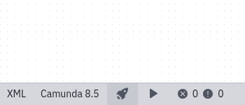
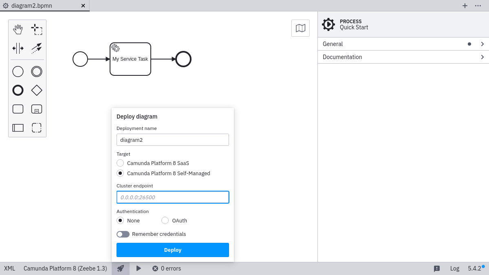
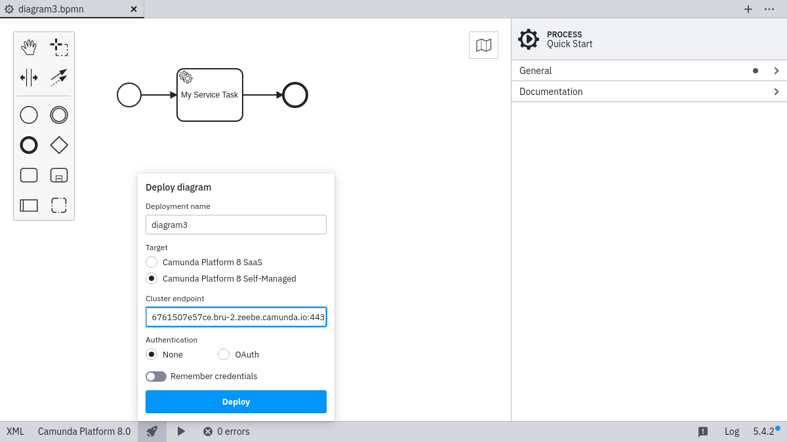
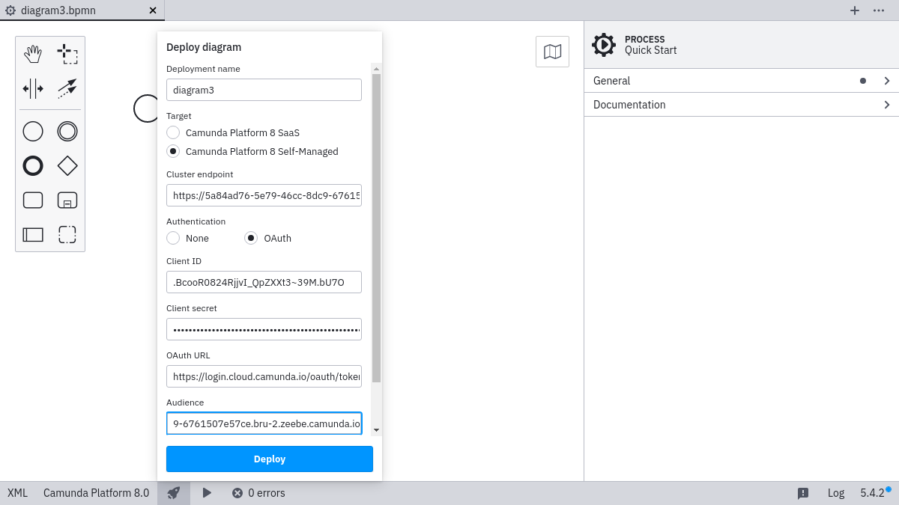
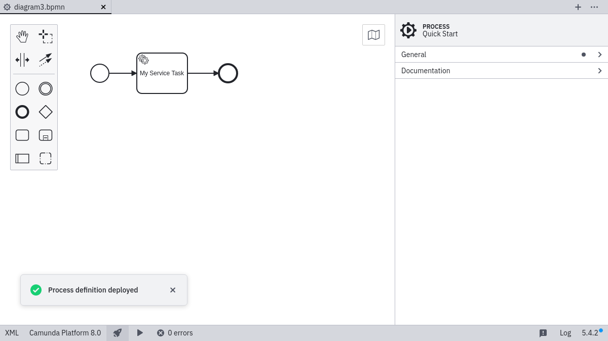

Desktop Modeler can directly deploy diagrams and start process instances in Camunda Platform 8 Self-Managed. Follow the steps below to deploy a diagram:

1. Click the rocket-shaped deployment icon:

2. Click **Camunda Platform 8 Self-Managed**:

3. Input the `Cluster endpoint`:

4. Select **OAuth**, and input the credentials in case your gateway requires authentication:

:::note
OAuth for gateway can be implemented with [zeebe-keycloak-interceptor](https://github.com/camunda-community-hub/zeebe-keycloak-interceptor).
:::

5. Select the **Remember** checkbox if you want to locally store the connection information.

6. Click **Deploy** to perform the actual deployment.

