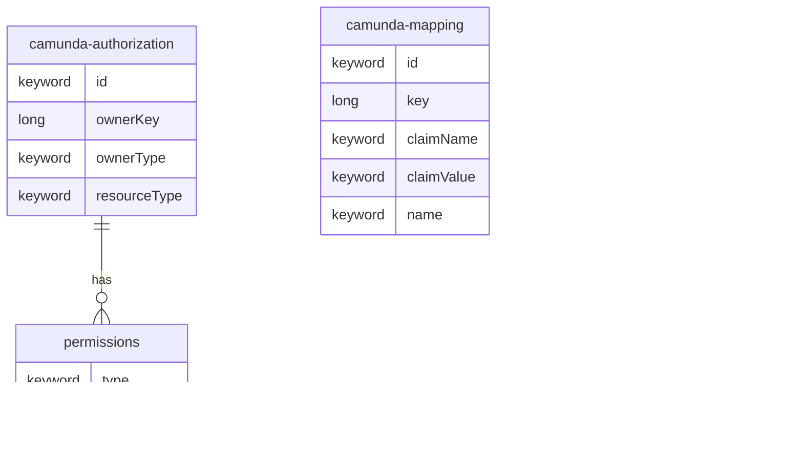

```mermaid
erDiagram
    camunda-authorization {
        keyword id
        long ownerKey
        keyword ownerType
        keyword resourceType
    }
    permissions {
        keyword type
        keyword resourceIds
    }
    camunda-authorization ||--o{ permissions : has

    camunda-mapping {
        keyword id
        long key
        keyword claimName
        keyword claimValue
        keyword name
    }

    camunda-role {
        keyword id
        long key
        keyword name
        long memberKey
        join join
    }
```
