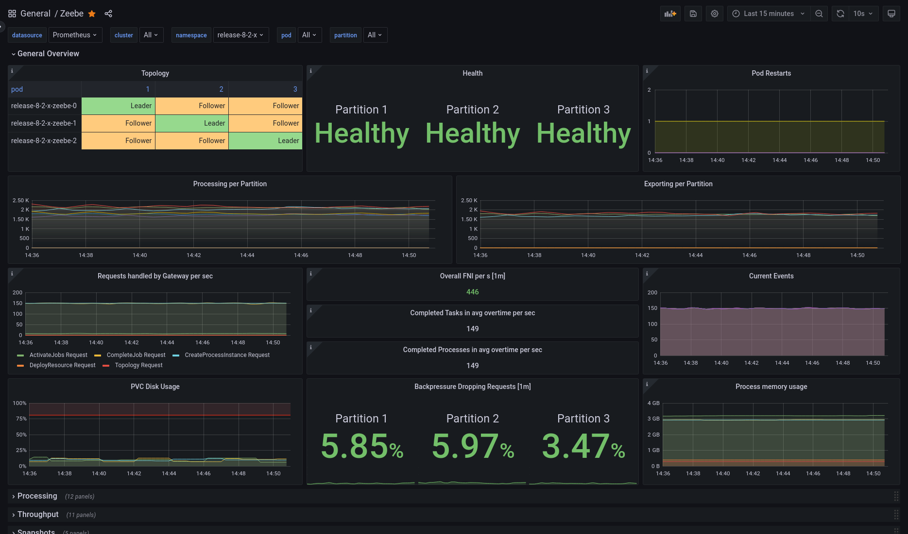
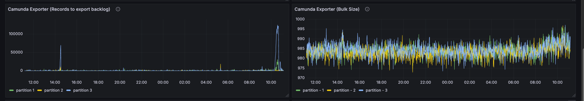

For distributed system monitoring, Camunda uses the [Micrometer](https://micrometer.io/) library as a facade to export metrics to [supported implementations](https://docs.micrometer.io/micrometer/reference/implementations.html) such as Prometheus, OpenTelemetry, Datadog, and Dynatrace.

## Access metrics

You can access your metrics data using your chosen monitoring implementation. Metrics data is only stored in-memory in Camunda, so it needs to be consumed and aggregated by a monitoring system.

Monitoring typically uses either a polling (default) or pushing system.

### Polling

The system (for example, Prometheus) polls an endpoint exposed by Camunda at a regular interval.

- Each request constitutes a data point for each metric.
- When working with such systems, configure the polling interval to get information quickly but without overwhelming Camunda itself (which still has to serve this data) or having to store too much data in your monitoring system itself.
- Additionally, this means exposing the Camunda endpoint to your external monitoring system.

### Pushing

For a pushing system (for example, OpenTelemetry), Camunda is configured to asynchronously push metric updates to an external endpoint at a regular interval.

- This implies that the system is accessible to Camunda via the network, so you should ensure communication is secure.
- Similarly to the polling approach, balance how fast you are pushing (and getting updates/data points) without overwhelming your external system.

## Configuration

Configure your metrics using the built-in [Spring Boot Micrometer configuration](https://docs.spring.io/spring-boot/reference/actuator/metrics.html).

### Defaults

Camunda includes built-in support for [Prometheus](https://prometheus.io) and [OpenTelemetry](https://opentelemetry.io/). By default, the configuration only exports Prometheus metrics via [a scraping endpoint](https://docs.spring.io/spring-boot/reference/actuator/metrics.html#actuator.metrics.export.prometheus), with OpenTelemetry disabled.

#### Prometheus

The scraping endpoint for Prometheus is located under the management context (default `:9600/actuator/prometheus`).

Configure this via the following properties:

```yaml
management:
  endpoint.prometheus.access: unrestricted
  prometheus.metrics.export.enabled: true
```

To collect metrics, you must define the new scraping endpoint for Prometheus.

Add the following scraping job:

```
- job_name: camunda
  scrape_interval: 30s
  metrics_path: /actuator/prometheus
  scheme: http
  static_configs:
  - targets:
    - localhost: 9600
```

:::warning
If you've configured your management context to use HTTPS, you must also update the `scheme` for the scraping job above. This also applies if you change the management port.
:::

:::note

The scraping interval is `30s` by default. This means you will get new data points in Prometheus every 30 seconds.

- This is a good default to minimize the storage requirements for Prometheus.
- To run alerts or auto-scaling based on the provided metrics, you can configure a shorter interval. As this results in more data
  being ingested, use at your own risk.

:::

#### OpenTelemetry Protocol

Zeebe also comes built-in with support to export metrics via OpenTelemetry (using the `micrometer-registry-otlp`).

Configure this via the following properties:

```yaml
management:
  # Disable Prometheus
  promethus.metrics.export.enabled: false
  # Configure OpenTelemetry Metrics
  otlp:
    metrics:
      export:
        # Enable OTLP
        enabled: true
        # Since metrics are pushed, you will need to configure at least one endpoint
        url: "https://otlp.example.com:4318/v1/metrics"
```

For a complete list of configuration options for OTLP, refer to the [Micrometer](https://docs.micrometer.io/micrometer/reference/implementations/otlp.html#_configuring) documentation.

:::warning
When using the OTLP exporter, check the requirements of your target endpoint, as it might require additional configuration. For example, you might need to pass a client secret and ID for authentication via the `otlp.metrics.export.headers` options, or your system might not support `cumulative` aggregation temporality and instead require `delta` (for example, Dynatrace).
:::

:::tip
A wide variety of existing monitoring systems also support ingesting OpenTelemetry data (for example, Dynatrace, Datadog, and so on). Camunda recommends using these instead of the specific Micrometer implementations.
:::

### Use a different monitoring system

To use a different monitoring system, refer to the [Spring Boot](https://docs.spring.io/spring-boot/reference/actuator/metrics.html#actuator.metrics.export) documentation.
Zeebe only ships with built-in support for the [Prometheus](https://docs.spring.io/spring-boot/reference/actuator/metrics.html#actuator.metrics.export.prometheus)
and [OTLP](https://docs.spring.io/spring-boot/reference/actuator/metrics.html#actuator.metrics.export.otlp) systems.

To use a different system, you must add the required dependencies to your Zeebe installation, specifically to the distribution's `lib/` folder.

:::note
When using the container image, you must add it to the following paths, based on your image:

- `camunda/zeebe`: `/usr/local/zeebe/lib`
- `camunda/camunda`: `/usr/local/camunda/lib`
  :::

For example, to export to Datadog, download the `io.micrometer:micrometer-registry-datadog` JAR and place it in the `./lib` folder of the distribution.

Running from the root of the distribution, you can use Maven to do this for you:

```shell
mvn dependency:copy -Dartifact=io.micrometer:micrometer-registry-datadog:1.14.4 -Dtransitive=false -DoutputDirectory=./lib
```

:::note
The version must be the same as the Micrometer version used by Camunda.

- Find this information by checking the distribution artifact on [Maven Central](https://central.sonatype.com/artifact/io.camunda/camunda-zeebe/dependencies).
- Select the distribution version you are using, and filter for `micrometer` to get the expected Micrometer version.

:::

### Customize metrics

You can modify and filter the metrics exposed in Camunda via configuration.

#### Common tags

[Tags provide a convenient way of aggregating metrics over common attributes](https://docs.spring.io/spring-boot/reference/actuator/metrics.html#actuator.metrics.customizing.common-tags). Via configuration, you can ensure that all metrics for a specific instance of Camunda share common tags.

For example, if you deployed two different clusters and wanted to differentiate them:

The first cluster could be configured as:

```yaml
management:
  metrics:
    tags:
      cluster: "foo"
```

And the second cluster configured as:

```yaml
management:
  metrics:
    tags:
      cluster: "bar"
```

#### Filtering

[You can additionally disable certain metrics](https://docs.spring.io/spring-boot/reference/actuator/metrics.html#actuator.metrics.customizing.per-meter-properties).
This can be useful for high cardinality metrics which you do not care for, but which may end up being expensive to store in your target system.

To filter a metric called `zeebe.foo`, you would configure the following property:

```yaml
management:
  metrics:
    enable:
      zeebe:
        foo: false
```

:::note
Filtering applies not only to direct name matches (for example, `zeebe.foo`), but as a prefix. This means any metric starting with the prefix `zeebe.foo` in the example would also be filtered out, and would not be exported.
:::

## Available metrics

[Spring already exposes various metrics](https://docs.spring.io/spring-boot/reference/actuator/metrics.html#actuator.metrics.supported), some of which will be made available
through Camunda:

- [JVM metrics](https://docs.spring.io/spring-boot/reference/actuator/metrics.html#actuator.metrics.supported.jvm)
- [System metrics](https://docs.spring.io/spring-boot/reference/actuator/metrics.html#actuator.metrics.supported.system)
- [Application startup metrics](https://docs.spring.io/spring-boot/reference/actuator/metrics.html#actuator.metrics.supported.application-startup)
- [Logger metrics](https://docs.spring.io/spring-boot/reference/actuator/metrics.html#actuator.metrics.supported.logger)
- [Spring MVC metrics](https://docs.spring.io/spring-boot/reference/actuator/metrics.html#actuator.metrics.supported.spring-mvc)

Camunda also exposes several custom metrics, most of them under the `zeebe`, `atomix`, `operate`, `tasklist`, or `optimize` prefixes.

:::note
While all nodes in a Camunda cluster expose metrics, they will expose relevant metrics based on their role. For example, brokers will expose processing related metrics,
while gateways will expose REST API relevant metrics.
:::

:::note
**Not all metrics are available at all times.** This can apply to various metrics, but is especially noticeable for **processing-related metrics**, which are recorded on events that can occur infrequently. For example, the `zeebe_incident_events_total` metric is only recorded when an incident is **created** or **resolved**.
:::

### Process processing metrics

The following metrics are related to process processing:

| Metric                                 | Description                                                                                                                                                                                                |
| :------------------------------------- | :--------------------------------------------------------------------------------------------------------------------------------------------------------------------------------------------------------- |
| `zeebe_stream_processor_records_total` | The number of events processed by the stream processor. The `action` label separates processed, skipped, and written events.                                                                               |
| `zeebe_exporter_events_total`          | The number of events processed by the exporter processor. The `action` label separates exported and skipped events.                                                                                        |
| `zeebe_element_instance_events_total`  | The number of occurred process element instance events. The `action` label separates the number of activated, completed, and terminated elements. The `type` label separates different BPMN element types. |
| `zeebe_job_events_total`               | The number of job events. The `action` label separates the number of created, activated, timed out, completed, failed, and canceled jobs.                                                                  |
| `zeebe_incident_events_total`          | The number of incident events. The `action` label separates the number of created and resolved incident events.                                                                                            |
| `zeebe_pending_incidents_total`        | The number of currently pending incidents, that is, not resolved.                                                                                                                                          |

### Performance metrics

The following metrics are related to performance. For example, Zeebe has a backpressure mechanism to reject requests when it receives more requests than it can handle without incurring high processing latency.

Monitor backpressure and processing latency of the commands using the following metrics:

| Metric                                  | Description                                                             |
| :-------------------------------------- | :---------------------------------------------------------------------- |
| `zeebe_dropped_request_count_total`     | The number of user requests rejected by the broker due to backpressure. |
| `zeebe_backpressure_requests_limit`     | The limit for the number of inflight requests used for backpressure.    |
| `zeebe_stream_processor_latency_bucket` | The processing latency for commands and event.                          |

### Health metrics

The health of partitions in a broker can be monitored using the metric `zeebe_health`.

## Execution latency metrics

Brokers can export optional execution latency metrics.

To enable export of execution metrics, set the `ZEEBE_BROKER_EXECUTION_METRICS_EXPORTER_ENABLED` environment variable to `true` in your Zeebe [configuration file](/self-managed/components/orchestration-cluster/zeebe/configuration/configuration.md).

## Grafana

### Zeebe

Zeebe comes with a pre-built dashboard, available in the repository:
[monitor/grafana/zeebe.json](https://github.com/camunda/camunda/blob/main/monitor/grafana/zeebe.json).

- [Import](https://grafana.com/docs/grafana/latest/reference/export_import/#importing-a-dashboard) the dashboard into your Grafana instance and select the correct Prometheus data source (if you have more than one).
- The dashboard displays a healthy cluster topology, general throughput metrics, handled requests, exported events per second, disk and memory usage, and more.



:::tip
You can also try out an [interactive dashboard](https://snapshots.raintank.io/dashboard/snapshot/Vbu3EHQMTI5Onh5RKuiS5J7QSMd7Sp5V) to learn about each panel and get an understanding of available data.
:::

### Data Layer

The data layer comes with a pre-built dashboard, available in the repoSITORY:
[monitor/grafana/data_layer.json](https://github.com/camunda/camunda/blob/main/monitor/grafana/dashboards/data_layer.json)

- [Import](https://grafana.com/docs/grafana/latest/reference/export_import/#importing-a-dashboard) the dashboard into the Grafana instance
  and select the correct Prometheus data source (if you have more than one).
- The dashboard displays information about the key components of the data-layer applying to version `>=8.8`, focusing on the
  Camunda exporter through which all data passes.

