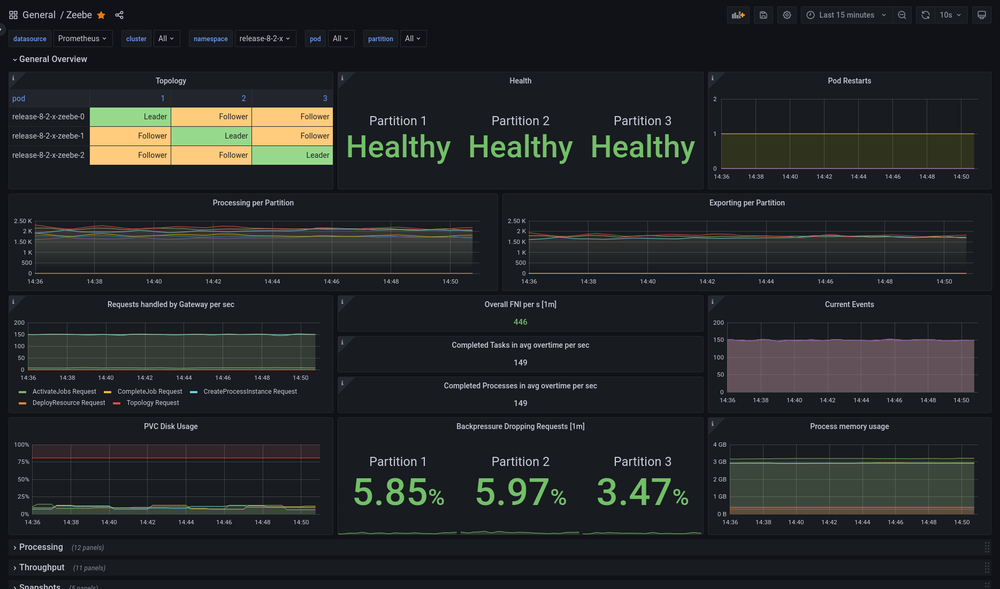
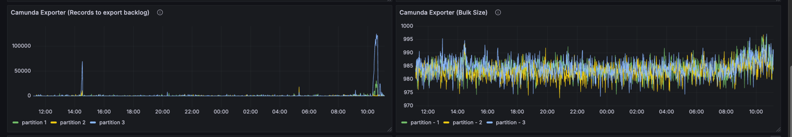

For distributed system monitoring, Camunda uses the [Micrometer](https://micrometer.io/) library as a facade to export metrics to [supported implementations](https://docs.micrometer.io/micrometer/reference/implementations.html) such as Prometheus, OpenTelemetry, Datadog, and Dynatrace.

## Access metrics

You can access your metrics data using your chosen monitoring implementation. Metrics data is only stored in-memory in Camunda, so it needs to be consumed and aggregated by a monitoring system.

Monitoring typically uses either a polling (default) or pushing system.

### Polling

The system (for example, Prometheus) polls an endpoint exposed by Camunda at a regular interval.

- Each request constitutes a data point for each metric.
- When working with such systems, configure the polling interval to get information quickly but without overwhelming Camunda itself (which still has to serve this data) or having to store too much data in your monitoring system itself.
- Additionally, this means exposing the Camunda endpoint to your external monitoring system.

### Pushing

For a pushing system (for example, OpenTelemetry), Camunda is configured to asynchronously push metric updates to an external endpoint at a regular interval.

- This implies that the system is accessible to Camunda via the network, so you should ensure communication is secure.
- Similarly to the polling approach, balance how fast you are pushing (and getting updates/data points) without overwhelming your external system.

## Configuration

Configure your metrics using the built-in [Spring Boot Micrometer configuration](https://docs.spring.io/spring-boot/reference/actuator/metrics.html).

### Defaults

Camunda includes built-in support for [Prometheus](https://prometheus.io) and [OpenTelemetry](https://opentelemetry.io/). By default, the configuration only exports Prometheus metrics via [a scraping endpoint](https://docs.spring.io/spring-boot/reference/actuator/metrics.html#actuator.metrics.export.prometheus), with OpenTelemetry disabled.

#### Prometheus

The scraping endpoint for Prometheus is located under the management context (default `:9600/actuator/prometheus`).

Configure this via the following properties:

```yaml
management:
  endpoint.prometheus.access: unrestricted
  prometheus.metrics.export.enabled: true
```

To collect metrics, you must define the new scraping endpoint for Prometheus.

Add the following scraping job:

```
- job_name: camunda
  scrape_interval: 30s
  metrics_path: /actuator/prometheus
  scheme: http
  static_configs:
  - targets:
    - localhost: 9600
```

:::warning
If you've configured your management context to use HTTPS, you must also update the `scheme` for the scraping job above. This also applies if you change the management port.
:::

:::note

The scraping interval is `30s` by default. This means you will get new data points in Prometheus every 30 seconds.

- This is a good default to minimize the storage requirements for Prometheus.
- To run alerts or auto-scaling based on the provided metrics, you can configure a shorter interval. As this results in more data
  being ingested, use at your own risk.

:::

#### OpenTelemetry Protocol

Zeebe also comes built-in with support to export metrics via OpenTelemetry (using the `micrometer-registry-otlp`).

Configure this via the following properties:

```yaml
management:
  # Disable Prometheus
  promethus.metrics.export.enabled: false
  # Configure OpenTelemetry Metrics
  otlp:
    metrics:
      export:
        # Enable OTLP
        enabled: true
        # Since metrics are pushed, you will need to configure at least one endpoint
        url: "https://otlp.example.com:4318/v1/metrics"
```

For a complete list of configuration options for OTLP, refer to the [Micrometer](https://docs.micrometer.io/micrometer/reference/implementations/otlp.html#_configuring) documentation.

:::warning
When using the OTLP exporter, check the requirements of your target endpoint, as it might require additional configuration. For example, you might need to pass a client secret and ID for authentication via the `otlp.metrics.export.headers` options, or your system might not support `cumulative` aggregation temporality and instead require `delta` (for example, Dynatrace).
:::

:::tip
A wide variety of existing monitoring systems also support ingesting OpenTelemetry data (for example, Dynatrace, Datadog, and so on). Camunda recommends using these instead of the specific Micrometer implementations.
:::

### Use a different monitoring system

To use a different monitoring system, refer to the [Spring Boot](https://docs.spring.io/spring-boot/reference/actuator/metrics.html#actuator.metrics.export) documentation.
Zeebe only ships with built-in support for the [Prometheus](https://docs.spring.io/spring-boot/reference/actuator/metrics.html#actuator.metrics.export.prometheus)
and [OTLP](https://docs.spring.io/spring-boot/reference/actuator/metrics.html#actuator.metrics.export.otlp) systems.

To use a different system, you must add the required dependencies to your Zeebe installation, specifically to the distribution's `lib/` folder.

:::note
When using the container image, you must add it to the following paths, based on your image:

- `camunda/zeebe`: `/usr/local/zeebe/lib`
- `camunda/camunda`: `/usr/local/camunda/lib`
  :::

For example, to export to Datadog, download the `io.micrometer:micrometer-registry-datadog` JAR and place it in the `./lib` folder of the distribution.

Running from the root of the distribution, you can use Maven to do this for you:

```shell
mvn dependency:copy -Dartifact=io.micrometer:micrometer-registry-datadog:1.14.4 -Dtransitive=false -DoutputDirectory=./lib
```

:::note
The version must be the same as the Micrometer version used by Camunda.

- Find this information by checking the distribution artifact on [Maven Central](https://central.sonatype.com/artifact/io.camunda/camunda-zeebe/dependencies).
- Select the distribution version you are using, and filter for `micrometer` to get the expected Micrometer version.

:::

### Customize metrics

You can modify and filter the metrics exposed in Camunda via configuration.

#### Common tags

[Tags provide a convenient way of aggregating metrics over common attributes](https://docs.spring.io/spring-boot/reference/actuator/metrics.html#actuator.metrics.customizing.common-tags). Via configuration, you can ensure that all metrics for a specific instance of Camunda share common tags.

For example, if you deployed two different clusters and wanted to differentiate them:

The first cluster could be configured as:

```yaml
management:
  metrics:
    tags:
      cluster: "foo"
```

And the second cluster configured as:

```yaml
management:
  metrics:
    tags:
      cluster: "bar"
```

#### Filtering

[You can additionally disable certain metrics](https://docs.spring.io/spring-boot/reference/actuator/metrics.html#actuator.metrics.customizing.per-meter-properties).
This can be useful for high cardinality metrics which you do not care for, but which may end up being expensive to store in your target system.

To filter a metric called `zeebe.foo`, you would configure the following property:

```yaml
management:
  metrics:
    enable:
      zeebe:
        foo: false
```

:::note
Filtering applies not only to direct name matches (for example, `zeebe.foo`), but as a prefix. This means any metric starting with the prefix `zeebe.foo` in the example would also be filtered out, and would not be exported.
:::

## Available metrics

[Spring already exposes various metrics](https://docs.spring.io/spring-boot/reference/actuator/metrics.html#actuator.metrics.supported), some of which will be made available
through Camunda:

- [JVM metrics](https://docs.spring.io/spring-boot/reference/actuator/metrics.html#actuator.metrics.supported.jvm)
- [System metrics](https://docs.spring.io/spring-boot/reference/actuator/metrics.html#actuator.metrics.supported.system)
- [Application startup metrics](https://docs.spring.io/spring-boot/reference/actuator/metrics.html#actuator.metrics.supported.application-startup)
- [Logger metrics](https://docs.spring.io/spring-boot/reference/actuator/metrics.html#actuator.metrics.supported.logger)
- [Spring MVC metrics](https://docs.spring.io/spring-boot/reference/actuator/metrics.html#actuator.metrics.supported.spring-mvc)

Camunda also exposes several custom metrics, most of them under the `zeebe`, `atomix`, `operate`, `tasklist`, or `optimize` prefixes.

:::note
While all nodes in a Camunda cluster expose metrics, they will expose relevant metrics based on their role. For example, brokers will expose processing related metrics,
while gateways will expose REST API relevant metrics.
:::

:::note
**Not all metrics are available at all times.** This can apply to various metrics, but is especially noticeable for **processing-related metrics**, which are recorded on events that can occur infrequently. For example, the `zeebe_incident_events_total` metric is only recorded when an incident is **created** or **resolved**.
:::

### Process processing metrics

The following metrics are related to process processing:

| Metric                                 | Description                                                                                                                                                                                                |
| :------------------------------------- | :--------------------------------------------------------------------------------------------------------------------------------------------------------------------------------------------------------- |
| `zeebe_stream_processor_records_total` | The number of events processed by the stream processor. The `action` label separates processed, skipped, and written events.                                                                               |
| `zeebe_exporter_events_total`          | The number of events processed by the exporter processor. The `action` label separates exported and skipped events.                                                                                        |
| `zeebe_element_instance_events_total`  | The number of occurred process element instance events. The `action` label separates the number of activated, completed, and terminated elements. The `type` label separates different BPMN element types. |
| `zeebe_job_events_total`               | The number of job events. The `action` label separates the number of created, activated, timed out, completed, failed, and canceled jobs.                                                                  |
| `zeebe_incident_events_total`          | The number of incident events. The `action` label separates the number of created and resolved incident events.                                                                                            |
| `zeebe_pending_incidents_total`        | The number of currently pending incidents, that is, not resolved.                                                                                                                                          |

### Performance metrics

The following metrics are related to performance. For example, Zeebe has a backpressure mechanism to reject requests when it receives more requests than it can handle without incurring high processing latency.

Monitor backpressure and processing latency of the commands using the following metrics:

| Metric                                  | Description                                                             |
| :-------------------------------------- | :---------------------------------------------------------------------- |
| `zeebe_dropped_request_count_total`     | The number of user requests rejected by the broker due to backpressure. |
| `zeebe_backpressure_requests_limit`     | The limit for the number of inflight requests used for backpressure.    |
| `zeebe_stream_processor_latency_bucket` | The processing latency for commands and event.                          |

### Health metrics

The health of partitions in a broker can be monitored using the metric `zeebe_health`.

## Execution latency metrics

Brokers can export optional execution latency metrics.

To enable export of execution metrics, set the `CAMUNDA_MONITORING_METRICS_ENABLEEXPORTEREXECUTIONMETRICS` environment variable to `true` in your Zeebe [configuration file](/self-managed/components/orchestration-cluster/zeebe/configuration/configuration.md).

## Optimize error metrics

Optimize exposes a counter metric for tracking errors by type.

| Metric name            | Type    | Description                                              | Labels                   |
| ---------------------- | ------- | -------------------------------------------------------- | ------------------------ |
| `optimize_error_total` | Counter | Number of errors occurring in Optimize, grouped by type. | `ERROR_TYPE` (see below) |

The `ERROR_TYPE` label can have the following values:

| Value                    | Description                                                                 |
| ------------------------ | --------------------------------------------------------------------------- |
| `too_many_buckets`       | Aggregation bucket limit exceeded during report evaluation.                 |
| `version_conflict`       | Document version conflict on write, for example, during imports or updates. |
| `index_not_found`        | Required index is missing, for example, in metadata queries or scrollers.   |
| `search_context_missing` | Search context expired during pagination, for example, JSON export.         |
| `nested_limit_exceeded`  | Nested document limit exceeded in complex queries.                          |
| `elasticsearch_error`    | Generic Elasticsearch error that does not match a more specific type.       |
| `opensearch_error`       | Generic OpenSearch error that does not match a more specific type.          |

Each time series uses the same metric name and differs only by the `ERROR_TYPE` label value. For example:

```
optimize_error_total{ERROR_TYPE="too_many_buckets"} 5
optimize_error_total{ERROR_TYPE="version_conflict"} 12
```

## Optimize report latency metrics

Optimize exposes a timer metric for tracking how long report evaluations take.

| Metric name                       | Type  | Description                    | Labels                     |
| --------------------------------- | ----- | ------------------------------ | -------------------------- |
| `optimize_report_reportLatency_*` | Timer | Duration of report evaluation. | `REPORT_NAME`, `REPORT_ID` |

The `REPORT_NAME` and `REPORT_ID` labels identify the evaluated report or dashboard.

Report latency metrics are controlled by the `optimize.metrics.report-latency.enabled=true` configuration property. Set the property to `false` to disable report latency metrics.

## Secret resolution and cache metrics

Camunda emits meters for resolving secret references against a secret store, and for the in-memory
cache that sits in front of each configured store. Together, they distinguish a secret store that
is slow or unavailable from a cache that is simply cold, in cases that otherwise show up only as
jobs that don't activate.

No meter listed here is tagged by secret name: the cardinality is unbounded, and secret names are
customer data.

### Secret resolution metrics

These meters cover resolving secret references against a secret store.

| Metric name                             | Type    | Description                                                                                                                                                                                                                                                                                                                                                                  | Labels                        |
| --------------------------------------- | ------- | ---------------------------------------------------------------------------------------------------------------------------------------------------------------------------------------------------------------------------------------------------------------------------------------------------------------------------------------------------------------------------- | ----------------------------- |
| `camunda.secret.resolution.duration`    | Timer   | Latency of one batch resolution call against a secret store, covering the call itself and not the follow-up commands the engine writes for its results. Split by how the call ended, so a store timing out does not distort the latency of the calls that came back.                                                                                                         | `store`, `result` (see below) |
| `camunda.secret.resolution.outcome`     | Counter | Number of secret reference resolutions that produced an outcome, per store. Every result value is terminal for the reference it counts, so the values can be summed or divided by one another to derive rates. A reference whose store is unavailable but still has retry attempts left is not counted at all, since it has not reached a terminal outcome.                  | `store`, `result` (see below) |
| `camunda.secret.resolution.cycle.error` | Counter | Number of resolution cycles in which a store failed in a way the engine does not model: an unexpected exception rather than a per-secret failure or an unreachable store. Counted per store. Always indicates a bug, either in the store implementation or in the engine. Counts cycles, not references, so it is a separate meter from `camunda.secret.resolution.outcome`. | `store`                       |

The `store` label carries the ID of the secret store a reference belongs to.

The `result` label carries different value domains depending on the meter, because
`camunda.secret.resolution.duration` measures a whole batch call while
`camunda.secret.resolution.outcome` measures one reference at a time:

`result` values on `camunda.secret.resolution.duration`:

| Value               | Description                                                                  |
| ------------------- | ---------------------------------------------------------------------------- |
| `RETURNED`          | The store returned, whatever the per-reference results were.                 |
| `STORE_UNAVAILABLE` | The store could not be reached for this call.                                |
| `ERROR`             | The store threw something the engine does not model. Always indicates a bug. |

`result` values on `camunda.secret.resolution.outcome`:

| Value               | Description                                                                                                                           |
| ------------------- | ------------------------------------------------------------------------------------------------------------------------------------- |
| `RESOLVED`          | The store returned a value for the reference.                                                                                         |
| `NOT_FOUND`         | The store does not hold the reference.                                                                                                |
| `ACCESS_DENIED`     | The store refused to read the reference.                                                                                              |
| `INVALID_REF`       | The reference is not valid for the store.                                                                                             |
| `UNREADABLE`        | The store holds the reference but could not read a value from it.                                                                     |
| `STORE_UNAVAILABLE` | The store could not serve the reference at all: either it is not configured, or it could not be reached and no retry attempt is left. |

### Secret cache metrics

Each configured secret store resolves through an in-memory cache. These meters say how well that
cache is doing its job.

| Metric name                      | Type    | Description                                                                                                                                                                                                                                                                                                                          | Labels                        |
| -------------------------------- | ------- | ------------------------------------------------------------------------------------------------------------------------------------------------------------------------------------------------------------------------------------------------------------------------------------------------------------------------------------ | ----------------------------- |
| `camunda.secret.cache.result`    | Counter | Number of secret cache lookups, per store and per result, so the hit rate is `HIT / (HIT + MISS)`. Every lookup is counted exactly once. A name the store answers permanently (deleted, denied, or an invalid reference) is never cached, so it misses on every lookup for as long as it is referenced. That is not a cache to tune. | `store`, `result` (see below) |
| `camunda.secret.cache.evictions` | Counter | Number of entries removed from a secret cache, per store and per cause.                                                                                                                                                                                                                                                              | `store`, `cause` (see below)  |
| `camunda.secret.cache.size`      | Gauge   | Estimated number of entries a secret cache currently holds, per store. Estimated because eviction is asynchronous, so the value can briefly sit above the configured maximum: read it as a level to compare against that maximum, not as an exact count.                                                                             | `store`                       |

The `store` label carries the ID of the secret store whose cache this is.

`result` values on `camunda.secret.cache.result`:

| Value  | Description                                                                            |
| ------ | -------------------------------------------------------------------------------------- |
| `HIT`  | The cache held a value for the name.                                                   |
| `MISS` | The cache held no value for the name, so the caller had to reach the store or give up. |

`cause` values on `camunda.secret.cache.evictions`:

| Value       | Description                                                                                                                                |
| ----------- | ------------------------------------------------------------------------------------------------------------------------------------------ |
| `SIZE`      | The cache was full, so it dropped an entry to make room for another.                                                                       |
| `EXPIRED`   | The entry's time-to-live elapsed.                                                                                                          |
| `EXPLICIT`  | Something removed the entry by name. In practice, this is a store answering a name permanently (deleted, denied, or an invalid reference). |
| `COLLECTED` | The entry's key or value was garbage collected.                                                                                            |

### Read cache and resolution metrics together

`camunda.secret.cache.result` and `camunda.secret.resolution.outcome` answer different questions.
Reading them in the wrong order can make a healthy cache look broken. A falling cache hit rate only
means the cache is not holding what callers ask for. It does not mean the value was cacheable in the
first place. A reference that a store answers permanently as not found, denied, or invalid is never
cached, so it registers a `MISS` on every lookup for as long as it is referenced. Read a low hit rate
against `camunda.secret.resolution.outcome` first: if the misses concentrate on references that never
resolve, the fix is not in the cache.

### Cache size and the configured maximum

`camunda.secret.cache.size` is bounded per store by the
[`camunda.secrets.cache.max-size`](/self-managed/components/orchestration-cluster/core-settings/configuration/properties.md#camundasecretscache)
property. The bound applies per store, not as a shared budget, so the worst-case memory footprint
across a deployment is the number of configured stores multiplied by that maximum.

For how the broker resolves secret references before job activation, see
[Secret resolution and job activation](/components/concepts/secret-resolution-and-job-activation.md).

## Grafana

### Zeebe

Zeebe comes with a pre-built dashboard, available in the repository:
[monitor/grafana/zeebe.json](https://github.com/camunda/camunda/blob/main/monitor/grafana/zeebe.json).

- [Import](https://grafana.com/docs/grafana/latest/reference/export_import/#importing-a-dashboard) the dashboard into your Grafana instance and select the correct Prometheus data source (if you have more than one).
- The dashboard displays a healthy cluster topology, general throughput metrics, handled requests, exported events per second, disk and memory usage, and more.

The following image shows an example of the Zeebe Grafana dashboard after import.



#### Physical Tenant filtering

Partition-scoped Zeebe metrics include a `physicalTenant` label. Node-level metrics that are not partition-scoped do not carry this label. The Zeebe dashboard supports filtering and aggregating metrics by `physicalTenant` and `partition`, and exposes `physicalTenant` as a variable selector, so you can monitor throughput, latency, and resource usage for each Physical Tenant independently.

To compare across tenants in Prometheus queries, use the `physicalTenant` label directly. For example:

```promql
sum by (physicalTenant) (zeebe_stream_processor_latency_seconds_count)
```

:::note
Other Grafana dashboards (API panels, gateway panels) are being updated to include `physicalTenant` filtering, tracked in [camunda/camunda#56250](https://github.com/camunda/camunda/issues/56250).
:::

### Data layer

A pre-built Grafana dashboard is available for the data layer in the repository:

[monitor/grafana/data_layer.json](https://github.com/camunda/camunda/blob/main/monitor/grafana/dashboards/data_layer.json)

To use it:

1. [Import](https://grafana.com/docs/grafana/latest/reference/export_import/#importing-a-dashboard) the dashboard into your Grafana instance.
2. When prompted, select the appropriate Prometheus data source (especially if multiple are configured).

The dashboard provides insights into key data layer components for Camunda versions `>= 8.8`, with a focus on the Camunda exporter through which all data flows.



## Configure metrics

Configure metrics for each Camunda 8 component as follows:

- [Orchestration Cluster](/self-managed/components/orchestration-cluster/core-settings/concepts/monitoring.md)
- [Camunda Hub](/self-managed/components/hub/monitoring.md)
