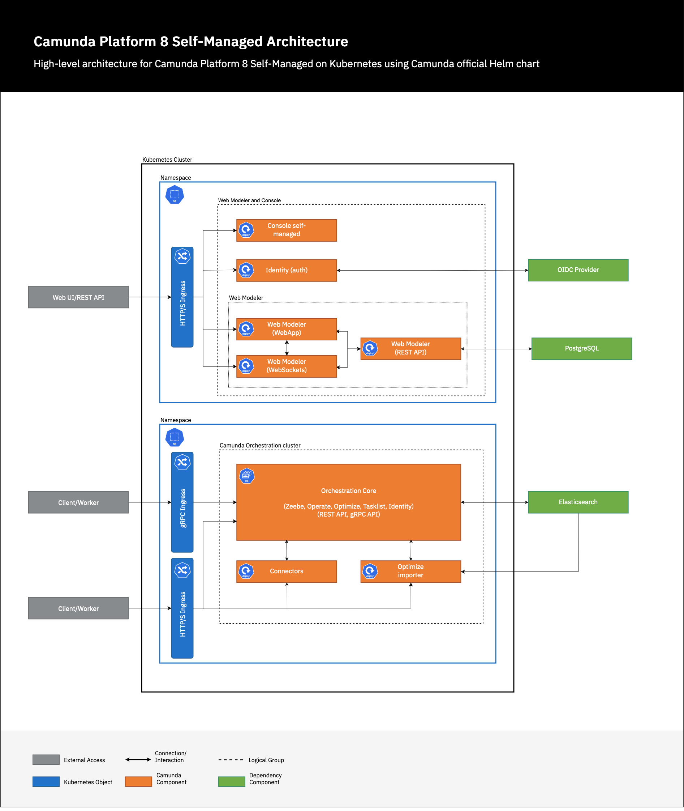

## Overview

This guide provides a resilient, production-ready architecture for Camunda 8 using the Camunda Helm chart. This setup minimizes complexity while offering a reliable foundation for most production use cases.

The goal of this guide is to give you a **scenario-based, production focused, step-by-step guide** for setting up the Camunda Helm chart. We will use AWS as a reference here but the guide would work with other supported cloud providers and their comparable services as well. By following this guide, you will be familiar with all of the necessary requirements for having a production ready Camunda Helm chart.

## Prerequisites

Before proceeding with the setup, ensure the following requirements are met:

- **Kubernetes Cluster**: A functioning Kubernetes cluster with kubectl access and block storage persistent volumes for stateful components. We are going to use an AWS EKS cluster. Have a look at the following guides:
  - [Deploy an EKS cluster with Terraform (advanced)](/docs/self-managed/setup/deploy/amazon/amazon-eks/eks-terraform/)
  - [Install Camunda 8 on an EKS cluster](/docs/self-managed/setup/deploy/amazon/amazon-eks/eks-helm/)
- **Helm**: Make sure you have the [Helm CLI](/docs/reference/supported-environments/#clients) installed
- **DNS Configuration**: Access to configure DNS for your domain to point to the Kubernetes cluster Ingress.
- **TLS Certificates**: Obtain valid X.509 certificates for your domain from a trusted Certificate Authority.
- **External Dependencies**: Provision the following external dependencies:
  - **Amazon Aurora PostgreSQL**: For persistent data storage required for the Web Modeler component. Have a look at the [Set up the Aurora PostgreSQL module](/docs/self-managed/setup/deploy/amazon/amazon-eks/eks-terraform/#set-up-the-aurora-postgresql-module) guide.
  - **Amazon OpenSearch**: is used as a datastore for Camunda Orchestration Core components. Have a look at our guide for setting an [OpenSearch domain](/docs/self-managed/setup/deploy/amazon/amazon-eks/eks-eksctl/#4-opensearch-domain).
  - **AWS Simple Active Directory**: For simple OIDC authentication in this scenario, we will use [AWS Simple Active Directory](https://docs.aws.amazon.com/directoryservice/latest/admin-guide/directory_simple_ad.html).
- **Ingress NGINX**: Ensure the [ingress-nginx](https://github.com/kubernetes/ingress-nginx) controller is set up in the cluster.
- **AWS OpenSearch Snapshot Repository** - This will be a place to store the backups of the Camunda WebApps. This repository must be configured with OpenSearch to take backups which are stored in Amazon S3. Have a look at the [official AWS guide](https://docs.aws.amazon.com/opensearch-service/latest/developerguide/managedomains-snapshot-registerdirectory.html) for detailed steps.
- **Amazon S3** - An additional bucket will be used to store backups of the Zeebe brokers.
- **Resource Planning**: Make sure you have understood the considerations for [sizing Camunda Clusters](/components/best-practices/architecture/sizing-your-environment.md/#camunda-8-self-managed) and evaluated sufficient CPU, memory and storage necessary for the deployment.

Ensure all prerequisites are in place to avoid issues during installation or upgrading in a production environment.

## Architecture Overview

Below is the high-level architecture diagram for the base production setup _(click on the image to open the PDF version)_:
[](./assets/smarch.pdf)

If you would like to learn more about the architecture setup, please refer to the [About Self-Managed](/docs/self-managed/about-self-managed/#architecture) and [Camunda 8 reference architectures](/docs/self-managed/reference-architecture/#orchestration-cluster-vs-web-modeler-and-console) documents.

## Installation and Configuration

Assuming that you have followed the prerequisites, you should have an EKS cluster ready with `kubectl` and `helm` cli installed.

#### Namespace Setup

To get started, create two namespaces:

```bash
kubectl create namespace management
kubectl create namespace orchestration
```

- Namespace `management` (Web Modeler and Console): we will install Identity, Console, and all the Web Modeler components.

- Namespace `orchestration`: we will install the Camunda Orchestration Core component, along with Connectors and Optimize importer.

We do not have to worry about installing each component separately since that will be handled by the Helm chart automatically. For more information on the Orchestration Cluster vs Web Modeler and Console, please review this [guide](/docs/self-managed/reference-architecture/#orchestration-cluster-vs-web-modeler-and-console)

#### Installing the Helm Chart

Since there will be a Helm deployment in each namespace, you can create your own `management-values.yaml` and `orchestration-values.yaml` or enhance your existing setup by applying various production recommendations in the next section.

The Camunda Helm chart can be installed in each namespace using the following command:

```bash
# This will add our chart repository so you can pull from it
helm repo add camunda https://helm.camunda.io
# This will update the chart repository. Please make sure to run this command before every install or upgrade
helm repo update
# This will install the latest Camunda Helm chart in the management namespace with the latest applications/dependencies.
helm install camunda camunda/camunda-platform -n management \
    --values management-values.yaml
# This will install the latest Camunda Helm chart in the Orchestration namespace with the latest applications/dependencies.
helm install camunda camunda/camunda-platform -n orchestration \
    --values orchestration-values.yaml
```

The next section will explain various configurations used in both values files.

### Ingress TLS Setup

In order to access the Camunda Platform through HTTPS with Ingress, you have to enable TLS. To do that, you require three things:

1. **Domain name**: A public registered domain that has configurable DNS records. In our example we will use `camunda.example.com` as the domain.
2. **TLS certificate**: A TLS certificate created for your domain. The certificate must be an X.509 certificate, issued by a trusted Certificate Authority. Also, the certificate must include the correct domain names (Common Name or Subject Alternative Names) to secure Ingress resources. Please reach out to your DNS provider if you are unsure on how to create a TLS certificate. It is not recommended to use self-signed certificates.
3. **TLS secret**: A TLS secret created from your TLS certificate. In our example, we will use a secret called `camunda-platform`. Please refer to the [Kubernetes documentation](https://kubernetes.io/docs/concepts/configuration/secret/#tls-secrets) on how to make a TLS secret.

Here is an example values.yaml configuration using the ingress domain and TLS secret mentioned above:

```yaml
global:
  ingress:
    enabled: true
    className: nginx
    host: camunda.example.com
    tls:
      enabled: true
      secretName: camunda-platform
```

Optionally, you can configure Ingress for Zeebe gRPC API. Here is an example Zeebe gRPC Ingress setup:

```yaml
core:
  ingress:
    grpc:
      enabled: true
      className: nginx
      host: zeebe-grpc.camunda.example.com
      tls:
        enabled: true
        secretName: camunda-platform-core-grpc
```

For more information on the Ingress setup, please refer to our [Ingress setup guide](/self-managed/setup/guides/ingress-setup.md)

### Identity Provider Integration

Once secure HTTPS connections are enabled and correctly configured via Ingress, the next stage to consider is configuring authentication. In this example, we will use AWS Simple Active Directory, which provides a subset implementation of a Microsoft Active Directory and is compatible with our Microsoft Entra ID guide. Here is an example configuration to add to your values files:

```yaml
global:
  identity:
    auth:
      type: MICROSOFT
      issuer: https://login.microsoftonline.com/00000000-0000-0000-0000-000000000000/v2.0
      issuerBackendUrl: https://login.microsoftonline.com/00000000-0000-0000-0000-000000000000/v2.0
      tokenUrl: https://login.microsoftonline.com/00000000-0000-0000-0000-000000000000/oauth2/v2.0/token
      jwksUrl: https://login.microsoftonline.com/00000000-0000-0000-0000-000000000000/discovery/v2.0/keys
      identity:
        clientId: "00000000-0000-0000-0000-000000000000"
        existingSecret: password-string-literal
        audience: "00000000-0000-0000-0000-000000000000"
        redirectUrl: https://identity.camunda.example.com
        initialClaimName: email
        initialClaimValue: test.user@camunda.com
      optimize:
        clientId: "00000000-0000-0000-0000-000000000000"
        existingSecret: password-string-literal
        audience: "00000000-0000-0000-0000-000000000000"
        redirectUrl: https://optimize.camunda.example.com
      core:
        clientId: "00000000-0000-0000-0000-000000000000"
        existingSecret: password-string-literal
        audience: "00000000-0000-0000-0000-000000000000"
        tokenScope: "00000000-0000-0000-0000-000000000000/.default"
        redirectUrl: https://core.camunda.example.com
      console:
        clientId: "00000000-0000-0000-0000-000000000000"
        wellKnown: https://login.microsoftonline.com/00000000-0000-0000-0000-000000000000/v2.0/.well-known/openid-configuration
        audience: "00000000-0000-0000-0000-000000000000"
        existingSecret: password-string-literal
        redirectUrl: https://console.camunda.example.com
      webModeler:
        clientId: "00000000-0000-0000-0000-000000000000"
        clientApiAudience: "00000000-0000-0000-0000-000000000000"
        publicApiAudience: "00000000-0000-0000-0000-000000000000"
        redirectUrl: https://modeler.camunda.example.com
```

If you would like some more guidance relating to authentication, refer to the [Connect to an OpenID Connect provider](/docs/self-managed/setup/guides/connect-to-an-oidc-provider/#configuration) guide

### Connect External Databases

The next stage of the production setup is configuring databases. To make it easy for testing, the Camunda Helm chart provides external, dependency Helm charts for Databases such as [Bitnami Elasticsearch Helm chart](https://artifacthub.io/packages/helm/bitnami/elasticsearch) and the [Bitnami PostgreSQL Helm chart](https://artifacthub.io/packages/helm/bitnami/postgresql). Within a production setting, these dependency charts should be disabled, and production databases should be used instead. For example, instead of the Bitnami Elasticsearch dependency chart, we will use Amazon OpenSearch, and instead of the Bitnami PostgreSQL dependency chart, we will use Amazon Aurora PostgreSQL.

In our scenario, the Core component and the Optimize importer communicate with a single Amazon OpenSearch instance. Similarly, the identity and web-modeler components use separate databases within a single Amazon Aurora PostgreSQL instance.

You should have one Amazon OpenSearch instance and one Amazon Aurora PostgreSQL instance (with two databases) ready to use, complete with a username, password, and URL. If not, refer to the guides in the prerequisites section.

#### Connecting to Amazon OpenSearch

```yaml
global:
  elasticsearch:
    enabled: false
  opensearch:
    enabled: true
    auth:
      username: user
      password: pass
    url:
      protocol: https
      host: opensearch.example.com
      port: 443

elasticsearch:
  enabled: false
```

You can see that we have globally disabled all internal component configuration for Elasticsearch through `global.elasticsearch.enabled: false` and also disable internal Elasticsearch through `elasticsearch.enabled: false`.

#### Connecting to External Database for Identity

Here is how to configure Identity with external Amazon Aurora PostgreSQL:

```yaml
identity:
  externalDatabase:
    enabled: true
    host: external-postgres-host
    port: 5432
    username: identity_user
    database: identity_db
    existingSecret: identity-db-secret
    existingSecretPasswordKey: database-password
```

Please make sure to correctly define the host, and port.

#### Connecting to External Database for Web Modeler

Here is how to configure Web Modeler with external Amazon Aurora PostgreSQL:

```yaml
webModeler:
  externalDatabase:
    url: jdbc:postgresql://external-postgres-host:5432/camunda_db
    user: web_modeler_user
    existingSecret: webm-odeler-db-secret
    existingSecretPasswordKey: database-password
```

Use the existingSecret parameter to specify a pre-existing Kubernetes secret containing the password. This approach allows the Camunda Helm chart to reference credentials stored securely in your cluster rather than hardcoding sensitive data in values files or templates.

If you would like further information on connecting to external databases, we have a number of guides on doing so with the Camunda Helm chart:

- [Using existing Elasticsearch](/self-managed/setup/guides/using-existing-elasticsearch.md)
- [Using Amazon OpenSearch Service](/self-managed/setup/guides/using-existing-opensearch.md)
  - [Using Amazon OpenSearch Service through IRSA (only applicable if you are running Camunda Platform on EKS)](/self-managed/setup/deploy/amazon/amazon-eks/terraform-setup.md#opensearch-module-setup)
- [Running Web Modeler on Amazon Aurora PostgreSQL](/self-managed/modeler/web-modeler/configuration/database.md/#running-web-modeler-on-amazon-aurora-postgresql)

## Camunda Core Configuration

At this point you would be able connect to your platform through HTTPS, correctly authenticate users using AWS Simple Active Directory, and have connected to external databases such as Amazon OpenSearch and Amazon PostgreSQL. The logical next step is to focus on the Camunda application-specific configurations suitable for a production environment.

We will continue our journey in adding to the `management-values.yaml` and `orchestration-values.yaml`. Here is what you should consider for Camunda component level configurations:

### Elasticsearch/OpenSearch Index Retention

An index lifecycle management (ILM) policy in OpenSearch is crucial for efficient management and operation of large-scale search and analytics workloads. ILM policies provide a framework for automating the management of index lifecycles, which directly impacts performance, cost efficiency, and data retention compliance.

Here is how the ILM policy can be configured for the core component. This can be added to your `orchestration-values.yaml`:

```yaml
core:
  retention:
    enabled: true
    minimumAge: 30d
    policyName: core-record-retention-policy
```

If you would like more information on configuring ILM policy. Please refer to [the configuration guide on the OpenSearch exporter](/docs/next/self-managed/zeebe-deployment/exporters/opensearch-exporter/#configuration).

### Configuring Backups

In order to configure backups, please refer to the [backup guide](/self-managed/operational-guides/backup-restore/backup-and-restore.md) for self-managed installations.

## Scaling and Performance

At this point you should already have a solid base to run your platform in a production setting. The rest of this guide gives you general Kubernetes based guidance on configuration of the Camunda Helm chart for long-term maintenance.

Here are some points to keep in mind when considering scalability:

- To scale the Core component, the following values can be modified:

  ```yaml
  core:
    clusterSize: "3"
    partitionCount: "3"
    replicationFactor: "3"
  ```

The `core.clusterSize` refers to the amount of brokers, the `core.partitionCount` refers to how [zeebe partitions](/docs/components/zeebe/technical-concepts/partitions.md) are configured for each cluster, and the `core.replicationFactor` refers to the [number of replicas](/docs/components/zeebe/technical-concepts/partitions.md/#replication) that each partition replicates to.

:::note
The `core.partitionCount` does not yet support dynamic scaling. You will not be able to modify it on future upgrades. It is better to overprovision the partitions to allow potential growth as dynamic partitioning isn't possible yet.
:::

- Check the resources (CPU and memory) and make sure they are appropriate for your workload size. For example, the resource limits can be changed for the core component by modifying the following values:

  ```yaml
  core:
    resources:
      requests:
        cpu: 800m
        memory: 1200Mi
      limits:
        cpu: 2000m
        memory: 1920Mi
  ```

- It is possible to set a LimitRange on the namespace. Please refer to the [Kubernetes documentation](https://kubernetes.io/docs/tasks/administer-cluster/manage-resources/memory-default-namespace/) on setting a LimitRange.

## Reliability

Here are some points to keep in mind when considering reliability:

- Check node affinity and tolerations. Please refer to the [Kubernetes documentation](https://kubernetes.io/docs/concepts/scheduling-eviction/taint-and-toleration/) to modify the node affinity and tolerations.

  For example, this is the default affinity configuration for the Core Pod in the Camunda Helm chart:

  ```yaml
  affinity:
    podAntiAffinity:
      requiredDuringSchedulingIgnoredDuringExecution:
        - labelSelector:
            matchExpressions:
              - key: app.kubernetes.io/component
                operator: In
                values:
                  - core
          topologyKey: kubernetes.io/hostname
  ```

This configuration ensures that Core Pods with the deafult label `app.kubernetes.io/component=core` are not scheduled on the same node. The primary benefits include:

1. High Availability: If one node fails, other nodes running the same component remain unaffected.
2. Load Distribution: Balances the workload across nodes.
3. Fault Tolerance: Reduces the impact of a node-level failure.

- It is possible to set a `podDisruptionBudget`. For example you can modify the following values for the Core component:

  ```yaml
  core:
    podDisruptionBudget:
      enabled: false
      minAvailable: 0
      maxUnavailable: 1
  ```

- Version Management: Stay on a stable Camunda and Kubernetes version. Follow Camunda’s [release notes](/docs/reference/release-notes/) for security patches or critical updates.
- Secrets should be created prior to installing the Helm chart so they can be referenced as existing secrets when installing the Helm chart. In this scenario we are going to auto-generate the secrets. The following can be added to both Helm values files:

  ```yaml
  global:
  secrets:
    autoGenerated: true
    name: camunda-credentials
  ```

  A secret called `camunda-credentials` will be generated. It will include all the needed secret values for the Camunda Helm chart. The `camunda-credentials` generated secret will not be deleted if the Helm chart is uninstalled. Also, `global.secrets.autoGenerated` should be set to `false` when upgrading the chart. Since the same secret data will be required on upgrade.

  :::note

  It best to store this secret in an external secret manager such as [Vault by HashiCorp](https://www.vaultproject.io/) in case of a total outage.

  :::

Please refer to the [Kuberentes documentation](https://kubernetes.io/docs/concepts/configuration/secret/) on how to create a secret.

- When upgrading the Camunda Helm chart, make sure to read the [upgrade guide](/self-managed/operational-guides/update-guide/introduction.md) and corresponding new version elease notes before upgrading and perform the upgrade on a test environment first before attempting in production.
- Make sure to not store any state or important, long term business data in the local file system of the container. A Pod is transient, if the Pod is restarted then the data will get wiped. It is better to create a volume and volume mount instead. Here is some example configuration for the core component to create persistent storage:

  ```yaml
  core:
    extraVolumes:
      extraVolumes:
        - name: persistent-state
          emptyDir: {}
      extraVolumeMounts:
        - name: persistent-state
          mountPath: /mount
  ```

<!-- This seems very specific to the application. I might remove this: -->
<!-- - Mount Secrets as volumes, not environment variables -->

- It is recommended to set a memory and resource quota for your namespace. Please refer to the [Kubernetes documenation](https://kubernetes.io/docs/tasks/administer-cluster/manage-resources/quota-memory-cpu-namespace/) to do so. Namespace-Level Quotas apply limits to all workloads within a namespace. It ensures aggregate resource consumption by all pods in the namespace do not exceed your desired resource limits.

## Security Guidelines

Here are some points to keep in mind when considering security:

- To limit unnecessary permissions, and reduce risk of token exploitations, it is recommended to disable auto-mounting of the default Service Account. It is possible to do so by adding the following to both of your values files:

  ```yaml
  identity:
    serviceAccount:
      enabled: false
  console:
    serviceAccount:
      enabled: false
  webModeler:
    serviceAccount:
      enabled: false
  connectors:
    serviceAccount:
      enabled: false
  core:
    serviceAccount:
      enabled: false
  optimize:
    serviceAccount:
      enabled: false
  ```

You should only enable the auto-mounting of a service account token when the application explicitly needs access to the Kubernetes API server, or you have created a service account with the exact permissions required for the application and bound it to the pod.

- If you have a use case for enabling [Network Policies](https://kubernetes.io/docs/concepts/services-networking/network-policies/) then it is recommended to do so.
<!--Maybe link this to customer: https://github.com/ahmetb/kubernetes-network-policy-recipes-->
- It is possible to have a pod security standard that is suitable to the security constraints you might have. This is possible through modifying the Pod Security Admission. Please refer to the [Pod Security Admission](https://kubernetes.io/docs/concepts/security/pod-security-admission/) guide in the official Kubernetes documentation in order to do so.
- By default, the Camunda Helm chart is configured to use a read-only root file system for the pod. It is advisable to retain this default setting, and no modifications are required in your Helm values files.
- Disable privileged containers. This can be achieved by implementing a pod security policy. For more information please visit the [Kubernetes documentation](https://kubernetes.io/docs/concepts/security/pod-security-admission/)
- It is possible to modify either the `containerSecurityContext` or the `podSecurityContext`. For example, here is the default configuration for the core component:

  ```yaml
  podSecurityContext:
    runAsNonRoot: true
    fsGroup: 1001
    seccompProfile:
      type: RuntimeDefault

  containerSecurityContext:
    allowPrivilegeEscalation: false
    privileged: false
    readOnlyRootFilesystem: true
    runAsNonRoot: true
    runAsUser: 1001
    seccompProfile:
      type: RuntimeDefault
  ```

If you would like to add any other security constraints to your Helm values files then please refer to the official [Kubernetes documentation](https://kubernetes.io/docs/tasks/configure-pod-container/security-context/)

- It is recommended to pull images exclusively from a private registry, such as [Amazon ECR](https://aws.amazon.com/ecr/), rather than directly from Docker Hub. Doing so enhances control over the images, avoids rate limits, and improves performance and reliability. Additionally, you can configure your cluster to pull images only from trusted registries. Tools like [Open Policy Agent](https://blog.openpolicyagent.org/securing-the-kubernetes-api-with-open-policy-agent-ce93af0552c3#3c6e) can be used to enforce this restriction.
- Open Policy Agent can also be used to [whitelist Ingress hostnames](https://www.openpolicyagent.org/docs/latest/kubernetes-tutorial/#4-define-a-policy-and-load-it-into-opa-via-kubernetes).

## Observability and Monitoring

Here are some points to keep in mind when considering observability:

- It is possible to enable integration with Prometheus, a popular monitoring solution, in the Camunda Helm chart. This can be configured by adding the following configuration below to your preferred Helm values file:

  ```yaml
  prometheusServiceMonitor:
    enabled: true
  ```

- A tool such as [Loki](https://grafana.com/oss/loki/) could be used for the retention and archival of logs. It can also be used to aggregate logs.

## Bringing it All Together

Here is a complete example, taking all the above sections into consideration.

`management-values.yaml` for the `management` namespace:

```yaml
global:
  secrets:
    autoGenerated: true
    name: camunda-test-credentials
  Ingress:
    enabled: true
    className: nginx
    host: management-host.com
    tls:
      enabled: true
      secretName: camunda-platform
  identity:
    auth:
      type: MICROSOFT
      issuer: https://login.microsoftonline.com/00000000-0000-0000-0000-000000000000/v2.0
      issuerBackendUrl: https://login.microsoftonline.com/00000000-0000-0000-0000-000000000000/v2.0
      tokenUrl: https://login.microsoftonline.com/00000000-0000-0000-0000-000000000000/oauth2/v2.0/token
      jwksUrl: https://login.microsoftonline.com/00000000-0000-0000-0000-000000000000/discovery/v2.0/keys
      admin:
        existingSecret:
          name: camunda-credentials
        existingSecretKey: identity-admin-client-password
      identity:
        clientId: "00000000-0000-0000-0000-000000000000"
        existingSecret: password-string-literal
        audience: "00000000-0000-0000-0000-000000000000"
        redirectUrl: https://identity.management-host.com
        initialClaimName: email
        initialClaimValue: test.user@camunda.com
      console:
        clientId: "00000000-0000-0000-0000-000000000000"
        wellKnown: https://login.microsoftonline.com/00000000-0000-0000-0000-000000000000/v2.0/.well-known/openid-configuration
        audience: "00000000-0000-0000-0000-000000000000"
        existingSecret: password-string-literal
        redirectUrl: https://console.management-host.com
        existingSecret:
          name: camunda-credentials
        existingSecretKey: identity-console-client-password
      webModeler:
        clientId: "00000000-0000-0000-0000-000000000000"
        clientApiAudience: "00000000-0000-0000-0000-000000000000"
        publicApiAudience: "00000000-0000-0000-0000-000000000000"
        redirectUrl: https://modeler.management-host.com
identity:
  contextPath: /identity
  firstUser:
    existingSecret: camunda-credentials
    existingSecretKey: identity-user-password
  externalDatabase:
    enabled: true
    host: external-postgres-host
    port: 5432
    username: identity_user
    database: identity_db
    existingSecret: identity-db-secret
    existingSecretPasswordKey: database-password


webModeler:
  enabled: true
  contextPath: /modeler
  restapi:
    mail:
      # This value is required, otherwise the restapi pod wouldn't start.
      fromAddress: noreply@example.com
  externalDatabase:
    url: jdbc:postgresql://external-postgres-host:5432/camunda_db
    user: camunda_user
    existingSecret: camunda-db-secret
    existingSecretPasswordKey: database-password

prometheusServiceMonitor:
  enabled: true
  labels:
    release: kube-prometheus-stack
core:
  enabled: false
optimize:
  enabled: false
connectors:
  enabled: false
elasticsearch:
  enabled: false
# console:
#   configuration: |
# console configuration to connect both deployments
```

`orchestration-values.yaml` for the `orchestration` namespace:

```yaml
global:
  secrets:
    autoGenerated: true
    name: camunda-test-credentials
  Ingress:
    enabled: true
    className: nginx
    host: orchestration-host.com
    tls:
      enabled: true
      secretName: camunda-platform
  elasticsearch:
    enabled: false
  opensearch:
    enabled: true
    auth:
      username: user
      password: pass
    url:
      protocol: https
      host: opensearch.example.com
      port: 443
  identity:
    service:
      url: "http://management-identity.management.svc.cluster.local:80/identity"
    keycloak:
      url:
        protocol: "http"
        host: "management-keycloak.management.svc.cluster.local"
        port: "80"
    auth:
      type: MICROSOFT
      issuer: https://login.microsoftonline.com/00000000-0000-0000-0000-000000000000/v2.0
      publicIssuerUrl: "https://orchestration-host.com/auth/realms/camunda-platform"
      issuerBackendUrl: https://login.microsoftonline.com/00000000-0000-0000-0000-000000000000/v2.0
      tokenUrl: https://login.microsoftonline.com/00000000-0000-0000-0000-000000000000/oauth2/v2.0/token
      jwksUrl: https://login.microsoftonline.com/00000000-0000-0000-0000-000000000000/discovery/v2.0/keys
      optimize:
        clientId: "00000000-0000-0000-0000-000000000000"
        existingSecret: password-string-literal
        audience: "00000000-0000-0000-0000-000000000000"
        redirectUrl: "https://orchestration-host.com/optimize"
        existingSecret:
          name: camunda-credentials
        existingSecretKey: identity-optimize-client-password
      core:
        clientId: "00000000-0000-0000-0000-000000000000"
        existingSecret: password-string-literal
        audience: "00000000-0000-0000-0000-000000000000"
        tokenScope: "00000000-0000-0000-0000-000000000000/.default"
        redirectUrl: "https://orchestration-host.com/core"
        existingSecret:
          name: camunda-credentials
        existingSecretKey: identity-core-client-password
      connectors:
        existingSecret:
          name: camunda-credentials
        existingSecretKey: identity-connectors-client-password
core:
  contextPath: /core
  ingress:
    grpc:
      enabled: true
      className: nginx
      host: grpc-{{ .Values.global.ingress.host }}
      tls:
        enabled: true
        secretName: camunda-platform-core-grpc
  retention:
    enabled: true
    minimumAge: 30d
    policyName: core-record-retention-policy

optimize:
  contextPath: /optimize

connectors:
  contextPath: /connectors

identity:
  enabled: false
identityKeycloak:
  enabled: false
webModeler:
  enabled: false
postgresql:
  enabled: false
```

## Next Steps

### Upgrade and Maintenance

- Make sure to follow our [upgrade guide](/docs/next/self-managed/setup/upgrade/) when performing the upgrade on your Helm chart.
- Secrets are not auto-generated by default in the Camunda Helm chart. It is important to not override this default behavior on upgrade.

### Adding more Orchestration Clusters

The next recommended step is to setup a multi-namespace deployment. To configure multiple Camunda Orchestration Clusters in different namespaces, we recommend you to follow our [guide for our multi-namespace deployments](/self-managed/setup/guides/multi-namespace-deployment.md). This is the most recommended approach to allow you to setup various environments using the Camunda Orchestration Cluster.

### Running benchmarks

If you would like to run benchmarks on the platform then please refer to our [community project](https://github.com/camunda-community-hub/camunda-8-benchmark)
