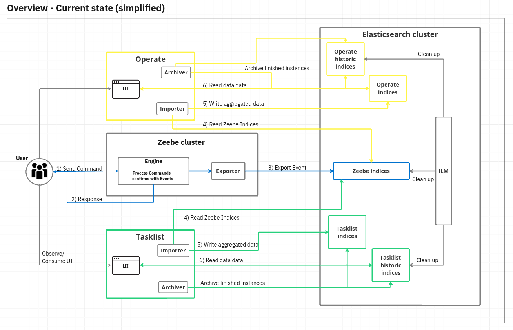
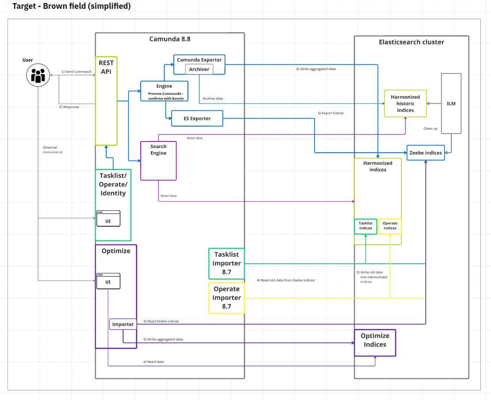
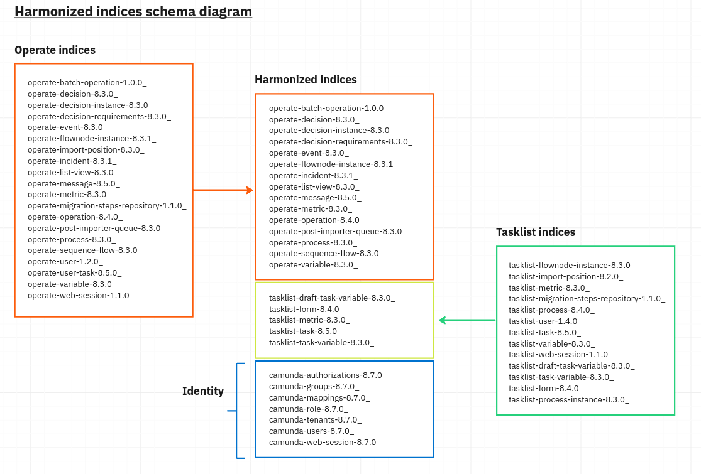
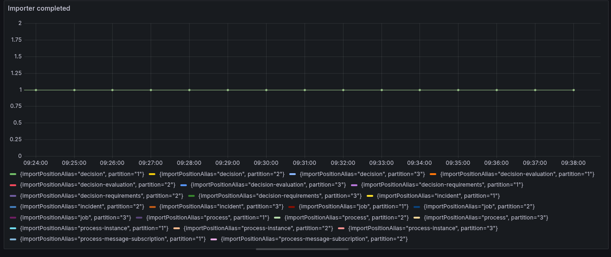

The following sections explain which adjustments must be made to migrate from Camunda 8.7.x to 8.8.x for each component.

## Camunda Exporter

In the past release, we’ve engineered a new Camunda Exporter, which brings the importer and archiving logic of web components (Tasklist and Operate) closer to our distributed platform (Zeebe).
This allows us to simplify our installation, enable scalability for web apps, reduce the latency to show runtime and historical data, and reduce data duplication (resource consumption).



Our web applications have historically used importers and archivers to consume, aggregate, and archive historical data provided by our Elasticsearch (ES) or OpenSearch (OS) Exporter.
With the introduction of the Camunda Exporter, there are some changes in the architecture users should be aware of.



We have introduced the Camunda Exporter to simplify things and get several benefits from it.

For the migration/update phase, we still need to run the Operate and Tasklist importer and the Elasticsearch Exporter. This is to make sure that old
data written in 8.7 to the Zeebe journal or already in the Zeebe Elasticsearch indices, gets imported into our new
harmonized index schema.

### Harmonized Indices

The harmonized schema looks like the following:



We were able to reduce the need for several indices and to make use of existing ones (Operate indices are used by Tasklist, etc.)

### Notes for updating to 8.8

Notes for updating to 8.7 related to the Camunda Exporter and harmonized indices.

#### Users need to make sure that the exporter/import backlog is small

As we mentioned above we need to import old data from 8.7 via the importers.
The importers need to run first and complete before the Camunda Exporter can confidently start.

The Importer is reading data, from existing Zeebe Elasticsearch indices, and as soon it detects data from newer versions, like 8.8
it marks itself as complete. The Camunda Exporter can detect this and will start exporting only if the Importer is done.

:::important
To reduce the potential of building a backlog,
(like growing disk, as records don't get exported and cleaned up, etc.), the user need to make sure to drain the backlog queue before the update.
:::

The backlog can be validated via the following metrics:

- operate_import_time_seconds_sum
- operate_import_time_seconds_count

For example, the following query will show the import latency, if this is low in a range of seconds it is fine to update.

```promql
sum(rate(operate_import_time_seconds_sum{namespace=~"$namespace", partition=~"$partition", pod=~"$pod"}[$__rate_interval]))
/ sum(rate(operate_import_time_seconds_count{namespace=~"$namespace", partition=~"$partition", pod=~"$pod"}[$__rate_interval]))
```

#### Data migration

As we have harmonized indices there are some details Tasklist needs as part of the processes, which were not part of
existing Operate process indices.

For such we have built a migration application to enhance existing process models. This migration application will
run asynchronous next to the other applications, and until the importers are done.

This is to make sure that all processes created in 8.7 are migrated and enhanced.

The migration application can be found here: `camunda/bin/migrate`

:::note
If you deploy the Helm Charts, it should automatically be deployed with the Importers.
:::

#### Users can turn off Importers after completion

As Importers are only necessary at the beginning, due to importing old data / draining the queue of 8.7 events,
they can be turned off later.

To detect whether importers are done, users can either validate the state in the Elasticsearch/OpenSearch Index:

- `tasklist-import-position-8.2.0_`
- `operate-import-position-8.3.0_`

If for all entries the `completed` property is set to true, the importing is done.

Alternatively, metrics can be validated via:

- `operate_import_completed`
- `tasklist_import_completed`

Example query could be: `sum(tasklist_import_completed{namespace="$namespace"}) by (importPositionAlias)`



#### Custom prefix usage needs extra care

:::important
This is a requirement if you use an installation with custom prefixes.
:::

As we have harmonized our index schema as part of the Camunda Exporter development, we have introduced one common index prefix.
To update indices need to migrate to one common index, so the Camunda Exporter and also REST API and other consumers
can be configured correctly.

##### Prefix migration

:::warning
Disk usage will massively increase while the migration is ongoing.
Make sure you have at least double of disk space free.
:::

:::note
While we test and validate the provided migration script.
It is recommended that you first back up the Elasticsearch, and test the migration script in a test environment first
to ensure there are no unexpected issues.
:::

:::note
The prefix migration involves downtime.
:::

Steps for prefix migration:

1. Shut down your Camunda 8.7 cluster, fex. reduce the replicas to zero. Such that no traffic will executed against your to-be-migrated ES/OS prefixes.
2. In the `camunda/bin` directory there is a `prefix-migration` script that will execute the prefix migration,
   pass the desired prefix using the `CAMUNDA_DATABASE_INDEXPREFIX` environment variable.
   1. Make sure that your configuration in `camunda/config` has set the previous custom prefixes. Such that the prefix migration script can find them.
   2. Alternatively, you can set them via env vars.

```shell
export CAMUNDA_OPERATE_ELASTICSEARCH_INDEX_PREFIX=old-operate-prefix; \
export CAMUNDA_TASKLIST_ELASTICSEARCH_INDEX_PREFIX=old-tasklist-prefix; \
export CAMUNDA_DATABASE_INDEXPREFIX=some-new-prefix; \
./prefix-migration
```

With the migration finished, There are mandatory configuration changes to be made prior to updating to 8.8.

:::note
Without these configuration changes the update to 8.8 will fail.
:::

Given a new desired prefix of `some-prefix`

- The configured `CAMUNDA_OPERATE_ELASTICSEARCH_INDEX_PREFIX` must now be `some-new-prefix`.
- The configured `CAMUNDA_TASKLIST_ELASTICSEARCH_INDEX_PREFIX` must now be `some-new-prefix`.
- The prefix for the [Camunda exporter](/self-managed/zeebe-deployment/exporters/camunda-exporter.md) should be configured using `ZEEBE_BROKER_EXPORTERS_CAMUNDA_ARGS_INDEX_PREFIX` to `some-new-prefix`.

## Removed deprecated OpenAPI objects

:::warning
With the Camunda 8.8 release, deprecated API objects containing number keys have been removed, including the
corresponding `application/vnd.camunda.api.keys.number+json` content type header.
:::

In previous releases, entity keys were transitioned from `integer (int64)` to `string` types, and deprecated
`integer (int64)` keys were still supported. As of the 8.8 release, support for `integer (int64)` keys has been removed.

To update to Camunda 8.8, API objects using `integer (int64)` keys must be updated to use `string` keys and the
`application/json` header.

For more information about the key attribute type change, see
the [8.7 API key attributes overview][camunda8-api-overview].

[camunda8-api-overview]: /versioned_docs/version-8.7/apis-tools/camunda-api-rest/camunda-api-rest-overview.md#api-key-attributes
