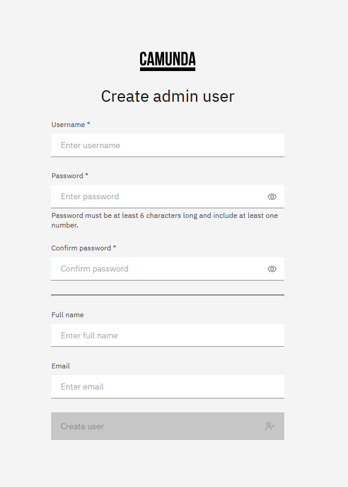

import Tabs from '@theme/Tabs';
import TabItem from '@theme/TabItem';

Identity is included by default with the deployment of any [Orchestration cluster](/self-managed/reference-architecture/reference-architecture.md#orchestration-cluster). Within an Orchestration cluster, Identity provides unified, cluster-level identity management and authorizations.

Identity for Orchestration clusters is available via [Helm install](/self-managed/installation-methods/helm/install.md), and for local development via [Camunda 8 Run](/self-managed/quickstart/developer-quickstart/c8run.md).

:::note

The following guides are on Identity configuration in Self-Managed environments. For information on Identity use and management, see the [user guides](/components/identity/identity-introduction.md).

:::

## Initial configuration

Following the default installation for [Camunda 8 Run](/self-managed/quickstart/developer-quickstart/c8run.md) will result in a cluster with the following:

1. Web application login enabled
2. API authentication disabled
3. Authorizations disabled
4. An initial user with the username/password `demo`/`demo`
5. An `admin` role with read, create, update, and delete permissions for all roles and all resources, which is applied to the initial `demo` user

To make changes to the [initial configuration](./configuration.md), add the desired values to your `application.yaml`, and provide this file to Camunda 8 Run using the `--config` flag [at startup](/self-managed/quickstart/developer-quickstart/c8run.md#enable-authentication-and-authorization).

:::note
Helm installations have API authentication and authorizations enabled by default. To adjust your Helm configuration, add the desired values to your `application.yaml` or via environment variables.
:::

### Configure initial users

If users are managed in the Orchestration Cluster (i.e. no external Identity Provider is connected), an initial user can be created in two ways:

- In the web application UI
- Via configuration

#### Configure an initial admin user in the web application UI

If no admin user exists in the system, you can access the Orchestration Cluster web applications and they will display a screen to create the initial user.



The initial user will be assigned to the admin role so that it has all permissions in the system. Once an admin user exists, the screen is not displayed anymore.

#### Configure initial users via configuration

To create initial users via configuration, the following is required in your `application.yaml` or environment variables:

<Tabs>
  <TabItem value="helm" label="Helm properties">

```yaml
camunda:
  security:
    initialization:
      users:
        - username: <Your chosen username>
          password: <Your chosen password>
          name: <The name of the first user>
          email: <The email address of the first user>
        # add more users to this list as desired
```

  </TabItem>
<TabItem value="env" label="Environment variables" default>

```shell
CAMUNDA_SECURITY_INITIALIZATION_USERS_0_USERNAME=<Your chosen username>
CAMUNDA_SECURITY_INITIALIZATION_USERS_0_PASSWORD=<Your chosen password>
CAMUNDA_SECURITY_INITIALIZATION_USERS_0_NAME=<The name of the first user>
CAMUNDA_SECURITY_INITIALIZATION_USERS_0_EMAIL=<The email address of the first user>

# add more users as desired by repeating the variables with an incremented index,
# like CAMUNDA_SECURITY_INITIALIZATION_USERS_1_USERNAME
```

  </TabItem>
</Tabs>

:::note
By default, a user is not assigned to any roles and accordingly does not have any permissions. See the next section for how to assign a user to a role via configuration.
:::

#### Assign users/clients/groups/mapping rules to roles via configuration

The Orchestration Cluster creates the following default roles:

- admin: Has all permissions
- readonly-admin: Has all permissions to read data and no permissions to modify data
- connectors: Has all the permissions that the Connectors component requires
- rpa: Has all the permissions that the RPA component requires

To assign users/clients/groups/mappings to a role, you can add the following `application.yaml` properties or environment variables:

<Tabs>
  <TabItem value="helm" label="Helm properties">

```yaml
camunda:
  security:
    initialization:
      defaultRoles:
        <role>:
          users:
            - <username>
            # add more users to this list as desired
          clients:
            - <client id>
            # add more clients to this list as desired
          groups:
            - <group id>
            # add more groups to this list as desired
          mappings:
            - <mapping id>
            # add more mappings to this list as desired
```

  </TabItem>
<TabItem value="env" label="Environment variables" default>

```shell
CAMUNDA_SECURITY_INITIALIZATION_DEFAULTROLES_<role>_USERS_0=<username>
CAMUNDA_SECURITY_INITIALIZATION_DEFAULTROLES_<role>_CLIENTS_0=<client id>
CAMUNDA_SECURITY_INITIALIZATION_DEFAULTROLES_<role>_GROUPS_0=<group id>
CAMUNDA_SECURITY_INITIALIZATION_DEFAULTROLES_<role>_MAPPINGS_0=<mapping id>

# add more members as desired by repeating the variables with an incremented index,
# like CAMUNDA_SECURITY_INITIALIZATION_DEFAULTROLES_<role>_USERS_1
```

  </TabItem>
</Tabs>

Replace `<role>` with the ID of the role you want to configure.

Here is an example how to configure a user `demo` to become a member of the admin role:

<Tabs>
  <TabItem value="helm" label="Helm properties">
```yaml
camunda:
  security:
    initialization:
      defaultRoles:
        admin:
          users:
            - demo
```

  </TabItem>
<TabItem value="env" label="Environment variables" default>

```shell
CAMUNDA_SECURITY_INITIALIZATION_DEFAULTROLES_ADMIN_USERS_0=demo
```

  </TabItem>
</Tabs>

### Enable API authentication and authorizations

In Camunda 8 Run installations, basic authentication is enabled on the Camunda web applications, but the API is unprotected, and [authorizations](/components/identity/authorization.md) are disabled. API protection and authorizations can both be enabled by modifying your `application.yaml` or environment variables:

<Tabs>
  <TabItem value="helm" label="Helm properties">

```yaml
camunda:
  security:
    authentication:
      unprotected-api: false
    authorizations:
      enabled: true
```

  </TabItem>
<TabItem value="env" label="Environment variables" default>

```shell
CAMUNDA_SECURITY_AUTHENTICATION_UNPROTECTED-API=false
CAMUNDA_SECURITY_AUTHORIZATIONS_ENABLED=true
```

  </TabItem>
</Tabs>

:::note
To enable authorizations, API protection must also be enabled.
:::

Basic authentication credentials are then required when making API requests, as in the following:

```shell
curl --request POST 'http://localhost:8080/v1/process-definitions/search'  \
  -u demo:demo \
  --header 'Content-Type: application/json' \
  --data-raw '{}'
```
