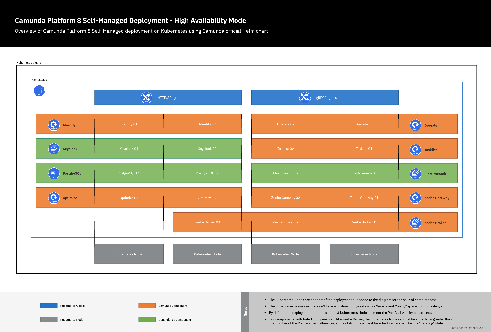

Camunda Platform 8 Self-Managed is highly customizable and can be deployed in different setups.
[**Helm/Kubernetes**](../platform-deployment/helm-kubernetes/overview.md) is the recommended method to deploy Camunda Platform 8, especially in production. Our Helm chart provides many capabilities to customize deployment according to your needs. This page provides a high-level overview of the architecture and deployment options.

## Architecture

Camunda Platform 8 Self-Managed has multiple web applications and gRPC services which could be accessed externally using Ingress. The following diagram is the architecture with two Ingress objects, an Ingress with HTTP(S) protocol for all web applications using a single domain, and another Ingress with gRPC protocol for the Zeebe workflow engine:

In this architecture, Camunda Platform 8 Self-Managed can be accessed as follows:

- Web applications: `https://camunda.example.com/[identity|operate|optimize|tasklist]`
- Keycloak authentication: `https://camunda.example.com/auth`
- Zeebe gateway: `grpc://zeebe.camunda.example.com`

It's also possible to set up an Ingress for each component. For more details, visit our [combined and separated Ingress set up guide](../platform-deployment/helm-kubernetes/guides/ingress-setup.md).

## Deployment

Each component of Camunda Platform 8 Self-Managed can be deployed in single or high-availability mode, which provides minimal to no service interruption. The following diagram represents deployment in high-availability mode:

## Additional considerations

- The Kubernetes resources that don't have a custom configuration like Service and ConfigMap are not in the diagram.
- By default, the deployment requires at least three Kubernetes Nodes to meet the Pod Anti-Affinity constraints.
- For components with Anti-Affinity enabled, like Zeebe Broker, the Kubernetes Nodes should be equal to or greater than the number of the Pod replicas. Otherwise, some of its Pods will not be scheduled and will be in a "Pending" state.

For more details about deployment options, visit [sizing your environment - Camunda Platform 8 Self-Managed](../../components/best-practices/architecture/sizing-your-environment.md#camunda-platform-8-self-managed).
