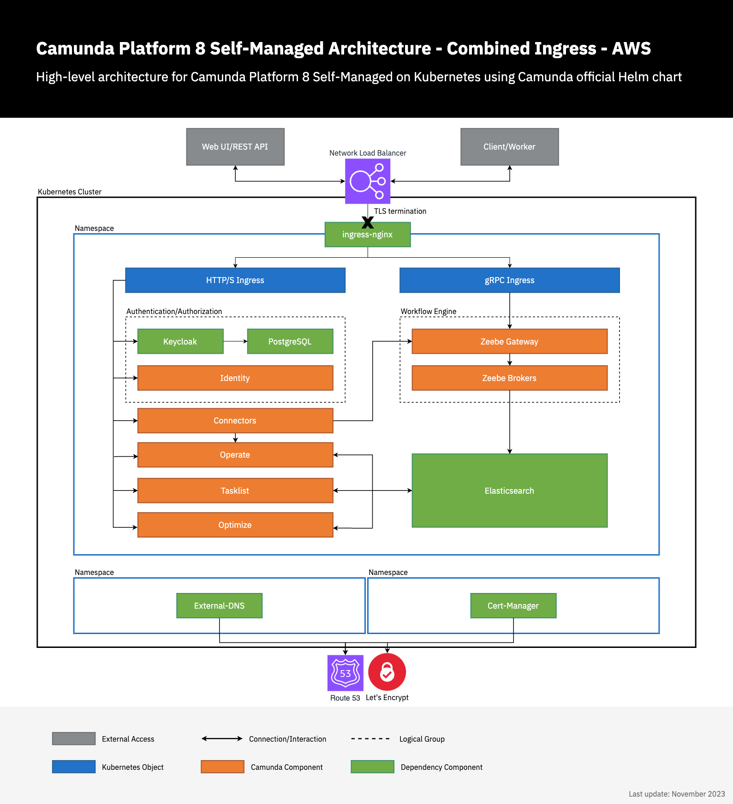

import Tabs from "@theme/Tabs";
import TabItem from "@theme/TabItem";

## Prerequisites

- a Kubernetes Cluster, see [eksctl](#) or [terraform](#) guide <!-- TODO: replace with proper links -->
- [Helm (3.13+)](https://helm.sh/docs/intro/install/) installed
- [kubectl (1.28+)](https://kubernetes.io/docs/tasks/tools/#kubectl) to interact with the cluster.
- (optional) Domain name / [hosted zone](https://docs.aws.amazon.com/Route53/latest/DeveloperGuide/hosted-zones-working-with.html) in Route53
  - this allows to expose Camunda 8 and easily connect via [zbctl](../../../../../../apis-tools/cli-client/) or the [Camunda Modeler](https://camunda.com/download/modeler/)

## Considerations

### Architecture



## Usage

### Environment Prerequisites

In order to streamline the execution of the subsequent commands, it is recommended to export multiple environment variables.

The following are the required environment variables with some example values.

```shell
# Your standard region that you host AWS resources in
export REGION=eu-central-1
# Following two environment variables can be skipped if you don't have a domain
# The domain name that you intend to use
export DOMAIN_NAME=camunda.example.com
# The e-mail to register with Let's Encrypt
export MAIL=admin@camunda.example.com
# The Ingress-Nginx Helm Chart version
export INGRESS_HELM_CHART_VERSION="4.8.3"
# The External DNS Helm Chart version
export EXTERNAL_DNS_HELM_CHART_VERSION="1.13.1"
# The Cert-Manager Helm Chart version
export CERT_MANAGER_HELM_CHART_VERSION="1.13.2"
# The Camunda 8 Helm Chart version
export CAMUNDA_HELM_CHART_VERSION="8.3.3"
```

Additionally, please follow the guide from either [eksctl](#) or from [Terraform](#) to retrieve the following values, which will be required for subsequent steps. <!-- TODO: Link to sources -->

- EXTERNAL_DNS_IRSA_ARN
- CERT_MANAGER_IRSA_ARN
- DB_HOST
- PG_USERNAME
- PG_PASSWORD
- DEFAULT_DB_NAME
- REGION

### DNS Setup

:::info
If you don't have a domain name, you can skip to [Camunda 8](#camunda-8).
:::

#### ingress-nginx

[Ingress-nginx](https://github.com/kubernetes/ingress-nginx) is an open-source Kubernetes Ingress controller that provides a way to manage external access to services within a Kubernetes cluster. It acts as a reverse proxy and load balancer, routing incoming traffic to the appropriate services based on rules defined in the Ingress resource.

The following will install `ingress-nginx` in the `ingress-nginx` namespace via Helm. For more configuration options, consult the [Helm chart](https://github.com/kubernetes/ingress-nginx/tree/main/charts/ingress-nginx).

```shell
helm upgrade --install \
  ingress-nginx ingress-nginx \
  --repo https://kubernetes.github.io/ingress-nginx \
  --version $INGRESS_HELM_CHART_VERSION \
  --set 'controller.service.annotations.service\.beta\.kubernetes\.io\/aws-load-balancer-backend-protocol=tcp' \
  --set 'controller.service.annotations.service\.beta\.kubernetes\.io\/aws-load-balancer-cross-zone-load-balancing-enabled=true' \
  --set 'controller.service.annotations.service\.beta\.kubernetes\.io\/aws-load-balancer-type=nlb' \
  --namespace ingress-nginx \
  --create-namespace
```

#### external-dns

[External-dns](https://github.com/kubernetes-sigs/external-dns) is a Kubernetes add-on that automates the management of DNS records for external resources, such as Load Balancers or Ingress controllers. It monitors the Kubernetes resources and dynamically updates the DNS provider with the appropriate DNS records.

The following will install `external-dns` in the `external-dns` namespace via Helm. For more configuration options, consult the [Helm chart](https://github.com/kubernetes-sigs/external-dns/tree/master/charts/external-dns).

Consider setting `domainFilters` via `--set` to restrict access to certain hosted zones.

```shell
helm upgrade --install \
  external-dns external-dns \
  --repo https://kubernetes-sigs.github.io/external-dns/ \
  --version $EXTERNAL_DNS_HELM_CHART_VERSION \
  --set "env[0].name=AWS_DEFAULT_REGION" \
  --set "env[0].value=$REGION" \
  --set txtOwnerId=external-dns \
  --set policy=sync \
  --set "serviceAccount.annotations.eks\.amazonaws\.com\/role-arn=$EXTERNAL_DNS_IRSA_ARN" \
  --namespace external-dns \
  --create-namespace
```

#### cert-manager

[Cert-manager](https://cert-manager.io/) is an open-source Kubernetes add-on that automates the management and issuance of TLS certificates. It integrates with various certificate authorities (CAs) and provides a straightforward way to obtain, renew, and manage SSL/TLS certificates for your Kubernetes applications.

The following will install `cert-manager` in the `cert-manager` namespace via Helm. For more configuration options, consult the [Helm chart](https://artifacthub.io/packages/helm/cert-manager/cert-manager). The supplied settings will also configure `cert-manager` to ease the certificate creation by setting a default issuer, which allows us to add a single annotation on an ingress to request the relevant certificates.

```shell
helm upgrade --install \
  cert-manager cert-manager \
  --repo https://charts.jetstack.io \
  --version $CERT_MANAGER_HELM_CHART_VERSION \
  --namespace cert-manager \
  --create-namespace \
  --set installCRDs=true \
  --set "serviceAccount.annotations.eks\.amazonaws\.com\/role-arn=$CERT_MANAGER_IRSA_ARN" \
  --set securityContext.fsGroup=1001 \
  --set ingressShim.defaultIssuerName=letsencrypt \
  --set ingressShim.defaultIssuerKind=ClusterIssuer \
  --set ingressShim.defaultIssuerGroup=cert-manager.io
```

It is recommended to install the cert-manager custom resource definitions (CRDs) separately from Helm. Please refer to the [installation advice](https://cert-manager.io/docs/installation/helm/#crd-installation-advice) provided by cert-manager. This approach is recommended because when using Helm, there is a possibility of accidentally omitting the CRDs due to incorrect configuration resulting the loss of certificates.

Create a ClusterIssuer via `kubectl` to enable cert-manager to request certificates from [Let's Encrypt](https://letsencrypt.org/).

```shell
cat << EOF | kubectl apply -f -
---
apiVersion: cert-manager.io/v1
kind: ClusterIssuer
metadata:
  name: letsencrypt
spec:
  acme:
    server: https://acme-v02.api.letsencrypt.org/directory
    email: $MAIL
    privateKeySecretRef:
      name: letsencrypt-issuer-account-key
    solvers:
      - selector: {}
        dns01:
          route53:
            region: $REGION
            # Cert-manager will automatically observe the hosted zones
            # Cert-manager will automatically make use of the IRSA assigned service account
EOF
```

### Camunda 8

For more configuration options, refer to the [Helm Chart documentation](https://github.com/camunda/camunda-platform-helm/blob/main/charts/camunda-platform/README.md). Additionally, explore our existing resources on the [C8 Helm Chart](../../deploy.md) and [guides](../../../guides/).

<Tabs groupId="domain">
  <TabItem value="with" label="With Domain">

The following makes use of the [combined ingress setup](../../guides/ingress-setup.md#combined-ingress-setup) by deploying a single ingress for all HTTP components and a separate ingress for the gRPC endpoint.

```shell
helm upgrade --install \
  camunda camunda-platform \
  --repo https://helm.camunda.io \
  --version $CAMUNDA_HELM_CHART_VERSION \
  --namespace camunda \
  --create-namespace \
  --set identity.keycloak.postgresql.enabled=false \
  --set identity.keycloak.externalDatabase.host=$DB_HOST \
  --set identity.keycloak.externalDatabase.user=$PG_USERNAME \
  --set identity.keycloak.externalDatabase.password=$PG_PASSWORD \
  --set identity.keycloak.externalDatabase.database=$DEFAULT_DB_NAME \
  --set global.ingress.enabled=true \
  --set global.ingress.host=$DOMAIN_NAME \
  --set global.ingress.tls.enabled=true \
  --set global.ingress.tls.secretName=camunda-c8-tls \
  --set-string 'global.ingress.annotations.kubernetes\.io\/tls-acme=true' \
  --set global.identity.auth.publicIssuerUrl="https://$DOMAIN_NAME/auth/realms/camunda-platform" \
  --set global.identity.auth.operate.redirectUrl="https://$DOMAIN_NAME/operate" \
  --set global.identity.auth.tasklist.redirectUrl="https://$DOMAIN_NAME/tasklist" \
  --set global.identity.auth.optimize.redirectUrl="https://$DOMAIN_NAME/optimize" \
  --set identity.contextPath="/identity" \
  --set identity.fullURL="https://$DOMAIN_NAME/identity" \
  --set operate.contextPath="/operate" \
  --set tasklist.contextPath="/tasklist" \
  --set optimize.contextPath="/optimize" \
  --set zeebe-gateway.ingress.enabled=true \
  --set zeebe-gateway.ingress.host="zeebe.$DOMAIN_NAME" \
  --set zeebe-gateway.ingress.tls.enabled=true \
  --set zeebe-gateway.ingress.tls.secretName=zeebe-c8-tls \
  --set-string 'zeebe-gateway.ingress.annotations.kubernetes\.io\/tls-acme=true'
```

The annotation `kubernetes.io/tls-acme=true` is [interpreted by cert-manager](https://cert-manager.io/docs/usage/ingress/) and will automatically result in the creation of the required certificate request, easing the setup.

  </TabItem>
  <TabItem value="without" label="Without Domain">

```shell
helm upgrade --install \
  camunda camunda-platform \
  --repo https://helm.camunda.io \
  --version $CAMUNDA_HELM_CHART_VERSION \
  --namespace camunda \
  --create-namespace \
  --set identity.keycloak.postgresql.enabled=false \
  --set identity.keycloak.externalDatabase.host=$DB_HOST \
  --set identity.keycloak.externalDatabase.user=$PG_USERNAME \
  --set identity.keycloak.externalDatabase.password=$PG_PASSWORD \
  --set identity.keycloak.externalDatabase.database=$DEFAULT_DB_NAME
```

  </TabItem>
</Tabs>

With the Camunda 8 Helm chart deployed, consider following the [next section](#verifying-connectivity-to-camunda-8) to verify connectivity.

### Verifying connectivity to Camunda 8

First of we need an OAuth client to be able to connect to the Camunda 8 cluster.

This can be done by following the [Identity getting started guide](../../../../../identity/getting-started/install-identity/) followed by the [incorporating applications documentation](../../../../../identity/user-guide/additional-features/incorporate-applications/).
Instead of creating a confidential application, a machine-to-machine (M2M) application is required to be created.
This will reveal a `client-id` and `client-secret` that can be used to connect to the Camunda 8 cluster.

<Tabs groupId="c8-connectivity">
  <TabItem value="zbctl" label="zbctl">

After following the installation instructions in the [zbctl docs](../../../../../../apis-tools/cli-client/) we can configure the required connectivity to check that the zeebe cluster is reachable.

<Tabs groupId="domain">
  <TabItem value="with" label="With Domain">

Export the following environment variables:

```shell
export ZEEBE_ADDRESS=zeebe.$DOMAIN_NAME:443
export ZEEBE_CLIENT_ID='client-id' # retrieve the value from the identity page of your created m2m application
export ZEEBE_CLIENT_SECRET='client-secret' # retrieve the value from the identity page of your created m2m application
export ZEEBE_AUTHORIZATION_SERVER_URL=https://$DOMAIN_NAME/auth/realms/camunda-platform/protocol/openid-connect/token
```

  </TabItem>
  <TabItem value="without" label="Without Domain">

This requires to port-forward the zeebe gateway and keycloak to be able to connect to the cluster.

```shell
kubectl port-forward services/camunda-zeebe-gateway 26500:26500
kubectl port-forward services/camunda-keycloak 8080:80
```

Export the following environment variables:

```shell
export ZEEBE_ADDRESS=localhost:26500
export ZEEBE_CLIENT_ID='client-id' # retrieve the value from the identity page of your created m2m application
export ZEEBE_CLIENT_SECRET='client-secret' # retrieve the value from the identity page of your created m2m application
export ZEEBE_AUTHORIZATION_SERVER_URL=http://localhost:8080/auth/realms/camunda-platform/protocol/openid-connect/token
```

  </TabItem>

</Tabs>

Executing the following command should result in a successful connection to the zeebe cluster...

```shell
zbctl status
# or in the case of port-forwarding (without domain)
zbctl status --insecure
```

... and result in the following output:

```shell
Cluster size: 3
Partitions count: 3
Replication factor: 3
Gateway version: 8.3.3
Brokers:
  Broker 0 - camunda-zeebe-0.camunda-zeebe.camunda.svc:26501
    Version: 8.3.3
    Partition 1 : Follower, Healthy
    Partition 2 : Follower, Healthy
    Partition 3 : Follower, Healthy
  Broker 1 - camunda-zeebe-1.camunda-zeebe.camunda.svc:26501
    Version: 8.3.3
    Partition 1 : Leader, Healthy
    Partition 2 : Leader, Healthy
    Partition 3 : Follower, Healthy
  Broker 2 - camunda-zeebe-2.camunda-zeebe.camunda.svc:26501
    Version: 8.3.3
    Partition 1 : Follower, Healthy
    Partition 2 : Follower, Healthy
    Partition 3 : Leader, Healthy
```

For more advanced topics like deploying a process or registering a worker, please consult the [zbctl docs](../../../../../../apis-tools/cli-client/cli-get-started).

  </TabItem>
    <TabItem value="modeler" label="Modeler">

Please follow our existing [Modeler guide on deploying a diagram](../../../../../modeler/desktop-modeler/deploy-to-self-managed/). Below are the helper values required to be filled in the Modeler.

<Tabs groupId="domain">
  <TabItem value="with" label="With Domain">

Following values are required for the OAuth authentication:

```shell
# Make sure to manually replace #DOMAIN_NAME with your actual domain since the Modeler can't access the shell context
Cluster endpoint=https://zeebe.$DOMAIN_NAME
Client ID='client-id' # retrieve the value from the identity page of your created m2m application
Client Secret='client-secret' # retrieve the value from the identity page of your created m2m application
OAuth Token URL=https://$DOMAIN_NAME/auth/realms/camunda-platform/protocol/openid-connect/token
Audience=zeebe-api # the default for Camunda 8 self-managed
```

  </TabItem>
  <TabItem value="without" label="Without Domain">

This requires to port-forward the zeebe gateway and keycloak to be able to connect to the cluster.

```shell
kubectl port-forward services/camunda-zeebe-gateway 26500:26500
kubectl port-forward services/camunda-keycloak 8080:80
```

Following values are required for the OAuth authentication:

```shell
# Make sure to manually replace #DOMAIN_NAME with your actual domain since the Modeler can't access the shell context
Cluster endpoint=http://localhost:26500
Client ID='client-id' # retrieve the value from the identity page of your created m2m application
Client Secret='client-secret' # retrieve the value from the identity page of your created m2m application
OAuth Token URL=http://localhost:8080/auth/realms/camunda-platform/protocol/openid-connect/token
Audience=zeebe-api # the default for Camunda 8 self-managed
```

  </TabItem>

</Tabs>

  </TabItem>
</Tabs>

### Advanced topics

The following are some suggestions that one can continue further with to improve the cluster setup:

- [Cluster Autoscaling](https://github.com/kubernetes/autoscaler/blob/master/cluster-autoscaler/cloudprovider/aws/README.md)

Additionally to get more familiar with our product stack, have a look at the following topics:

- [Operate](../../../../../../components/operate/operate-introduction/)
- [Tasklist](../../../../../../components/tasklist/introduction-to-tasklist/)
- [Optimize](../../../../../../../../optimize/components/what-is-optimize/)
