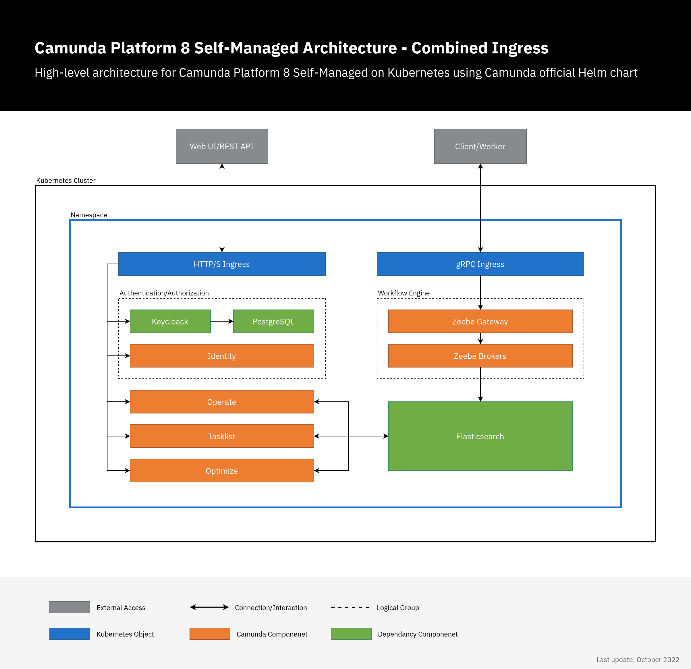
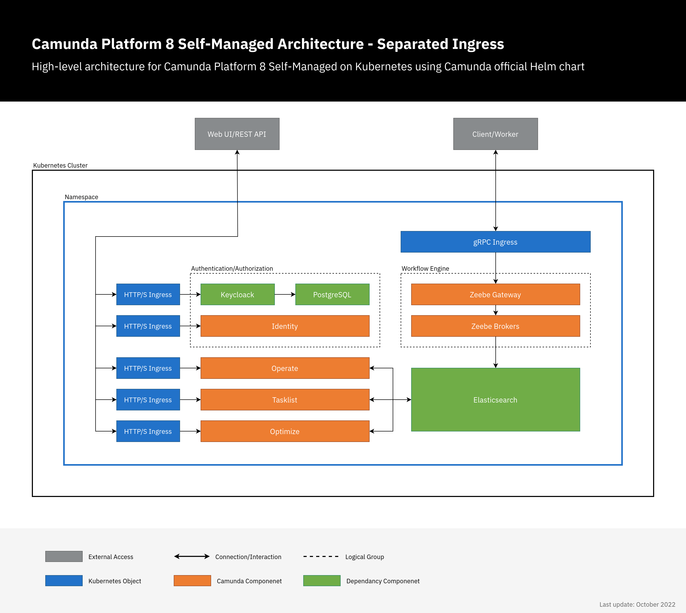

Camunda Platform 8 Self-Managed has multiple web applications and gRPC services. Both can be accessed externally using Ingress. There are two ways to do this:

1. **Combined setup:** In this setup, there are two Ingress objects: one Ingress object for all Camunda Platform 8 web applications using a single domain. Each application has a sub-path e.g. `camunda.example.com/operate`, and `camunda.example.com/optimize` and another Ingress which uses gRPC protocol for Zeebe Gateway e.g. `zeebe.camunda.example.com`.
2. **Separated setup:** In this setup, each component has its own Ingress/host e.g. `operate.camunda.example.com`, `optimize.camunda.example.com`, `zeebe.camunda.example.com`, etc.

There are no significant differences between the two setups. Rather, they both offer flexibility for different workflows.

:::note
Camunda Platform 8 Helm chart doesn't manage or deploy Ingress controllers, it only deploys Ingress objects. Hence, this Ingress setup will not work without Ingress controller running in your cluster.
:::

## Preparation

- An Ingress controller should be deployed in advance. The examples below use `Nginx` Ingress controller, but any Ingress controller could be used by setting `ingress.className`.
- TLS configuration is not handled in the examples because it varies between different workflows. It could be configured directly using `ingress.tls` options or via an external tool like [Cert-Manager](https://github.com/cert-manager/cert-manager) using `ingress.annotations`. For more details, check available [configuration options](https://github.com/camunda/camunda-platform-helm/tree/main/charts/camunda-platform#configuration).

## Combined Ingress setup

In this setup, a single Ingress/domain is used to access Camunda Platform 8 web applications, and another for Zeebe Gateway. By default, all web applications use `/` as a base, so we just need to set the context path, Ingress configuration, and authentication redirect URLs.



```yaml
# Chart values for the Camunda Platform 8 Helm chart in combined Ingress setup.

# This file deliberately contains only the values that differ from the defaults.
# For changes and documentation, use your favorite diff tool to compare it with:
# https://github.com/camunda/camunda-platform-helm/blob/main/charts/camunda-platform

# IMPORTANT: Make sure to change "camunda.example.com" to your domain.

global:
  ingress:
    enabled: true
    className: nginx
    host: "camunda.example.com"
  identity:
    auth:
      publicIssuerUrl: "https://camunda.example.com/auth/realms/camunda-platform"
      operate:
        redirectUrl: "https://camunda.example.com/operate"
      tasklist:
        redirectUrl: "https://camunda.example.com/tasklist"
      optimize:
        redirectUrl: "https://camunda.example.com/optimize"

identity:
  contextPath: "/identity"
  fullURL: "https://camunda.example.com/identity"

operate:
  contextPath: "/operate"

optimize:
  contextPath: "/optimize"

tasklist:
  contextPath: "/tasklist"

zeebe-gateway:
  ingress:
    enabled: true
    className: nginx
    host: "zeebe.camunda.example.com"
```

Using the custom values file, [deploy Camunda Platform 8 as usual](../../helm-kubernetes/deploy.md):

```shell
helm install demo camunda/camunda-platform -f values-combined-ingress.yaml
```

Once deployed, you can access the Camunda Platform 8 components on:

- **Web applications:** `https://camunda.example.com/[identity|operate|optimize|tasklist]`
- **Keycloak authentication:** `https://camunda.example.com/auth`
- **Zeebe Gateway:** `grpc://zeebe.camunda.example.com`

## Separated Ingress setup

In this setup, each Camunda Platform 8 component has its own Ingress/domain. There is no need to set the context since `/` is used as a default base. Here, we just need to set the Ingress configuration and authentication redirect URLs.



```yaml
# Chart values for the Camunda Platform 8 Helm chart in combined Ingress setup.

# This file deliberately contains only the values that differ from the defaults.
# For changes and documentation, use your favorite diff tool to compare it with:
# https://github.com/camunda/camunda-platform-helm/blob/main/charts/camunda-platform

# IMPORTANT: Make sure to change "camunda.example.com" to your domain.

global:
  identity:
    auth:
      publicIssuerUrl: "https://keycloak.camunda.example.com/auth/realms/camunda-platform"
      operate:
        redirectUrl: "https://operate.camunda.example.com"
      tasklist:
        redirectUrl: "https://tasklist.camunda.example.com"
      optimize:
        redirectUrl: "https://optimize.camunda.example.com"

identity:
  ingress:
    enabled: true
    className: nginx
    host: "identity.camunda.example.com"
  fullURL: "https://identity.camunda.example.com"

  keycloak:
    ingress:
      enabled: true
      ingressClassName: nginx
      hostname: "keycloak.camunda.example.com"

operate:
  ingress:
    enabled: true
    className: nginx
    host: "operate.camunda.example.com"

optimize:
  ingress:
    enabled: true
    className: nginx
    host: "optimize.camunda.example.com"

tasklist:
  ingress:
    enabled: true
    className: nginx
    host: "tasklist.camunda.example.com"

zeebe-gateway:
  ingress:
    enabled: true
    className: nginx
    host: "zeebe.camunda.example.com"
```

Using the custom values file, [deploy Camunda Platform 8 as usual](../../helm-kubernetes/deploy.md):

```shell
helm install demo camunda/camunda-platform -f values-separated-ingress.yaml
```

Once deployed, you can access the Camunda Platform 8 components on:

- **Web applications:** `https://[identity|operate|optimize|tasklist].camunda.example.com`
- **Keycloak authentication:** `https://keycloak.camunda.example.com`
- **Zeebe Gateway:** `grpc://zeebe.camunda.example.com`

## Troubleshooting

If something is not working as expected, check the guide for [general deployment troubleshooting](../../troubleshooting.md).
