```mermaid

architecture-beta
    group regions(cloud)["Camunda dual region"]
    group r0(cloud)["Region 0 · eu-west-2"] in regions
    group r1(cloud)["Region 1 · eu-west-3"] in regions
    group aurora_global(logos:aws-rds)["Aurora Global Database"] in regions

    service ingress0(logos:aws-elb)["ALB and NLB ingress"] in r0
    service tasks0(logos:aws-ecs)["ECS Fargate workloads"] in r0
    service s3id0(logos:aws-s3)["S3 broker-ID lease"] in r0
    service s3bk0(logos:aws-s3)["S3 backup repository"] in r0
    service peer0(internet)["Cross-region link"] in r0

    service ingress1(logos:aws-elb)["ALB and NLB ingress"] in r1
    service tasks1(logos:aws-ecs)["ECS Fargate workloads"] in r1
    service s3id1(logos:aws-s3)["S3 broker-ID lease"] in r1
    service s3bk1(logos:aws-s3)["S3 backup repository"] in r1
    service peer1(internet)["Cross-region link"] in r1

    service db_primary(logos:aws-rds)["Primary writer · eu-west-2"] in aurora_global
    service db_secondary(logos:aws-rds)["Secondary reader · eu-west-3"] in aurora_global
    db_primary:R --> L:db_secondary

    ingress0:B -- T:tasks0
    tasks0:L -- R:s3id0
    tasks0:B -- T:s3bk0
    tasks0:R -- L:peer0


    peer0{group}:R <--> L:peer1{group}
    peer0{group}:B --> T:db_primary{group}
    peer1{group}:B --> T:db_secondary{group}

    ingress1:B -- T:tasks1
    tasks1:R -- L:s3id1
    tasks1:B -- T:s3bk1
    tasks1:L -- R:peer1
```

This reference architecture deploys Camunda 8 Self-Managed across two AWS regions on ECS Fargate in an active-active configuration, with Aurora Global Database as secondary storage and Camunda 8.10 unified `/v2/*` REST API.

:::warning Experimental — reference only
This reference architecture is experimental. RDBMS-based dual-region for Camunda 8 is uncharted territory and known limitations apply (see [Known limitations](#known-limitations)). Use it for learning, evaluation, and validation. Do not run production workloads through it without your own hardening, monitoring, and operational testing.
:::

## What you get

The reference architecture creates two identically configured ECS Fargate clusters, one per AWS region, with Zeebe brokers distributed across both regions.

- Active-active deployment across two AWS regions (default `eu-west-2` and `eu-west-3`; pick your own pair).
- Eight Zeebe brokers (four per region) with `cluster_size=8`, `replication_factor=4`, and `partition_count=8`. Asymmetric initial contact points use ECS Service Connect locally and the cross-region NLB for inter-region traffic.
- Aurora Global Database — single writer endpoint per cluster, with the [AWS JDBC Wrapper](https://github.com/aws/aws-advanced-jdbc-wrapper) `failover` plugin enabled for automatic reconnection after a writer change.
- Cross-region connectivity via [AWS Transit Gateway](https://aws.amazon.com/transit-gateway/) (default) or [VPC peering](https://docs.aws.amazon.com/vpc/latest/peering/what-is-vpc-peering.html).
- [Route 53 Resolver](https://docs.aws.amazon.com/Route53/latest/DeveloperGuide/resolver.html) endpoints to forward Cloud Map service-discovery DNS queries across regions.
- Camunda 8.10 or later. The unified Orchestration Cluster `/v2/*` REST API requires Basic authentication; see [Access the deployment](#access-the-deployment).

:::note Active-active scope
Active-active in this guide refers to the Zeebe data plane: one stretched cluster whose brokers and partitions live in both regions, accepting and processing work concurrently from either region. The Aurora-backed secondary storage tier is active-standby — region 0 hosts the writer and region 1 hosts a cross-region reader. Promoting region 1 to writer is an explicit step during failover, not an automatic property of the deployment.
:::



:::warning
Reference architectures provided in this guide are not turnkey modules. Camunda recommends cloning the repository and modifying it locally. You're responsible for operating and maintaining the infrastructure. Camunda updates the reference architecture over time, and changes may not be backward compatible.
:::

## Prerequisites

### AWS permissions

Your AWS IAM principal needs permissions for the following services in both target regions:

- ECS (clusters, task definitions, services)
- RDS (Aurora Global, DB clusters, parameter groups)
- EC2 (VPCs, subnets, security groups, Transit Gateway or VPC peering)
- ELB (ALB, NLB, target groups)
- IAM (roles, policies, instance profiles)
- KMS (key creation and grants)
- S3 (bucket creation and policy)
- EFS (file systems, mount targets)
- CloudWatch Logs (log groups)
- Secrets Manager (secret creation)
- Systems Manager Session Manager (`ssmmessages:*`) — required only for the [Session Manager access path](#method-b--session-manager-port-forward)
- Route 53 Resolver — required only when `enable_cross_region_dns_resolver = true`: `route53resolver:CreateResolverEndpoint`, `route53resolver:CreateResolverRule`, `route53resolver:AssociateResolverRule`

### AWS service quotas

Dual-region deployments may require quota increases. Before deploying, verify the following quotas in both regions and request increases as needed:

- Aurora Global Database (some accounts require a support request to enable Aurora Global).
- Elastic IPs (NAT gateways consume one per AZ per region).
- Transit Gateway attachments (default account limit).
- Fargate vCPU quota per region.
- VPC count per region.

### Tooling

| Tool                     | Purpose                                                                                                                                                                                            |
| ------------------------ | -------------------------------------------------------------------------------------------------------------------------------------------------------------------------------------------------- |
| `terraform`              | Infrastructure provisioning. Pin to the version in [`.tool-versions`](https://github.com/camunda/camunda-deployment-references/blob/main/.tool-versions).                                          |
| `aws` CLI v2             | AWS resource inspection and authentication.                                                                                                                                                        |
| `jq`                     | JSON parsing in verification commands.                                                                                                                                                             |
| `session-manager-plugin` | Required only for the [Session Manager access path](#method-b--session-manager-port-forward). Install with `brew install --cask session-manager-plugin` on macOS or follow the [AWS instructions]. |
| `just` (optional)        | Task runner for common operations in the reference repository.                                                                                                                                     |
| `asdf` (optional)        | Tool version management.                                                                                                                                                                           |

[AWS instructions]: https://docs.aws.amazon.com/systems-manager/latest/userguide/session-manager-working-with-install-plugin.html

Configure valid AWS credentials before starting. The [AWS Terraform provider](https://registry.terraform.io/providers/hashicorp/aws/latest/docs#authentication-and-configuration) supports several authentication methods:

- For development or testing, configure the AWS CLI — Terraform automatically detects and uses those credentials:

  ```bash
  aws configure
  ```

- For production, export credentials as environment variables: `AWS_ACCESS_KEY_ID` and `AWS_SECRET_ACCESS_KEY`.

### Obtain a copy of the reference architecture

Download a copy of the reference architecture from the [GitHub repository](https://github.com/camunda/camunda-deployment-references). The reference architectures are versioned according to Camunda releases (for example, `stable/8.x`). The copy lets you reuse and extend the provided Terraform examples without the constraints of a third-party-maintained module:

```bash reference
https://github.com/camunda/camunda-deployment-references/blob/main/aws/containers/ecs-dual-region-fargate/procedure/get-your-copy.sh
```

With the reference architecture in place, you can proceed with the remaining steps. Make sure you're in the correct directory before continuing.

## Terraform layout

The reference architecture splits infrastructure into three independent state layers. Deploy them in order; each layer reads the previous layer's outputs via `terraform_remote_state`.

```
terraform/
├── vpc/    ← VPCs + cross-region networking. Supports BYO-VPC.
├── infra/  ← Aurora Global, ECS clusters, ALB/NLBs, KMS, S3, secrets, IAM.
└── app/    ← Camunda task definitions + ECS services.
```

| Layer | Directory          | Contents                                                                                      | Change frequency |
| ----- | ------------------ | --------------------------------------------------------------------------------------------- | ---------------- |
| VPC   | `terraform/vpc/`   | VPCs, subnets, NAT gateways, Transit Gateway or VPC peering, optional Route 53 Resolver       | Low              |
| Infra | `terraform/infra/` | Aurora Global Database, ECS clusters, ALB, NLB, KMS, S3, EFS, Secrets Manager, IAM            | Low              |
| App   | `terraform/app/`   | Camunda orchestration cluster and Connectors task definitions, plus the matching ECS services | High             |

By default, the paths between layers are relative:

- `terraform/infra/` reads `../vpc/terraform.tfstate`.
- `terraform/app/` reads `../infra/terraform.tfstate`.

If you use S3 remote backends, override `vpc_state_path` in `terraform/infra/terraform.tfvars` and `infra_state_path` in `terraform/app/terraform.tfvars` to point to the correct S3 URIs.

## Deploy time and cost

Wall-clock time for a greenfield deploy to a first healthy `/v2/topology` response with eight brokers:

| Phase          | Wall clock             | What's slow                                                                                |
| -------------- | ---------------------- | ------------------------------------------------------------------------------------------ |
| `vpc/ apply`   | 3–5 min                | VPC creation plus cross-region peering or Transit Gateway attachment.                      |
| `infra/ apply` | 15–20 min              | Aurora Global Database creation (primary first, then secondary attaches).                  |
| `app/ apply`   | ~30 s plan + 15–20 min | ECS service rollout waits for steady state; first cross-region Raft quorum takes the most. |
| **Total**      | **35–45 min**          |                                                                                            |

`terraform destroy` is faster: about 15–20 minutes end-to-end, with Aurora teardown again the bottleneck.

Rough running cost for the default sizing (four brokers per region, one Connectors task per region, Aurora `db.r6g.large` × 2 instances per region, one NAT gateway per region, two ALBs, four NLBs):

| Component                                               | Approximate cost per day |
| ------------------------------------------------------- | ------------------------ |
| Fargate orchestration cluster (4 vCPU / 8 GB × 8 tasks) | ~$38                     |
| Fargate Connectors (2 vCPU / 4 GB × 2 tasks)            | ~$5                      |
| Aurora Global (`db.r6g.large` × 4 instances)            | ~$28                     |
| 2 × ALB + 4 × NLB                                       | ~$5                      |
| 2 × NAT Gateway (data transfer extra)                   | ~$2                      |
| EFS, S3, Secrets Manager, KMS                           | ~$1                      |
| **Total**                                               | **~$80 per day**         |

These are list-price ballparks for `us-east-1`. Commit discounts, region, idle time, and cross-region data egress all shift the number. Always run `terraform destroy` when you're done with a demo.

## Architecture decisions

Make these decisions before running any `terraform apply`. They affect every layer of the deployment.

### Networking mode

| Option                    | `networking_mode` value | When to use                                                                                                         |
| ------------------------- | ----------------------- | ------------------------------------------------------------------------------------------------------------------- |
| Transit Gateway (default) | `transit_gateway`       | Production, existing TGW deployments, or anticipated future multi-VPC topologies. Incurs hourly and per-GB charges. |
| VPC peering               | `vpc_peering`           | Development or proof-of-concept. Simpler to manage; limited to a direct 1:1 connection between the two regions.     |

:::note
Neither Transit Gateway nor VPC peering encrypts traffic at the network layer. Raft replication between Zeebe brokers crosses the AWS backbone in cleartext unless you add an encryption layer (for example, IPsec on the TGW attachment, or application-layer TLS on the Zeebe broker channel). Regulated workloads should evaluate this before choosing.
:::

### VPC source

| Option     | `byo_vpc` value   | When to use                                                                                                                              |
| ---------- | ----------------- | ---------------------------------------------------------------------------------------------------------------------------------------- |
| Greenfield | `false` (default) | Terraform creates two VPCs, subnets across three availability zones, NAT gateways, internet gateways, and the cross-region link.         |
| BYO-VPC    | `true`            | You supply existing VPCs and subnets. Terraform skips VPC creation but still provisions the cross-region link and optional DNS resolver. |

BYO-VPC is the preferred path for customers integrating with an existing AWS landing zone. Supply the following per region (replace `N` with `0` or `1`):

| Variable                           | Constraint                                                                                     |
| ---------------------------------- | ---------------------------------------------------------------------------------------------- |
| `region_N_vpc_id`                  | Existing VPC ID (`vpc-xxxxxxxx`).                                                              |
| `region_N_vpc_cidr`                | CIDR of the existing VPC.                                                                      |
| `region_N_private_subnet_ids`      | At least three private subnet IDs in distinct AZs (used by ECS tasks and Aurora).              |
| `region_N_public_subnet_ids`       | At least three public subnet IDs in distinct AZs with an internet gateway route (used by ALB). |
| `region_N_private_route_table_ids` | At least one private route table ID per region (for cross-region routes).                      |

The full validation contract — including the plan-time checks that fail with a descriptive error when a constraint is missing — lives in [`terraform/vpc/README.md`](https://github.com/camunda/camunda-deployment-references/blob/main/aws/containers/ecs-dual-region-fargate/terraform/vpc/README.md) in the reference repository.

## Deployment walkthrough

### Step 1 — Configure

Create a `terraform.tfvars` file in each of the three Terraform directories before running `apply`.

#### `terraform/vpc/terraform.tfvars`

Required variables for a greenfield deployment:

```hcl
cluster_name       = "<your-cluster-name>"
aws_profile        = "<your-aws-profile>" # optional; omit when authenticating via AWS_ACCESS_KEY_ID / AWS_SECRET_ACCESS_KEY
region_0           = "<primary-region>"         # for example, eu-west-2
region_1           = "<secondary-region>"       # for example, eu-west-3
networking_mode    = "transit_gateway"          # or "vpc_peering"
region_0_cidr      = "10.192.0.0/16"
region_1_cidr      = "10.202.0.0/16"
single_nat_gateway = false                      # set to true to reduce NAT costs in non-production
```

For BYO-VPC, add:

```hcl
byo_vpc = true

region_0_vpc_id                  = "vpc-<your-vpc-id>"
region_0_vpc_cidr                = "10.192.0.0/16"
region_0_private_subnet_ids      = ["subnet-aaa", "subnet-bbb", "subnet-ccc"]
region_0_public_subnet_ids       = ["subnet-ddd", "subnet-eee", "subnet-fff"]
region_0_private_route_table_ids = ["rtb-xxx"]

region_1_vpc_id                  = "vpc-<your-vpc-id>"
region_1_vpc_cidr                = "10.202.0.0/16"
region_1_private_subnet_ids      = ["subnet-ggg", "subnet-hhh", "subnet-iii"]
region_1_public_subnet_ids       = ["subnet-jjj", "subnet-kkk", "subnet-lll"]
region_1_private_route_table_ids = ["rtb-yyy"]
```

#### `terraform/infra/terraform.tfvars`

:::warning
The infra layer takes the `registry_username` and `registry_password` for `registry.camunda.cloud`. Do not commit `terraform.tfvars` to source control. Add `*.tfvars` to your `.gitignore`, or supply secrets via `TF_VAR_registry_username` / `TF_VAR_registry_password` environment variables or a secrets backend such as HashiCorp Vault.
:::

```hcl
cluster_name           = "<your-cluster-name>"   # must match vpc layer
aws_profile            = "<your-aws-profile>"    # optional; omit when authenticating via env vars
region_0               = "<primary-region>"
region_1               = "<secondary-region>"
s3_force_destroy       = true                    # default; flip to false before running real workloads — see Cleanup
limit_access_to_cidrs  = ["<your-source-cidr>"]  # required; restrict to the CIDR range that should reach the ALB
registry_username      = "<your-registry-user>"  # Camunda registry credentials for registry.camunda.cloud
registry_password      = "<your-registry-pass>"
```

#### `terraform/app/terraform.tfvars`

```hcl
aws_profile      = "<your-aws-profile>" # optional; omit when authenticating via env vars
camunda_image    = "registry.camunda.cloud/camunda/camunda:<camunda-version>"      # 8.10 or later
connectors_image = "camunda/connectors-bundle:<connectors-bundle-version>"          # for example, 8.10.0-alpha2
default_tags     = { Environment = "reference", Team = "<your-team>" }
```

### Step 2 — Deploy VPC

```bash
cd terraform/vpc
terraform init
terraform plan
terraform apply
```

- **Greenfield:** creates two VPCs, six subnets (three private and three public per region), NAT gateways, internet gateways, and the cross-region link. Expect 3–5 minutes.
- **BYO-VPC:** creates only the cross-region link and optional DNS resolver. Expect under 1 minute.

### Step 3 — Deploy infra

```bash
cd ../infra
terraform init
terraform plan
terraform apply
```

This layer creates the Aurora Global Database, ECS clusters, load balancers, KMS keys, S3 buckets, EFS file systems, Secrets Manager secrets, and IAM roles.

:::note
Aurora Global Database creation takes 15–20 minutes. If Terraform reports a timeout, first check the Aurora cluster status in the AWS console or with `aws rds describe-global-clusters` before re-running `terraform apply`. A real failure (quota exceeded, KMS grant failure, IAM permission gap) does not resolve by re-running and will repeat each cycle. Only re-run when the cluster status is `creating` or `available`.
:::

After `apply` completes, a one-time `db_seed` ECS task runs automatically to create an IAM-authenticated `camunda` database user. The orchestration cluster connects to Aurora as this user using its ECS task role (no password). Monitor the seed task in CloudWatch Logs at `/ecs/<cluster_name>-r0-db-seed`. A successful run ends with the task exiting with status code `0`; if the task fails, re-running `terraform apply` re-triggers it.

### Step 4 — Deploy app

```bash
cd ../app
terraform init
terraform plan
terraform apply
```

`terraform apply` itself completes in approximately 30 seconds. The actual wait is ECS reaching steady state and the eight Zeebe brokers forming a Raft quorum, which can take up to 20 minutes on a cold start in a dual-region setup. If the cluster has not stabilized after 30 minutes, treat it as a real failure rather than continued patience and investigate (see below).

:::note
The `wait_for_steady_state` provider timeout may expire before all brokers stabilize. Before concluding success, verify cluster health with two checks:

1. In the ECS console for each region, confirm both the orchestration cluster and Connectors services show **steady state** with the expected running task count (four orchestration tasks per region, one Connectors task per region) and no recent task failures in the **Events** tab.
2. Run the `/v2/topology` check from Step 5 and confirm eight brokers are visible with healthy partitions.

If either check fails, do not proceed to verification. Inspect CloudWatch Logs for the orchestration-cluster log group and the ECS service event stream. The most common causes are image pull failures, IAM or Secrets Manager misconfiguration, and cross-region security group rules blocking ports 26500–26502.
:::

### Step 5 — Verify

Run the helper script from the reference repository to validate that the deployment is healthy in both regions:

```bash
cd ../../  # back to the repo root
./aws/containers/ecs-dual-region-fargate/procedure/verify_dual_region.sh
```

When `enable_cross_region_dns_resolver = true`, also confirm that cross-region service-discovery DNS works:

```bash
./aws/containers/ecs-dual-region-fargate/procedure/test_cross_region_dns.sh
```

To check the cluster yourself, retrieve the admin password and ALB endpoint from the infra layer, then call `/v2/topology` — Camunda 8.10 requires Basic authentication on all `/v2/*` endpoints:

```bash
cd terraform/infra
ALB_R0=$(terraform output -raw region_0_alb_endpoint)
ADMIN_PASS=$(terraform output -raw admin_user_password)
curl -s -u "admin:${ADMIN_PASS}" "http://${ALB_R0}/v2/topology" | jq '.brokers | length'
# Expected: 8 once Raft has settled
```

Confirm the full topology response shows:

- Eight brokers in `brokers`.
- Eight partitions across the cluster.
- `replicationFactor` equal to 4.
- All partition roles are `leader` or `follower` (all lowercase; no `null` entries).
- Zero unhealthy partitions.

Also verify Aurora Global health:

```bash
aws rds describe-global-clusters \
  --query "GlobalClusters[*].{Status:Status,Members:GlobalClusterMembers[*].IsWriter}" \
  --output table
```

The output must show `Status=available` with two members, one writer and one reader.

:::warning
The verification commands use `http://` because TLS is not configured by default. HTTP transmits Basic authentication credentials and process data in cleartext. Before exposing the cluster to any non-trusted network, attach a TLS certificate to the ALB (see [Next steps](#next-steps)) and rerun the verification over `https://`.
:::

### Step 6 — Cleanup

Destroy resources in reverse order to respect layer dependencies:

```bash
cd terraform/app && terraform destroy
cd ../infra && terraform destroy
cd ../vpc && terraform destroy
```

:::warning Cleanup caveat
The reference architecture sets `s3_force_destroy = true` by default so `terraform destroy` removes backup S3 buckets without manual emptying. Flip `s3_force_destroy` to `false` in `terraform/infra/terraform.tfvars` and re-apply the infra layer before running any real workload through the stack. Otherwise, `terraform destroy` will delete backup data permanently.
:::

## Access the deployment

Camunda 8.10 requires Basic authentication on the unified `/v2/*` REST API. Two users are seeded at first boot:

- `admin` — full access; use this user to log into Operate, Tasklist, and other Web UIs.
- `connectors` — used by the Connectors bundle to call the orchestration cluster.

Both passwords are auto-generated (32 random characters) and stored in AWS Secrets Manager. They are not `demo:demo`, matching the single-region ECS Terraform reference.

### Retrieve credentials

The admin password is generated once during the infra layer apply and shared by both regions:

```bash
cd terraform/infra
ADMIN_PASS=$(terraform output -raw admin_user_password)
echo "admin / $ADMIN_PASS"
```

The Connectors password is also stored in Secrets Manager. Retrieve it with the AWS CLI:

```bash
SECRET_ARN=$(terraform output -raw connectors_password_secret_region_0_arn)
CONNECTORS_PASS=$(aws secretsmanager get-secret-value \
  --secret-id "$SECRET_ARN" \
  --query SecretString --output text)
```

You can also locate the secrets in the AWS console at **Secrets Manager > `<cluster_name>-r0-oc-admin-user-password-*`**.

### Method A — direct via ALB

Use the ALB when your source IP is in `limit_access_to_cidrs`. This is the easiest path for an internet-facing demo.

```bash
ALB_R0=$(terraform output -raw region_0_alb_endpoint)

# Topology (auth required on 8.10+)
curl -s -u "admin:${ADMIN_PASS}" "http://${ALB_R0}/v2/topology" | jq '.brokers | length'
# Expected: 8 (four brokers per region once Raft has settled)

# Open Operate in a browser
open "http://${ALB_R0}/operate"
```

If `limit_access_to_cidrs` is restricted to a corporate CIDR your laptop is not in, use [Method B](#method-b--session-manager-port-forward).

### Method B — Session Manager port-forward

Use this method when the ALB is not reachable from your machine — for example, a private deployment, a locked-down CIDR allow-list, or a customer audit requirement that forbids opening a public endpoint. The session piggybacks on the ECS Exec channel; no bastion host is needed.

Requirements:

- `task_enable_execute_command = true` on the orchestration cluster module. The reference architecture sets this to `true` by default — see [`terraform/app/camunda.tf`](https://github.com/camunda/camunda-deployment-references/blob/main/aws/containers/ecs-dual-region-fargate/terraform/app/camunda.tf).
- The task IAM role must allow `ssmmessages:CreateControlChannel`, `ssmmessages:CreateDataChannel`, `ssmmessages:OpenControlChannel`, and `ssmmessages:OpenDataChannel`. The `ecs_exec_policy` in the orchestration-cluster module already grants these.
- [AWS Session Manager plugin](https://docs.aws.amazon.com/systems-manager/latest/userguide/session-manager-working-with-install-plugin.html) installed locally (`brew install --cask session-manager-plugin` on macOS).

Start the port-forwarding session:

```bash
# 1. Pick a running orchestration-cluster task in region 0
CLUSTER=$(cd terraform/infra && terraform output -raw cluster_name)
TASK_ARN=$(aws ecs list-tasks \
  --cluster "${CLUSTER}-r0-cluster" \
  --service-name "${CLUSTER}-r0-oc-orchestration-cluster" \
  --query 'taskArns[0]' --output text)
TASK_ID=${TASK_ARN##*/}

# 2. Resolve the ECS-managed runtime ID (Session Manager target)
RUNTIME_ID=$(aws ecs describe-tasks \
  --cluster "${CLUSTER}-r0-cluster" \
  --tasks "$TASK_ID" \
  --query 'tasks[0].containers[?name==`orchestration-cluster`].runtimeId' \
  --output text)

# 3. Start a port-forwarding session: localhost:8080 → container 8080
aws ssm start-session \
  --target "ecs:${CLUSTER}-r0-cluster_${TASK_ID}_${RUNTIME_ID}" \
  --document-name AWS-StartPortForwardingSession \
  --parameters '{"portNumber":["8080"],"localPortNumber":["8080"]}'
```

In another shell, open the UI and log in as `admin` with `$ADMIN_PASS`:

```bash
open http://localhost:8080
```

### Endpoint reference

| Endpoint                  | Port  | Protocol | Purpose                                                 |
| ------------------------- | ----- | -------- | ------------------------------------------------------- |
| ALB (region 0/1)          | 80    | HTTP     | Camunda REST API and Web UI (routes to container 8080). |
| ALB (region 0/1)          | 9600  | HTTP     | Management and metrics.                                 |
| NLB external (region 0/1) | 26500 | TCP      | Zeebe gRPC for clients.                                 |
| NLB internal (region 0/1) | 26502 | TCP      | Zeebe Raft, cross-region, private.                      |

## Failover and failback

The reference repository ships helper scripts under `aws/containers/ecs-dual-region-fargate/procedure/`:

```bash
# Planned switchover to region 1
./procedure/failover.sh

# Unplanned promote-detach to region 1
./procedure/failover.sh --unplanned

# Failback to region 0
./procedure/failback.sh

# Failback and also switch the Aurora writer back to region 0
./procedure/failback.sh --switch-writer
```

Read the scripts in the reference repository for the exact actions and prerequisites. Failover is manual — no automated health-check-driven promotion is included.

## Known limitations

- **No Identity / Keycloak.** Authentication is Basic authentication only. There is no Single Sign-On integration in this reference.
- **No Optimize.** RDBMS secondary storage does not yet support Optimize.
- **No Web Modeler or Console.** Neither is included in the reference architecture.
- **Node ID assignment.** Even/odd broker ID assignment per region is pending follow-up work.
- **Manual failover only.** No automated health-check-driven failover is included.

## Next steps

After you have a working dual-region deployment, consider the following:

- [Connect to an identity provider](/self-managed/components/orchestration-cluster/admin/connect-external-identity-provider.md) to integrate with an external identity system.
- Add TLS by attaching an [AWS Certificate Manager (ACM) certificate](https://docs.aws.amazon.com/elasticloadbalancing/latest/application/create-https-listener.html) to the Application Load Balancers.
- Review the [dual-region concept documentation](/self-managed/concepts/multi-region/dual-region.md) for current limitations and operational considerations.
- Browse the [single-region ECS Fargate guide](/self-managed/deployment/containers/cloud-providers/amazon/aws-ecs.md) for a comparison with the simpler single-region pattern.
