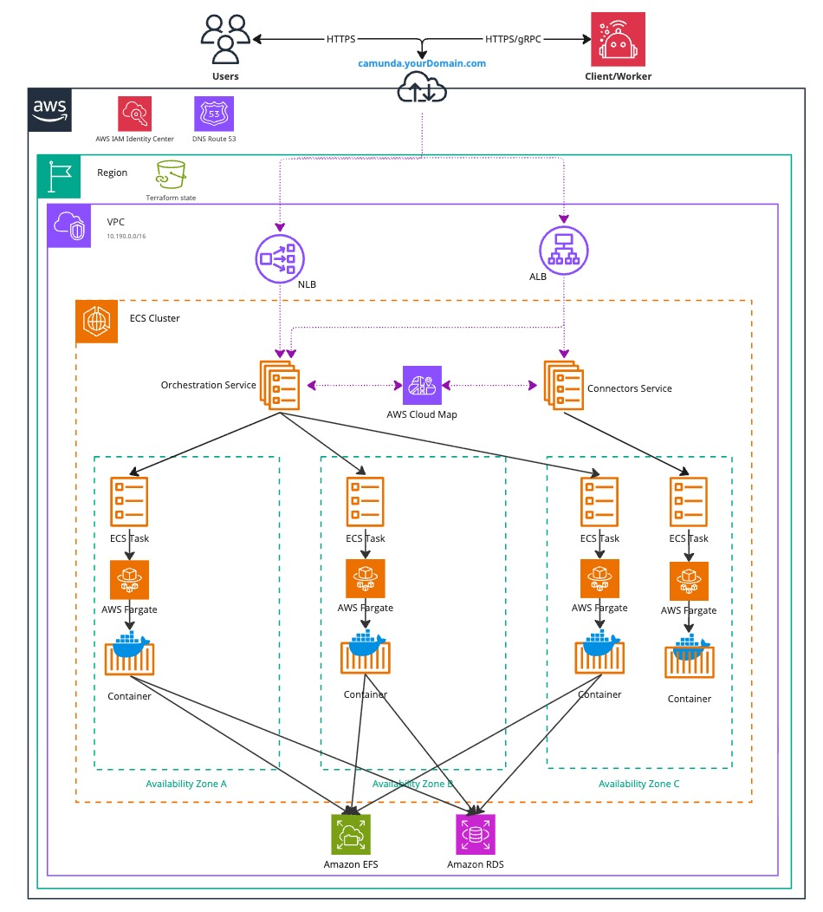

This reference architecture describes how to deploy Camunda 8 Self-Managed with containers. This deployment method is ideal for users who want a portable, consistent runtime and the benefits of containerization without managing Kubernetes.

## Key features

- **Environment isolation:** Each container runs in its own isolated environment. This helps prevent conflicts between applications and improves security.
- **Scalability:** You can scale containers up or down to handle varying workloads. This provides flexibility in resource management.

## Reference implementations

This section includes the following reference architectures:

- [Amazon ECS](../deployment/containers/cloud-providers/amazon/aws-ecs.md): A fully functioning Camunda Orchestration Cluster deployed in a high-availability setup using Amazon Elastic Container Service (ECS), AWS Fargate, and a managed Amazon Aurora PostgreSQL instance.

## Amazon ECS Architecture

The architecture outlined below describes a standard Zeebe three-node deployment, distributed across three [Availability Zones](https://aws.amazon.com/about-aws/global-infrastructure/regions_az/) within a single AWS region. It includes a managed Aurora PostgreSQL instance deployed under the same conditions. This approach ensures high availability and redundancy in case of a zone failure.

_Infrastructure diagram for the Orchestration Cluster ECS architecture (click the image to view the PDF version)._

For more information, see [Amazon ECS on AWS](../deployment/containers/cloud-providers/amazon/aws-ecs.md#architecture).
