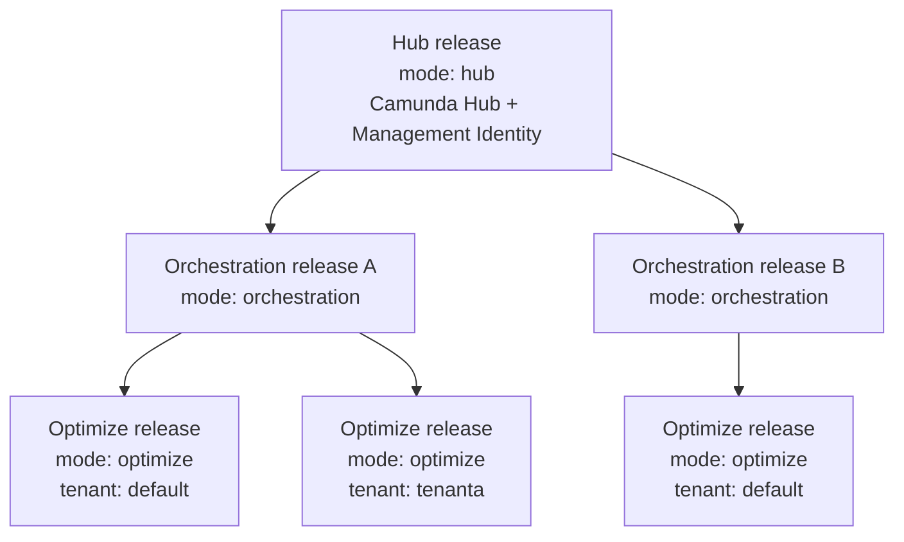

Camunda 8.10 Self-Managed is deployed as a management plane and one or more execution planes, each installed as its own Helm release.

A single Helm chart still produces every component. What changed in 8.10 is that you choose the _role_ each release plays in the wider deployment, using `global.topology.mode`. One management release running Camunda Hub can serve many independently deployed Orchestration Clusters, and each cluster can host several [Physical Tenants](/self-managed/concepts/multi-tenancy/physical-tenants.md), each with its own Optimize release.

For the mechanics of installing this topology, see [install the deployment topology](/self-managed/deployment/helm/install/topology/index.md).

## Release roles

`global.topology.mode` selects what a release deploys and what it must be told about the rest of the deployment.

| Role            | Chart versions | Deploys                                  | Key requirements                                                                                                                                                                                                                                                                                                  |
| --------------- | -------------- | ---------------------------------------- | ----------------------------------------------------------------------------------------------------------------------------------------------------------------------------------------------------------------------------------------------------------------------------------------------------------------- |
| `hub`           | 8.10 only      | Camunda Hub and Management Identity      | `identity.enabled: true`, OIDC authentication, and it's the only release that declares `global.topology.clusters`                                                                                                                                                                                                 |
| `orchestration` | 8.7 and later  | One Orchestration Cluster and Connectors | `global.identity.auth.enabled: true`, `identity.enabled: false`, a reachable `global.identity.service.url`, and the workload enabled. Requirements differ by chart version, see [per-version requirements](/self-managed/deployment/helm/install/topology/orchestration-release.md#requirements-by-chart-version) |
| `optimize`      | 8.10 only      | Optimize only                            | `optimize.enabled: true`, `global.noSecondaryStorage: false`, an enabled Elasticsearch or OpenSearch backend with a non-empty host, an OIDC issuer, a reachable Management Identity URL, and `optimize.contextPath` when the chart renders this release's routing                                                 |
| `combined`      | 8.7 and later  | Every enabled component in one release   | None beyond normal component configuration. This is the default                                                                                                                                                                                                                                                   |

Camunda Hub and its cluster inventory exist only in the 8.10 chart, so `hub` and `optimize` are 8.10-only roles. The 8.7, 8.8, and 8.9 charts support `combined` and `orchestration` only.

The chart validates these requirements at render time and fails with a `[camunda][error]` message naming the missing value, so a misconfigured topology doesn't reach the cluster.

## How the planes fit together

One Hub release serves any number of Orchestration Clusters. Each cluster hosts one or more Physical Tenants, and each tenant is served by exactly one Optimize release.

Optimize is one-to-one with a Physical Tenant because it reads exported records from a single index prefix. A tenant without its own Optimize release has no analytics; an Optimize release pointed at two tenants reads only one of them.

The default Physical Tenant counts. Every Orchestration Cluster has one, created at provisioning time, and it needs its own Optimize release like any other tenant.

## Mix Orchestration Cluster versions under one Hub

An 8.10 Hub release manages Orchestration Cluster releases on the 8.7, 8.8, 8.9, and 8.10 charts. Each cluster deploys from its own chart and its own values, so clusters upgrade independently of the Hub and of each other.

| Orchestration chart | Role to set     | Cluster record needs                                |
| :------------------ | :-------------- | :-------------------------------------------------- |
| 8.10                | `orchestration` | The standard record                                 |
| 8.9                 | `orchestration` | The standard record                                 |
| 8.8                 | `orchestration` | The standard record                                 |
| 8.7                 | `orchestration` | `architecture: legacy` and the legacy service names |

Chart 8.7 predates the unified Orchestration Cluster, so it runs Zeebe, Zeebe Gateway, Operate, and Tasklist as separate workloads. Its Hub cluster record must set `architecture: legacy`, which makes the Hub inventory address those split services and omit the Orchestration Admin component. See [describe a chart 8.7 cluster](/self-managed/deployment/helm/install/topology/hub-release.md#describe-a-chart-87-cluster).

The Hub release always owns registration, clients, permissions, and inventory, whatever chart version a cluster runs. The older charts can't own any of that, because Camunda Hub doesn't exist in them.

Camunda tests one 8.10 Hub release against 8.10, 8.9, 8.8, and 8.7 orchestration releases in a single deployment.

## Why the topology is split

- **Independent cluster lifecycle.** Each Orchestration Cluster is deployed, scaled, upgraded, and removed on its own schedule, without declaring its sibling clusters or duplicating their configuration.
- **One authoritative inventory.** Management Identity registration and Camunda Hub's cluster list both derive from the same `global.topology.clusters` records, so client IDs, audiences, roles, and endpoints can't drift apart.
- **Tenant-level isolation.** Physical Tenants give each team separate data storage and independent backup and restore within one cluster, and each tenant's Optimize gets its own OIDC client and resource server.
- **Declarative operation.** Topology renders from values alone, with no cluster discovery, so Helm, Argo CD, and Flux all produce the same resources.

### What the split does not give you

- **Hub is single-region.** Multi-region guidance applies to the Orchestration Cluster only.
- **Physical Tenants share compute.** Tenants have isolated data and independent management, but they share the cluster's brokers and gateways, so runtime interference is reduced rather than eliminated. See [what is not isolated](/self-managed/concepts/multi-tenancy/physical-tenants.md).
- **Identity reconciliation is additive.** Removing a cluster or tenant record doesn't delete its external client, resource server, permissions, or role. Inventory and clean those objects yourself, after the releases that used them have stopped.
- **Authentication isolation isn't storage isolation.** Separate OIDC credentials per cluster and tenant do nothing to separate shared Elasticsearch or OpenSearch data. Index prefixes do that, and they're your responsibility. See [configure Physical Tenants across releases](/self-managed/deployment/helm/install/topology/physical-tenants.md).
- **Scale limits are undefined.** Supported cluster and tenant counts haven't been established. Validate your own target scale before committing to it.

## What the chart does not own

The chart deploys workloads and wires them to the endpoints you give it. Everything below is yours to provide, and every URL you configure must be reachable from the release that uses it.

| Concern                                                        | Owner                                      |
| -------------------------------------------------------------- | ------------------------------------------ |
| OIDC provider, its clients, and its pinned issuer              | You                                        |
| Cross-namespace and cross-cluster DNS, routing, and TLS trust  | You                                        |
| NetworkPolicies and firewall rules                             | You                                        |
| Management Identity and Camunda Hub relational databases       | You                                        |
| Orchestration Cluster and Optimize secondary storage           | You                                        |
| Index retention and deletion, including after a Helm uninstall | You                                        |
| Kubernetes workloads, services, secrets wiring, and volumes    | The chart                                  |
| Management Identity presets and Camunda Hub cluster inventory  | The chart, from `global.topology.clusters` |

Camunda 8.10 bundles no Elasticsearch, PostgreSQL, or Keycloak subcharts. Provision these before you install. See [deploy required dependencies](/self-managed/deployment/helm/configure/operator-based-infrastructure.md).

## Choose your topology

| Your situation                                            | Use                                                                                                                                                                             |
| --------------------------------------------------------- | ------------------------------------------------------------------------------------------------------------------------------------------------------------------------------- |
| Evaluating Camunda, or developing locally                 | A `combined` release. See [quick developer install](/self-managed/deployment/helm/install/quick-install.md)                                                                     |
| A new production deployment, one cluster                  | A `hub` release plus one `orchestration` release. See [install the deployment topology](/self-managed/deployment/helm/install/topology/index.md)                                |
| A new production deployment, several clusters or tenants  | The same, plus one `optimize` release per Physical Tenant. See [configure Physical Tenants across releases](/self-managed/deployment/helm/install/topology/physical-tenants.md) |
| Upgrading an existing 8.9 deployment                      | Upgrade in place first, staying on `combined`. See [upgrade Camunda 8.9 to 8.10 using Helm](/self-managed/upgrade/helm/890-to-8100.md)                                          |
| Moving an existing combined release to the split topology | See [move from a combined release to the split topology](/self-managed/upgrade/helm/combined-to-split-topology.md)                                                              |

A `combined` release remains supported, and remains the default. It's the right choice for evaluation, proofs of concept, and 8.9 compatibility. For a new production deployment, the split topology is the baseline.
