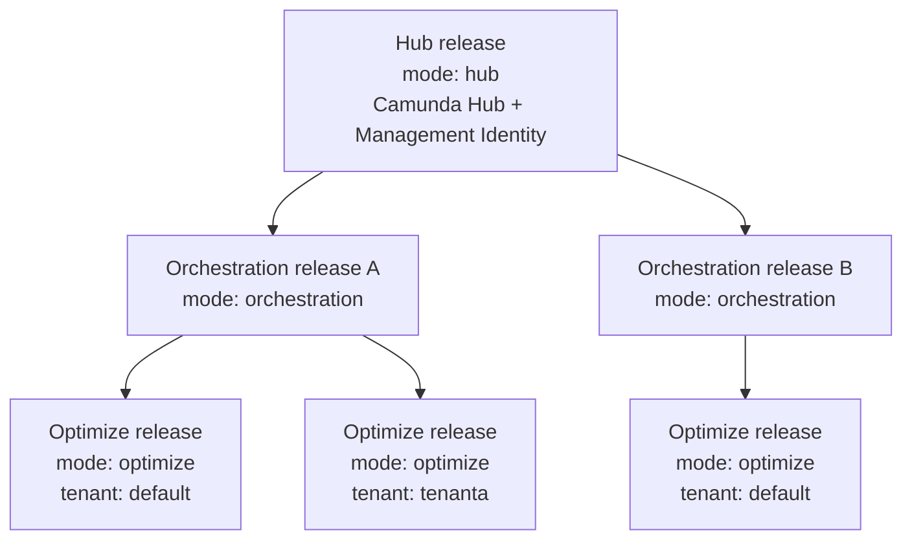

Camunda 8.10 Self-Managed is deployed as a Hub plane and one or more execution planes, each installed as its own Helm release.

A single Helm chart still produces every component. What changed in 8.10 is that you choose the _role_ each release plays in the wider deployment, using `global.topology.mode`. One Hub release running Camunda Hub can serve many independently deployed Orchestration Clusters, and each cluster can host several [Physical Tenants](/self-managed/concepts/multi-tenancy/physical-tenants.md), each with its own Optimize release.

For the mechanics of installing this topology, see [install the deployment topology](/self-managed/deployment/helm/install/topology/index.md).

## Release roles

`global.topology.mode` selects what a release deploys and what it must be told about the rest of the deployment.

For the minimum Helm chart version of each role, see [minimum chart versions](/self-managed/deployment/helm/install/topology/index.md#minimum-chart-versions).

### Role requirements

| Role            | Chart versions                                                 | Deploys                                                                                                                                                                                                                               | Key requirements                                                                                                                                                                                                                                                                                                  |
| --------------- | -------------------------------------------------------------- | ------------------------------------------------------------------------------------------------------------------------------------------------------------------------------------------------------------------------------------- | ----------------------------------------------------------------------------------------------------------------------------------------------------------------------------------------------------------------------------------------------------------------------------------------------------------------- |
| `hub`           | 8.10 (15.0.0+)                                                 | Camunda Hub and Management Identity                                                                                                                                                                                                   | `identity.enabled: true`, OIDC authentication, and it's the only release that declares `global.topology.clusters`                                                                                                                                                                                                 |
| `orchestration` | 8.10 (15.0.0+), 8.9 (14.11.0+), 8.8 (13.14.0+), 8.7 (12.14.0+) | 8.10 and 8.9: one Orchestration Cluster and Connectors. 8.8: the same, plus the chart's default bundled Elasticsearch. 8.7: Zeebe, Zeebe Gateway, Operate, Tasklist, Optimize, and Connectors, plus the default bundled Elasticsearch | `global.identity.auth.enabled: true`, `identity.enabled: false`, a reachable `global.identity.service.url`, and the workload enabled. Requirements differ by chart version, see [per-version requirements](/self-managed/deployment/helm/install/topology/orchestration-release.md#requirements-by-chart-version) |
| `optimize`      | 8.10 (15.0.0+)                                                 | Optimize only                                                                                                                                                                                                                         | `optimize.enabled: true`, `global.noSecondaryStorage: false`, an enabled Elasticsearch or OpenSearch backend with a non-empty host, an OIDC issuer, a reachable Management Identity URL, and `optimize.contextPath` when the chart renders this release's routing                                                 |
| `combined`      | All. This is the behavior of charts without `global.topology`  | Every enabled component in one release                                                                                                                                                                                                | None beyond normal component configuration. This is the default                                                                                                                                                                                                                                                   |

Camunda Hub and its cluster inventory exist only in the 8.10 chart, so `hub` and `optimize` are 8.10-only roles. The 8.7, 8.8, and 8.9 charts support `combined` and `orchestration` only, from the minimum versions above. Earlier versions of those charts have no `global.topology` key: they always behave as `combined`, and setting `orchestration` on them has no effect and produces no error.

A chart 8.7 orchestration release still runs Optimize in-release, so it doesn't follow the one-Optimize-release-per-tenant model.

The chart validates some of these requirements at render time. It fails with a `[camunda][error]` message that names the missing value. It doesn't validate all of them:

- For a `hub` release, the chart enforces `identity.enabled: true` and OIDC authentication. It doesn't check that `global.topology.clusters` is set. Without clusters, Camunda Hub lists no Orchestration Clusters.
- For an `orchestration` release, the chart enforces `global.identity.auth.enabled: true`, `identity.enabled: false`, and the enabled workload. The 8.7, 8.8, and 8.9 charts also enforce a non-empty `global.identity.service.url`. The 8.10 chart doesn't.

Requirements that the chart doesn't enforce are still requirements. Review them before you install.

## How the planes fit together

One Hub release serves any number of Orchestration Clusters. Each cluster hosts one or more Physical Tenants, and each tenant is served by exactly one Optimize release.

```mermaid
graph TD
    Hub["Hub release<br/>mode: hub<br/>Camunda Hub + Management Identity"]
    OCA["Orchestration release A<br/>mode: orchestration"]
    OCB["Orchestration release B<br/>mode: orchestration"]
    OptA1["Optimize release<br/>mode: optimize<br/>tenant: default"]
    OptA2["Optimize release<br/>mode: optimize<br/>tenant: tenanta"]
    OptB1["Optimize release<br/>mode: optimize<br/>tenant: default"]

    Hub --> OCA
    Hub --> OCB
    OCA --> OptA1
    OCA --> OptA2
    OCB --> OptB1
```

Each Physical Tenant, including the default tenant, needs its own Optimize release. See [why Optimize is its own release](/self-managed/deployment/helm/install/topology/optimize-release.md#why-optimize-is-its-own-release).

## Mix Orchestration Cluster versions under one Hub

An 8.10 Hub release manages Orchestration Cluster releases on the 8.7, 8.8, 8.9, and 8.10 charts. Each cluster deploys from its own chart and its own values, so clusters upgrade independently of the Hub and of each other.

| Orchestration chart | Role to set     | Cluster record needs                                |
| :------------------ | :-------------- | :-------------------------------------------------- |
| 8.10                | `orchestration` | The standard record                                 |
| 8.9                 | `orchestration` | The standard record                                 |
| 8.8                 | `orchestration` | The standard record                                 |
| 8.7                 | `orchestration` | `architecture: legacy` and the legacy service names |

Chart 8.7 predates the unified Orchestration Cluster, so it runs Zeebe, Zeebe Gateway, Operate, and Tasklist as separate workloads. Its Hub cluster record must set `architecture: legacy`, which makes the Hub inventory address those split services and omit the Orchestration Admin component. See [describe a chart 8.7 cluster](/self-managed/deployment/helm/install/topology/hub-release.md#describe-a-chart-87-cluster).

The Hub release always owns registration, clients, permissions, and inventory, whatever chart version a cluster runs. The older charts can't own any of that, because Camunda Hub doesn't exist in them.

## Why the topology is split

- **Independent cluster lifecycle.** Each Orchestration Cluster is deployed, scaled, upgraded, and removed on its own schedule, without declaring its sibling clusters or duplicating their configuration.
- **One authoritative inventory.** Management Identity registration and Camunda Hub's cluster list both derive from the same `global.topology.clusters` records, so client IDs, audiences, roles, and endpoints can't drift apart.
- **Tenant-level isolation.** Physical Tenants give each team separate data storage and independent backup and restore within one cluster, and each tenant's Optimize gets its own OIDC client and resource server.
- **Declarative operation.** Topology renders from values alone, with no cluster discovery, so Helm, Argo CD, and Flux all produce the same resources.

### What the split does not give you

- **Hub is single-region.** Multi-region guidance applies to the Orchestration Cluster only.
- **Physical Tenants share compute.** Tenants have isolated data and independent management, but they share the cluster's brokers and gateways, so runtime interference is reduced rather than eliminated. See [what is not isolated](/self-managed/concepts/multi-tenancy/physical-tenants.md).
- **Identity reconciliation is additive.** Removing a cluster or tenant record doesn't delete its external client, resource server, permissions, or role. Inventory and clean those objects yourself, after the releases that used them have stopped.
- **Authentication isolation isn't storage isolation.** Separate OIDC credentials per cluster and tenant do nothing to separate shared Elasticsearch or OpenSearch data. Index prefixes do that, and they're your responsibility. See [configure Physical Tenants across releases](/self-managed/deployment/helm/install/topology/physical-tenants.md).
- **Scale limits are undefined.** Supported cluster and tenant counts haven't been established. Validate your own target scale before committing to it.

## Choose your topology

To choose a topology for your situation, see [choose your topology](/self-managed/deployment/helm/install/index.md#choose-your-topology).
