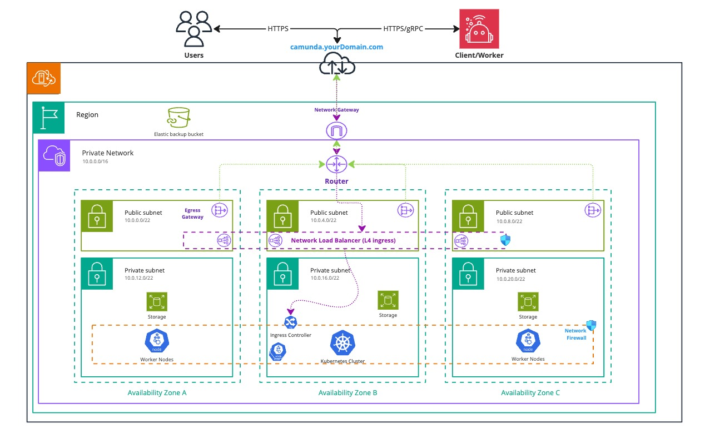
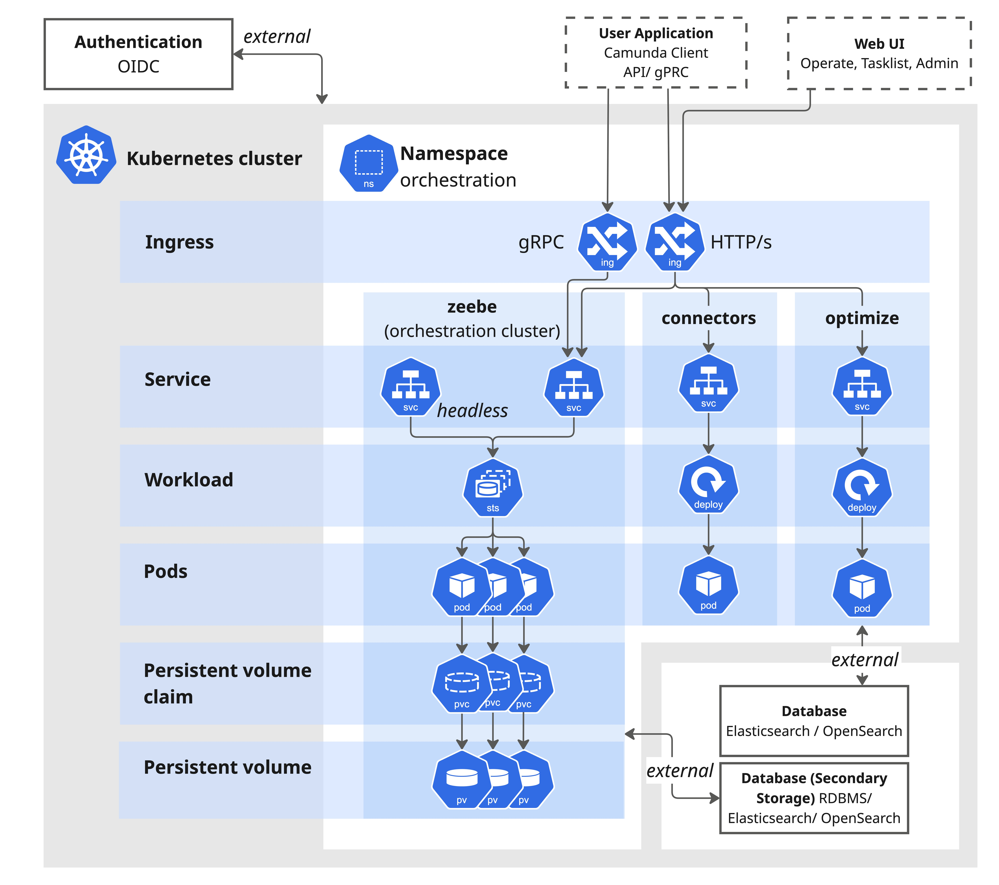
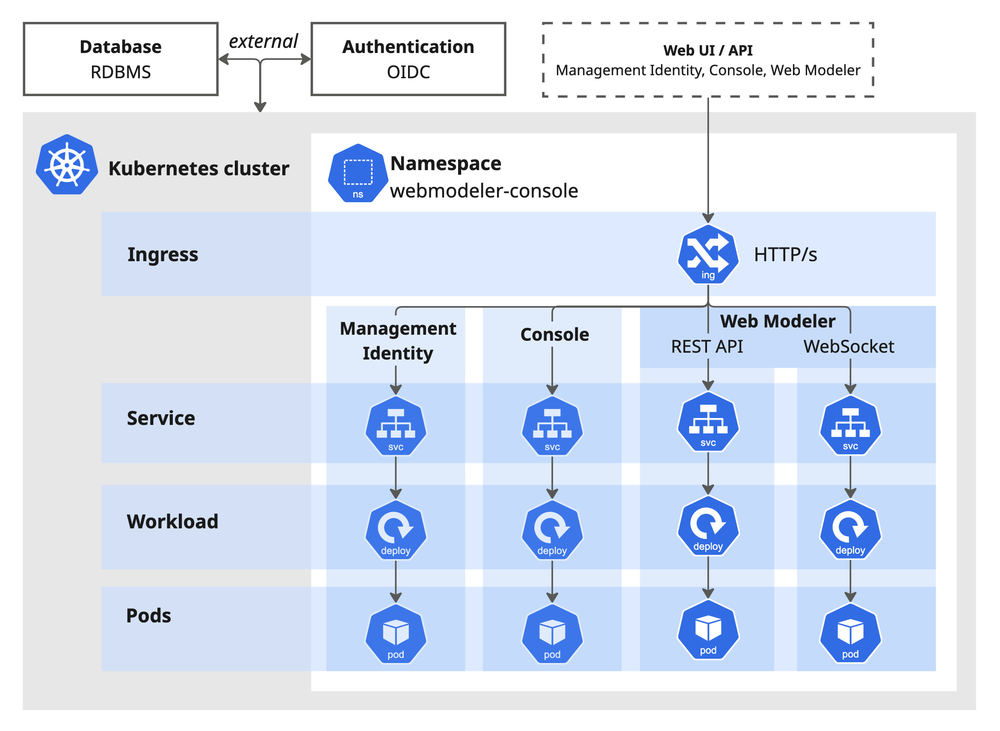

This reference architecture provides guidance for deploying Camunda 8 Self-Managed within a Kubernetes cluster. This deployment method is ideal for users who want to leverage the benefits of containerization and self-healing. It supports quick scalability and offers increased resilience through multi-zone deployments.

## Key features

- **Scalability & high availability**: Camunda 8 can scale dynamically to meet demand and supports high-availability configurations.
- **Fault tolerance & resilience**: Deploy Camunda 8 across availability zones or regions to improve fault tolerance and increase uptime for your workflows.

While Kubernetes introduces a steeper learning curve, once configured properly it provides significant benefits—such as self-healing capabilities that automatically restart failed containers and reschedule workloads to maintain availability.

Kubernetes also benefits from a robust ecosystem of [**Cloud Native Computing Foundation (CNCF) projects**](https://www.cncf.io/), enabling seamless integration with tools for monitoring, observability, logging, and security. Solutions like [Prometheus](https://prometheus.io/) and [Grafana](https://grafana.com/) offer comprehensive monitoring, while service meshes like [Istio](https://istio.io/) enhance traffic management and security.

By leveraging this ecosystem, organizations can extend Kubernetes to fit specific operational needs—improving automation, scalability, and visibility across their infrastructure.

## Reference implementations

This section includes reference deployment architectures:

### Amazon EKS

- [Amazon EKS single-region](/self-managed/installation-methods/helm/cloud-providers/amazon/amazon-eks/terraform-setup.md): Standard production setup.
- [Amazon EKS dual-region](/self-managed/installation-methods/helm/cloud-providers/amazon/amazon-eks/dual-region.md): Advanced multi-region setup.

### Red Hat OpenShift on AWS (ROSA)

- [ROSA single-region](/self-managed/installation-methods/helm/cloud-providers/amazon/openshift/terraform-setup.md): Standard production setup.
- [ROSA dual-region](/self-managed/installation-methods/helm/cloud-providers/amazon/openshift/terraform-setup-dual-region.md): Advanced multi-region setup.

### Microsoft Azure

- [Microsoft AKS single-region](/self-managed/installation-methods/helm/cloud-providers/azure/microsoft-aks/terraform-setup.md): Standard production setup.

For common issues and mitigation strategies, refer to the [deployment troubleshooting guide](/self-managed/operational-guides/troubleshooting.md).

## Architecture

_Infrastructure diagram for a single region setup (click on the image to open the PDF version):_
[](./img/k8s-single.pdf)

This Kubernetes architecture illustrates a high-availability setup across multiple availability zones (A, B, and C), with key networking components to ensure scalability, security, and reliability. We recommend using multiple availability zones to improve fault tolerance and eliminate single points of failure.

To control access, deploy Camunda 8 in a private subnet and manage inbound traffic using an Ingress and Load Balancer.

:::note
The database is not shown in the diagram. It should be hosted outside the Kubernetes cluster, ideally within the same private network or subnet. Many organizations use a dedicated external database setup with tightly controlled access.
:::

### Kubernetes

:::note
The [reference architecture overview](/self-managed/reference-architecture/reference-architecture.md#orchestration-cluster-vs-web-modeler-and-console) explains the distinction between the Orchestration Cluster and Web Modeler and Console, including details on how they communicate.
:::

A [multi-namespace deployment](/self-managed/installation-methods/helm/configure/multi-namespace-deployment.md) is recommended. For details on individual components, see the [components section](#components).

The following visuals provide a simplified view of the deployed namespaces using the [Camunda 8 Helm chart](/self-managed/installation-methods/helm/install.md). For clarity, ConfigMaps, Secrets, RBAC, and ReplicaSets are omitted.

#### Orchestration Cluster



The Helm chart uses a single Ingress by default, enabling a unified domain with each application accessible via a dedicated path.

Most Camunda 8 components are stateless and deployed as **Deployments**. However, the Orchestration Cluster contains Zeebe brokers, which require a **StatefulSet** to maintain consistent volume mounts. This ensures stable pod ordering and identifiers. StatefulSet names remain consistent even as they represent the entire Orchestration Cluster—simplifying migration from existing setups.

The Orchestration Cluster exposes two services:

1. A [**headless service**](https://kubernetes.io/docs/concepts/services-networking/service/#headless-services) for internal communication between Zeebe brokers. This service skips load balancing and resolves to pod IPs for direct peer-to-peer communication.

2. A **standard service** for external applications. This service distributes traffic randomly (via `kube-proxy`) and is suitable for clients or other services connecting to the cluster.

#### Web Modeler and Console



Web Modeler, Console, and Management Identity are stateless and deployed as **Deployments**, with data stored in an external SQL database. This makes them easy to scale as needed.

Each namespace uses its own Ingress, as Ingress resources are namespace-scoped (not cluster-wide). This requires separate subdomains for each Ingress. For more details, see the [multi-namespace deployment guide](/self-managed/installation-methods/helm/configure/multi-namespace-deployment.md).

### High availability (HA)

:::caution Non-HA importer / archiver
This applies to **Optimize**:

When scaling from a single pod to multiple pods, ensure that the `importer / archiver` is enabled on only one pod. Enabling it on more than one pod may cause data inconsistencies. This is a known limitation and will be addressed in a future update.

See the [Optimize system configuration guide](/self-managed/components/optimize/configuration/system-configuration-platform-8.md#general-settings) for example settings.
:::

For high availability, we recommend a minimum of **four Kubernetes nodes** to ensure fault tolerance and support leader election. This is especially important when using the [Raft protocol](<https://en.wikipedia.org/wiki/Raft_(algorithm)>) for consensus within the Orchestration Cluster. For more details, refer to the [clustering documentation](/components/zeebe/technical-concepts/clustering.md).

While Deployments and StatefulSets in Kubernetes can scale independently of physical hardware, four nodes are typically required to support:

- The default three-node Orchestration Cluster
- Other Camunda 8 components (e.g., Web Modeler, Identity, Tasklist)

Depending on your specific use case, you may need to scale **horizontally** (more nodes) or **vertically** (larger nodes) to meet resource requirements.

By default, node affinity rules prevent all Orchestration Cluster pods from being scheduled on the same node. This requires at least three nodes for proper operation. For details, see the [Kubernetes node affinity documentation](https://kubernetes.io/docs/concepts/scheduling-eviction/assign-pod-node/).

To further improve fault tolerance, distribute the Orchestration Cluster and other components across **multiple availability zones**. Use affinity and anti-affinity rules to ensure workloads remain available even if a zone fails.

### Components

Camunda 8 deployments typically separate workloads into two logical groups:

- **Orchestration Cluster**
- **Web Modeler and Console**

We recommend deploying these groups into separate [Kubernetes namespaces](https://kubernetes.io/docs/concepts/overview/working-with-objects/namespaces/). This separation supports multi-tenancy, improves isolation, and allows flexible scaling. However, deploying all components in a single namespace is also possible for smaller environments.

A **multi-namespace setup** enables:

- Independent scaling of Orchestration Clusters based on workload
- Shared access to centralized components (e.g., Management Identity)

#### Orchestration Cluster namespace

As shown in the [architecture diagram](#orchestration-cluster), the Orchestration Cluster is deployed as a StatefulSet and packaged as a single container image. It includes the following components:

- [Zeebe](/components/zeebe/zeebe-overview.md) — workflow engine and broker
- [Operate](/components/operate/operate-introduction.md) — visibility and troubleshooting UI
- [Tasklist](/components/tasklist/introduction-to-tasklist.md) — UI for human tasks
- [Identity](/self-managed/components/orchestration-cluster/identity/overview.md) — authentication and access control

Also included in this namespace are components that are tightly integrated with the cluster:

- [Optimize](/components/optimize/what-is-optimize.md) — reporting and analytics
- [Connectors](/components/connectors/introduction.md) — external system integrations

#### Web Modeler and Console namespace

As shown in the [architecture diagram](#web-modeler-and-console), this namespace contains:

- [Web Modeler](/self-managed/components/modeler/web-modeler/overview.md) — browser-based BPMN editor
- [Console](/self-managed/components/console/overview.md) — administrative interface
- [Management Identity](/self-managed/components/management-identity/what-is-identity.md) — centralized access control

This namespace also includes **Keycloak**, which serves as the Identity Provider (IdP) for Management Identity.

The **Orchestration Cluster** can be configured to authenticate via **OIDC** by connecting to the **Management Identity** service deployed in this namespace.

## Requirements

This guide focuses on a single-region application, but can be adapted for a multi-region setup once you understand the basics of a single region.

For details on multi-region configurations, especially dual-region setups, refer to the [dedicated guide](/self-managed/concepts/multi-region/dual-region.md).

### Infrastructure

We recommend using a [certified Kubernetes](https://www.cncf.io/training/certification/software-conformance/#benefits) distribution.

Camunda 8 is not tied to a specific Kubernetes version. To simplify deployment, we provide a [Helm chart](/self-managed/installation-methods/helm/install.md) that supports the Kubernetes [official support cycle](https://kubernetes.io/releases/).

#### Minimum cluster requirements

The following are suggested minimum requirements. Sizing depends heavily on your specific use cases and workload. Refer to [sizing your environment](/components/best-practices/architecture/sizing-your-environment.md) and [Zeebe resource planning](/self-managed/components/orchestration-cluster/zeebe/operations/resource-planning.md), and conduct benchmarking to determine your exact needs.

- **4 Kubernetes nodes**
  - CPU: 4 modern cores
  - Memory: 16 GiB
- **Persistent volumes**
  - 1,000 IOPS
  - 32 GiB
  - _Avoid burstable disk types_

#### Networking

Networking is largely managed through services and load balancers. The following outlines typical port usage, which may require whitelisting in private networks:

- Stable, high-speed connection
- Firewall rules for:
  - `80`: Web UI (Console, Management Identity, Keycloak, Web Modeler)
  - `82`: Metrics (Management Identity)
  - `8080`: REST/Web UI (Connectors, Keycloak, Orchestration Cluster)
  - `8071`, `8091`: Management (Web Modeler)
  - `8092`: Management (Optimize)
  - `9100`: Management (Console)
  - `9600`: Management (Orchestration Cluster)
  - `26500`: gRPC endpoint
  - `26501`: Gateway-to-broker
  - `26502`: Inter-broker

A load balancer is recommended to distribute traffic and expose Camunda 8 to users as needed.

The exposed Kubernetes service port may differ from the internal component port. Refer to the rendered Helm chart or component configuration for accurate target ports.

:::note Databases
Database ports are not included here, as databases should be maintained outside of Camunda. Default ports may vary by environment.

Typical defaults include:

- `5432`: PostgreSQL
- `9200`, `9300`, `9600`: Elasticsearch/OpenSearch
  :::

##### Load balancer

The Zeebe Gateway as part of the Orchestration Cluster requires gRPC, which itself requires HTTP/2 to be used. It is recommended to secure the endpoint with a TLS certificate.

:::tip
If you do not rely on the gRPC capabilities of Camunda 8, you can safely disregard this and use the Orchestration Cluster REST API instead.
:::

By default, the Camunda 8 Helm chart is compatible with the [Ingress-nginx controller](https://github.com/kubernetes/ingress-nginx), which supports gRPC and HTTP/2. This solution is applicable independent of the cloud provider.

`Ingress-nginx` deploys a Network Load Balancer (layer 4).

The following annotation is added by the Helm chart to enable gRPC:

```yaml
annotations:
  nginx.ingress.kubernetes.io/backend-protocol: "GRPC"
```

### Application

The Helm chart required for deploying on Kubernetes is [publicly available](https://helm.camunda.io/).

Camunda maintains the required Docker images consumed by the Helm chart. These images are available on [DockerHub](https://hub.docker.com/u/camunda). The `Dockerfile` and its default configuration are available as part of the [Camunda repository](https://github.com/camunda/camunda/blob/main/Dockerfile).

### Database

The following databases are required:

- Elasticsearch/OpenSearch
  - Required by Orchestration Cluster and Optimize
- PostgreSQL
  - Required by Management Identity, Keycloak, and Web Modeler

For more information, see the [reference architecture overview](/self-managed/reference-architecture/reference-architecture.md#architecture).

Sizing is use case dependent. It is crucial to conduct thorough load testing and benchmarking to determine the appropriate sizing for your specific environment and workload.

Once deployed, the included [Grafana dashboard](/self-managed/operational-guides/monitoring/metrics.md#grafana) can be used with [Prometheus](https://prometheus.io/) to monitor for bottlenecks when exporting data from the Orchestration Cluster to your database.

## Distributions

### OpenShift

Red Hat OpenShift, a Kubernetes distribution maintained by [Red Hat](https://www.redhat.com/en/technologies/cloud-computing/openshift), provides options for both managed and on-premises hosting.

#### Minimum cluster requirements

- Instance type: 4 vCPUs (x86_64, >3.1 GHz), 16 GiB memory
- Number of dedicated nodes: 4
- Volume type: SSD
  - 1,000–3,000 IOPS per volume
  - Throughput of 1,000 MB/s per volume

#### Supported versions

We conduct testing and ensure compatibility with the following OpenShift versions:

| OpenShift version |
| ----------------- |
| 4.19.x            |
| 4.18.x            |
| 4.17.x            |
| 4.16.x            |
| 4.15.x            |

:::caution Versions compatibility

Camunda 8 supports OpenShift versions in the Red Hat General Availability, Full Support, and Maintenance Support life cycle phases. For more information, refer to the [Red Hat OpenShift Container Platform Life Cycle Policy](https://access.redhat.com/support/policy/updates/openshift).

:::

## Cloud specifics

### Amazon EKS

#### Minimum cluster requirements

- Instance type: `m6i.xlarge` (4 vCPUs, 16 GiB memory)
- Number of Kubernetes nodes: 4
- Volume type: SSD `gp3`
  - 3,000 IOPS baseline
  - Requires [Amazon EBS CSI driver](https://docs.aws.amazon.com/eks/latest/userguide/ebs-csi.html) to be installed and a `gp3` StorageClass [configured](https://docs.aws.amazon.com/eks/latest/userguide/create-storage-class.html)
- Volume alternative: `gp2`
  - Only if `gp3` isn't available
  - IOPS performance [varies based on volume size](https://docs.aws.amazon.com/AWSEC2/latest/UserGuide/general-purpose.html#gp2-performance)
  - Minimum 34 GiB for >1,000 IOPS

#### Load balancer

The following AWS load balancers are supported by Camunda 8:

- Application Load Balancer (ALB)
- Network Load Balancer (NLB)

The Classic Load Balancer (CLB) is the previous generation and is not supported by Camunda 8.

##### Application Load Balancer (ALB)

AWS offers an [Application Load Balancer](https://docs.aws.amazon.com/elasticloadbalancing/latest/application/introduction.html) (ALB), which requires TLS termination in the load balancer and supports AWS Certificate Manager (ACM).

To use an Application Load Balancer:

- Deploy the [AWS Load Balancer Controller](https://kubernetes-sigs.github.io/aws-load-balancer-controller/)
- Set up a [certificate in AWS Certificate Manager](https://docs.aws.amazon.com/acm/latest/userguide/gs-acm-request-public.html)
- Configure Ingress for Camunda using the [AWS example](https://github.com/kubernetes-sigs/aws-load-balancer-controller/blob/main/docs/examples/grpc_server.md), which results in the following annotations on the Camunda Ingress:
  ```yaml
  alb.ingress.kubernetes.io/ssl-redirect: "443"
  alb.ingress.kubernetes.io/backend-protocol-version: GRPC
  alb.ingress.kubernetes.io/listen-ports: '[{"HTTP": 80}, {"HTTPS":443}]'
  alb.ingress.kubernetes.io/scheme: internet-facing
  alb.ingress.kubernetes.io/target-type: ip
  ```

The setup does not require configuration of [TLS on the Ingress](https://kubernetes.io/docs/concepts/services-networking/ingress/#tls). If the AWS Load Balancer Controller is correctly configured, it automatically retrieves the appropriate certificate from ACM based on the host name.

##### Network load balancer (NLB)

Camunda 8 is compatible with [Ingress-nginx](https://github.com/kubernetes/ingress-nginx), which deploys a Network Load Balancer. In this setup, TLS must be terminated within the Ingress, so AWS Certificate Manager (ACM) cannot be used. ACM does not allow exporting the private key required for TLS termination inside the Ingress.

### Microsoft AKS

#### Minimum cluster requirements

- Instance type: Standard_D4as_v4 (4 vCPUs, 16 GiB memory)
- Number of Kubernetes nodes: 4
- Volume type: Premium SSD v2
  - 3,000 IOPS baseline
  - Several [known limitations](https://learn.microsoft.com/en-us/azure/virtual-machines/disks-types#premium-ssd-v2-limitations), e.g., lack of [Azure Backup support](https://learn.microsoft.com/en-us/azure/backup/disk-backup-support-matrix#limitations)
- Volume alternative: Premium SSD
  - IOPS performance [varies based on volume size](https://learn.microsoft.com/en-us/azure/virtual-machines/disks-types#premium-ssds)
  - Minimum 256 GiB (P15) for > 1,000 IOPS

#### Load balancer

Azure offers the **Application Gateway for Containers (AGC)**, which supports gRPC and HTTP/2 via the `GRPCRoute` resource in the [Kubernetes Gateway API](https://kubernetes.io/docs/concepts/services-networking/gateway/). Configuration details are available in the [official Azure documentation](https://learn.microsoft.com/en-us/azure/application-gateway/for-containers/grpc).

### Google GKE

#### Minimum cluster requirements

- Instance type: n(1|2)-standard-4 (4 vCPUs, 15 / 16 GiB memory)
- Number of Kubernetes nodes: 4
- Volume type: Performance (SSD) persistent disks
  - IOPS performance [varies based on volume size](https://cloud.google.com/compute/docs/disks/performance#performance_factors)
  - Minimum 34 GiB for > 1,000 IOPS

#### Load balancer

If you are using the [GKE Ingress](https://cloud.google.com/kubernetes-engine/docs/concepts/ingress) (Ingress-gce), you may need to use `cloud.google.com/app-protocols` annotations in the **Zeebe Gateway** service. For more details, visit the GKE guide [using HTTP/2 for load balancing with Ingress](https://cloud.google.com/kubernetes-engine/docs/how-to/ingress-http2).
