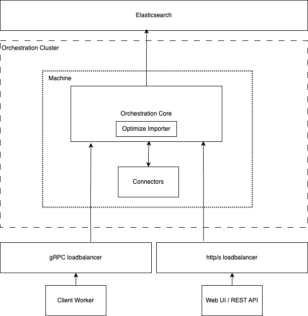

<!-- Could also be called manual? -->

<!-- Moving target, may be renamed, different focus, etc. -->

<!-- Day 1 vs Day 2 operations? -->
<!-- Installation vs Operations -->

## Preface

The Single JAR deployment option allows you to run Camunda Platform as a standalone Java application. This method is particularly suited for users who prefer manual deployment on bare metal servers or virtual machines (VMs). It provides full control over the environment and configuration, making it ideal for scenarios where custom setups or specific infrastructure requirements are necessary.

With the Single JAR approach, all necessary components are bundled into a single executable JAR file. This simplifies the deployment process, as you only need to manage one artifact. However, it also means that you are responsible for handling all aspects of the deployment, including installation, configuration, scaling, and maintenance.

Other deployment options, such as containerized deployments or managed services, might offer more convenience and automation. However, the Single JAR method gives you the flexibility to tailor the deployment to your exact needs, which can be beneficial for complex or highly customized environments.

We will later go into the details but be aware that not everything is part of this Single JAR. Have a look at [the documentation](/self-managed/reference-architecture/reference-architecture.md#orchestration-cluster-vs-web-modeler-and-console) on the orchestration and management cluster separation.

## Before You Start

Before you begin with the self-managed single JAR setup, please consider the complexity and operational overhead involved. Self-managing your deployment requires a good understanding of infrastructure, networking, and application management. If you are looking for a simpler and more managed solution, you might want to explore [our SaaS offerings](https://camunda.com/platform/) first. SaaS can significantly reduce the burden of maintenance and allow you to focus more on your core business needs.

## Limitations

- The focus is on the orchestration cluster. This includes the single JAR compromised of Identity, Operate, Optimize, Tasklist, and Zeebe. AS well as the Connectors runtime.
- General guidance and examples are with focus on **unix** users but can be adapted by Windows users with the use of e.g. [WSL](https://learn.microsoft.com/en-us/windows/wsl/install) or included `batch` files.
- The `Optimize importer` is still based on the old architecture and is not suitable for high availability and needs to only run once.

## Architecture

<!-- TODO: switch placeholder pictures to the new miro approach of Léo -->

The above depiction showcases a simple use case of a single machine with a single Camunda deployment of the single JAR.

The single jar and manual way of deploying Camunda can be used for either simple architectures or high availability setups. Be aware that maintaining such setups is a lot more work compared to a solution like Kubernetes.

Compared to the generalized architecture depicted in the [reference architecture](../reference-architecture.md#architecture), the `Optimize importer` can be enabled as part of the single JAR.

:::note
When scaling from a single machine to multiple machine, ensure that the `Optimize importer` is enabled on only one machine and disabled on the others. Enabling it on multiple machines will cause data inconsistencies. This limitation is known and will be addressed in future updates.
:::

### High availability

The above depiction showcases a minimum of three machines for a high availability setup. Two machines would be too little for high availability as no master can be elected in case of a machine failure. Consider having a read through the [clustering chapter](/components/zeebe/technical-concepts/clustering.md) to learn more about the raft protocol.

### Components

The orchestration core is packaged as a single JAR file and includes the following components:

- **Zeebe**
- **Operate**
- **Tasklist**
- **Optimize**
- **Identity**

The core facilitates:

1. **gRPC communication**: For client workers.
2. **HTTP endpoints**: Used by the REST API and Web UI.

Both types of endpoints can be routed through a load balancer to maintain availability, ensuring that the system remains accessible even if a machine becomes unavailable. While using a load balancer is optional, it is recommended for enhanced availability and security. Alternatively, you can expose static machines, ports, and IPs directly. However, direct exposure is generally discouraged due to security concerns.

Connectors expose additional HTTP endpoints for handling incoming webhooks, which can also be routed through the same http load balancer.

The orchestration components rely on **Elasticsearch** or **OpenSearch** as their data store.

Components within the orchestration core communicate seamlessly, particularly:

- **Zeebe brokers** exchange data over gRPC endpoints for efficient inter-broker communication.

## Requirements

Before implementing a reference architecture, review the requirements and guidance outlined below. We are differentiating between `Infrastructure` and `Application` requirements.

### Infrastructure

Any of the following are just suggestions for the minimum viable setup, the sizing heavily depends on your use cases and usage. It is recommended to understand the documentation on [sizing your environment](/components/best-practices/architecture/sizing-your-environment.md) and run benchmarking to confirm your required needs.

#### Host

- Variable amount of host systems
  - **1** minimum and **3** minimum for high availability (HA)

Per host:

- Minimum of **4** CPU cores (**amd64** / **arm64**)
- Minimum of **8** GB of Memory
- **32** GB SSD disk (**1,000** IOPS)
  - We advise against using "burstable" disk types because of their inconsistent performance.

#### Networking

- Stable and high-speed network connection
- Configured firewall rules to allow necessary traffic:
  - **8080**: Web UI / REST endpoint.
  - **9090**: Connector port.
  - **9600**: Metrics endpoint.
  - **26500**: gRPC endpoint.
  - **26501**: Gateway-to-broker communication.
  - **26502**: Inter-broker communication.
- Load balancer for distributing traffic (if required)

:::note
Some ports can be overwritten and are not definitive, you may conduct the [documentation](#TODO) to see how it can be done for the different components, in case you want to use a different port. Or in our example `Connectors` and `Web UIs` overlap on 8080 due to which we moved connectors to a different port.
:::

### Application

- Java Virtual Machine, see [supported environments](/reference/supported-environments.md) for version details.

### Database

- Elasticsearch / OpenSearch, see [supported environments](/reference/supported-environments.md) for version details.

Our recommendation is to use an external managed offer as we will not go into detail on how to manage and maintain your database.

## Reference implementations

Designed and tested for default setups with the minimum required sizing in mind while supporting high availability.

- [AWS EC2](./aws-ec2.md)
