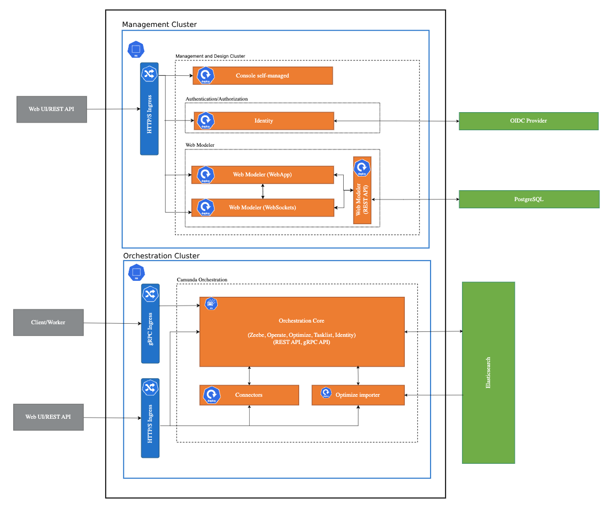

## Target User

- **Enterprise Architects**: To design and plan the overall system structure.
- **Developers**: To understand the components and their interactions.
- **IT Managers**: To ensure the system meets business requirements and is maintainable.

Reference architectures help these users by providing:

- **Best Practices**: Proven methods and techniques for system design.
- **Consistency**: Standardized approaches that ensure uniformity across projects.
- **Efficiency**: Accelerated development by reusing established patterns.
- **Risk Reduction**: Mitigation of common pitfalls through well-documented guidelines.

## Preface

Reference architectures provide a blueprint for system design and implementation, offering a standardized approach to solving common problems. They serve as a guide for enterprise architects, developers, and IT professionals to build robust and scalable systems. By following a reference architecture, organizations can ensure consistency, reduce risks, and accelerate the development process.

## Customization and Flexibility

It's important to note that reference architectures are not a one-size-fits-all solution. Each organization has unique requirements and constraints that may necessitate modifications to the provided blueprints. While these reference architectures offer a solid foundation and best practices, they should be adapted to fit the specific needs of your project. Use them as a starting point to start your development process, but be prepared to make adjustments to ensure they align with your goals and infrastructure.

## Support Considerations

We recognize that deviations from the reference architecture are unavoidable. However, such changes will introduce additional complexity, making troubleshooting more difficult. When modifications are required, ensure they are well-documented to facilitate future maintenance and support more quickly.

## Architecture

<!-- TODO: include overview, Hamza had good pictures on this topic -->

### Orchestration Cluster vs Management Cluster

When designing a reference architecture, it's essential to understand the differences between an orchestration cluster and a management cluster. Both play crucial roles in the deployment and operation of processes, but they serve different purposes and include distinct components.

#### Orchestration Cluster

We refer to the orchestration or automation cluster to the core of Camunda.

The included components are:

- [Zeebe](/components/zeebe/zeebe-overview.md): A workflow engine for orchestrating microservices and managing stateful, long-running business processes.
- [Operate](/components/operate/operate-introduction.md): A monitoring tool for visualizing and troubleshooting workflows running in Zeebe.
- [Tasklist](/components/tasklist/introduction-to-tasklist.md): A user interface for managing and completing human tasks within workflows.
- [Optimize](#TODO): An analytics tool for generating reports and insights based on workflow data.
- [Identity](/self-managed/identity/what-is-identity.md): A service for managing user authentication and authorization.
- [Connectors](/components/connectors/introduction.md): Pre-built integrations for connecting Zeebe with external systems and services.

The orchestration cluster in itself is isolated and each of the above components have a 1:1 relation. So a single Operate instance can only talk to a single Zeebe instance as the data is dependent.

#### Management Cluster

The management cluster is designed to oversee and manage multiple orchestration clusters. It offers tools and interfaces for administrators and developers to monitor clusters and create BPMN models. The management cluster operates independently from the orchestration cluster and can function without requiring an orchestration cluster.

The included components are:

- [Console](/components/console/introduction-to-console.md): A central management interface for monitoring and managing multiple orchestration clusters.
- [Web Modeler](#TODO): A web-based tool for designing and deploying workflow models to any available orchestration cluster.
- [Identity](/self-managed/identity/what-is-identity.md): A service for managing user authentication and authorization.

The management cluster supports a 1:many relationship, meaning a single Console instance can manage multiple orchestration clusters, and the Web Modeler can deploy models to any available cluster.

:::note
Identity is listed twice because there are two distinct Identity components: one within the application layer and another for the management cluster. These components are disjoint from each other. For production setups, it is recommended to use an external identity provider. However, it is possible to use the management Identity as an OIDC provider for the application Identity.
:::

### Databases

Databases are meant to be supplied from the outside, rather than being bundled with Camunda. This approach offers several advantages:

- **Flexibility**: Allows you to choose the database technology that best fits your needs and existing infrastructure while choosing one of the [supported environments](/reference/supported-environments.md#component-requirements).
- **Scalability**: External databases can be scaled independently of the Camunda components, providing better performance and resource management.
- **Maintenance**: Simplifies the maintenance and upgrade processes, as database management can be handled separately.
- **Compliance**: Ensures that you can adhere to specific data governance and compliance requirements.

While some guides go into detail on how to deploy those along Camunda, the recommendation is to maintain this outside of Camunda.

By decoupling databases from Camunda, you can achieve greater control and customization over your data storage and management strategies.

### High Availability (HA)

High availability (HA) ensures that a system remains operational and accessible even in the event of component failures. Generally all components are equipped to be run in a highly available manner. Some components do need extra considerations when run in HA mode.

Following should be considered when choosing high availability:

- **Increased Uptime**: Ensures that services remain available even during hardware or software failures.
- **Fault Tolerance**: Reduces the risk of a single point of failure by distributing workloads across multiple nodes.
- **Increased Performance**: Zeebe scales both vertically and horizontally.
- **Cost**: Higher costs due to the need for additional hardware, software, and maintenance.
- **Complexity**: Requires more sophisticated infrastructure and management, increasing the complexity of the system.

While high availability is one part of the increased fault tolerance and resilience, you should also consider regional or zonal placement of your workloads.

If you run infrastructure on cloud providers, you are often met with different regions and zones. For ideal high availability you should consider a minimum setup of 3 zones within a region as this will guarantee that in case of a zonal failure that the remaining two workloads can still process data. For more information on how Zeebe handles fault tolerance, have a look at the [raft consensus chapter](/components/zeebe/technical-concepts/clustering.md#raft-consensus-and-replication-protocol).

You can run Camunda also just with a single instance for various reasons but be sure to make [regular backups](/self-managed/operational-guides/backup-restore/backup-and-restore.md) as your resilience is limited.

In the end it depends on your uptime requirements, budget, criticality of the workflow engine, and performance requirements.

## Use Cases

### Kubernetes

Kubernetes is a powerful orchestration platform for containerized applications. Using a reference architecture for Kubernetes can help organizations deploy and manage their applications more effectively. It provides guidelines for setting up clusters, managing workloads, and ensuring high availability and scalability. This approach is ideal for organizations looking to leverage the benefits of containerization and self-healing capabilities.

### Manual (Bare Metal / VMs)

For organizations that prefer traditional infrastructure, reference architectures for bare metal or virtual machines (VMs) offer a structured approach to system deployment. These architectures provide best practices for setting up physical servers or VMs, configuring networks, and managing storage. They are suitable for environments where control, and security are critical, and where containerization may not be feasible or necessary.

### Local Development

While both options are suitable for trying out Camunda 8 locally, you might also consider exploring [Camunda 8 Run](/self-managed/setup/deploy/local/c8run.md) for a more developer focused experience.

## Helping Customers Decide

Choosing the right reference architecture depends on various factors such as the organization's goals, existing infrastructure, and specific requirements. Here are some guidelines to help you decide:

- **Kubernetes**:
  - Ideal for organizations adopting containerization and microservices.
  - Suitable for dynamic scaling and high availability.
  - Best for teams with experience in managing containerized environments.
  - A steeper learning curve and continuous platform investment.

For more information and guides, have a look at the specific reference for [Kubernetes](#TODO).

- **Manual (Bare Metal / VMs)**:
  - Suitable for organizations requiring control.
  - Ideal for environments where security and compliance are critical.
  - Applicable for high availability but requires more planning ahead.
  - Best for teams with expertise in managing physical servers or virtual machines.

For more information and guides, have a look at the specific reference for [Manual](./manual/manual-overview).
