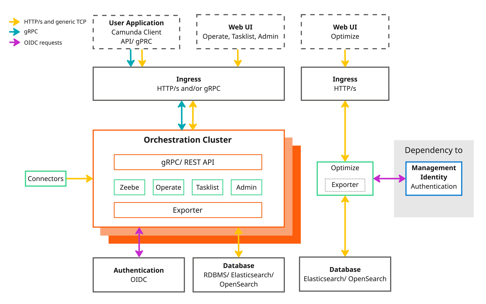
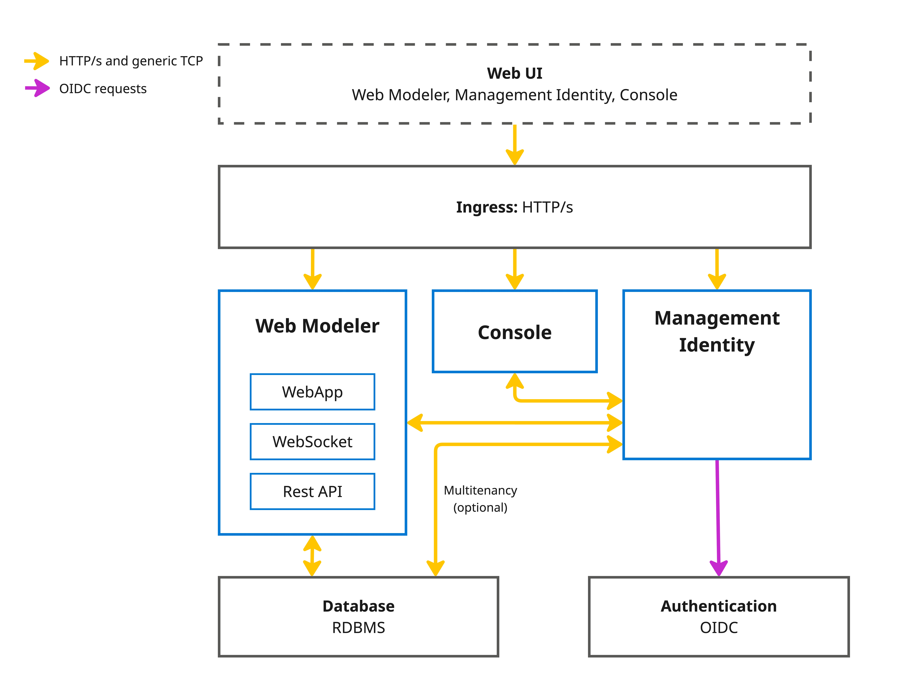

Reference architectures provide a blueprint for designing and implementing scalable, robust, and adaptable systems. The reference architectures published here help enterprise architects, developers, and IT managers streamline deployments and improve system reliability.

## Overview

Reference architectures are not a one-size-fits-all solution. Each organization has unique requirements and constraints that may require modifications to the provided blueprints.

Use these reference architectures as a starting point for your Camunda 8 implementation. Adapt them to ensure they align with your goals and infrastructure.

### Target users

- **Enterprise architects**: Design and plan the overall system structure.
- **Developers**: Understand the components and their interactions.
- **IT managers**: Ensure the system meets business requirements and is maintainable.

### Key benefits

- **Accelerated deployment**: Predefined best practices simplify setup, reducing time and effort to deploy a reliable workflow automation solution.
- **Consistency**: Standardized components and configurations reduce errors and simplify maintenance.
- **Enhanced security**: Incorporates best practices for securing Camunda 8 deployments, including encryption, authentication, and access controls.

### Support considerations

Deviations from the reference architecture are expected. However, changes can introduce additional complexity, making troubleshooting more difficult. When modifications are required, document them to support future maintenance and troubleshooting.

Camunda publishes [supported environments](/reference/supported-environments.md) to help you navigate supported configurations.

## Architecture

### Orchestration Cluster vs Web Modeler and Console

When designing a reference architecture, it's essential to understand the differences between Orchestration Cluster, Web Modeler, and Console Self-Managed. These components serve different purposes and include distinct elements.

#### Orchestration Cluster

The Orchestration Cluster is the core of Camunda.

The following components are bundled into a single artifact:

- [Zeebe](/components/zeebe/zeebe-overview.md): Highly scalable, cloud-native workflow engine that tracks the state of active process instances and drives business processes from start to finish.
- [Operate](/components/operate/operate-introduction.md): Monitoring tool for visualizing and troubleshooting process instances running in Zeebe.
- [Tasklist](/components/tasklist/introduction-to-tasklist.md): User interface for interacting with user tasks, including assigning and completing them.
- [Identity](/self-managed/components/orchestration-cluster/identity/overview.md): Integrated authentication and authorization service for managing access to all Orchestration Cluster components and APIs.

Tightly integrated with the Orchestration Cluster:

- [Optimize](/components/optimize/what-is-optimize.md): Business intelligence tool for analyzing bottlenecks and examining improvements in automated processes.
- [Connectors](/components/connectors/introduction.md): Reusable building blocks for easily connecting processes to external systems, applications, and data.

This unified architecture ensures seamless communication, consistent state management, and reliable process execution across all components.

#### Web Modeler and Console

Web Modeler and Console are designed to interact with multiple orchestration clusters:

- [Console](/components/console/introduction-to-console.md): Central management interface for monitoring and managing multiple orchestration clusters.
- [Web Modeler](/self-managed/components/modeler/web-modeler/overview.md): Web-based tool for designing and deploying workflow models to any available orchestration cluster.
- [Management Identity](/self-managed/components/management-identity/overview.md): Centralized authentication and authorization service.

:::note Identity separation
Web Modeler and Console use a separate Management Identity deployment, distinct from the embedded Identity in the Orchestration Cluster. Optimize also requires Management Identity and cannot use the embedded Orchestration Cluster Identity.  
:::

:::tip New in Camunda 8.8
Starting with Camunda 8.8, Identity and Management Identity have been redesigned for clearer separation of concerns and improved flexibility.
:::

#### Identity vs Management Identity

The following table outlines the key differences between Identity and Management Identity:

| Category                  | Identity                                                                                                                                                                                                                                                                                                                                                                                                                                             | Management Identity                                                                                                                                                                          |
| ------------------------- | ---------------------------------------------------------------------------------------------------------------------------------------------------------------------------------------------------------------------------------------------------------------------------------------------------------------------------------------------------------------------------------------------------------------------------------------------------- | -------------------------------------------------------------------------------------------------------------------------------------------------------------------------------------------- |
| Scope                     | Provides access and permission management for all Orchestration Cluster components: Zeebe, Operate, Tasklist, and the Orchestration Cluster REST and gRPC API.                                                                                                                                                                                                                                                                                       | Manages access for platform components such as Web Modeler, Console, and Optimize.                                                                                                           |
| Unified access management | Authentication and authorizations are handled directly by the Orchestration Cluster across all components and APIs, eliminating any dependency on Management Identity.                                                                                                                                                                                                                                                                               | Continues to manage access for Web Modeler, Console, and Optimize.                                                                                                                           |
| Authentication            | <ul><li><strong>No authentication</strong>: No authentication required for API access. Form-based login in the UI. Users and groups are managed in Identity.</li><li><strong>Basic authentication</strong>: API access with basic authentication. Form-based login in the UI. Users and groups are managed in Identity.</li><li><strong>OIDC</strong>: Any compatible identity provider (for example, Keycloak, Microsoft Entra ID, Okta).</li></ul> | <ul><li><strong>Direct Keycloak integration</strong> (default).</li><li><strong>OIDC</strong>: Any compatible identity provider (for example, Keycloak, Microsoft Entra ID, Okta).</li></ul> |
| Authorizations            | Fine-grained [authorizations](/components/concepts/access-control/authorizations.md) provide consistent access control for process instances, tasks, and decisions across components and APIs.                                                                                                                                                                                                                                                       |                                                                                                                                                                                              |
| Keycloak integration      | Treated as a standard external identity provider integrated via OIDC, making it easier to use other providers without special integration.                                                                                                                                                                                                                                                                                                           | Default Keycloak integration, with OIDC available for other providers.                                                                                                                       |
| Tenant management         | Tenants are directly managed within the Orchestration Cluster, allowing per-cluster tenant management.                                                                                                                                                                                                                                                                                                                                               | No longer manages tenants for Orchestration Cluster components. Tenants apply only to Optimize.                                                                                              |

For production environments, use an external [identity provider](/self-managed/deployment/helm/configure/connect-to-an-oidc-provider.md) to connect both environments.

### Databases

Databases can be deployed as part of the Camunda clusters, but using external databases or managed services offers several advantages:

- **Flexibility**: Choose the database technology that fits your needs and existing infrastructure. See [supported environments](/reference/supported-environments.md#component-requirements).
- **Scalability**: External databases can be scaled independently of Camunda components for better performance and resource management.
- **Maintenance**: Database management, including upgrades, can be handled separately.
- **Compliance**: External databases support specific governance and compliance requirements.

While some guides explain how to deploy databases with Camunda, the recommendation is to manage databases externally for greater control and flexibility.

### High availability (HA)

High availability (HA) ensures that a system remains operational even when components fail. All components can run in HA mode, but Optimize requires special consideration: the importer/archiver must run on only one replica at a time. See the [Optimize configuration](/self-managed/components/optimize/configuration/system-configuration-platform-8.md#general-settings) for details.

Consider regional and zonal placement of workloads. Use at least three zones in a region to maintain availability if a zone fails.

For more information on how Zeebe handles fault tolerance, see the [Raft consensus chapter](/components/zeebe/technical-concepts/clustering.md#raft-consensus-and-replication-protocol).

If running a single instance, implement [regular backups](/self-managed/operational-guides/backup-restore/backup-and-restore.md), as resilience will be limited.

## Available reference architectures

:::note Documentation update in progress
This documentation is being updated to provide clearer general guidance. Some Docker documentation may still point to older guides.
:::

Choose a reference architecture based on factors such as your organization’s goals, infrastructure, and requirements. Use the following guides to plan your deployment:

### Kubernetes

Kubernetes is a powerful orchestration platform for containerized applications. A Kubernetes reference architecture provides guidelines for setting up clusters, managing workloads, and ensuring high availability and scalability.

- Ideal for organizations adopting containerization and microservices (see [Cloud Native Computing Foundation](https://www.cncf.io/)).
- Suitable for dynamic scaling and high availability.
- Best for teams experienced in managing containerized environments.
- Offers high resilience but comes with a steep learning curve.

See [Kubernetes deployment overview](/self-managed/reference-architecture/kubernetes.md).

### Containers

Containers, such as Docker, provide a portable and consistent runtime environment. They simplify development, testing, and deployment across environments by encapsulating applications and their dependencies.

- A middle ground between manual setups and Kubernetes that provides the benefits of containerization without the overhead of Kubernetes.
- Containers can run on any system that supports the container runtime, ensuring consistency across development, testing, and production environments.
- Each container runs in its own isolated environment, which helps prevent conflicts between applications and improves security.
- Containers can be easily scaled up or down to handle varying workloads, providing flexibility in resource management.

See [Camunda Docker images](/self-managed/deployment/docker/docker.md).

### Manual (bare metal/virtual machines)

For organizations that prefer traditional infrastructure, bare metal or VM-based reference architectures offer a structured approach to system deployment. These architectures provide best practices for setting up physical servers or VMs, configuring networks, and managing storage using Infrastructure as Service cloud providers. They are suitable for environments where containerization or use of Kubernetes services may not be feasible.

- Suitable for IaaS, bare metal, or traditional infrastructures.
- Ideal for traditional setups needing highly customized security, strict data residency, or industry-specific regulatory compliance.
- Applicable for high availability but requires more detailed planning.
- Best for teams with expertise in managing physical servers or virtual machines.

See [Manual deployment overview](/self-managed/reference-architecture/manual.md).

### Local development

For local evaluation or development, use [Camunda 8 Run](/self-managed/quickstart/developer-quickstart/c8run.md), a simplified distribution for developers.
