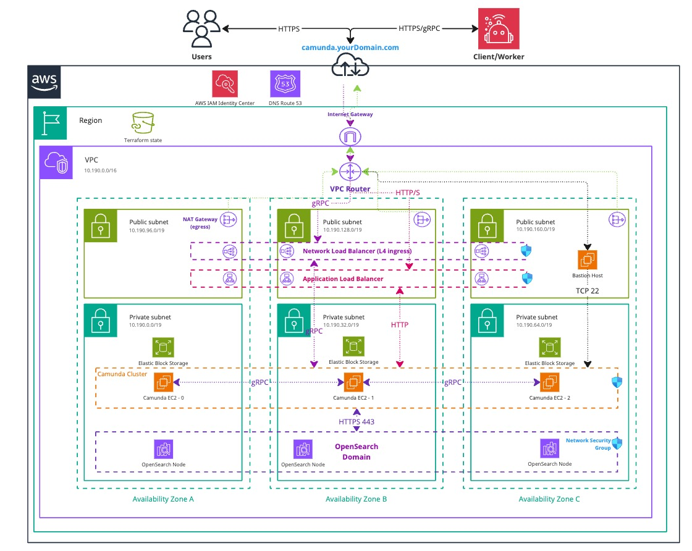

This guide provides a detailed walkthrough for installing the Camunda 8 single JAR on AWS EC2 instances. It focuses on managed services by AWS and their cloud offering. Finally, you will verify that the connection to your Self-Managed Camunda 8 environment is working.

This guide focuses on setting up the [orchestration cluster](/self-managed/reference-architecture/reference-architecture.md#orchestration-cluster-vs-web-modeler-and-console) for Camunda 8. The Web Modeler and Console are not covered in this manual deployment approach. These components are supported on Kubernetes and should be [deployed using Kubernetes](/self-managed/setup/install.md/#install-web-modeler).

:::note Using other Cloud provider
This guide is built around the available tools and services that AWS offers, but is not limited to AWS. The scripts and ideas included can be adjusted for any other cloud provider and use case.

When using this guide with a different cloud provider, note that you will be responsible for configuring and maintaining the resulting infrastructure. Our support is limited to questions related to the guide itself, not to the specific tools and services of the chosen cloud provider.
:::

:::warning Cost management
Following this guide will incur costs on your Cloud provider account, namely for the EC2 instances, and OpenSearch. More information can be found on AWS and their [pricing calculator](https://calculator.aws/#/) as the total cost varies per region.
:::

<!-- TODO: add calculator specific for this setup -->

## Architecture

The architecture as depicted focuses on a standard deployment consisting of a three-node setup distributed over 3 [availability zones](https://docs.aws.amazon.com/AWSEC2/latest/UserGuide/using-regions-availability-zones.html) within an AWS region, as well as an OpenSearch domain with the same conditions. The focus is on a highly available setup and redundancy in case a zone should fail.

<!-- The following diagram should be exported as an image and as a PDF from the sources https://miro.com/app/board/uXjVL-6SrPc=/ --->
<!-- To export: click on the frame > "Export Image" > as PDF and as JPG (low res), then save it in the ./assets/ folder --->

_Infrastructure diagram for a 3 node EC2 architecture (click on the image to open the PDF version)_
[](./assets/aws-ec2-arch.pdf)

The setup consists of:

- [Virtual Private Cloud](https://docs.aws.amazon.com/vpc/latest/userguide/what-is-amazon-vpc.html) (VPC) is a logically isolated virtual network.
  - a [Private Subnet](https://docs.aws.amazon.com/vpc/latest/userguide/configure-subnets.html), which does not have direct access to the internet and cannot be easily reached.
    - three [EC2](https://aws.amazon.com/ec2/) instances using Ubuntu, one within each availability zone, which will run Camunda 8.
    - a [managed OpenSearch](https://aws.amazon.com/what-is/opensearch/) cluster stretched over the three availability zones.
  - a [Public Subnet](https://docs.aws.amazon.com/vpc/latest/userguide/configure-subnets.html), which allows direct access to the Internet via an [Internet Gateway](https://docs.aws.amazon.com/vpc/latest/userguide/VPC_Internet_Gateway.html).
    - (optional) an [Application Load Balancer](https://docs.aws.amazon.com/elasticloadbalancing/latest/application/introduction.html) (ALB) is used to expose the WebUIs like Operate, Tasklist, and Connectors, as well as the REST API to the outside world. This is done using sticky sessions, as generally requests are distributed round-robin across all EC2 instances.
    - (optional) a [Network Load Balancer](https://docs.aws.amazon.com/elasticloadbalancing/latest/network/introduction.html) (NLB) is used to expose the gRPC endpoint of the Zeebe Gateway, in case external applications require it.
    - (optional) a [Bastion Host](https://en.wikipedia.org/wiki/Bastion_host) to allow access to the private EC2 instances since they're not publicly exposed.
      - Alternatively, utilize the [AWS Client VPN](https://docs.aws.amazon.com/vpn/latest/clientvpn-admin/what-is.html) instead to reach the private subnet within the VPC. The setup requires extra work and certificates, but can be set up by following the [getting started tutorial by AWS](https://docs.aws.amazon.com/vpn/latest/clientvpn-admin/cvpn-getting-started.html).
    - a NAT Gateway that allows the private EC2 instances to reach the internet to download and update software packages. This cannot be used to access the EC2 instances.
- [Security Groups](https://docs.aws.amazon.com/vpc/latest/userguide/vpc-security-groups.html) to handle traffic flow to the VMs.
- an [Internet Gateway](https://docs.aws.amazon.com/vpc/latest/userguide/VPC_Internet_Gateway.html) to allow traffic between the VPC and the Internet.

Both types of subnets are distributed over three availability zones of a single AWS region, allowing for a highly available setup.

:::note Single Deployment
Alternatively, the same setup can run with a single AWS EC2 instance, but be aware that in case of a zone failure, the whole setup would be unreachable.
:::

## Requirements

- An AWS account to create any resources within AWS.
  - On a high level, permissions are required on the **ec2**, **iam**, **elasticloadbalancing**, **kms**, **logs**, and **es** level.
  - For a more fine-grained view of the permissions, check this [example policy](https://github.com/camunda/camunda-deployment-references/blob/main/aws/ec2/example/policy.json).
- Terraform (1.7+)
- Unix based Operating System (OS) with ssh and sftp
  - Windows may be used with [Cygwin](https://www.cygwin.com/) or [Windows WSL](https://learn.microsoft.com/en-us/windows/wsl/install) but has not been tested

### Considerations

- The Optimize importer is not highly available and must only run once within the whole setup.

### Outcome

The outcome is a fully working Camunda orchestration cluster running in a high availability setup using AWS EC2 and utilizing a managed OpenSearch domain.
The EC2 instances come with an extra disk meant for Camunda to ensure that the content is separated from the operating system.

## Create required infrastructure

:::note Terraform infrastructure example
We do not recommend using the below Terraform related infrastructure as module as we do not guarantee compatibility.
Therefore, we recommend extending or reusing some elements of the Terraform example to ensure compatibility with your environments.
:::

1. **Download the reference architecture GitHub repository** to directly reuse and extend the existing Terraform example base.
   The idea is to provide an easy to use example implementation that's flexible to extend to your own needs without the potential limitations of a Terraform module.

```sh
wget https://github.com/camunda/camunda-deployment-references/archive/refs/heads/main.zip
```

2. **Go to directory**

```sh
cd camunda-deployment-references-main/aws/ec2/terraform
```

3. **Configure Variables**

Edit the `variables.tf` file to customize the settings such as the prefix for resource names and CIDR blocks. Example:

```hcl
variable "prefix" {
  default = "example"
}

variable "cidr_blocks" {
  default = "10.0.1.0/24"
}
```

4. **Configure alternative Terraform backend**

It's recommended to use a different backend than `local` as it is just meant for testing and development purposes. The state would be saved locally and does not allow to easily share it with colleagues.

More information on alternatives can be found in the [Terraform documentation](https://developer.hashicorp.com/terraform/language/backend).

- In the `config.tf` change the `backend "local"` to e.g. [AWS 3](https://developer.hashicorp.com/terraform/language/backend/s3) or any other non `local` one that fits your organization.

5. **Configure Terraform AWS provider**

   1. **Add the [Terraform AWS provider](https://registry.terraform.io/providers/hashicorp/aws/latest/docs) in the `config.tf`**

   It's a technical limitation on our side as we're using the same files for testing and Terraform does not allow to define the provider twice.

   ```hcl
   provider "aws" {}
   ```

   E.g. can be done via a simple `script` or manually:

   ```sh
   echo 'provider "aws" {}' >> config.tf
   ```

   2. **Configure authentication**

   The [AWS Terraform provider](https://registry.terraform.io/providers/hashicorp/aws/latest/docs) is required to create resources in AWS. You must configure the provider with the proper credentials before using it. You can further change the region and other preferences and explore different authentication methods.

   There are several ways to authenticate the AWS provider.

   - (Testing/development) Use the [AWS CLI](https://docs.aws.amazon.com/cli/latest/userguide/cli-chap-getting-started.html) to configure access. Terraform will automatically default to AWS CLI configuration when present.
   - (CI/CD) Set environment variables `AWS_ACCESS_KEY_ID` and `AWS_SECRET_ACCESS_KEY`, which can be retrieved from the [AWS Console](https://docs.aws.amazon.com/IAM/latest/UserGuide/id_credentials_access-keys.html).
   - (Enterprise grade security) Use an [AWS IAM role](https://registry.terraform.io/providers/hashicorp/aws/latest/docs#assuming-an-iam-role)

   Ensure you have set the `AWS_REGION` either as environment variable or in the Terraform AWS provider to deploy the infrastructure in your desired region. AWS resources are region bound on creation.

:::note Secret management
We strongly recommend managing sensitive information using a secure secrets management solution like HashiCorp Vault. For details on how to inject secrets directly into Terraform via Vault, see the [Terraform Vault Secrets Injection Guide](https://developer.hashicorp.com/terraform/tutorials/secrets/secrets-vault).
:::

6. **Initialize Terraform**

Initialize the Terraform working directory. This step downloads the necessary provider plugins.

```sh
terraform init
```

7. **Deploy the Infrastructure**

Plan the configuration files:

```sh
terraform plan -out infrastructure.plan # describe what will be created
```

After reviewing the plan, you can confirm and apply the changes.

```sh
terraform apply infrastructure.plan # apply the creation
```

The execution takes roughly 30 minutes of which the majority of time ~ 25 minutes is solely the creation of a managed highly available OpenSearch cluster.

8. **Access outputs**

After the infrastructure is created, you can access the outputs defined in `outputs.tf`. For example, to get the OpenSearch endpoint:

```sh
terraform output aws_opensearch_domain
```

9. **(optional) Connect to remote machines via Bastion host**

The EC2 instances are not public and have to be reached via a Bastion host.
Alternatively one can utilize the [AWS VPN Client](https://docs.aws.amazon.com/vpn/latest/clientvpn-admin/what-is.html) to connect securely to a private VPC. This is not covered here as the setup requires a lot more manual user interaction.

```sh
export BASTION_HOST=$(terraform output -raw bastion_ip)
# retrieves the first IP from the camunda_ips array
export CAMUNDA_IP=$(tf output -json camunda_ips | jq -r '.[0]')

ssh -J admin@${BASTION_HOST} admin@${CAMUNDA_IP}
```

## Deploy Camunda 8

1. **Go to the script directory**

The script directory contains bash scripts that can be used to install and configure Camunda 8.

```sh
cd camunda-deployment-references-main/aws/ec2/scripts
```

2. **Advanced configuration options**

There are certain script features hidden behind a feature flag. Those are the following:

- `CLOUDWATCH_ENABLED`: The default is false. If set to true will install the CloudWatch agent on each EC2 instance and export Camunda logs and Prometheus metrics to AWS CloudWatch.
- `SECURITY`: The default is false. If set to true will use self-signed certificates to secure cluster communication, based on the procedure described in the [documentation](/self-managed/zeebe-deployment/security/secure-cluster-communication.md). This requires a manual step as a prerequisite as described below in step 3.

Additionally, certain variables can be configured in the `camunda-install.sh` script to overwrite the default for Camunda and Java versions:

- `OPENJDK_VERSION`: The Temurin Java version.
- `CAMUNDA_VERSION`: The Camunda 8 version.
- `CAMUNDA_CONNECTORS_VERSION`: The Camunda 8 connectors version.

Setting those as environment variables will not take effect since the scripts are executed on the remote host with no access to your local environment.

3. **(optional) Security**

If you decide to enable `SECURITY`, please execute the `generate-self-signed-cert-authority.sh` script to once create a certificate authority. It would be wise to save those somewhere securely as you'll require those if you want to upgrade or change configs in an automated way. Worst case, you'll have to recreate the certificate authority certs via the script and all manually created client certificates.

:::note Self-signed certificates for testing
Self-signed certificates are advocated for development and testing purposes. Check the [documentation](/self-managed/zeebe-deployment/security/secure-cluster-communication.md) on secure cluster communication to learn more about PEM certificates.
:::

4. **Execute script `all-in-one-install.sh`**

Run the `all-in-one-install.sh` script.

It will install all required dependencies. Additionally, it configures Camunda 8 to run in a highly available setup by using a managed OpenSearch instance.

The script will pull all required IPs and other information from the Terraform state via Terraform outputs.

During the first installation, you will be asked to confirm the connection to each EC2 instance by typing `yes`.

5. **How to connect and use Camunda 8**

We distinguish between the Application Load Balancer (ALB) and the Network Load Balancer (NLB) as follows: The ALB is designed for handling Web UIs, such as Operate, Tasklist, Optimize, and Connectors. In contrast, the NLB is intended for managing the gRPC endpoint of the Zeebe Gateway. This is due to the difference of protocols with ALB focusing on HTTP and NLB on TCP.

Via the Terraform output `alb_endpoint` one can access Operate or on port `9090` the Connectors instance.

Via the Terraform output `nlb_endpoint` one can access the gRPC endpoint of the Zeebe gateway.

The two endpoints above use the publicly assigned hostname of AWS. One may add their domain via CNAME records or use [Route53](https://aws.amazon.com/route53/) to map to the load balancers, allowing them to easily enable SSL. This will require extra work in the Terraform blueprint as it listens to HTTP by default.

Alternatively, if you have decided not to expose your environment, you can use the jump host to access relevant services on your local machine via port-forwarding.

For an enterprise grade solution, you can utilize the [AWS Client VPN](https://docs.aws.amazon.com/vpn/latest/clientvpn-admin/what-is.html) instead to reach the private subnet within the VPC. The setup requires a lot of extra work and certificates, but one can follow the [getting started tutorial by AWS](https://docs.aws.amazon.com/vpn/latest/clientvpn-admin/cvpn-getting-started.html).

The following can be executed from within the Terraform folder to bind the remote ports to your local machine.

```sh
export BASTION_HOST=$(terraform output -raw bastion_ip)
# retrieves the first IP from the camunda_ips array
export CAMUNDA_IP=$(tf output -json camunda_ips | jq -r '.[0]')

# 26500 - gRPC; 8080 - WebUI; 9090 - Connectors
ssh -L 26500:${CAMUNDA_IP}:26500 -L 8080:${CAMUNDA_IP}:8080 -L 9090:${CAMUNDA_IP}:9090 admin@${BASTION_HOST}
```

6. **(optional) turn off bastion host**

If you've used the bastion host for access, you can turn it off when it's no longer needed for direct access to the EC2 instances.

To do this, set the `enable_jump_host` variable to `false` in the `variables.tf` file and reapply Terraform.

## Verify connectivity to Camunda 8

Using Terraform, you can obtain the HTTP endpoint of the Application Load Balancer and interact with Camunda through the [REST API](/apis-tools/camunda-api-rest/camunda-api-rest-overview.md).

For retrieving the Camunda endpoint you can do the following:

1. Go to the Terraform folder

```sh
cd camunda-deployment-references-main/aws/ec2/terraform
```

2. Retrieve the Application Load Balancer output

```sh
terraform output -raw alb_endpoint
```

3. Use the REST API to communicate with Camunda

With the endpoint you can follow the example as outlined in [the documentation](/apis-tools/camunda-api-rest/camunda-api-rest-authentication.md) to authenticate and retrieve the cluster topology.

## Upgrade Camunda 8

:::info Direct upgrade not supported
Upgrading directly from a Camunda 8.6 release to 8.7 is not supported and cannot be performed.
:::

To update to a new patch release, the recommended approach is as follows:

1. Remove the `jars` folder: This step ensures that outdated dependencies from previous versions are completely removed.
2. Overwrite remaining files: Replace the existing files with those from the downloaded patch release package.
3. Restart Camunda 8.

The update process can be automated using the `all-in-one-install.sh` script, which performs the following steps:

- Detects an existing Camunda 8 installation.
- Deletes the jars folder to clear outdated dependencies.
- Overwrites the remaining files with the updated version.
- Regenerates configuration files.
- Restarts the application to apply the updates.

## Monitoring

Our default way of exposing metrics is in the Prometheus format, please conduct the general [metrisc related documentation](/self-managed/zeebe-deployment/operations/metrics.md) to learn more how to scrape Camunda 8.

In an AWS environment, you can leverage CloudWatch not only for log collection but also for gathering [Prometheus metrics](https://docs.aws.amazon.com/AmazonCloudWatch/latest/monitoring/ContainerInsights-Prometheus-metrics.html). It's important to note that while Camunda natively supports Grafana and Prometheus, integrating CloudWatch for metric visualization is possible but requires additional configuration.

## Backups

Please conduct the general topic of backups in the [documentation](/self-managed/operational-guides/backup-restore/backup-and-restore.md).

With AWS as chosen platform you can utilize [S3](https://aws.amazon.com/s3/) for the backups both for Zeebe and Elasticsearch.

If you are using a managed OpenSearch domain instead, you should check out the [official documentation](https://docs.aws.amazon.com/opensearch-service/latest/developerguide/managedomains-snapshots.html) on creating backups and snapshots in OpenSearch.

## Troubleshooting

Please conduct the general topic of troubleshooting in the [documentation](/self-managed/operational-guides/troubleshooting/troubleshooting.md).

<!-- Optional stuff, just keeping it here for now -->

<!--
## Deployment Model

Deployment Topology
Describe whether the architecture is single-region, multi-region, or hybrid.
Configuration Guidelines
Best practices for configuring the environment for optimal performance and reliability.
Automation and CI/CD Pipelines
Suggested tooling and workflows for automated deployments and updates.

## Scalability and Performance Considerations

Maybe we have some information on this in the docs

Scalability Patterns
Recommended patterns for scaling compute, storage, and networking resources.
Load Balancing and Caching
Best practices for distributing traffic and caching data to enhance performance.
Performance Optimization Tips
Tips for optimizing performance across different components.
-->
