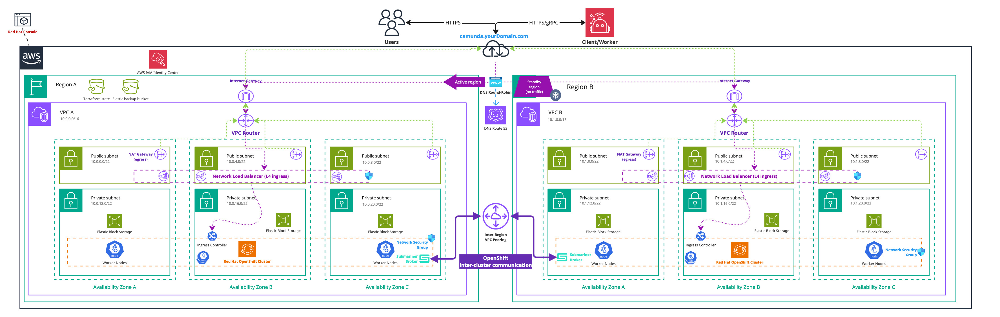

<!-- (!) Note: Please ensure that this guide maintains a consistent structure and presentation style throughout, as with ../amazon-eks/terraform-setup.md. The user should have a similar experience when reading both guides. -->

import Tabs from "@theme/Tabs";
import TabItem from "@theme/TabItem";

This guide provides a detailed tutorial for deploying two [Red Hat OpenShift on AWS (ROSA) cluster with Hosted Control Plane (HCP)](https://docs.redhat.com/en/documentation/red_hat_openshift_service_on_aws/4/html-single/architecture/index#architecture-overview) in two different [regions](https://aws.amazon.com/about-aws/global-infrastructure/regions_az/). It is specifically tailored for deploying Camunda 8 using Terraform, a widely-used Infrastructure as Code (IaC) tool, details of the High Level design are available in the generic [Red Hat OpenShift dual-region for Camunda 8 guide](/self-managed/setup/deploy/openshift/dual-region.md).

We recommend this guide for building a robust and sustainable infrastructure that needs to survive a region lost.

This guide aims to help you leverage IaC to streamline and reproduce your cloud infrastructure setup. While it covers the essentials for deploying an ROSA HCP cluster, for more advanced use cases, please refer to the official [Red Hat OpenShift on AWS Documentation](https://docs.redhat.com/en/documentation/red_hat_openshift_service_on_aws/4).

:::tip

If you are completely new to Terraform and the idea of IaC, read through the [Terraform IaC documentation](https://developer.hashicorp.com/terraform/tutorials/aws-get-started/infrastructure-as-code) and give their [interactive quick start](https://developer.hashicorp.com/terraform/tutorials/aws-get-started/infrastructure-as-code#quick-start) a try for a basic understanding.

:::

## Requirements

- A [Red Hat Account](https://www.redhat.com/) to create the Red Hat OpenShift cluster.
- An [AWS account](https://docs.aws.amazon.com/accounts/latest/reference/accounts-welcome.html) to create any resources within AWS.
- [AWS CLI (2.17+)](https://docs.aws.amazon.com/cli/latest/userguide/getting-started-install.html), a CLI tool for creating AWS resources.
- [Terraform (1.9+)](https://developer.hashicorp.com/terraform/downloads)
- [kubectl (1.30+)](https://kubernetes.io/docs/tasks/tools/#kubectl) to interact with the cluster.
- [ROSA CLI](https://docs.redhat.com/en/documentation/red_hat_openshift_service_on_aws/4/html/getting_started/rosa-quickstart-guide-ui#rosa-getting-started-environment-setup_rosa-quickstart-guide-ui) to interact with the cluster.
- [jq (1.7+)](https://jqlang.github.io/jq/download/) to interact with some Terraform variables.
- This guide uses GNU/Bash for all the shell commands listed.

### Considerations

This setup provides a foundational starting point for working with Camunda 8, though it is not optimized for peak performance. It serves as a solid initial step in preparing a production environment by leveraging [Infrastructure as Code (IaC) tools](https://developer.hashicorp.com/terraform/tutorials/aws-get-started/infrastructure-as-code).

Terraform can initially appear complex. If you're new to it, you might want to start by considering [deployment in a single region](terraform-setup.md) first.

:::warning Cost management

Following this guide will incur costs on your cloud provider account and your Red Hat account, specifically for the managed OpenShift service, OpenShift worker nodes running in EC2, the hosted control plane, Elastic Block Storage (EBS), and Route 53. For more details, refer to [ROSA AWS pricing](https://aws.amazon.com/rosa/pricing/) and the [AWS Pricing Calculator](https://calculator.aws/#/) as total costs vary by region.

:::

### Outcome

<!-- The following diagram should be exported as an image and as a PDF from the sources https://miro.com/app/board/uXjVL-6SrPc=/ --->
<!-- To export: click on the frame > "Export Image" > as PDF and as JPG (low res), then save it in the ./assets/ folder --->

_Infrastructure diagram for a dual region ROSA setup (click on the image to open the PDF version)_
[](./assets/rosa-dual-region.pdf)

Following this tutorial and steps will result in:

- Two [Red Hat OpenShift with Hosted Control Plane](https://www.redhat.com/en/topics/containers/what-are-hosted-control-planes#rosa-with-hcp) clusters running the latest ROSA version, each with six nodes ready for Camunda 8 installation in separate regions.
- The [EBS CSI driver](https://docs.aws.amazon.com/eks/latest/userguide/ebs-csi.html) installed and configured, enabling the Camunda 8 Helm chart to create [persistent volumes](https://kubernetes.io/docs/concepts/storage/persistent-volumes/).
- [VPC Peering](https://docs.aws.amazon.com/vpc/latest/peering/what-is-vpc-peering.html) configured to enable cross-region cluster communication.
- An [Amazon Simple Storage Service](https://docs.aws.amazon.com/AmazonS3/latest/userguide/Welcome.html) (S3) bucket for [Elasticsearch backups](https://www.elastic.co/guide/en/elasticsearch/reference/current/repository-s3.html).
- [Red Hat OpenShift Advanced Cluster Management](https://www.redhat.com/en/technologies/management/advanced-cluster-management) used to manage the two clusters and configure Submariner.
- [Submariner](https://docs.redhat.com/en/documentation/red_hat_advanced_cluster_management_for_kubernetes/2.2/html/manage_cluster/submariner) configured on the two clusters to enable cross-namespace and cross-cluster network communication.
<!-- TODO: will be re-included in an other PR - [Route 53](https://aws.amazon.com/en/route53/) configured on [a domain](https://docs.aws.amazon.com/Route53/latest/DeveloperGuide/domain-register.html) with an [active-passive failover](https://docs.aws.amazon.com/Route53/latest/DeveloperGuide/dns-failover-types.html), enabling access to Camunda 8 on both clusters. -->

## 1. Configure AWS and initialize Terraform

### Terraform prerequisites

To manage the infrastructure for Camunda 8 on AWS using Terraform, we need to set up Terraform's backend to store the state file remotely in an S3 bucket. This ensures secure and persistent storage of the state file.

:::note
Advanced users may want to handle this part differently and use a different backend. The backend setup provided is an example for new users.
:::

#### Set up AWS authentication

The [AWS Terraform provider](https://registry.terraform.io/providers/hashicorp/aws/latest/docs) is required to create resources in AWS. Before you can use the provider, you must authenticate it using your AWS credentials.

:::caution Ownership of the created resources

A user who creates resources in AWS will always retain administrative access to those resources, including any Kubernetes clusters created. It is recommended to create a dedicated [AWS IAM user](https://docs.aws.amazon.com/IAM/latest/UserGuide/id_users.html) for Terraform purposes, ensuring that the resources are managed and owned by that user.

:::

You can further change the region and other preferences and explore different [authentication](https://registry.terraform.io/providers/hashicorp/aws/latest/docs#authentication-and-configuration) methods:

- For development or testing purposes you can use the [AWS CLI](https://docs.aws.amazon.com/cli/latest/userguide/cli-chap-getting-started.html). If you have configured your AWS CLI, Terraform will automatically detect and use those credentials.
  To configure the AWS CLI:

  ```bash
  aws configure
  ```

  Enter your `AWS_ACCESS_KEY_ID`, `AWS_SECRET_ACCESS_KEY`, region, and output format. These can be retrieved from the [AWS Console](https://docs.aws.amazon.com/IAM/latest/UserGuide/id_credentials_access-keys.html).

- For production environments, we recommend the use of a dedicated IAM user. Create [access keys](https://docs.aws.amazon.com/IAM/latest/UserGuide/id_credentials_access-keys.html) for the new IAM user via the console, and export them as `AWS_ACCESS_KEY_ID` and `AWS_SECRET_ACCESS_KEY`.

#### Create an S3 bucket for Terraform state management

Before setting up Terraform, you need to create an S3 bucket that will store the state file. This is important for collaboration and to prevent issues like state file corruption.

To simplify the process and avoid repeating the region in each command, set your desired AWS region as an environment variable:

```bash
export S3_TF_BUCKET_REGION="<your-region>"
```

Replace `<your-region>` with the AWS region where you want to create the S3 bucket (e.g., `us-east-2`).

:::note Special case us-east-1

Regions outside of `us-east-1` require the appropriate `LocationConstraint` to be specified in order to create the bucket in the desired region.
While `us-east-1` does not require it and can only be created without specifying it.

:::

:::note Region of the bucket's state

This region can be different from the regions used for other resources, but it requires to be set explicitly in the backend configuration using the flag: `-backend-config="region=<your-region>"`.

For clarity, this guide explicitly sets the bucket region in all relevant commands.
:::

Steps to create the S3 bucket with versioning enabled:

1. Open your terminal and ensure the AWS CLI is installed and configured.

1. Use the following command to create an S3 bucket. Replace `my-rosa-dual-tf-state` with a unique bucket name:

   ```bash
   export S3_TF_BUCKET_NAME="my-rosa-dual-tf-state"

   aws s3api create-bucket --bucket "$S3_TF_BUCKET_NAME" --region "$S3_TF_BUCKET_REGION" \
     --create-bucket-configuration LocationConstraint="$S3_TF_BUCKET_REGION"
   ```

1. Enable versioning on the S3 bucket to track changes and protect the state file from accidental deletions or overwrites:

   ```bash
   aws s3api put-bucket-versioning --bucket "$S3_TF_BUCKET_NAME" --versioning-configuration Status=Enabled --region "$S3_TF_BUCKET_REGION"
   ```

1. Secure the bucket by blocking public access:

   ```bash
   aws s3api put-public-access-block --bucket "$S3_TF_BUCKET_NAME" --public-access-block-configuration \
     "BlockPublicAcls=true,IgnorePublicAcls=true,BlockPublicPolicy=true,RestrictPublicBuckets=true" --region "$S3_TF_BUCKET_REGION"
   ```

1. Verify versioning is enabled on the bucket:

   ```bash
   aws s3api get-bucket-versioning --bucket "$S3_TF_BUCKET_NAME" --region "$S3_TF_BUCKET_REGION"
   ```

This S3 bucket will now securely store your Terraform state files with versioning enabled.

### OpenShift clusters module setup

This module sets up the foundational configuration for ROSA HCP and Terraform usage.

We will leverage [Terraform modules](https://developer.hashicorp.com/terraform/language/modules), which allow us to abstract resources into reusable components, simplifying infrastructure management.

The [Camunda-provided module](https://github.com/camunda/camunda-tf-rosa) is publicly available and serves as a starting point for deploying Red Hat OpenShift clusters on AWS using a Hosted Control Plane.
It is highly recommended to review this module before implementation to understand its structure and capabilities.

Please note that this module is based on the official [ROSA HCP Terraform module documentation](https://docs.openshift.com/rosa/rosa_hcp/terraform/rosa-hcp-creating-a-cluster-quickly-terraform.html).
It is presented as an example for running Camunda 8 in ROSA.

**For production or advanced use cases or custom setups, we encourage you to use the [official module](https://docs.openshift.com/rosa/rosa_hcp/terraform/rosa-hcp-creating-a-cluster-quickly-terraform.html)**, which includes vendor-supported features.

#### Set up ROSA authentication

To set up a ROSA cluster, certain prerequisites must be configured on your AWS account. Below is an excerpt from the [official ROSA planning prerequisites checklist](https://docs.openshift.com/rosa/rosa_planning/rosa-cloud-expert-prereq-checklist.html):

1. Verify that your AWS account is correctly configured:

   ```bash
   aws sts get-caller-identity
   ```

1. Check if the ELB service role exists, as if you have never created a load balancer in your AWS account, the role for Elastic Load Balancing (ELB) might not exist yet:

   ```bash
   aws iam get-role --role-name "AWSServiceRoleForElasticLoadBalancing"
   ```

   If it doesn't exist, create it:

   ```bash
   aws iam create-service-linked-role --aws-service-name "elasticloadbalancing.amazonaws.com"
   ```

1. Create a Red Hat Hybrid Cloud Console account if you don’t already have one: [Red Hat Hybrid Cloud Console](https://console.redhat.com/).

1. Enable ROSA on your AWS account via the [AWS Console](https://console.aws.amazon.com/rosa/).

1. Enable HCP ROSA on [AWS Marketplace](https://docs.openshift.com/rosa/cloud_experts_tutorials/cloud-experts-rosa-hcp-activation-and-account-linking-tutorial.html):

   - Navigate to the ROSA console: [AWS ROSA Console](https://console.aws.amazon.com/rosa).
   - Choose **Get started**.
   - On the **Verify ROSA prerequisites** page, select **I agree to share my contact information with Red Hat**.
   - Choose **Enable ROSA**.

   **Note**: Only a single AWS account can be associated with a Red Hat account for service billing.

1. Install the ROSA CLI from the [OpenShift AWS Console](https://console.redhat.com/openshift/downloads#tool-rosa).

1. Get an API token, go to the [OpenShift Cluster Management API Token](https://console.redhat.com/openshift/token/rosa), click **Load token**, and save it. Use the token to log in with ROSA CLI:

   **Apply the token in each of your region's terminal**:

   ```bash
   export RHCS_TOKEN="<yourToken>"
   rosa login --token="$RHCS_TOKEN"

   # Verify the login
   rosa whoami
   ```

1. Configure `CLUSTER_1_REGION` and `CLUSTER_2_REGION` with the target regions respectively.

   ```bash
   # set the region, adjust to your needs
   export CLUSTER_1_REGION="us-east-1"
   export CLUSTER_2_REGION="us-east-2"
   ```

1. Verify your AWS quotas for each region:

   ```bash
   rosa verify quota --region="$CLUSTER_1_REGION"
   rosa verify quota --region="$CLUSTER_2_REGION"
   ```

   **Note**: This may fail due to organizational policies.

1. Create the required account roles:

   ```bash
   rosa create account-roles --mode auto
   ```

1. Verify your AWS quotas, and if quotas are insufficient, consult the following:

   - [Provisioned AWS Infrastructure](https://docs.openshift.com/rosa/rosa_planning/rosa-sts-aws-prereqs.html#rosa-aws-policy-provisioned_rosa-sts-aws-prereqs)
   - [Required AWS Service Quotas](https://docs.openshift.com/rosa/rosa_planning/rosa-sts-required-aws-service-quotas.html#rosa-sts-required-aws-service-quotas)

1. Ensure the `oc` CLI is installed. If it’s not already installed, follow the [official ROSA oc installation guide](https://docs.openshift.com/rosa/cli_reference/openshift_cli/getting-started-cli.html#cli-getting-started):

   ```bash
   rosa verify openshift-client
   ```

#### Create the clusters configuration module

The dual-cluster setup requires managing two distinct clusters in different regions.
For the simplicity of usage, we will manage the two clusters using a single module, therefore
this guide uses a dedicated [aws terraform provider](https://registry.terraform.io/providers/hashicorp/aws/latest/docs) for each region.

1. Initiate the module by creating a `clusters` folder and then navigating to it:

   ```bash
   mkdir clusters
   cd clusters
   ```

2. Configure your topology deployment, as you will use multiple regions, specify `CLUSTER_1_REGION` and `CLUSTER_2_REGION` with the target regions respectively.

   ```bash
   # set the region, adjust to your needs
   export CLUSTER_1_REGION="us-east-1"
   export CLUSTER_2_REGION="us-east-2"

   # ensure bucket variables are set
   export S3_TF_BUCKET_REGION="<your-region>"
   export S3_TF_BUCKET_NAME="my-rosa-dual-tf-state"
   ```

3. Ensure that your `RHCS_TOKEN` is defined and valid (otherwise, renew it on [OpenShift Cluster Management API Token](https://console.redhat.com/openshift/token/rosa)):

   ```bash
   rosa login --token="$RHCS_TOKEN"
   ```

4. Copy the initial module configuration file `config.tf` into this directory.
   This configuration will use the previously created S3 bucket for storing the Terraform state file:

   ```hcl reference
   https://github.com/camunda/camunda-deployment-references/blob/main/aws/rosa-hcp-dual-region/terraform/clusters/config.tf
   ```

5. Create a file named `cluster_region_1.tf` in the same directory as your `config.tf`.
   This file describes the cluster of the region 1:

   ```hcl reference
   https://github.com/camunda/camunda-deployment-references/blob/main/aws/rosa-hcp-dual-region/terraform/clusters/cluster_region_1.tf
   ```

6. Create a file named `cluster_region_2.tf` in the same directory as your `config.tf`.
   This file describes the cluster of the region 2:

   ```hcl reference
   https://github.com/camunda/camunda-deployment-references/blob/main/aws/rosa-hcp-dual-region/terraform/clusters/cluster_region_2.tf
   ```

7. After setting up the terraform files and ensuring your AWS authentication is configured, initialize your Terraform project, then, initialize Terraform to configure the backend and download necessary provider plugins:

   ```bash
   export S3_TF_BUCKET_KEY_CLUSTERS="camunda-terraform/clusters.tfstate"

   echo "Storing clusters terraform state in s3://$S3_TF_BUCKET_NAME/$S3_TF_BUCKET_KEY_CLUSTERS"

   terraform init -backend-config="bucket=$S3_TF_BUCKET_NAME" -backend-config="key=$S3_TF_BUCKET_KEY_CLUSTERS" -backend-config="region=$S3_TF_BUCKET_REGION"
   ```

**For each cluster's file:**

:::note Configure each cluster

- Customize the cluster name, availability zones, with the values of your choice.
- Additionally, provide a secure username and password for the cluster administrator.
  We strongly recommend managing sensitive information using a secure secrets management solution like HashiCorp Vault. For details on how to inject secrets directly into Terraform via Vault, see the [Terraform Vault Secrets Injection Guide](https://developer.hashicorp.com/terraform/tutorials/secrets/secrets-vault).

- By default, a cluster is accessible from the internet. If you prefer to restrict access, please refer to the [official documentation of the module](https://registry.terraform.io/modules/terraform-redhat/rosa-hcp/rhcs/latest#input_private).

:::

1. Configure each cluster by editing the beginning of their respective files in the `locals` section:

   - Each cluster should have a unique, non-overlapping CIDR block to ensure proper functioning of the Submariner overlay network (as referenced in the [Submariner documentation](https://submariner.io/0.8/getting-started/architecture/globalnet)).
     This is essential for successful inter-cluster communication using the Submariner underlay network.
     If you can't fullfill this requirement, you may need to implement a [Submariner Global Private Network](https://submariner.io/0.8/getting-started/architecture/globalnet/).

1. Configure user access to the clusters. By default, the user who creates an OpenShift cluster has administrative access. If you want to grant access to other users, follow the [Red Hat documentation for granting admin rights to users](https://docs.openshift.com/rosa/cloud_experts_tutorials/cloud-experts-getting-started/cloud-experts-getting-started-admin-rights.html) when the cluster will be created.

1. Customize the clusters setup. The module offers various input options that allow you to further customize the cluster configuration. For a comprehensive list of available options and detailed usage instructions, refer to the [ROSA module documentation](https://github.com/camunda/camunda-tf-rosa/blob/v2.0.0/modules/rosa-hcp/README.md).

:::caution Camunda Terraform module

This ROSA module is based on the [official Red Hat Terraform module for ROSA HCP](https://registry.terraform.io/modules/terraform-redhat/rosa-hcp/rhcs/latest). Please be aware of potential differences and choices in implementation between this module and the official one.

We invite you to consult the [Camunda ROSA module documentation](https://github.com/camunda/camunda-tf-rosa/blob/v2.0.0/modules/rosa-hcp/README.md) for more information.

:::

#### Define outputs

**Terraform** allows you to define outputs, which make it easier to retrieve important values generated during execution, such as cluster endpoints and other necessary configurations for Helm setup.

Each module that you have previously set up contains an output definition at the end of the file. You can adjust them to your needs.

#### Execution

1.  Plan the configuration files:

    ```bash
    # describes what will be created
    terraform plan -out clusters.plan \
        -var cluster_1_region="$CLUSTER_1_REGION" \
        -var cluster_2_region="$CLUSTER_2_REGION"
    ```

1.  After reviewing the plan, you can confirm and apply the changes.

    ```bash
    # creates the resources
    terraform apply clusters.plan
    ```

    Terraform will now create the OpenShift clusters with all the necessary configurations.
    The completion of this process may require approximately 20-30 minutes.

### Region peering module setup

This section outlines the process of setting up communication between two different AWS regions hosting each cluster. To achieve this, we will make use of the Amazon [Virtual Private Cloud Peering connection](https://docs.aws.amazon.com/vpc/latest/peering/what-is-vpc-peering.html).

The VPC peering connection enables two VPCs in different regions to connect and exchange traffic as if they were part of the same network, while maintaining security through the application of appropriate security groups.

Please note that, once the VPC peering is created, it becomes a dependency of the cluster, therefore it must be destroyed before removing the cluster's VPCs.

#### Retrieve the peering cluster variables

To create the peering between each cluster’s VPC, you need to gather some information using the [terraform outputs](https://developer.hashicorp.com/terraform/language/values/outputs) of the [OpenShift clusters module setup](#openshift-clusters-module-setup). Follow these steps:

1. First, go in the clusters module directory

   ```bash
   cd clusters
   ```

1. Then for each cluster, save the associated [VPC ID](https://registry.terraform.io/providers/hashicorp/aws/latest/docs/data-sources/vpc):

   ```bash
   export CLUSTER_1_VPC_ID="$(terraform output -raw cluster_1_vpc_id)"
   echo "CLUSTER_1_VPC_ID=$CLUSTER_1_VPC_ID"

   export CLUSTER_2_VPC_ID="$(terraform output -raw cluster_2_vpc_id)"
   echo "CLUSTER_2_VPC_ID=$CLUSTER_2_VPC_ID"
   ```

#### Create the peering configuration module

In the parent directory where your clusters module reside (`clusters`), create a new directory called `peering` for the VPC peering configuration:

```bash
ls
# Example output:
# clusters

mkdir peering
cd peering
```

We'll re-use the previously configured S3 bucket to store the state of the peering configuration.

Begin by setting up the `config.tf` file to use the S3 backend for managing the Terraform state:

```hcl reference
https://github.com/camunda/camunda-deployment-references/blob/main/aws/rosa-hcp-dual-region/terraform/peering/config.tf
```

Alongside the `config.tf` file, create a file called `peering.tf` to reference the peering configuration:

```hcl reference
https://github.com/camunda/camunda-deployment-references/blob/main/aws/rosa-hcp-dual-region/terraform/peering/peering.tf
```

One cluster will be referenced as the **owner**, and the other as the **accepter**.
This designation is used solely for networking purposes and does not imply any dependency between the two clusters.

#### Initialize Terraform

Once the `.tf` files are set up, configure the backend for Terraform and set the S3 bucket key for the peering state and initialize Terraform to configure the backend and download the necessary provider plugins:

```bash
# ensure bucket variables are set
export S3_TF_BUCKET_REGION="<your-region>"
export S3_TF_BUCKET_NAME="my-rosa-dual-tf-state"

export S3_TF_BUCKET_KEY_PEERING="camunda-terraform/peering.tfstate"

echo "Storing terraform state in s3://$S3_TF_BUCKET_NAME/$S3_TF_BUCKET_KEY_PEERING"

terraform init -backend-config="bucket=$S3_TF_BUCKET_NAME" -backend-config="key=$S3_TF_BUCKET_KEY_PEERING" -backend-config="region=$S3_TF_BUCKET_REGION"
```

This command connects Terraform to the S3 bucket for managing the state file, ensuring remote and persistent storage.

#### Execution

1. Open a terminal and navigate to the `peering` directory where the `config.tf` file and other `.tf` files are located. This is where [the previously retrieved VPC values](#retrieve-the-peering-cluster-variables).

1. Run the following command to generate a plan for the VPC peering configuration.
   It will connect with peering the previously retrieved VPCs of each cluster:

   ```bash
   terraform plan -out peering.plan \
        -var cluster_1_region="$CLUSTER_1_REGION" \
        -var cluster_1_vpc_id="$CLUSTER_1_VPC_ID" \
        -var cluster_2_region="$CLUSTER_2_REGION" \
        -var cluster_2_vpc_id="$CLUSTER_2_VPC_ID"
   ```

1. After reviewing the execution plan, apply the configuration to create the VPC peering connection:

   ```bash
   terraform apply peering.plan
   ```

   This command will initiate the creation of the peering connection, enabling communication between the two clusters.

For more details, consult the official [AWS VPC Peering documentation](https://docs.aws.amazon.com/vpc/latest/peering/what-is-vpc-peering.html).

### S3 backup bucket module setup

This section outlines the process of creating a [S3 bucket](https://aws.amazon.com/en/s3/) that will be used to to [perform backups of the elasticsearch cluster](https://www.elastic.co/guide/en/elasticsearch/reference/current/snapshot-restore.html) used by Camunda 8.
Read more about the [failover procecure](/self-managed/operational-guides/multi-region/dual-region-ops.md#procedure).

The S3 bucket is set up following best practices, including encryption, logging, and versioning. These configurations can be customized to suit your specific requirements.

#### Create the bucket configuration module

In the parent directory where your other modules reside (`clusters` and `peering`), create a new directory called `backup_bucket` for the S3 configuration:

```bash
ls
# Example output:
# clusters  peering

mkdir backup_bucket
cd backup_bucket
```

We'll re-use the previously configured S3 bucket to store the state of the backup bucket configuration.

Begin by setting up the `config.tf` file to use the S3 backend for managing the Terraform state:

```hcl reference
https://github.com/camunda/camunda-deployment-references/blob/main/aws/rosa-hcp-dual-region/terraform/backup_bucket/config.tf
```

Finally, create a file called `backup_bucket.tf` to reference the elastic backup bucket configuration:

```hcl reference
https://github.com/camunda/camunda-deployment-references/blob/main/aws/rosa-hcp-dual-region/terraform/backup_bucket/backup_bucket.tf
```

This bucket configuration follows [multiple best practices](https://docs.aws.amazon.com/AmazonS3/latest/userguide/security-best-practices.html).  
We encourage you to review the implementation and adjust it according to your specific requirements.

#### Initialize Terraform

Once the `.tf` files are set up, configure the backend for Terraform and set the S3 bucket key for the peering state and initialize Terraform to configure the backend and download the necessary provider plugins:

```bash
# ensure bucket variables are set
export S3_TF_BUCKET_REGION="<your-region>"
export S3_TF_BUCKET_NAME="my-rosa-dual-tf-state"

# set the region of the bucket
export BACKUP_BUCKET_REGION="us-east-1"

export S3_TF_BUCKET_KEY_BUCKET="camunda-terraform/backup-bucket.tfstate"

echo "Storing terraform state in s3://$S3_TF_BUCKET_NAME/$S3_TF_BUCKET_KEY_BUCKET"

terraform init -backend-config="bucket=$S3_TF_BUCKET_NAME" -backend-config="key=$S3_TF_BUCKET_KEY_BUCKET" -backend-config="region=$S3_TF_BUCKET_REGION"
```

This command connects Terraform to the S3 bucket for managing the state file, ensuring remote and persistent storage.
The `BACKUP_BUCKET_REGION` will define the region of the bucket, you can pick one of your cluster region.

#### Execution

1. Open a terminal and navigate to the `backup_bucket` directory where the `config.tf` file and other `.tf` files are located.

1. Run the following command to generate a plan for the S3 bucket configuration. You can edit the default bucket name using `-var=bucket_name=nameOfBucket`

   ```bash
   terraform plan -out backup-bucket.plan \
                  -var backup_bucket_region="$BACKUP_BUCKET_REGION"
   ```

1. After reviewing the execution plan, apply the configuration to create the VPC peering connection:

   ```bash
   terraform apply backup-bucket.plan     # apply the creation
   ```

   This command will initiate the creation of the backup bucket.

1. You will need to store the following secret variables to set up the dual-region installation of Camunda:

   ```bash
   export AWS_ACCESS_KEY_ES=$(terraform output -raw s3_aws_access_key)
   export AWS_SECRET_ACCESS_KEY_ES=$(terraform output -raw s3_aws_secret_access_key)
   export AWS_ES_BUCKET_NAME=$(terraform output -raw s3_bucket_name)
   export AWS_ES_BUCKET_REGION="$BACKUP_BUCKET_REGION"

   echo "AWS_ACCESS_KEY_ES=$AWS_ACCESS_KEY_ES"
   echo "AWS_SECRET_ACCESS_KEY_ES=$AWS_SECRET_ACCESS_KEY_ES"
   echo "AWS_ES_BUCKET_NAME=$AWS_ES_BUCKET_NAME"
   echo "AWS_ES_BUCKET_REGION=$AWS_ES_BUCKET_REGION"
   ```

   Ensure these variables are securely stored, as they will be needed later in the process.

### Reference files

You can find the reference files used on [this page](https://github.com/camunda/camunda-deployment-references/tree/main/aws/rosa-hcp-dual-region/terraform)

## 2. Preparation for Camunda 8 installation

### Access the created OpenShift clusters

You can now access the created OpenShift clusters.

1.  Verify that you are in the [OpenShift clusters module](#openshift-clusters-module-setup) directory `clusters`:

    ```bash
    pwd

    # Example output:
    # /home/your-username/camunda/clusters
    ```

1.  Set up the required environment variables from the OpenShift terraform module:

    ```bash
    # Cluster 1
    export CLUSTER_1_NAME="$(terraform console <<<local.rosa_cluster_1_name | jq -r)"
    export CLUSTER_1_API_URL=$(terraform output -raw cluster_1_openshift_api_url)
    export CLUSTER_1_ADMIN_USERNAME="$(terraform console <<<local.rosa_cluster_1_admin_username | jq -r)"
    export CLUSTER_1_ADMIN_PASSWORD="$(terraform console <<<local.rosa_cluster_1_admin_password | jq -r)"

    echo "CLUSTER_1_NAME=$CLUSTER_1_NAME"
    echo "CLUSTER_1_API_URL=$CLUSTER_1_API_URL"
    echo "CLUSTER_1_ADMIN_USERNAME=$CLUSTER_1_ADMIN_USERNAME"

    # Cluster 2
    export CLUSTER_2_NAME="$(terraform console <<<local.rosa_cluster_2_name | jq -r)"
    export CLUSTER_2_API_URL=$(terraform output -raw cluster_2_openshift_api_url)
    export CLUSTER_2_ADMIN_USERNAME="$(terraform console <<<local.rosa_cluster_2_admin_username | jq -r)"
    export CLUSTER_2_ADMIN_PASSWORD="$(terraform console <<<local.rosa_cluster_2_admin_password | jq -r)"

    echo "CLUSTER_2_NAME=$CLUSTER_2_NAME"
    echo "CLUSTER_2_API_URL=$CLUSTER_2_API_URL"
    echo "CLUSTER_2_ADMIN_USERNAME=$CLUSTER_2_ADMIN_USERNAME"
    ```

1.  Give cluster administrator role to the created user for each cluster:

    ```bash
    # Cluster 1
    rosa grant user cluster-admin --cluster="$CLUSTER_1_NAME" --user="$CLUSTER_1_ADMIN_USERNAME"

    # Cluster 2
    rosa grant user cluster-admin --cluster="$CLUSTER_2_NAME" --user="$CLUSTER_2_ADMIN_USERNAME"
    ```

1.  Log in to the OpenShift clusters and configure the kubeconfig contexts:

    ```bash
    # Cluster 1
    oc config delete-context "$CLUSTER_1_NAME" || true

    oc login -u "$CLUSTER_1_ADMIN_USERNAME" "$CLUSTER_1_API_URL" -p "$CLUSTER_1_ADMIN_PASSWORD"
    oc config rename-context $(oc config current-context) "$CLUSTER_1_NAME"

    # Cluster 2
    oc config delete-context "$CLUSTER_2_NAME" || true

    oc login -u "$CLUSTER_2_ADMIN_USERNAME" "$CLUSTER_2_API_URL" -p "$CLUSTER_2_ADMIN_PASSWORD"
    oc config rename-context $(oc config current-context) "$CLUSTER_2_NAME"
    ```

1.  Verify your connection to the clusters with `oc`:

    ```bash
    # Cluster 1
    oc --context "$CLUSTER_1_NAME" get nodes

    # Cluster 2
    oc --context "$CLUSTER_2_NAME" get nodes
    ```

In the remainder of the guide, different namespaces will be created following the needs of the dual-region architecture.

## 3. Next installation steps

The next steps are generic and referenced in the **[Generic OpenShift Dual-Region for Camunda 8 guide](/self-managed/setup/deploy/openshift/dual-region.md#setup-advanced-cluster-management-and-submariner)**.

It includes:

- Installation of Advanced Cluster Management
- Installation of Submariner
- Preparation of the configuration for Camunda 8 on dual-region
- Installation of Camunda 8 in OpenShift dual-region.

## 4. Deletion of Terraform Resources

### Deletion of the VPC peering

The VPC peering module can be deleted once it is no longer in use and has no dependencies.
Once the VPC peering is deleted, the clusters will not be able to communicate with each other anymore.

To delete the module, follow these steps:

1. Before proceeding with the deletion of the VPC peering module, ensure that the necessary variables, which were provided during the module creation, are still available. To verify that the required variables are correctly defined, repeat the steps from the [retrieve the VPC peering cluster variables](#retrieve-the-peering-cluster-variables) section.

1. Ensure that the `CLUSTER_1_REGION` and `CLUSTER_2_REGION` variables are defined correctly:

   ```bash
   # set the region, adjust to your needs
   export CLUSTER_1_REGION="us-east-1"
   export CLUSTER_2_REGION="us-east-2"
   ```

1. Navigate to the VPC peering module directory `peering` where the VPC peering module configuration is located.

1. Execute the following command to plan the destruction of the VPC peering module. Ensure the correct variables are passed in, as shown below:

   ```bash
   terraform plan -destroy \
     -var cluster_1_region="$CLUSTER_1_REGION" \
     -var cluster_1_vpc_id="$CLUSTER_1_VPC_ID" \
     -var cluster_2_region="$CLUSTER_2_REGION" \
     -var cluster_2_vpc_id="$CLUSTER_2_VPC_ID" \
     -out destroy-peering.plan
   ```

   This command will generate a plan to destroy the resources and save it in a file called `destroy-peering.plan`.

1. After reviewing the destruction plan, apply the changes to delete the VPC peering module resources by running:

   ```bash
   terraform apply destroy-peering.plan
   ```

   Once the `apply` command completes successfully, the VPC peering module and associated resources will be deleted.

### Deletion of the clusters

The clusters can be deleted once they are no longer in use and have no dependencies. Since clusters rely on the VPC Peering connection, the Peering module must be deleted first.

1. Before proceeding with cluster deletion, ensure that the VPC Peering has been successfully removed by following the steps in the [deletion of the VPC Peering](#deletion-of-the-vpc-peering) section.

1. Go to the directory `clusters` where the clusters configurations are managed.

1. Execute the following command to generate a plan for deleting the clusters, ensuring the correct variables are passed:

   ```bash
   terraform plan -destroy \
     -var cluster_1_region="$CLUSTER_1_REGION" \
     -var cluster_2_region="$CLUSTER_2_REGION" \
     -out destroy-clusters.plan
   ```

   This command will generate a plan to destroy the clusters and save it in a file called `destroy-clusters.plan`.

1. After reviewing the destruction plan, apply the changes to delete the cluster resources by running:

   ```bash
   terraform apply destroy-clusters.plan
   ```

   Once the `apply` command completes successfully, the clusters and associated resources will be deleted.

### Deletion of the S3 backup bucket

The S3 backup bucket can be deleted once it is no longer in use and has no dependencies.
To delete the bucket, follow these steps:

1. Navigate to the `backup_bucket` directory created during the [S3 backup bucket module setup](#s3-backup-bucket-module-setup).
   This directory contains the configuration for managing the S3 bucket.

1. Run the Terraform destroy plan:  
   Execute the following Terraform command to plan the destruction of the S3 bucket and other resources:

   ```bash
   terraform plan -destroy -out destroy-bucket.plan
   ```

   This command will generate a plan to destroy the resources and output it into a file called `destroy-bucket.plan`.

1. After reviewing the plan, apply the changes to delete the resources with the following command:

   ```bash
   terraform apply destroy-bucket.plan
   ```

   Once the `apply` command is successfully completed, the S3 bucket and associated resources will be deleted.
