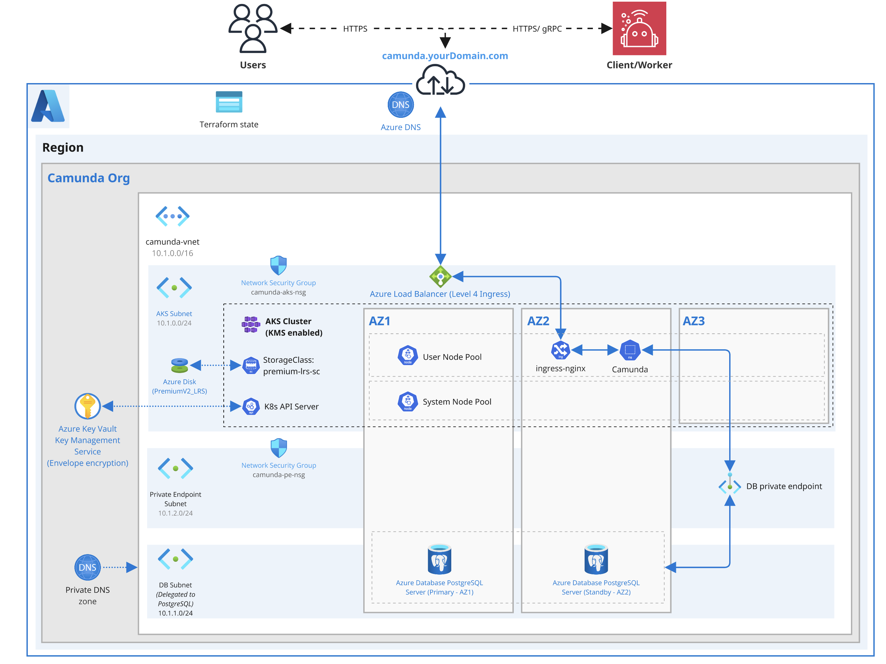

This guide provides a detailed tutorial for deploying an Azure Kubernetes Service (AKS) cluster, tailored specifically for deploying Camunda 8 using Terraform, a popular Infrastructure as Code (IaC) tool.

This guide is designed to help you leverage the power of Infrastructure as Code (IaC) to streamline and reproduce your cloud infrastructure setup. By walking through the essentials of setting up an AKS cluster, and provisioning managed Azure resources such as Azure Database for PostgreSQL, this guide demonstrates how to use Terraform with Azure. It makes the process accessible even to those new to Terraform or IaC concepts. It utilizes Azure-managed services where available, offering these as optional components for added convenience and maintainability.

:::tip

If you are completely new to Terraform and the concept of IaC, consider reading the [Terraform IaC documentation](https://developer.hashicorp.com/terraform/tutorials/azure-get-started/infrastructure-as-code) and trying the [interactive quick start](https://developer.hashicorp.com/terraform/tutorials/azure-get-started/infrastructure-as-code#quick-start) for a basic understanding.

:::

## Requirements

- An [Azure subscription](https://azure.microsoft.com/free/) to create any resources within Azure.
- [Azure CLI](https://learn.microsoft.com/cli/azure/install-azure-cli), a CLI tool for creating and managing Azure resources.
- [Terraform](https://developer.hashicorp.com/terraform/downloads) for provisioning infrastructure as code.
- [kubectl](https://kubernetes.io/docs/tasks/tools/#kubectl) to interact with your AKS cluster.
- [jq](https://stedolan.github.io/jq/download/) to parse and manipulate JSON (e.g. Terraform outputs).
- **Azure service quotas**
  - Check your quotas for **Virtual Networks**, **vCPU cores**, and **Storage Accounts** in the target region: [Azure subscription and service limits](https://learn.microsoft.com/azure/azure-resource-manager/management/azure-subscription-service-limits).
  - If you hit a limit, request an increase via the Azure portal: [Request a quota increase](https://learn.microsoft.com/azure/azure-resource-manager/management/subscribe-quota-increase-request).
- This guide uses **GNU Bash** for all shell commands.

For the exact tool versions we’ve tested against, see the [.tool-versions](https://github.com/camunda/camunda-deployment-references/blob/main/.tool-versions) file in the repository.

### Considerations

This setup provides a basic foundation for getting started with Camunda 8 on Azure AKS, but it is not fully optimized for performance or resilience. It serves as a good starting point for building out a production-ready environment by incorporating [IaC tooling](https://developer.hashicorp.com/terraform/tutorials/azure-get-started/infrastructure-as-code).

To try out Camunda 8 or for development purposes, consider signing up for our [SaaS offering](https://camunda.com/platform/). If you already have an Azure AKS cluster, you can skip ahead to the [Helm guide](./aks-helm.md).

To keep this guide simple and focused, certain best practices are referenced via links to additional documentation, allowing you to explore each area in more detail when you're ready.

The following security considerations were relaxed to streamline adoption and development. These should be reassessed and hardened before deploying to production. The following items were identified using [Trivy](https://trivy.dev/) and can be looked up in the [Aqua vulnerability database](https://avd.aquasec.com/).

These concessions are intentional in this reference infrastructure to simplify onboarding, allow internal-only access, and minimize friction during evaluation. They are not appropriate for production and must be revisited.

```
AVD-AZU-0047 #(CRITICAL): Security group rule allows unrestricted ingress from any IP address.
AVD-AZU-0041 #(CRITICAL): Cluster does not limit API access to specific IP addresses.
AVD-AZU-0013 #(CRITICAL): Vault network ACL does not block access by default.

AVD-AZU-0042 #(HIGH): RBAC is not enabled on cluster

AVD-AZU-0040 #(MEDIUM): Cluster does not have logging enabled via OMS Agent.
```

:::warning

Reference architectures are not intended to be consumed exactly as described. The examples provided in this guide are not packaged as a reusable Terraform module. It is recommended that you clone the repository and make any necessary modifications locally.

This approach allows you to extend and customize the codebase according to your specific needs. However, please note that maintaining the infrastructure is your responsibility. Camunda will continue to update and improve the reference architecture, and these updates may not be backward compatible. You may incorporate updates into your customized codebase as needed.

:::

:::danger Cost management

Following this guide will incur costs on your Azure account, including charges for Azure Kubernetes Service (AKS) node pools (virtual machine instances), Azure Managed Disks for persistent volumes, and Azure DNS zones for domain resolution. For more information, refer to the [Azure AKS pricing page](https://azure.microsoft.com/pricing/details/kubernetes-service/) and the [Azure pricing calculator](https://azure.microsoft.com/pricing/calculator/), as costs depend on region and configuration choices.

:::

### Outcome

_Infrastructure diagram for a single-region AKS setup (click on the image to open the PDF version)_
[](./assets/aks-single-region.pdf)

:::caution

The vnet and the subnets are sized according to standard Azure recommendations by default.
Due to Azure CNI, every pod will get assigned a real internal IP. While the defaults are more than sufficient for this guide, if you expect a large number of pods in a single subnet, consider using a larger subnet for AKS like /23 or /22.

:::

Following this tutorial will result in:

- An Azure Kubernetes Service (AKS) cluster with node pools provisioned and ready for Camunda 8 installation.
- The [Azure Disk CSI driver](https://learn.microsoft.com/azure/aks/csi-storage-drivers) is installed and configured, used by the Camunda 8 Helm chart to create [persistent volumes](https://kubernetes.io/docs/concepts/storage/persistent-volumes/).
- An [Azure Database for PostgreSQL - Flexible Server](https://learn.microsoft.com/azure/postgresql/flexible-server/overview) instance provisioned to be used by the Camunda platform.

## 1. Configure Azure and initialize Terraform

### Obtain a copy of the reference architecture

The first step is to download a copy of the reference architecture from the [GitHub repository](https://github.com/camunda/camunda-deployment-references/blob/main/azure/common/). This material will be used throughout the rest of this documentation. The reference architectures are versioned using the same Camunda versions (`stable/8.x`).

The provided reference architecture repository allows you to directly reuse and extend the existing Terraform example base. This sample implementation is flexible to extend to your own needs without the potential limitations of a Terraform module maintained by a third party.

```bash
curl -sSL https://raw.githubusercontent.com/camunda/camunda-deployment-references/main/azure/common/procedure/get-your-copy.sh | bash
```

With the reference architecture copied, you can proceed with the remaining steps outlined in this documentation. Ensure that you are in the correct directory before continuing with further instructions.

### Terraform prerequisites

To manage the infrastructure for Camunda 8 on Azure using Terraform, we need to set up Terraform's backend to store the state file remotely in an Azure Storage Account. This ensures secure and persistent storage of the state file.

:::note
Advanced users may want to handle this part differently and use a different backend. The backend setup provided is an example for new users.
:::

#### Set up Azure authentication

The [Azure Terraform provider](https://registry.terraform.io/providers/hashicorp/azurerm/latest/docs) is required to create resources in Azure. Before you can use the provider, you must authenticate it using your Azure credentials.

:::caution Ownership of the created resources

A user who creates resources in Azure will always retain administrative access to those resources, including any Kubernetes clusters created. It is recommended to create a dedicated Azure user or service principal for Terraform purposes, ensuring that the resources are managed and owned by that identity.

:::

You can further change the region and other preferences and explore different [authentication](https://registry.terraform.io/providers/hashicorp/azurerm/latest/docs#authenticating-via-the-azure-cli) methods:

- For development or testing purposes, you can use the [Azure CLI](https://learn.microsoft.com/cli/azure/install-azure-cli). If you have configured your Azure CLI, Terraform will automatically detect and use those credentials.
  To configure the Azure CLI:

  ```bash
  az login
  ```

  This command will open a browser window for interactive login, or use device code login in headless environments.

- For production environments, we recommend using a dedicated Azure AD user or service principal. You can create one and assign appropriate roles via the [Azure Portal](https://portal.azure.com/) or with the Azure CLI.

To create a new service principal and assign it the necessary permissions:

```bash
az ad sp create-for-rbac \
  --name "camunda-tf-sp" \
  --role Contributor \
  --scopes /subscriptions/<your-subscription-id>
```

This will return a JSON object with `appId`, `password`, and `tenant`. These values are required for login using the service principal:

```bash
az login --service-principal \
  -u <appId> \
  -p <password> \
  --tenant <tenant-id>
```

Use the `appId` as the value for `terraform_sp_app_id` in your `terraform.tfvars`.

:::warning

Microsoft Accounts (MSA) such as those ending in `@outlook.com` or `@gmail.com` cannot be granted Key Vault permissions because they lack an Entra ID object ID. In such cases, you must use a service principal to authenticate Terraform.

:::

#### Create an Azure Storage Account for Terraform state management

Before setting up Terraform, you should create an Azure Storage Account and container to store the state file. This is important for collaboration and to prevent issues like state file corruption. This should be in a separate resource group from the main infrastructure.

To start, set the required values as environment variables upfront to avoid repeating them in each command:

```bash
export AZURE_LOCATION=<your-region>                             # e.g. westeurope
export RESOURCE_GROUP_NAME="camunda-tf-rg"
export AZURE_STORAGE_ACCOUNT_NAME="camundatfstate$RANDOM"       # must be globally unique
export AZURE_STORAGE_CONTAINER_NAME="tfstate"
export AZURE_TF_KEY="camunda-terraform/terraform.tfstate"
```

Replace `<your-region>` with your chosen Azure region (for example, `westeurope`).

Now, follow these steps to create the storage account with versioning enabled:

1. Open your terminal and ensure the Azure CLI is installed and you're logged in.

2. Run the following script to create a storage account and container for storing your Terraform state. Make sure that you have chosen a globally unique name for the storage account before:

   ```bash reference
   https://github.com/camunda/camunda-deployment-references/blob/azure-docs-adjustments/azure/common/procedure/storage-account/storage-account-creation.sh
   ```

3. Enable blob versioning to track changes and protect the state file from accidental deletions or overwrites:

   ```bash reference
   https://github.com/camunda/camunda-deployment-references/blob/azure-docs-adjustments/azure/common/procedure/storage-account/storage-account-versioning.sh
   ```

4. Verify versioning is enabled on the blob container:

   ```bash reference
   https://github.com/camunda/camunda-deployment-references/blob/azure-docs-adjustments/azure/common/procedure/storage-account/storage-account-verify.sh
   ```

This Azure Storage Account will now securely store your Terraform state files with versioning enabled.

#### Creating terraform.tfvars

To configure your deployment, create a `terraform.tfvars` file in the root of the `aks-single-region` folder. This file defines critical environment-specific settings like your Azure subscription and the Service Principal used for authentication.

Example:

```hcl
subscription_id     = "00000000-0000-0000-0000-000000000000"
terraform_sp_app_id = "00000000-0000-0000-0000-000000000000"
```

##### subscription_id

This value specifies the Azure Subscription ID in which all infrastructure will be deployed, including the AKS cluster, PostgreSQL Flexible Server, and Key Vault. To retrieve your current subscription ID, you can run the following command:

```shell
az account show --query "id" -o tsv
```

It is essential to ensure this ID is correct, as Terraform will use it to determine where resources are provisioned. Providing an incorrect subscription ID can result in resources being created in the wrong environment or permission-related failures during deployment.

##### terraform_sp_app_id

This is the Application (client) ID of the Azure Service Principal that Terraform uses for authentication. It is required to configure access policies in services such as Key Vault, particularly when using customer-managed keys (CMK) with AKS.

If you created a Service Principal manually, you can retrieve its application ID with the following command:

```shell
az ad sp list --display-name "<your-service-principal-name>" --query "[0].appId" -o tsv
```

If you're already using a Service Principal to authenticate (for example, with `az login --service-principal`), this value corresponds to the `appId` you supplied during login.

This value is critical because Terraform uses it to assign the necessary permissions for interacting with encryption keys and other protected resources. If the ID is incorrect or omitted, key-related configurations may fail, and AKS will be unable to use CMK for securing cluster secrets.

#### Initialize Terraform

Once your authentication is set up, you can initialize your Terraform project. The previous steps configured a dedicated Azure Storage Account and container (`AZURE_STORAGE_ACCOUNT_NAME`, `AZURE_STORAGE_CONTAINER_NAME`) to store your state, and the following creates a backend key that will be used by your configuration.

Configure the backend and download the necessary provider plugins:

```bash reference
https://github.com/camunda/camunda-deployment-references/blob/azure-docs-adjustments/azure/common/procedure/storage-account/storage-account-tf-init.sh
```

Terraform will connect to the Azure storage container to manage the state file, ensuring remote and persistent storage.

### Terraform setup

This reference architecture uses [Terraform modules](https://developer.hashicorp.com/terraform/language/modules) to deploy all required Azure infrastructure for running Camunda 8 in a production-grade AKS environment. It includes:

- A Virtual Network (VNet) and three subnets (AKS, database, private endpoint)
- Network Security Group (NSG) for AKS
- Azure Kubernetes Service (AKS) cluster with system and user node pools across 3 AZs
- Azure PostgreSQL Flexible Server with high availability and private endpoint
- Azure Key Vault with encryption key and a user-assigned managed identity for AKS secrets (KMS)

#### 1. Main configuration

The main deployment logic is defined in [`main.tf`](https://github.com/camunda/camunda-deployment-references/blob/main/azure/kubernetes/aks-single-region/main.tf). It instantiates all modules and exposes several **customizable values** via the `locals` block:

```hcl
locals {
  resource_prefix     = var.resource_prefix_placeholder # Change this to a name of your choice
  resource_group_name = ""                              # Change this to a name of your choice, if not provided, it will be set to resource_prefix-rg, if provided, it will be used as the resource group name
  location            = "swedencentral"                 # Change this to your desired Azure region
  kubernetes_version = "1.30"                           # Change this to your desired Kubernetes version (aks - major.minor)

  db_admin_username = "secret_user"    # Replace with your desired PostgreSQL username
  db_admin_password = "secretvalue%23" # Replace with your desired PostgreSQL password, password must contain at least one letter, one number, and one special character.

  camunda_database_keycloak   = "camunda_keycloak"   # Name of your camunda database for Keycloak
  camunda_database_identity   = "camunda_identity"   # Name of your camunda database for Identity
  camunda_database_webmodeler = "camunda_webmodeler" # Name of your camunda database for WebModeler

  # Connection configuration
  camunda_keycloak_db_username   = "keycloak_db"   # This is the username that will be used for connection to the DB on Keycloak db
  camunda_identity_db_username   = "identity_db"   # This is the username that will be used for connection to the DB on Identity db
  camunda_webmodeler_db_username = "webmodeler_db" # This is the username that will be used for connection to the DB on WebModeler db

  camunda_keycloak_db_password   = "secretvalue%24" # Replace with a password that will be used for connection to the DB on Keycloak db
  camunda_identity_db_password   = "secretvalue%25" # Replace with a password that will be used for connection to the DB on Identity db
  camunda_webmodeler_db_password = "secretvalue%26" # Replace with a password that will be used for connection to the DB on WebModeler db
}
```

These values control database user setup, naming, passwords, and the general cluster configuration. Sensitive values are used by downstream provisioning jobs and Helm secrets.

The modules deployed are:

- `network`: Virtual network, AKS subnet, DB subnet, and private endpoint subnet
- `kms`: Key Vault, encryption key, and UAMI for AKS secret encryption
- `aks`: Cluster deployment with system and user node pools across AZs
- `postgres_db`: High-availability PostgreSQL Flexible Server, private DNS, and endpoint

#### 2. PostgreSQL module

This module is **enabled by default**. To opt out, you must:

- Remove the `postgres_db` block from `main.tf`
- Manually provide credentials and PostgreSQL endpoints for the Helm chart

Let me know if you'd like this split out into docs-ready MDX format or have a similar summary for the `network`, `aks`, or `kms` modules.

### Execution

:::note Secret management

We strongly recommend managing sensitive information such as the PostgreSQL username and password using a secure secrets management solution like HashiCorp Vault. For details on how to inject secrets directly into Terraform via Vault, see the [Terraform Vault Secrets Injection Guide](https://developer.hashicorp.com/terraform/tutorials/secrets/secrets-vault).

:::

1. Open a terminal in the chosen reference folder where `config.tf` and other `.tf` files are located.

2. Perform a final initialization for anything changed throughout the guide:

```bash reference
https://github.com/camunda/camunda-deployment-references/blob/azure-docs-adjustments/azure/common/procedure/storage-account/storage-account-tf-init.sh#L11-L15
```

3. Plan the configuration files:

```bash
terraform plan -out cluster.plan # describe what will be created
```

4. After reviewing the plan, you can confirm and apply the changes:

```bash
terraform apply cluster.plan     # apply the creation
```

Terraform will now create the Azure AKS cluster with all the necessary configurations. The completion of this process may require approximately 20–30 minutes.

## 2. Preparation for Camunda 8 installation

### Access the created AKS cluster

You can gain access to the Azure AKS cluster using the `Azure CLI` with the following command:

```bash
az aks get-credentials --resource-group <your-resource-group> --name <your-cluster-name> --overwrite-existing
```

Replace `<your-resource-group>` and `<your-cluster-name>` with the actual values you have input in the root main.tf. `<your-cluster-name>` will be `<your-resource-prefix>-aks`.

After updating the kubeconfig, you can verify your connection to the cluster with `kubectl`:

```bash
kubectl get nodes
```

Create a namespace for Camunda:

```bash
kubectl create namespace camunda
```

In the remainder of the guide, we reference the `camunda` namespace to create some required resources in the Kubernetes cluster, such as secrets or one-time setup jobs.

### Configure the database and associated access

As you now have a database, you need to create dedicated databases for each Camunda component and an associated user that has configured access. Follow these steps to create the database users and configure access.

Due to the tight NSG rules in this example, the only way to access the database is through the AKS cluster.

1. In your terminal, set the necessary environment variables that will be substituted in the setup manifest:

```bash reference
https://github.com/camunda/camunda-deployment-references/blob/main/azure/kubernetes/aks-single-region/procedure/vars-create-db.sh
```

A **Kubernetes job** will connect to the database and create the necessary users with the required privileges. The script installs the necessary dependencies and runs SQL commands to create the users and assign them the correct roles and privileges.

2. Create a secret that references the environment variables:

```bash reference
https://github.com/camunda/camunda-deployment-references/blob/main/azure/kubernetes/aks-single-region/procedure/create-setup-db-secret.sh
```

This command creates a secret named `setup-db-secret` and dynamically populates it with the values from your environment variables.

After running the above command, you can verify that the secret was created successfully by using:

```bash
kubectl get secret setup-db-secret -o yaml --namespace camunda
```

This should display the secret with the base64 encoded values.

3. Save the following manifest to a file, for example, `setup-postgres-create-db.yml`.

```yaml reference
https://github.com/camunda/camunda-deployment-references/blob/main/azure/kubernetes/aks-single-region/manifests/setup-postgres-create-db.yml
```

4. Apply the manifest:

```bash
kubectl apply -f setup-postgres-create-db.yml --namespace camunda
```

Once the secret is created, the **Job** manifest from the previous step can consume this secret to securely access the database credentials.

5. Once the job is created, monitor its progress using:

```bash
kubectl get job/create-setup-user-db --namespace camunda --watch
```

Once the job shows as `Completed`, the users and databases will have been successfully created.

6. View the logs of the job to confirm that the users were created and privileges were granted successfully:

```bash
kubectl logs job/create-setup-user-db --namespace camunda
```

7. Clean up the resources:

```bash
kubectl delete job create-setup-user-db --namespace camunda
kubectl delete secret setup-db-secret --namespace camunda
```

Running these commands cleans up both the job and the secret, ensuring that no unnecessary resources remain in the cluster.

### Configure a high-performance StorageClass

Camunda 8 requires high IOPS for performance-critical components like **Zeebe**, so it is important to use Azure **PremiumV2** disks rather than the default `Standard_LRS`.

This step defines a custom `StorageClass` that:

- Uses **PremiumV2_LRS** Azure Managed Disks
- Sets a **`Retain`** reclaim policy
- Uses `WaitForFirstConsumer` volume binding
- Becomes the default StorageClass for the cluster

#### Apply the StorageClass

```yaml reference
https://github.com/camunda/camunda-deployment-references/blob/main/azure/kubernetes/aks-single-region/manifests/storage-class.yml
```

Apply it using:

```bash
kubectl apply -f azure/kubernetes/aks-single-region/manifests/storage-class.yml
```

This must be applied **before installing the Camunda Helm chart** so that PersistentVolumeClaims (PVCs) are provisioned with the correct performance characteristics.

## 2. Install Camunda 8 using the Helm chart

Now that you've exported the necessary values, you can proceed with installing Camunda 8 using Helm charts. Follow the guide [Camunda 8 on Kubernetes](./aks-helm.md) for detailed instructions on deploying the platform to your Kubernetes cluster.
