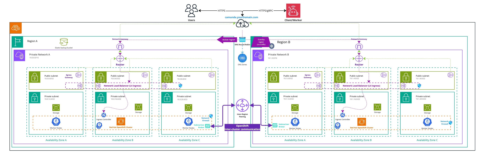

import Tabs from '@theme/Tabs';
import TabItem from '@theme/TabItem';

This guide is designed to assist users aiming to deploy Camunda 8 in a dual-region setup on Red Hat OpenShift.

The primary goal is to configure and integrate **two OpenShift clusters** for use in the dual-region reference architecture. This setup leverages specific components to address key challenges, and users are encouraged to exercise discretion regarding their use.
While this guide does not cover exhaustive configurations, it aims to provide the key steps needed to achieve the desired outcome.

To enable intercommunication between regions, we will utilize [ACM Advanced Cluster Management](https://www.redhat.com/en/technologies/management/advanced-cluster-management) and [Submariner](https://docs.redhat.com/en/documentation/red_hat_advanced_cluster_management_for_kubernetes/2.2/html/manage_cluster/submariner). Failover will be managed through DNS configurations, while access to the platform will be ensured via OpenShift Routes.

Additionally, depending on whether your OpenShift clusters are managed on a cloud provider or deployed on-premises, certain aspects of the configuration might require adaptation.

:::caution Dual-region limits and constraints

Please review our [dual-region concept documentation](./../../../concepts/multi-region/dual-region.md) to understand the limitations and constraints of this blueprint before proceeding.

:::

## High Level Design

<!-- The following diagram should be exported as an image and as a PDF from the sources https://miro.com/app/board/uXjVL-6SrPc=/ --->
<!-- To export: click on the frame > "Export Image" > as PDF and as JPG (low res), then save it in the ./assets/ folder --->

_Infrastructure diagram for a OpenShift dual-region setup (click on the image to open the PDF version)_
[](./assets/openshift-dual-region.pdf)

This High-Level Design describes how the following critical components interact to achieve a Camunda 8 deployment across two regions:

- An S3-compatible solution is used for replicating and taking snapshots of the Elasticsearch database.
- A DNS entry with an associated domain is used to enable Camunda 8 failover and reroute traffic from one cluster to the other.
- Firewall and networking components are configured to allow unrestricted communication between the two clusters.
- Local storage is provided on each OpenShift cluster for persistent data requirements.
- A non-overlapping network configuration is implemented on the OpenShift clusters. This is a mandatory requirement, as outlined in the [Submariner overlapping guide](https://submariner.io/0.8/getting-started/architecture/globalnet/).
- [Red Hat OpenShift Advanced Cluster Management](https://www.redhat.com/en/technologies/management/advanced-cluster-management) is used to manage the two clusters and configure Submariner.
- [Submariner](https://docs.redhat.com/en/documentation/red_hat_advanced_cluster_management_for_kubernetes/2.2/html/manage_cluster/submariner) is configured on the two clusters to enable cross-namespace and cross-cluster network communication.

## Requirements

- You need access to the [Advanced Cluster Management operator](https://www.redhat.com/en/technologies/management/advanced-cluster-management) and the [Submariner operator](https://catalog.redhat.com/software/container-stacks/detail/5f0c67b7ce85fb9e399f3a12).
- The clusters must be separated by a reasonable latency as outlined in the [installation environment guidelines](/self-managed/concepts/multi-region/dual-region/#installation-environment).
- Each of your OpenShift clusters must meet at least the minimum capacity requirements for a cluster. Refer to the [cluster specification guide](./redhat-openshift.md##cluster-specification) for details on resource allocation and infrastructure needs.
- Administrative privileges are required for both clusters to perform configurations and operator deployments.
- A reliable means of communication between the two clusters is necessary. Ensure that each cluster can establish network connections with the other.
- The version of your OpenShift clusters must be included in the [supported versions list](./redhat-openshift.md#supported-versions).

### CLI Requirements

In addition to the general prerequisites outlined above, the following CLI tools are required for interacting with the clusters and deploying Camunda 8, these are the same CLI tools required as mentioned in the [OpenShift Guide](redhat-openshift.md#requirements).

<!-- TODO: be exhaustive on the missing tools -->

Some steps in this guide may require additional CLI tools, which will be specified as needed.

## Setup the clusters

### Referencing the clusters

- Have access to the cluster from your cli
- reference the region and the name of each cluster

### Networking of the clusters

- Allow clusters to communicate between each other

## Setup Advanced Cluster Management and Submariner

In order to achieve cross-cluster communication, we use the recommanded [Submariner](https://docs.redhat.com/en/documentation/red_hat_advanced_cluster_management_for_kubernetes/2.2/html/manage_cluster/submariner) solution that is designed to securely connect workloads across multiple Kubernetes clusters. 

The installation of Submariner on OpenShift differs from the standard installation as it requires the usage of [Red Hat Advanced Cluster Management for Kubernetes](https://www.redhat.com/en/technologies/management/advanced-cluster-management). 

:::note Alternative installations

You may achieve the same installation without the usage of Red Hat Advanced Cluster Management for Kubernetes, however, this guide will focus on the official supported deployment of Submariner.

:::

### Advanced Cluster Management

If Red Hat Advanced Cluster Management is not enabled on your cluster, you need to enable it. The following steps are an extract from the [official instructions](https://docs.redhat.com/en/documentation/red_hat_advanced_cluster_management_for_kubernetes/2.12/html/install/installing), which you may want to refer for details of the implementation and associated customizations.

:::caution Non-production use only

The following installation instructions for Advanced Cluster Management are intended for non-production environments.  
For a production setup, please consult the [official Red Hat Advanced Cluster Management guide](https://docs.redhat.com/en/documentation/red_hat_advanced_cluster_management_for_kubernetes/2.12/html/install/installing).
  
:::

:::note Designation of the first cluster  

The first cluster is referred to as `local-cluster`. This designation cannot be changed, as it is a constant name used to reference the [managed hub cluster](https://open-cluster-management.io/docs/concepts/cluster-inventory/managedcluster/).  

:::  

1. Reference each cluster context name:

  ```bash
  export CLUSTER_1_NAME="cluster_1"  # Replace with your actual context name
  export CLUSTER_2_NAME="cluster_2"  # Replace with your actual context name
  ```

1. The following manifest will create a namespace for the management cluster, enable the [open-cluster-management operator](https://open-cluster-management.io/) and the [associated subscription](https://docs.openshift.com/container-platform/4.17/operators/admin/olm-adding-operators-to-cluster.html#olm-installing-operator-from-operatorhub-using-cli_olm-adding-operators-to-a-cluster).

  ```yaml reference
  https://github.com/camunda/camunda-deployment-references/blob/feat/dual-region-hcp/aws/rosa-hcp-dual-region/camunda-version/8.7/procedure/acm/install-manifest.yml
  ```
  Apply the manifests to enable ACM:
  ```bash
  oc --context $CLUSTER_1_NAME apply -f https://raw.githubusercontent.com/camunda/camunda-deployment-references/refs/heads/feat/dual-region-hcp/aws/rosa-hcp-dual-region/camunda-version/8.7/procedure/acm/install-manifest.yml
  ```

  Verify that the installation succeeded after a few seconds:
  ```bash 
  oc --context $CLUSTER_1_NAME --namespace open-cluster-management get csv --watch
  ```

1. With the ACM operator now enabled on the first cluster, the next step is to create the [Multicluster Global Hub](https://docs.redhat.com/en/documentation/red_hat_advanced_cluster_management_for_kubernetes/2.12/html-single/install/index#installing-from-the-cli). This feature allows you to import and manage one or more hub clusters from a single central hub cluster.

  In this setup, the first cluster will act as the central hub, managing the second cluster. This capability enables the deployment and management of components on the second cluster directly from the first cluster.

  ```yaml reference
  https://github.com/camunda/camunda-deployment-references/blob/feat/dual-region-hcp/aws/rosa-hcp-dual-region/camunda-version/8.7/procedure/acm/multi-cluster-hub.yml
  ```

  Apply the manifest:
  ```bash
  oc --context $CLUSTER_1_NAME apply -f https://raw.githubusercontent.com/camunda/camunda-deployment-references/refs/heads/feat/dual-region-hcp/aws/rosa-hcp-dual-region/camunda-version/8.7/procedure/acm/multi-cluster-hub.yml
  ```

  Wait until the status shows as "Running." This process can take up to 10 minutes:
  ```bash
  oc --context $CLUSTER_1_NAME get mch -n open-cluster-management multiclusterhub --watch
  ```

  :::caution Security consideration
    - A ServiceAccount with a ClusterRoleBinding automatically gives cluster administrator privileges to Red Hat Advanced Cluster Management and to any user credentials with access to the namespace where you install Red Hat Advanced Cluster Management.

    - A namespace called `local-cluster` is reserved for the Red Hat Advanced Cluster Management hub cluster when it is self-managed. 
    This is the only local-cluster namespace that can exist.

    - :warning: For security reasons, do not give access to the `local-cluster` namespace to any user that is not a cluster-administrator. 
  :::

1. With the Multi Cluster Hub created, the last step is to create a `ManagedClusterSet` which is a group of managed clusters. With a `ManagedClusterSet`, you can manage access to all of the managed clusters in the group together

  ```yaml reference
  https://github.com/camunda/camunda-deployment-references/blob/feat/dual-region-hcp/aws/rosa-hcp-dual-region/camunda-version/8.7/procedure/acm/managed-cluster-set.yml
  ```

  Apply the manifest:
  ```bash
  oc --context $CLUSTER_1_NAME get mch -A

  oc --context $CLUSTER_1_NAME apply -f https://raw.githubusercontent.com/camunda/camunda-deployment-references/refs/heads/feat/dual-region-hcp/aws/rosa-hcp-dual-region/camunda-version/8.7/procedure/acm/managed-cluster-set.yml
  ```

1. After creating the Managed Cluster Set, the next step is to import clusters into the set.  

   - To import a cluster, you need to template the manifest for each cluster. 
     
     Save the following file as `managed-cluster.yml.tpl`:  
     ```yaml reference
     https://github.com/camunda/camunda-deployment-references/blob/feat/dual-region-hcp/aws/rosa-hcp-dual-region/camunda-version/8.7/procedure/acm/managed-cluster.yml.tpl
     ```  

   - The cluster’s associated addon configuration will be managed using the following manifest. 
     
     Save it as `klusterlet-config.yml.tpl`:  
     ```yaml reference
     https://github.com/camunda/camunda-deployment-references/blob/feat/dual-region-hcp/aws/rosa-hcp-dual-region/camunda-version/8.7/procedure/acm/klusterlet-config.yml.tpl
     ```  

   - To import a cluster, you must store the associated authentication token. 
     
     Save the following file as `auto-import-cluster-secret.yml.tpl`:  
     ```yaml reference
     https://github.com/camunda/camunda-deployment-references/blob/feat/dual-region-hcp/aws/rosa-hcp-dual-region/camunda-version/8.7/procedure/acm/auto-import-cluster-secret.yml.tpl
     ```  

   - Finally, import each cluster into the Managed Cluster Set and verify that they can be reached and managed successfully:
    ```bash
    # Import the first cluster
    SUB1_TOKEN=$(oc --context "$CLUSTER_1_NAME" whoami -t)

    # for the first cluster, the cluster name is hardcoded on purpose
    CLUSTER_NAME="local-cluster" envsubst < managed-cluster.yml.tpl | oc --context "$CLUSTER_1_NAME" apply -f -

    CLUSTER_NAME="local-cluster" CLUSTER_TOKEN="$SUB1_TOKEN" CLUSTER_API="$(rosa describe cluster --cluster "$CLUSTER_1_NAME" --output json | jq .api.url -r)" envsubst < auto-import-cluster-secret.yml.tpl | oc --context "$CLUSTER_1_NAME" apply -f -

    CLUSTER_NAME="local-cluster" envsubst < klusterlet-config.yml.tpl | oc --context "$CLUSTER_1_NAME" apply -f -

    # List Managed Cluster sets
    oc --context "$CLUSTER_1_NAME" get managedclusters

    # Import second cluster
    SUB2_TOKEN=$(oc --context "$CLUSTER_2_NAME" whoami -t)

    CLUSTER_NAME="$CLUSTER_2_NAME" envsubst < managed-cluster.yml.tpl | oc --context "$CLUSTER_1_NAME" apply -f -

    CLUSTER_NAME="$CLUSTER_2_NAME" CLUSTER_TOKEN="$SUB2_TOKEN" CLUSTER_API="$(rosa describe cluster --cluster "$CLUSTER_2_NAME" --output json | jq .api.url -r)" envsubst < auto-import-cluster-secret.yml.tpl | oc --context "$CLUSTER_1_NAME" apply -f -
    
    CLUSTER_NAME="$CLUSTER_2_NAME" envsubst < klusterlet-config.yml.tpl | oc --context "$CLUSTER_1_NAME" apply -f -

    oc --context "$CLUSTER_1_NAME" get managedclusters
    # NAME            HUB ACCEPTED   MANAGED CLUSTER URLS                                 JOINED   AVAILABLE   AGE
    # cl-oc-2         true           https://api.cl-oc-2.5egh.p3.openshiftapps.com:443    True     True        50s
    # local-cluster   true           https://api.cl-oc-1.f70c.p3.openshiftapps.com:443   True     True        36m
    ```


### Submariner

The [architecture of Submariner](https://submariner.io/getting-started/architecture/) consists of several components acting together to enable a service located in one cluster to be reached from an other cluster.


Needed to coordinate the deployment of cross cluster resources

Needed to make services discoverable from each cluster and to access it

## Deploying Camunda 8 via Helm charts in dual region

### Setup the S3 bucket supporting failover

### Configure your deployment

Start by creating a `values.yml` file to store the configuration for your environment.
This file will contain key-value pairs that will be substituted using `envsubst`.
Over this guide, you will add and merge values in this file to configure your deployment to fit your needs.

You can find a reference example of this file here:

```hcl reference
https://github.com/camunda/camunda-deployment-references/blob/feature/openshift-ra-standard/aws/rosa-hcp/camunda-versions/8.7/procedure/install/helm-values/base.yml
```

:::warning Merging YAML files

This guide references multiple configuration files that need to be merged into a single YAML file. Be cautious to avoid duplicate keys when merging the files.  
Additionally, pay close attention when copying and pasting YAML content. Ensure that the separator notation `---` does not inadvertently split the configuration into multiple documents.

We strongly recommend double-checking your YAML file before applying it. You can use tools like [yamllint.com](https://www.yamllint.com/) or the [YAML Lint CLI](https://github.com/adrienverge/yamllint) if you prefer not to share your information online.

:::

#### Configuring the Ingress

Before exposing services outside the cluster, we need an Ingress component. Here's how you can configure it:

<Tabs queryString="current-ingress">

<TabItem value="openshift-routes" label="Using OpenShift Routes" default>

[Routes](https://docs.openshift.com/container-platform/latest/networking/routes/route-configuration.html) expose services externally by linking a URL to a service within the cluster. [OpenShift supports both the standard Kubernetes Ingress and routes](https://docs.openshift.com/container-platform/latest/networking/ingress-operator.html), giving cluster users the flexibility to choose.

The presence of routes is rooted in their specification predating Ingress. It's worth noting that the functionality of routes differs from Ingress; for example, unlike Ingress, routes don't allow multiple services to be linked to a single route or the use of paths.

To use these routes for the Zeebe Gateway, configure this through Ingress as well.

#### Prerequisite

##### Setting Up the application domain for Camunda 8

The route created by OpenShift will use a domain to provide access to the platform. By default, you can use the OpenShift applications domain, but any other domain supported by the router can also be used.

To retrieve the OpenShift applications domain (used as an example here), run the following command:

```bash
export OPENSHIFT_APPS_DOMAIN=$(oc get ingresses.config.openshift.io cluster -o jsonpath='{.spec.domain}')
```

Next, define the route domain that will be used for the Camunda 8 deployment. For example:

```bash
export DOMAIN_NAME="camunda.$OPENSHIFT_APPS_DOMAIN"

echo "Camunda 8 will be reachable from $DOMAIN_NAME"
```

If you choose to use a custom domain instead, ensure it is supported by your router configuration and replace the example domain with your desired domain. For more details on configuring custom domains in OpenShift, refer to the official documentation:  
[Custom Domains for Applications on OpenShift](https://docs.openshift.com/dedicated/applications/deployments/osd-config-custom-domains-applications.html)

##### Checking if HTTP/2 is enabled

As the Zeebe Gateway also uses `gRPC` (which relies on `HTTP/2`), [HTTP/2 Ingress Connectivity must be enabled](https://docs.openshift.com/container-platform/latest/networking/ingress-operator.html#nw-http2-haproxy_configuring-ingress).

To check if HTTP/2 is already enabled on your OpenShift cluster, run the following command:

```bash
oc get ingresses.config/cluster -o json | jq '.metadata.annotations."ingress.operator.openshift.io/default-enable-http2"'
```

Alternatively, if you use a dedicated IngressController for the deployment:

```bash
# List your IngressControllers
oc -n openshift-ingress-operator get ingresscontrollers

# Replace <ingresscontroller_name> with your IngressController name
oc -n openshift-ingress-operator get ingresscontrollers/<ingresscontroller_name> -o json | jq '.metadata.annotations."ingress.operator.openshift.io/default-enable-http2"'
```

- If the output is `"true"`, it means HTTP/2 is enabled.
- If the output is `null` or empty, HTTP/2 is not enabled.

<details>
   <summary>Enable HTTP/2</summary>

If HTTP/2 is not enabled, you can enable it by running the following command:

**IngressController configuration:**

```bash
oc -n openshift-ingress-operator annotate ingresscontrollers/<ingresscontroller_name> ingress.operator.openshift.io/default-enable-http2=true
```

**Global cluster configuration:**

```bash
oc annotate ingresses.config/cluster ingress.operator.openshift.io/default-enable-http2=true
```

This will add the necessary annotation to [enable HTTP/2 for Ingress in your OpenShift cluster](https://docs.openshift.com/container-platform/latest/networking/ingress-operator.html#nw-http2-haproxy_configuring-ingress) globally on the cluster.

</details>

##### Configure Route TLS

Additionally, the Zeebe Gateway should be configured to use an encrypted connection with TLS. In OpenShift, the connection from HAProxy to the Zeebe Gateway service can use HTTP/2 only for re-encryption or pass-through routes, and not for edge-terminated or insecure routes.

1. **Zeebe Gateway:** two [TLS secrets](https://kubernetes.io/docs/concepts/configuration/secret/#tls-secrets) for the Zeebe Gateway are required, one for the **service** and the other one for the **route**:

- The first TLS secret is issued to the Zeebe Gateway Service Name. This must use the [PKCS #8 syntax](https://en.wikipedia.org/wiki/PKCS_8) or [PKCS #1 syntax](https://en.wikipedia.org/wiki/PKCS_1) as Zeebe only supports these, referenced as `camunda-platform-internal-service-certificate`.

In the example below, a TLS certificate is generated for the Zeebe Gateway service with an [annotation](https://docs.openshift.com/container-platform/latest/security/certificates/service-serving-certificate.html). The generated certificate will be in the form of a secret.

Another option is [Cert Manager](https://docs.openshift.com/container-platform/latest/security/cert_manager_operator/index.html). For more details, review the [OpenShift documentation](https://docs.openshift.com/container-platform/latest/networking/routes/secured-routes.html#nw-ingress-creating-a-reencrypt-route-with-a-custom-certificate_secured-routes).

      <details>
        <summary>PKCS #8, PKCS #1 syntax</summary>

> PKCS #1 private key encoding. PKCS #1 produces a PEM block that contains the private key algorithm in the header and the private key in the body. A key that uses this can be recognised by its BEGIN RSA PRIVATE KEY or BEGIN EC PRIVATE KEY header. NOTE: This encoding is not supported for Ed25519 keys. Attempting to use this encoding with an Ed25519 key will be ignored and default to PKCS #8.

> PKCS #8 private key encoding. PKCS #8 produces a PEM block with a static header and both the private key algorithm and the private key in the body. A key that uses this encoding can be recognised by its BEGIN PRIVATE KEY header.

[PKCS #1, PKCS #8 syntax definitionfrom cert-manager](https://cert-manager.io/docs/reference/api-docs/#cert-manager.io/v1.PrivateKeyEncoding)

      </details>

- The second TLS secret is used on the exposed route, referenced as `camunda-platform-external-certificate`. For example, this would be the same TLS secret used for Ingress. We also configure the Zeebe Gateway Ingress to create a [Re-encrypt Route](https://docs.openshift.com/container-platform/latest/networking/routes/route-configuration.html#nw-ingress-creating-a-route-via-an-ingress_route-configuration).

Finally, we mount the **Service Certificate Secret** (`camunda-platform-internal-service-certificate`) to the Zeebe Gateway Pod.
Update your `values.yml` file with the following:

```yaml reference
https://github.com/camunda/camunda-deployment-references/blob/feature/openshift-ra-standard/aws/rosa-hcp/camunda-versions/8.7/procedure/install/helm-values/zeebe-gateway-route.yml
```

The domain used by the Zeebe Gateway for gRPC is different from the one used for the rest, namely `$DOMAIN_NAME`, to avoid any conflicts. It is also important to note that the port used for gRPC is `443`.

1. **Operate:** mount the **Service Certificate Secret** to the Operate pod and configure the secure TLS connection. Here, only the `tls.crt` file is required.

Update your `values.yml` file with the following:

```yaml reference
https://github.com/camunda/camunda-deployment-references/blob/feature/openshift-ra-standard/aws/rosa-hcp/camunda-versions/8.7/procedure/install/helm-values/operate-route.yml
```

The actual configuration properties can be reviewed [in the Operate configuration documentation](/self-managed/operate-deployment/operate-configuration.md#zeebe-broker-connection).

1. **Tasklist:** mount the **Service Certificate Secret** to the Tasklist pod and configure the secure TLS connection. Here, only the `tls.crt` file is required.
   Update your `values.yml` file with the following:

```yaml reference
https://github.com/camunda/camunda-deployment-references/blob/feature/openshift-ra-standard/aws/rosa-hcp/camunda-versions/8.7/procedure/install/helm-values/tasklist-route.yml
```

The actual configuration properties can be reviewed [in the Tasklist configuration documentation](/self-managed/tasklist-deployment/tasklist-configuration.md#zeebe-broker-connection).

1. **Connectors:** update your `values.yml` file with the following:

```yaml reference
https://github.com/camunda/camunda-deployment-references/blob/feature/openshift-ra-standard/aws/rosa-hcp/camunda-versions/8.7/procedure/install/helm-values/connectors-route.yml
```

The actual configuration properties can be reviewed [in the Connectors configuration documentation](/self-managed/connectors-deployment/connectors-configuration.md#zeebe-broker-connection).

1. Configure all other applications running inside the cluster and connecting to the Zeebe Gateway to also use TLS.

1. Set up the global configuration to enable the single Ingress definition with the host. Update your configuration file as shown below:

```yaml reference
https://github.com/camunda/camunda-deployment-references/blob/feature/openshift-ra-standard/aws/rosa-hcp/camunda-versions/8.7/procedure/install/helm-values/domain.yml
```

1. Deploy routes for each service to ensure they are accessible externally. These routes will be configured with default ports, allowing seamless communication with the services. To proceed, you need to reference the manifest that contains all the routes for the platform.

To implement these routes, first copy the contents of the provided manifest into a file named `routes.yml`:

```yaml reference
https://github.com/camunda/camunda-deployment-references/blob/feature/openshift-ra-standard/aws/rosa-hcp/camunda-versions/8.7/procedure/manifests/routes.yml
```

Once this file is created, you can apply the routes to the `camunda` namespace. Use the following command to apply the routes:

```bash
# replace the domain
envsubst < routes.yml > generated-routes.yml

# setup the routes
oc apply -f generated-routes.yml -n camunda
```

This command will create the routes and make them available to the services in the specified namespace. However, it is important to note that the routes will not be functional until the Helm deployment is completed in the subsequent steps. The Helm chart must be successfully deployed and the services up and running before the routes can be accessed and used.

<!--Intended space left for not breaking the build!-->

<!--Intended space left for not breaking the build!-->
  </TabItem>

  <TabItem value="kubernetes-ingress" label="Using Kubernetes Ingress">

[Routes](https://docs.openshift.com/container-platform/latest/networking/routes/route-configuration.html) serve as OpenShift's default Ingress implementation.

If you find that its features aren't suitable for your needs, or if you prefer to use a Kubernetes-native Ingress controller, such as the [ingress-nginx controller](https://github.com/kubernetes/ingress-nginx), [you have that option](https://www.redhat.com/en/blog/a-guide-to-using-routes-ingress-and-gateway-apis-in-kubernetes-without-vendor-lock-in).

For guidance on installing an Ingress controller, you can refer to the [Ingress Setup documentation](/self-managed/setup/guides/ingress-setup.md).

:::note Difference between ingress-nginx and NGINX Ingress

Do not confuse the [ingress-nginx controller](https://github.com/kubernetes/ingress-nginx) with the [NGINX Ingress Controller](https://www.redhat.com/en/blog/using-nginx-ingress-controller-red-hat-openshift) that is endorsed by Red Hat for usage with OpenShift. Despite very similar names, they are two different products.

If you should decide to use the Red Hat endorsed [NGINX Ingress Controller](https://www.redhat.com/en/blog/using-nginx-ingress-controller-red-hat-openshift), you would require additional adjustments done to the Camunda 8 Ingress objects and the NGINX Ingress Controller itself to make `gRPC` and `HTTP/2` connections work. In that case, please refer to the [example and the prerequisites](https://github.com/nginxinc/kubernetes-ingress/blob/main/examples/ingress-resources/grpc-services/README.md).

:::

  </TabItem>
  <TabItem value="no-ingress" label="No Ingress">
If you do not have a domain name or do not intend to use one for your Camunda 8 deployment, external access to Camunda 8 web endpoints from outside the OpenShift cluster will not be possible.

However, you can use `kubectl port-forward` to access the Camunda platform without a domain name or Ingress configuration. For more information, refer to the [kubectl port-forward documentation](https://kubernetes.io/docs/reference/kubectl/generated/kubectl_port-forward/).

To make this work, you will need to configure the deployment to reference `localhost` with the forwarded port. Update your `values.yml` file with the following:

```yaml reference
https://github.com/camunda/camunda-deployment-references/blob/feature/openshift-ra-standard/aws/rosa-hcp/camunda-versions/8.7/procedure/install/helm-values/no-domain.yml
```

  </TabItem>
</Tabs>

#### Configuring the Security Context Constraints

Depending on your OpenShift cluster's Security Context Constraints (SCCs) configuration, the deployment process may vary.
By default, OpenShift employs more restrictive SCCs. The Helm chart must assign `null` to the user running all components and dependencies.

<Tabs queryString="current-scc">
<TabItem value="w-scc" label="Restrictive SCCs" default>

The `global.compatibility.openshift.adaptSecurityContext` variable in your values.yaml can be used to set the following possible values:

- `force`: The `runAsUser` and `fsGroup` values will be null in all components.
- `disabled`: The `runAsUser` and `fsGroup` values will not be modified (default).

```hcl reference
https://github.com/camunda/camunda-deployment-references/blob/feature/openshift-ra-standard/aws/rosa-hcp/camunda-versions/8.7/procedure/install/helm-values/scc.yml
```

</TabItem>
<TabItem value="no-scc" label="Permissive SCCs">

To use permissive SCCs, simply install the charts as they are. Follow the [general Helm deployment guide](/self-managed/setup/install.md).

```hcl reference
https://github.com/camunda/camunda-deployment-references/blob/feature/openshift-ra-standard/aws/rosa-hcp/camunda-versions/8.7/procedure/install/helm-values/no-scc.yml
```

</TabItem>
</Tabs>

#### Enable Enterprise components

Some components are not enabled by default in this deployment. For more information on how to configure and enable these components, refer to [configuring Enterprise components and Connectors](/self-managed/setup/install.md#configuring-enterprise-components-and-connectors).

#### Fill your deployment with actual values

Once you've prepared the `values.yml` file, run the following `envsubst` command to substitute the environment variables with their actual values:

```bash
# generate the final values
envsubst < values.yml > generated-values.yml

# print the result
cat generated-values.yml
```

:::info Camunda Helm chart no longer automatically generates passwords

Starting from **Camunda 8.6**, the Helm chart deprecated the automatic generation of secrets, and this feature has been fully removed in **Camunda 8.7**.

:::

Next, store various passwords in a Kubernetes secret, which will be used by the Helm chart. Below is an example of how to set up the required secret. You can use `openssl` to generate random secrets and store them in environment variables:

```bash reference
https://github.com/camunda/camunda-deployment-references/blob/feature/openshift-ra-standard/aws/rosa-hcp/camunda-versions/8.7/procedure/install/generate-passwords.sh
```

Use these environment variables in the `kubectl` command to create the secret.

- The values for `postgres-password` and `password` are not required if you are using an external database. If you choose not to use an external database, you must provide those values.
- The `smtp-password` should be replaced with the appropriate external value ([see how it's used by Web Modeler](/self-managed/modeler/web-modeler/configuration/configuration.md#smtp--email)).

```bash reference
https://github.com/camunda/camunda-deployment-references/blob/feature/openshift-ra-standard/aws/rosa-hcp/camunda-versions/8.7/procedure/install/create-identity-secret.sh
```

### Install Camunda 8 using Helm

Now that the `generated-values.yml` is ready, you can install Camunda 8 using Helm. Run the following command:

```bash reference
https://github.com/camunda/camunda-deployment-references/blob/feature/openshift-ra-standard/aws/rosa-hcp/camunda-versions/8.7/procedure/install/install-chart.sh
```

This command:

- Installs (or upgrades) the Camunda platform using the Helm chart.
- Substitutes the appropriate version using the `$CAMUNDA_HELM_CHART_VERSION` environment variable.
- Applies the configuration from `generated-values.yml`.

:::note

This guide uses `helm upgrade --install` as it runs install on initial deployment and upgrades future usage. This may make it easier for future [Camunda 8 Helm upgrades](/self-managed/setup/upgrade.md) or any other component upgrades.

:::

You can track the progress of the installation using the following command:

```bash
watch -n 5 '
  kubectl get pods -n camunda --output=wide;
  if [ $(kubectl get pods -n camunda --field-selector=status.phase!=Running -o name | wc -l) -eq 0 ] &&
     [ $(kubectl get pods -n camunda -o json | jq -r ".items[] | select(.status.containerStatuses[]?.ready == false)" | wc -l) -eq 0 ];
  then
    echo "All pods are Running and Healthy - Installation completed!";
  else
    echo "Some pods are not Running or Healthy";
  fi
'
```

### Export Camunda 8 services using Submariner

## Verify connectivity to Camunda 8

Please follow our [guide to verify connectivity to Camunda 8](/self-managed/setup/deploy/amazon/amazon-eks/eks-helm.md#verify-connectivity-to-camunda-8)

<!-- TODO: modify instructions to test with zbctl as the domain is slighty different -->

## Pitfalls to avoid

For general deployment pitfalls, visit the [deployment troubleshooting guide](/self-managed/operational-guides/troubleshooting/troubleshooting.md).

### Security Context Constraints (SCCs)

[Security Context Constraints (SCCs)](https://docs.openshift.com/container-platform/latest/authentication/managing-security-context-constraints.html) are a set of conditions that a pod must adhere to in order to be accepted into the system. They define the security conditions under which a pod operates.

Similar to how roles control user permissions, SCCs regulate the permissions of deployed applications, both at the pod and container level. It's generally recommended to deploy applications with the most restrictive SCCs possible. If you're unfamiliar with security context constraints, you can refer to the [OpenShift documentation](https://docs.openshift.com/container-platform/latest/authentication/managing-security-context-constraints.html).

<Tabs queryString="current-scc">
  <TabItem value="scc" label="Restrictive SCCs (default)" default>

#### Restrictive SCCs

The following represents the most restrictive SCCs that can be used to deploy Camunda 8. Note that in OpenShift 4.10, these are equivalent to the built-in `restricted` SCCs (which are the default SCCs).

```yaml
Allow Privileged: false
Default Add Capabilities: <none>
Required Drop Capabilities: KILL, MKNOD, SYS_CHROOT, SETUID, SETGID
Allowed Capabilities: <none>
Allowed Seccomp Profiles: <none>
Allowed Volume Types: configMap, downwardAPI, emptyDir, persistentVolumeClaim, projected, secret
Allow Host Network: false
Allow Host Ports: false
Allow Host PID: false
Allow Host IPC: false
Read Only Root Filesystem: false
Run As User Strategy: MustRunAsRange
SELinux Context Strategy: MustRunAs
FSGroup Strategy: MustRunAs
Supplemental Groups Strategy: RunAsAny
```

When using these SCCs, be sure not to specify _any_ `runAsUser` or `fsGroup` values in either the pod or container security context. Instead, allow OpenShift to assign arbitrary IDs.

:::note
If you are providing the ID ranges yourself, you can also configure the `runAsUser` and `fsGroup` values accordingly.
:::

The Camunda Helm chart can be deployed to OpenShift with a few modifications, primarily revolving around your desired security context constraints.
</TabItem>
<TabItem value="no-root-scc" label="Non-root SCCs">

#### Non-root SCCs

If you intend to deploy Camunda 8 while restricting applications from running as root (e.g., using the `nonroot` built-in SCCs), you'll need to configure each pod and container to run as a non-root user. For example, when deploying Zeebe using a stateful set, you would include the following YAML, replacing `1000` with the desired user ID:

```yaml
spec:
  template:
    spec:
      securityContext:
        runAsUser: 1000
      containers:
        securityContext:
          runAsUser: 1000
```

:::note
As the container user in OpenShift is always part of the root group, defining a `fsGroup` for any Camunda 8 application pod security context is unnecessary.
:::

This configuration is necessary for all Camunda 8 applications, as well as related ones (e.g., Keycloak, PostgreSQL, etc.). It's particularly crucial for stateful applications that will write to persistent volumes, but it's also generally a good security practice.
</TabItem>
<TabItem value="permissive-scc" label="Permissive SCCs">

#### Permissive SCCs

If you deploy Camunda 8 (and related infrastructure) with permissive SCCs out of the box, there's nothing specific for you to configure. Here, permissive SCCs refer to those where the strategy for `RunAsUser` is defined as `RunAsAny` (including root).

  </TabItem>
</Tabs>
