# Operate Index Diagrams
- [operate-decision-requirements](#operate-decision-requirements)
- [operate-decision](#operate-decision)
- [operate-import-position](#operate-import-position)
- [operate-metric](#operate-metric)
- [operate-migration-steps-repository](#operate-migration-steps-repository)
- [operate-process](#operate-process)
- [operate-user](#operate-user)
- [operate-batch-operation](#operate-batch-operation)
- [operate-decision-instance](#operate-decision-instance)
- [operate-event](#operate-event)
- [operate-flownode-instance](#operate-flownode-instance)
- [operate-incident](#operate-incident)
- [operate-job](#operate-job)
- [operate-list-view](#operate-list-view)
- [operate-message](#operate-message)
- [operate-operation](#operate-operation)
- [operate-post-importer-queue](#operate-post-importer-queue)
- [operate-sequence-flow](#operate-sequence-flow)
- [operate-variable](#operate-variable)
## operate-decision-requirements
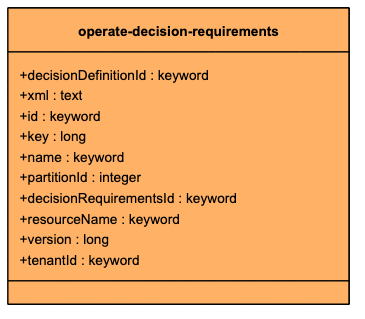
## operate-decision
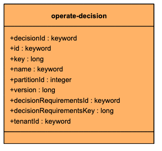
## operate-import-position
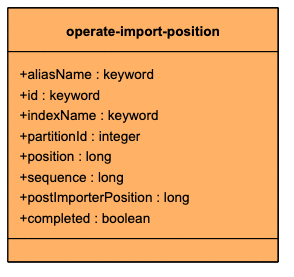
## operate-metric
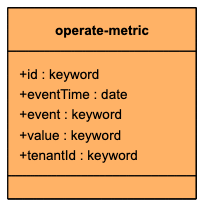
## operate-migration-steps-repository
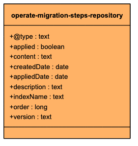
## operate-process
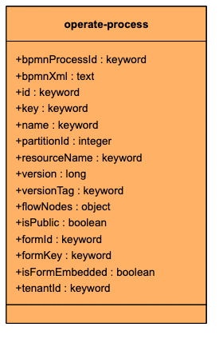
## operate-user
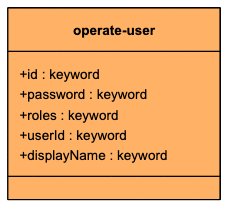
## operate-batch-operation
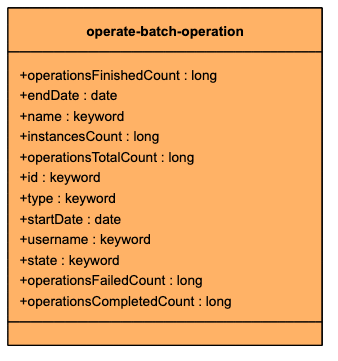
## operate-decision-instance
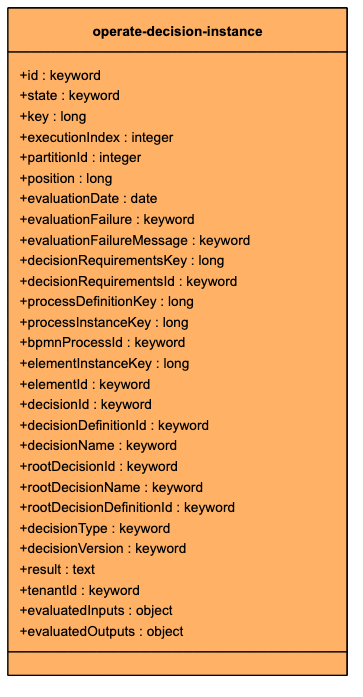
## operate-event
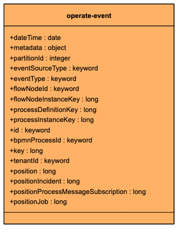
## operate-flownode-instance
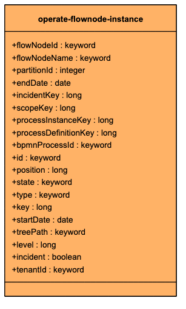
## operate-incident
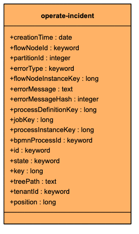
## operate-job
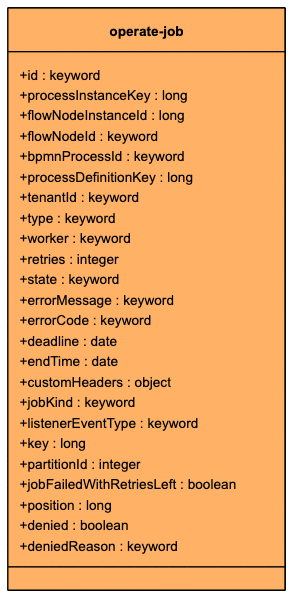
## operate-list-view
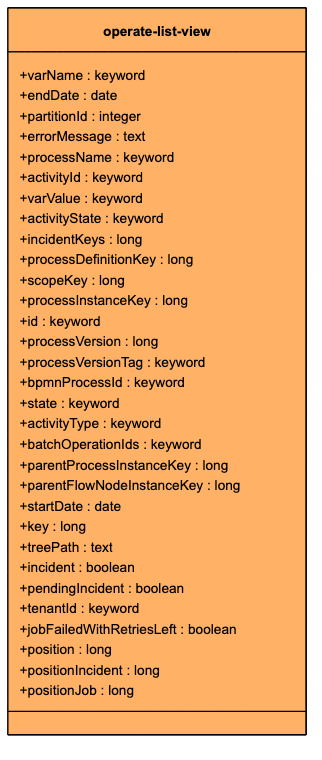
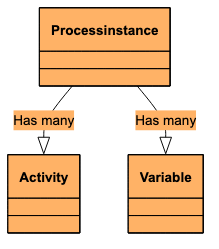
## operate-message
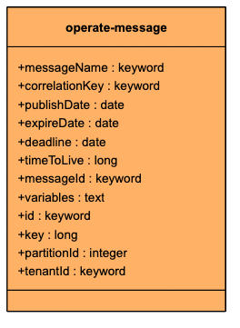
## operate-operation
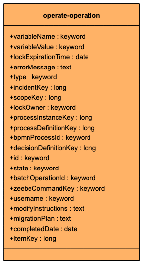
## operate-post-importer-queue
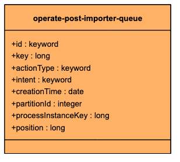
## operate-sequence-flow
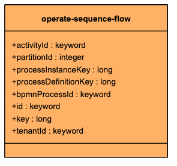
## operate-variable
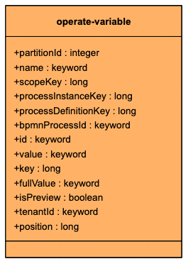