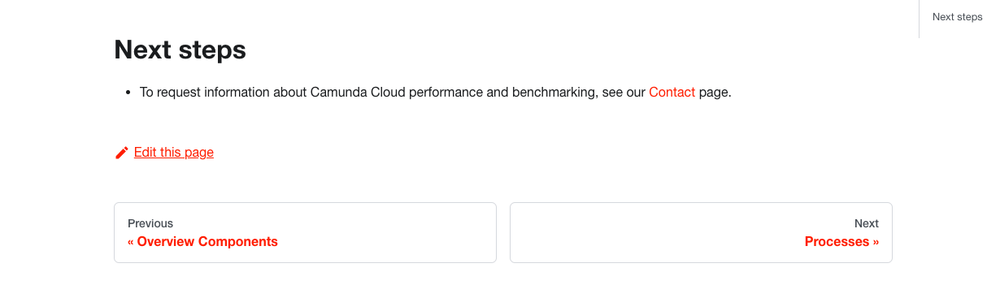
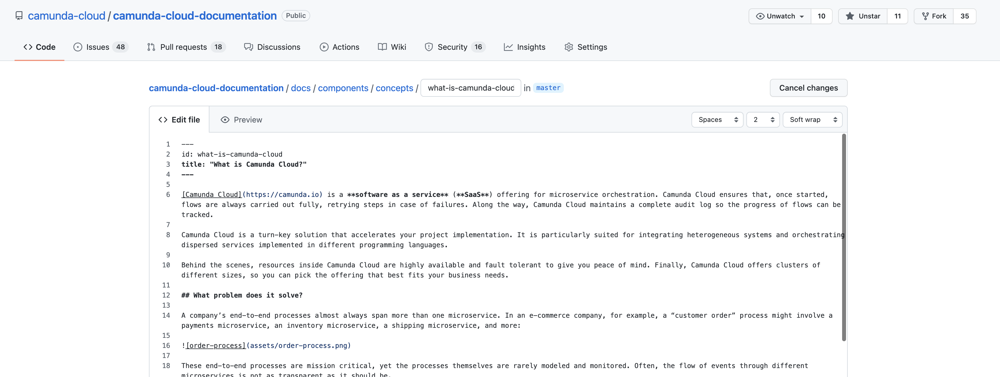
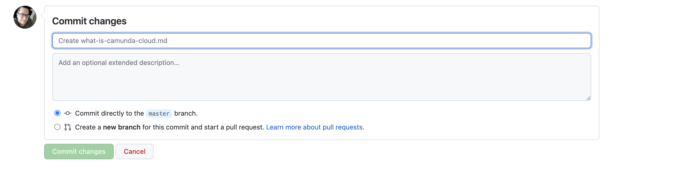

# Getting started

- [Getting started](#getting-started)
  - [Overview](#overview)
    - [Edit this page](#edit-this-page)

## Overview

There are a variety of Camunda open source projects whose documentation sets are open source and available on GitHub. Some documentation may not be completely open source, but will allow for edits to be made to it by making suggestions via a pull request. Writing, reviewing, and creating documentation in the open allows for a streamlined and collaborative approach to documentation. This also aligns both internal and external contributors and allows the Camunda community as a whole to work together to improve our documentation.

The contributor experience on docs.camunda.io integrates GitHub workflows in addition to allowing contributors to make quick edits to existing documentation. An example of this would be fixing a typo, adding a sentence for clarification, updating a screenshot, or making a grammatical change.

While contributors can open new issues to report typos and other formatting mistakes, we encourage you to create a pull request to fix the issue if you have the option to do so.

### Edit this page

1. Many documentation pages on docs.camunda.io allow you to edit content directly from your browser. If the documentation is editable, you’ll see an, **Edit this page** button and pencil-shaped icon appear at the bottom of the page you are currently viewing, as shown below.

If there is no **Edit this page** button available, that particular documentation is not accepting contributions at this time.

2. If you are already logged into GitHub, you will be immediately presented with a web-based version of the documentation that you can edit directly in your browser.

3. After making your changes, select the **Preview** tab to ensure your changes are formatted correctly.
4. Once you’ve made your changes and ensured the formatting is correct, you can then scroll to the bottom of the page. You’ll see a bold heading that says either **Commit** or **Propose changes** as shown in the screenshot below, depending on your GitHub repository permissions level for the project. Enter a title and description for your change that matches the formatting outlined in our [commit message guidelines](/CONTRIBUTING.MD).

1. After your changes have been proposed, you will want to create a pull request (also known as a PR) following the guidelines outlined in our [contributor guide](/CONTRIBUTING.MD). If you’ve never submitted a PR before, check out [About Pull Requests] on GitHub to learn more about the pull request process.
2. Thank you for your contribution! A member of the project’s team will review and merge your pull request once it has been reviewed and approved. Keep in mind that you may get feedback from maintainers requesting changes, so be sure to check your GitHub notifications on a regular basis.

[about pull requests]: https://docs.github.com/en/pull-requests/collaborating-with-pull-requests/proposing-changes-to-your-work-with-pull-requests/about-pull-requests
