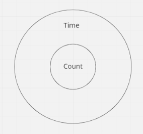

## Overview

The **Process Default Dashboards and KPIs** section gives you an overview of all the processes and their status on a single page.
This section also allows you to set a process owner and take responsibility of a process, viewing time, and quality KPIs to track process performance. Additionally, a **Adoption Dashboard** can be found at the top of the page, which integrates data from all processes in one view. The optional date filter is applied to all the reports shown in this view.

Note the available views below:

1. Process Instance Usage: Track Camunda adoption by visualizing how many process instances were started each month.

2. Overall Incident-Free Rate: Check the overall technical health of your processes by visualizing the percentage of process instances that did not have an incident.

3. Automation Rate (<1 hour): View the percentage of process instances completed within one hour. This is a good proxy for how automated your entire suite of processes is.

4. Long-Running Process Instances: View how many process instances that started over a week ago are still running. In addition, you can combine that with their average duration to identify the least efficient processes and potential pain points.

5. Automation Candidates: View your most expensive user tasks by seeing how often they run next to their average duration.

6. Active Bottlenecks: Identify the worst bottlenecks across any process in real-time by seeing the number of instances at any certain task and how long those instances have been there.

7. Time KPIs: These are KPIs based on duration reports or percentage reports with a duration filter.

8. Quality KPIs: These are KPIs based on other reports.

9. KPI Results: You can see the KPI’s current and target values, plus a link to the report itself.

10. Clicking on each process on the list opens a [default dashboard dedicated to this process](./instant-preview-dashboards.md).

:::tip
For the pie chart reports in 4, 5, and 6, both time and count are displayed in the chart according to the following format:

:::
