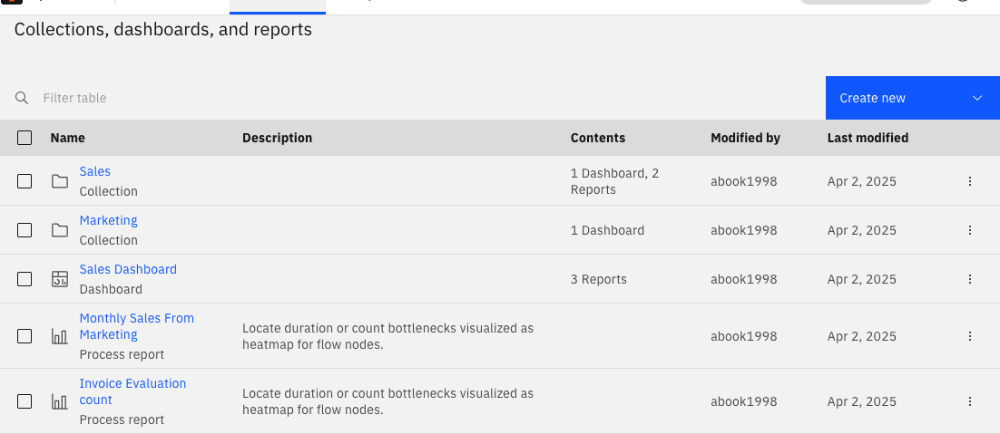
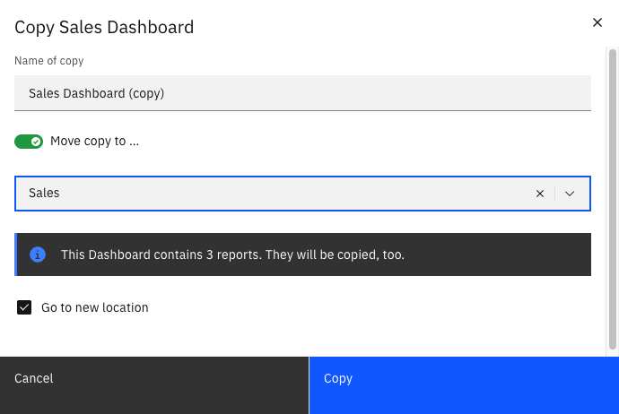

Optimize uses a single visualization for **reports**, and **[dashboards](./creating-dashboards.md)** combine these visualizations, akin to a spreadsheet or a set of comparative charts. **Collections** organize these datasets, acting as project folders. The Optimize **Collections** page displays all dashboards, reports, and collections, and clicking on a collection reveals associated reports and dashboards.

In addition to the name of the dashboard, report, or collection, you can also see modification dates, the number of items they contain, and user/group access. Optimize enables collaborative sharing through the **Share** tab, allowing the creation of shared links for external viewing. Toggle to **Enable sharing**.

:::note
Colleagues without access to Optimize can still view your report with the shared link. Learn more about [user permissions](./user-permissions.md).
:::

Clicking on a report, dashboard, or collection takes you to its corresponding details page. When moving the mouse over one of these entities, you can access a context menu that allows you to edit, copy, or delete the entity. Multiple entities can be selected and deleted at once using the bulk menu which appears after selecting at least one entity. When copying an entity, you also have the option to move that copy into a collection.

To find a collection, report, or dashboard, use the search field on the top of the page to filter the list by the name of the entity.

To [create a dashboard](./creating-dashboards.md) or [report](./creating-reports.md), use the **Create New** button available in the top right corner of the page.
