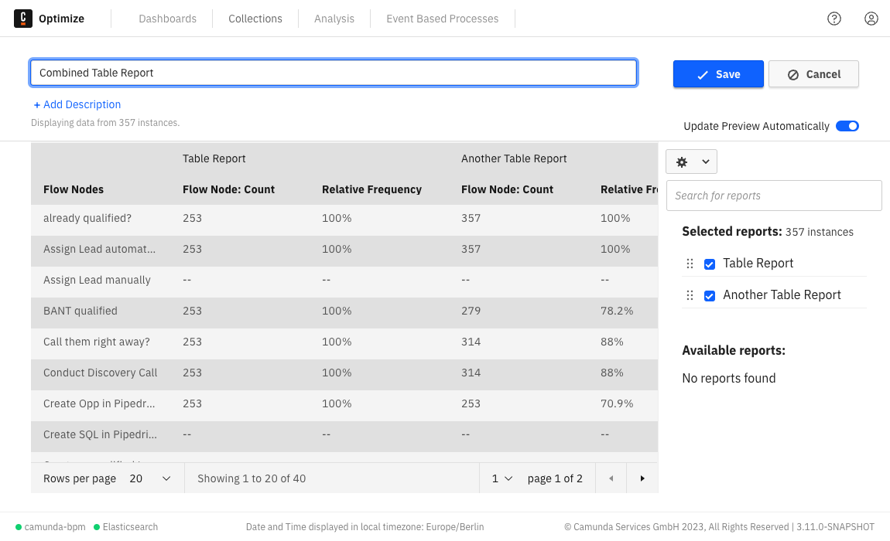

Camunda 7 only

Occasionally, it is necessary to compare multiple reports or visualize them together in one diagram. This can be achieved by creating a special type of report called a combined process report. To create a new combined process report, visit the **Collections** page and click **Create New > New Report > Combined Process Report**.

Afterward, you'll be directed to the combined process report builder. Here, navigate the selection panel on the right to choose multiple reports for combination.

:::note
If the combined process report resides within a collection, only reports in the same collection can be combined. If the combined process report is not part of a collection, it can only combine reports that are also not in a collection.
:::

A preview of the selected reports will appear in the panel on the left:

For instance, combining two reports with a table visualization yields the following view:

And combining two reports with line chart visualization results in the following view:

You can modify the color of chart reports by clicking on the color box near the report's name. Additionally, you can rearrange items in the list of selected reports to change their order in the report view.

:::note
Not all reports can be combined due to differences in their configurations, such as varying visualizations, which may make them incompatible. When selecting a report, only other reports that are combinable with the selected one will appear.
:::

Only reports that match the following criteria can be combined:

- Same group by
- Same visualization
- Same view but combining user task duration (work, idle, and total). Flow node duration reports are also possible.
- Distributed reports cannot be combined
- Multi-measure reports including reports containing multiple aggregations or multiple user task duration times cannot be combined.
- Process definition can be different.
- Furthermore, it is possible to combine reports grouped by start date with reports grouped by end date under the condition that the date interval is the same.

Moreover, only the following visualizations are possible to combine and will show up in the combined selection list:

- Bar chart
- Line chart
- Table
- Number

Currently, it is not possible to combine decision reports.

You can update the name of the report, save it, and add it to a dashboard, similar to a normal report. The combined process reports will appear in the reports list alongside normal reports.

### Configure combined process reports

You can configure the combined process report using the cogwheel button available on the top right side of the screen.

For example, in all chart reports, you can modify what is shown in the tooltips, change the axis names, and set a goal line, as illustrated in the figure below.

