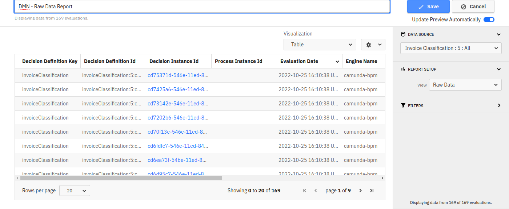
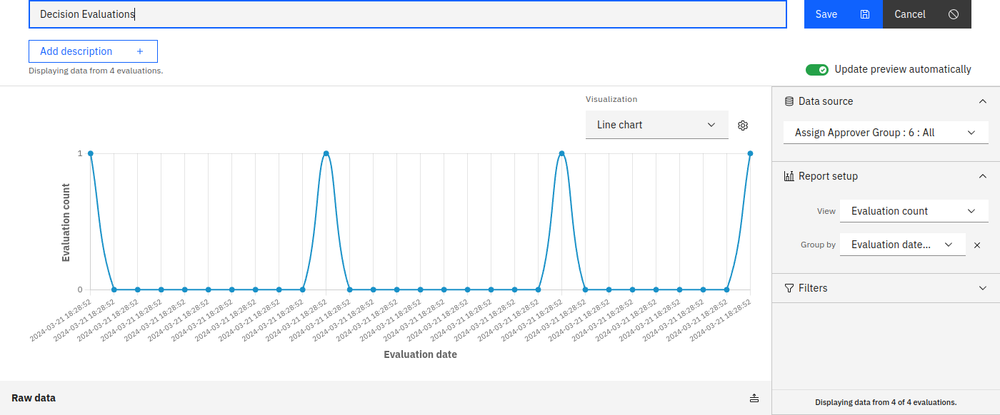

Camunda 7 only

Decision reports provide insights into decision definitions, distinct from process reports. To create one click on **Create New** and select **Decision Report** from the dropdown on the homepage.

There are a number of different reports you can create based on decisions:

## Raw data

Create a raw data report to view a table listing all decision data. Useful for detailed information on specific evaluations or exploring a decision definition with limited evaluations.

- Reorder columns and sort by any column header to view a table listing all available decision data. This can come in handy if you found interesting insights in certain decision evaluations and need detailed information about those evaluations, or you are exploring a decision definition with a limited number of evaluations.
- Configure columns and include evaluation count in edit mode. You can reorder the columns and click on any column header to sort the table by this column. Using the configuration dialog, you can also define which columns to show and whether to include the evaluation count number in the report. These settings are only available in the edit mode of the report.

To create a raw data report, select **Raw Data** from the view dropdown. The other fields are filled automatically.

## Evaluation count

Create reports showing how often the decision was evaluated. Depending on the group by selection, this could be either the total number of evaluations, a chart displaying how this number of evaluations developed over time, or how they were distributed across variables or rules. As always, you can define [filters](../process-analysis/filters.md) to specify which decision evaluations to include in the report. Grouping options include:

### Group by: None

- Displays the total evaluations for the decision definition and version.
- Configure precision and set a goal for a progress bar.

### Group by: Rules

- Shows the decision table with additional columns indicating rule match frequency.
- Customize display options in the configuration dialog.

### Group by: Evaluation date

- Visualize evaluations over time as a table or chart.
- Use filters to create powerful reports, e.g., time periods for specific output variables.

### Group by: Input or output variable

- Group results by a chosen variable from the decision definition.
- Visualize as a table or chart.

This view option allows you to create reports that show how often the decision was evaluated.
