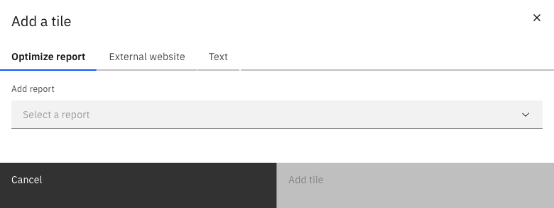
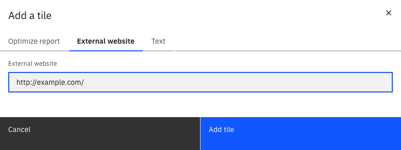
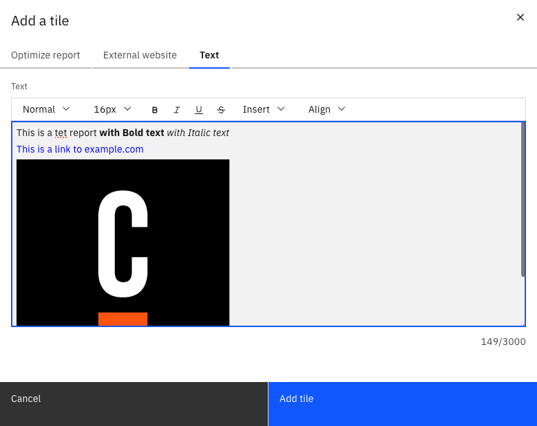

The edit mode allows you to configure the dashboard and adjust it to your needs, including the following operations:

- Rename your dashboard
- Add/remove a report
- Save the current state with your applied changes
- Cancel changes you already applied to the dashboard
- Set filters available on the dashboard
- Set a default auto refresh rate to periodically update the dashboard in [view mode](./view-mode.md)

Once you have prepared all your reports, you can now start to assemble them into a dashboard. Above the dashboard grid, click **Add a report** to open a modal where you can select one of your defined reports and add it to the dashboard. The **Add report** modal allows you to create dashboards that combine Optimize reports with data from other services as external URL reports and text reports.

### Optimize reports

In the **Add report** modal, use the **Optimize Report** tab to add reports to the dashboard. Use the **Select a Report** field to select one of the previously created reports or click **+ New Report from a template** to create a new report.

:::note
If the dashboard is inside a collection, only reports that are in the same collection can be added. If the dashboard is not in a collection, it can only contain reports that are also not in a collection.
:::

### External reports

In the **Add report** modal, click **External URL** to enter the URL of an external data source which should be added to the dashboard. Such external reports are added as iframes to the dashboard.

### Text reports

In the **Add report** modal, click **Text Report** to open the text editor. This allows you to create a document which can contain formatted text, links and images.

### Placing report on the dashboard

To move the report to your desired location, drag it in any direction. As soon as you release the dragged report, it snaps to the closest grid position. Dragging the handle on the lower right corner of each report will resize it. Delete the report from your dashboard by clicking the **x** button on the top right corner of each report.

## Adding filters in edit mode

In the dashboard edit mode, there is an **Add a Filter** button which shows a **Filters** panel. This panel allows you to specify filters which will become available for the dashboard. The following filters are available:

- Start date: Allows filtering by process instance start date
- End date: Allows filtering by process instance end date
- Instance state: Allows filtering by process instance state, such as running, completed, or canceled
- Variable: Allows filtering by process instance variable value
- Assignee: Allows filtering flow node data by their assignee
- Candidate Group: Allows filtering flow node data by their candidate group

For Variable Filters, specify which variable the filter should apply to. For string and number variables, provide a list of values which should be allowed to be filtered by.

Additionally, it is possible to allow dashboard users to filter by their own values by checking the **Allow viewer to add filter values** box. In contrast to report filters, adding a value in the modal will not immediately filter by this value, it will only make this value available to filter by in the dashboard.

For **Assignee** and **Candidate Group** filters, the dashboard editor can specify which assignees and candidate groups are available to filter by. In contrast to report filters, adding an assignee or candidate group to the filter will not immediately filter by this value, it will only make this value available to filter by in the dashboard. Additionally, it is possible to allow dashboard users to filter by their own values by checking the **Allow viewer to add filter values** box.

The list of variable names, variable values, assignees, and candidate groups is compiled from all reports on the dashboard.

### Setting a default dashboard filter

After specifying available filters in the dashboard edit mode, editors of the dashboard can also set a default filter. A default filter is always applied when a user initially opens the dashboard. Viewers can still remove filter values to see unfiltered reports, but if a user does not perform any steps to change the filter manually, they will see the reports with the defined default filter.

To set a default filter, dashboard editors can use the added filter options in the filter area. Whatever filter configuration is set there when the dashboard is saved becomes the default filter for the dashboard.
