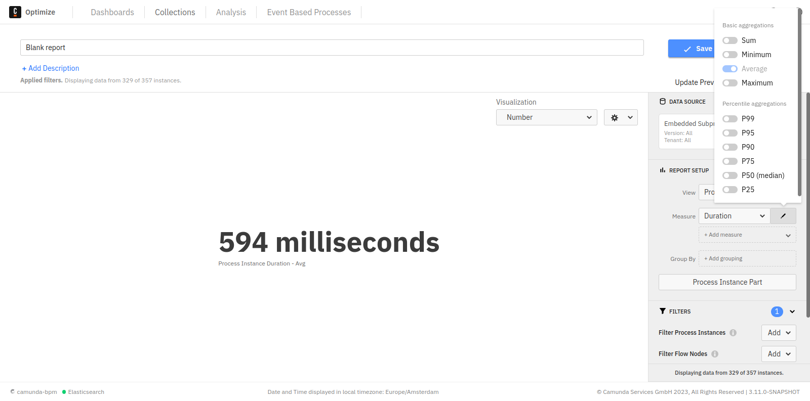

## Duration and variable report aggregation

For duration and variable views, the default aggregation type is the average. You can add and change different aggregations like minimum, maximum, and median in the report configuration panel. Note that the median is an estimate and the other operations are exact values.

Reports with multiple aggregations that have a [second "Group by"](./define-reports.md#reports-with-a-second-group-by-option) can only be visualized as table.

## User task duration time

For information about Optimize user task analytics, refer to our [task analysis documentation](../task-analysis.md).
